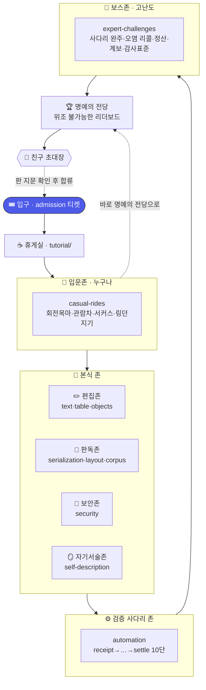

# 🎡 rhwp 운동장 — 테마파크 지도

운동장은 시험장이 아니라 **놀이공원**이다. 처음 온 사람은 입구에서 회전목마를
타고, 손에 익으면 급류를 타고, 담력이 생기면 보스 자이로드롭에 오른다. 부모님도
친구도 데려올 수 있다 — 키 제한 없는 놀이기구부터 있으니까.

이 지도는 어느 존에 무슨 어트랙션이 있고, 어떻게 타는지를 한 장에 담는다.
점수·판정 논리는 이 장식과 **무관하게** 그대로다(→ [정직 조항](#정직-조항)).



---

## 🎟️ 입구 — 입장 티켓

놀이공원은 표를 끊고 들어간다. 운동장의 표는 **입장 봉투**(`admission.json`)다.
채점기가 "이 러너로 pack 을 하나라도 유효하게 채점했다"고 판정하면 `verdict:
allow` 티켓이 나온다. 만점이어야 들어오는 게 아니다 — 낮은 점수도 순위이지
입장 거부 사유가 아니다.

```bash
python gym/score.py --agent 내이름        # 표 발권(admission.json)
```

## ☕ 휴게실 — 처음 오신 분

지도만 보면 막막하다. 휴게실에서 첫 놀이기구를 함께 타 본다.

> **→ [gym/tutorial/README.md](tutorial/README.md)** — 5분 첫 방문 안내.

---

## 존 안내 (pack = 어트랙션)

| 존 | pack | 어트랙션 | 키 제한(tier) | 어떻게 타나 |
|---|---|---|---|---|
| 🎠 입문존 | `casual-rides` | 회전목마·관람차·서커스·링던지기 | **1 (누구나)** | 문서 열어 숫자 하나 읽어 답 |
| ✏️ 편집존 | `text-editing`·`table-editing`·`objects-media` | 좌표 편집 놀이기구 | 1~2 | 지목한 자리를 고치고 재검증 |
| 📖 판독존 | `serialization`·`layout-rendering`·`corpus-diagnostics` | 형식 왕복·렌더·진단 | 1~2 | 읽기 경로의 정합을 맞춘다 |
| 🔐 보안존 | `security` | 신뢰경계·서명·마스킹 | 1~2 | 오염을 막고 서명을 건다 |
| 🪞 자기서술존 | `self-description` | 능력·스키마 자기 신고 | 1~2 | rhwp 가 자기를 설명하게 |
| ⚙️ 사다리존 | `automation` | 검증 사다리 10단 | 2 | 영수증→…→정산까지 오른다 |
| 🐉 **보스존** | `expert-challenges` | **사다리 완주·오염 리콜·정산·계보·감사표준** | **4~5** | 한 단만 틀려도 판정이 막힌다 |

키 제한(tier)은 놀이기구의 담력 등급이다: **1=입문(부모님도), 2=초급, 3=중급,
4=고급, 5=보스**.

---

## 🐉 보스존 — 이번에 새로 연 고난도 어트랙션

검증 사다리를 **한 체인으로 길게 엮은** 어트랙션. 부분 점수가 없다 — 열 단계 중
하나만 틀려도 최종 판정이 막힌다. 자이로드롭에서 안전바 하나만 안 걸려도 출발
안 하는 것과 같다.

| 어트랙션 | tier | 무엇을 완주하나 | 최종 판정 |
|---|---|---|---|
| **XC01 사다리 완주** | 5 | 서명→앵커→정산까지 전 사다리 | 적합성 **L5** conformant |
| **XC02 오염 리콜 드릴** | 5 | 2세대 계보에서 오염 전파 | 오염원의 후손까지 리콜 범위 |
| **XC03 정산 완주** | 4 | 청구→원장→검증 | 캡슐·게이트·원장·워크오더 4관문 |
| **XC04 계보 완주** | 4 | 끊기지 않는 3세대 사슬 | lineage valid · depth 3 |
| **XC05 감사 표준 발급** | 5 | 감사 리포트 + 서명 귀속 | 적합성 **L3** conformant |

```bash
# 보스존만 골라 타기
python gym/score.py --agent 내이름 --profile boss
```

모든 보스 어트랙션은 **기준 풀이 왕복**으로 "풀 수 있음"이 실측됐다
(`gym/packs/expert-challenges/reference/`). 못 푸는 보스는 어트랙션이 아니라
고장 난 기계다 — 그런 건 열지 않는다.

## 🎠 입문존 — 부모님·친구와 함께

키 제한 없는 유아용 놀이기구. rhwp 를 딱 한 번 실행하고, 나온 숫자를
`answer.json` 에 옮기면 통과다. 처음 온 사람도 성공한다.

| 놀이기구 | 무엇을 세나 |
|---|---|
| 🎠 CR01 회전목마 | 문서가 몇 쪽인가 |
| 🎡 CR02 관람차 | 문단이 몇 개인가 |
| 🎪 CR03 서커스 텐트 | 표가 몇 개인가 |
| 🎯 CR04 링 던지기 | '표' 글자가 몇 번 나오나 |

```bash
python gym/score.py --agent 부모님 --profile family
```

---

## 🏆 명예의 전당 — 위조 불가능한 리더보드

탄 사람은 명예의 전당에 이름을 올린다. 이 점수판은 자기 신고가 아니라 **검증
사다리로 봉인**된다(3해시 고정·Ed25519 서명·append-only 원장·머클 앵커). 순위는
렌더 시점에 전 사슬을 재검증한 항목만 오른다.

```bash
python gym/tools/leaderboard.py attest --agent 내이름   # 전당에 등재
python gym/tools/leaderboard.py verify                  # 전 사슬 재검증
python gym/tools/leaderboard.py render                  # 순위표 생성
```

자세히 → [gym/leaderboard/](leaderboard/) · 설계는
[gym/README.md](README.md#위조-불가능한-리더보드).

## 💌 친구 초대장 — 문은 열려 있다

리더보드는 처음부터 문이 열려 있다(attest 는 아무 이름이든 받는다). 초대장은
그 열린 문에 붙이는 안내다 — 신참이 **판 지문**으로 위조본이 아님을 확인하고
자기 신원으로 합류하도록.

```bash
python gym/tools/leaderboard.py invite --agent 친구이름   # 초대장 발급
```

자세히 → [gym/INVITE.md](INVITE.md).

---

## 정직 조항

이 문서는 **장식**이다. 존·어트랙션·티켓·전당은 은유일 뿐, 채점과 판정 논리는
장식과 무관하게 그대로 돈다:

- 점수는 여전히 pack 별로 보존되고, 총점은 편의값이다.
- 기대값은 골든 파일로 박제하지 않고 **채점 시점에 rhwp 로 재계산**한다(라이브 오라클).
- 보스 어트랙션도 예외 없이 **기준 풀이 왕복**을 통과해야 등재된다 — 테마를
  입혔다고 못 푸는 과제를 슬쩍 끼워 넣지 않는다.
- 부재는 실패로 위장하지 않는다: 요구 명령이 없는 pack 은 0점이 아니라
  `unavailable`.

놀이공원이라 부르는 이유는 사람을 부르기 위해서지, 판정을 무르게 하기 위해서가
아니다.
