# CI 그린 PR 9건 통합 후보 검증과 시각 증적

## 최종 판정

- **승인:** #6736, #6743, #6745, #6747, #6750, #6752.
- **메인터너 보정 됨, 수용 가능:** #6746, #6751, #6755.
- 현재 로컬 검토 범위의 **머지 보류 0건**.
- 통합 PR 생성·push는 작업지시자 승인을 받았다. 이 기록은 PR 생성 전 작성했으며, 최종 원격 head CI와 merge 승인은 별도 gate다.

## 후보와 환경

- 브랜치: `review/ci-green-batch-20260905`.
- base: `f7426ad95f2eb6f30732749bc50b32d60a3f343a`.
- 최종 코드 후보: `e207bb081ce3e56bad4f97c766add153ed28c28e`. 원 체리픽·샘플 보정 후보 `8204bdb29999fdbf96c3227fa25ee860211fd3b1` 위에 TS·기준선 보정을 커밋했다.
- 추가 보정: [#6751 snapshot 선택 전달](../assets/ci_green_batch_20260905/pr6751-maintainer-correction.patch) 및 [overflow-cell 기준선 강화](../../../tests/fixtures/overflow_cell_baseline.tsv). 둘 다 `e207bb081ce3e56bad4f97c766add153ed28c28e`에 포함했다. 시각 검증 당시 manifest의 실제 실행 SHA·바이너리 해시는 변경하지 않았다.
- macOS arm64, Rust 1.93.1, Node 24.15.0, 전용 target `target/pr-review-ci-green-20260905`.
- 사용자 요청에 따라 Docker 대신 host WASM build를 사용했다. 기존 Vite 7700을 유지하고 별도 headless Chrome으로 검증했다. 사용자 PC 전체 화면이 아니라 `#scroll-container`만 캡처했다.
- Rust 전체 실행 뒤의 추가 제품 보정은 TypeScript 2파일뿐이다. Rust 소스·fixture·WASM은 그대로이며 TS 보정 후 Studio 전체·타입 검사와 브라우저 검증을 다시 수행했다.
- [후보 파일 해시](../assets/ci_green_batch_20260905/candidate-sha256.txt). Visual sweep이 실제 사용한 바이너리·입력 해시는 아래 개별 run manifest를 우선한다. 이후 Native Skia 빌드의 같은 경로 바이너리 해시와 혼동하지 않는다.

## 실제 자동 검증

| 항목 | 결과 |
| --- | --- |
| 기준선 강화 후 전체 nextest | 9,043 통과, 46 skip, 실패 0; 241.513초, exit 0 |
| Native Skia lib | rhwp 3,930 통과/13 ignored; contracts 15, chart 165, crypto 2 통과 |
| Native Skia 그림·PNG | 2 통과 |
| Native Skia 직접 PDF | 4 통과 |
| TS 보정 후 Studio | 1,399 통과, 1 skip, 실패 0 |
| TypeScript --noEmit | exit 0 |
| fmt | 통과 |
| host clippy | -D warnings 통과 |
| WASM lib clippy | -D warnings 통과 |
| workspace/all-targets clippy | -D warnings 통과 |
| workspace build | 통과 |
| suite manifest | 1,164 sources, 48 integration targets 확인 |
| WASM host build | 최적화 포함 2분 59초, 성공 |

실행 명령의 target은 이 작업 전용이다. Cargo 명령은 서로 동시에 실행하지 않았다.

~~~bash
CARGO_TARGET_DIR=target/pr-review-ci-green-20260905 \
  scripts/wasm-pack-locked.sh --target web --out-dir pkg
node scripts/rust-test-suite-manifest.mjs --prepare
cargo build --locked --profile release-test \
  --target-dir target/pr-review-ci-green-20260905 --bin rhwp
RHWP_IR_SWEEP_FAST=0 \
RHWP_IR_SWEEP_DUMP=/tmp/rhwp-overflow-ratchet-20260905.tUfsEw/ir-field-current.tsv \
RHWP_OVERFLOW_CELL_DUMP=/tmp/rhwp-overflow-ratchet-20260905.tUfsEw/overflow-cell-current.tsv \
cargo nextest run --locked --cargo-profile release-test \
  --target-dir target/pr-review-ci-green-20260905 --tests --test-threads 6 --no-fail-fast
cargo test --locked --profile release-test \
  --target-dir target/pr-review-ci-green-20260905 --features native-skia --lib -- --test-threads 6
node scripts/run-rust-test.mjs issue_2225_missing_picture_placeholder -- \
  --cargo-profile release-test --target-dir target/pr-review-ci-green-20260905 --features native-skia
node scripts/run-rust-test.mjs render_p37_direct_pdf_export -- \
  --cargo-profile release-test --target-dir target/pr-review-ci-green-20260905 --features native-skia
cargo fmt --all -- --check
cargo clippy --locked --target-dir target/pr-review-ci-green-20260905 -- -D warnings
cargo clippy --locked -p rhwp --lib --target wasm32-unknown-unknown \
  --target-dir target/pr-review-ci-green-20260905 -- -D warnings
cargo build --locked --workspace --target-dir target/pr-review-ci-green-20260905
cargo clippy --locked --workspace --all-targets \
  --target-dir target/pr-review-ci-green-20260905 -- -D warnings
node scripts/rust-test-suite-manifest.mjs --check
npm --prefix rhwp-studio test
(cd rhwp-studio && npx tsc --noEmit)
~~~

### 새 fixture의 원장 대조

두 새 HWP는 환경변수·개인 Windows 경로 없이 `samples/`의 필수 파일을 읽도록 보정했다. IR 및 overflow-cell 검사와 dump 대조에서 신규·증가 행은 없었다. 검사를 skip하거나 baseline 허용치를 상향하지 않았다.

- [IR 실측](../assets/ci_green_batch_20260905/ir-field-sweep-current.tsv), [기준선 diff](../assets/ci_green_batch_20260905/ir-field-sweep.diff).
- [overflow-cell 실측](../assets/ci_green_batch_20260905/overflow-cell-current.tsv), [강화 diff: 기존 기준선 대비](../assets/ci_green_batch_20260905/overflow-cell.diff).
- 재검토에서 감소한 overflow-cell 실측을 기준선에 반영하지 않은 절차 누락을 발견했다. 기존 두 문서를 현재 후보에서 전 페이지 렌더해 확인한 뒤 기준선을 강화했다. `issue1891_external_bindata_link.hwpx`의 허용값은 48→32, `issue4889/18098267_nested_fragment_origin.hwp`의 87개 행은 실측 0이므로 삭제했다. 제품 코드·검사 helper·skip 규칙은 변경하지 않았다.
- IR dump도 감소가 있지만 신규 샘플의 발산 행을 억지로 만들지 않았다. 원장 수치는 파일 목록이나 전체 페이지 수가 아니다.

### 기준선 강화 후 확인

overflow-cell 기준선을 `48→32`로 강화하고 0개로 해소된 87개 허용 행을 제거한 뒤 전체 Rust 회귀를 다시 실행했다. **9,043 통과, 46 skip, 실패 0; 241.513초, exit 0**이며 overflow-cell 16개 파티션도 모두 통과했다. 새 dump의 비영 문서 12건은 강화한 기준선과 정확히 일치했다. [기준선 보정 증적](../assets/ci_green_batch_20260905/overflow-cell-ratchet-check.json). 이번 추가 실행은 Rust 전체 회귀이며, 제품 소스가 같은 Native Skia·lint·WASM 및 TS 보정 후 Studio·브라우저 검증은 기존 통과 결과를 유지한다.

| 기존 문서 | 렌더한 페이지 | 쪽 밖 셀 소실 줄 | 확인 결과 |
| --- | ---: | ---: | --- |
| `issue1891_external_bindata_link.hwpx` | 71/71 | 32 | 1부터 세는 6·27·38·39·46쪽에 각각 1·4·19·2·6개 |
| `issue4889/18098267_nested_fragment_origin.hwp` | 3/3 | 0 | 전 페이지 정상 생성, 원장 행 제거 |

- 두 문서의 export는 `--backend layer --profile screen --json`으로 실행했고 모두 exit 0이었다. 파싱 실패나 페이지 건너뛰기 때문에 감소한 것이 아니다.
- 현재 Mac 후보의 실측과 전체 회귀를 근거로 기존의 느슨한 허용선을 강화했다. 감소를 특정 원 PR 하나의 성과로 단정하거나 다른 OS의 실행 결과로 확대하지 않는다.
- 문서 SHA-256·페이지별 관측값·전체 회귀 결과·16개 partition 대조 결과는 위 JSON에 보존했다. 실행 로그는 저장소 밖 `/tmp`에만 남겼다.
- 기준선 강화 전 전체 회귀는 276.318초, 강화 뒤 재실행은 241.513초였다. 두 관측값의 차이를 제품 성능 개선으로 주장하지 않는다.

## 한컴 기준 PDF

기존 유효 기준 PDF는 재사용했다. 없는 3건만 MCP `start → status(succeeded) → download` 비동기 순서로 생성했고 서버 환경 파일이나 인증 값은 증적에 포함하지 않았다.

| 문서 | 기준 PDF | 쪽수 | 출처 |
| --- | --- | ---: | --- |
| 해양경찰청 156487948 | [PDF](../../../pdf/issue6737-156487948-2020.pdf) | 2 | engine/profile 2020, job 29fa228f-d765-42c6-a7d7-e9e2ffd9954a |
| 농촌진흥청 156585314 | [PDF](../../../pdf/issue6754-156585314-2020.pdf) | 3 | engine/profile 2020, job 949d16d5-5e05-4113-9f56-44a4c3ded643 |
| 27469 아동수당 | [PDF](../../../pdf/issue6718-27469-2020.pdf) | 12 | engine/profile 2020, job 4bd345fa-c377-4195-8cb9-056bea3150df |
| issue5966 가맹사업 보고서 | [기존 PDF](../../../pdf/pr_6088_6144/hancom2020/pr_6088_6144_issue5966_franchise_review_report_1130000-202100008_franchise_review_report-2020.pdf) | 142 | 기존 #6098 기록의 SHA-256과 일치 |

- 해양경찰청 PDF SHA-256: `c5fd06be9c0d3c982fccb41837e71e6b28147a6bdd8e81fd9bf699df408d9a19`.
- 농촌진흥청 PDF SHA-256: `f8695727d73acad4ed6402a4a3e127f8d29f9bfc6a59b92b48546f1ddb5b784f`.
- 27469 PDF SHA-256: `87fa64ad9b7061de3e321f16af5c4e1eb0eda81354c084864ab308f497345fc6`.
- issue5966 PDF SHA-256: `4cf22800e29baddb9b84023462c75252efd4efb04d22e9e64a8e3d9313076009`.
- 새 변환의 서버 응답은 `hancom_version=12.0.0.4605`, `backend=hwp-managed-direct-dll-host`, `input_preprocess=none`이었다. 요청 engine/profile 2020과 제품 내부 버전 표기를 구분한다.
- 동일 이름의 `local_hancom2020/*local2020.pdf`는 Cairo producer였으므로 이 검토의 한컴 정본으로 사용하지 않았다.

## #6746: 표 축과 셀 글자

1쪽을 현재 네이티브 CLI → SVG → Studio 공통 webfont Chrome rasterizer, 144 DPI로 생성했다. 표 오른쪽 잘림과 담당자 셀 유실이 해소됐다. 본문 글꼴과 상단 로고 위치 차이는 남아 있어 페이지 전체 일치를 주장하지 않는다.

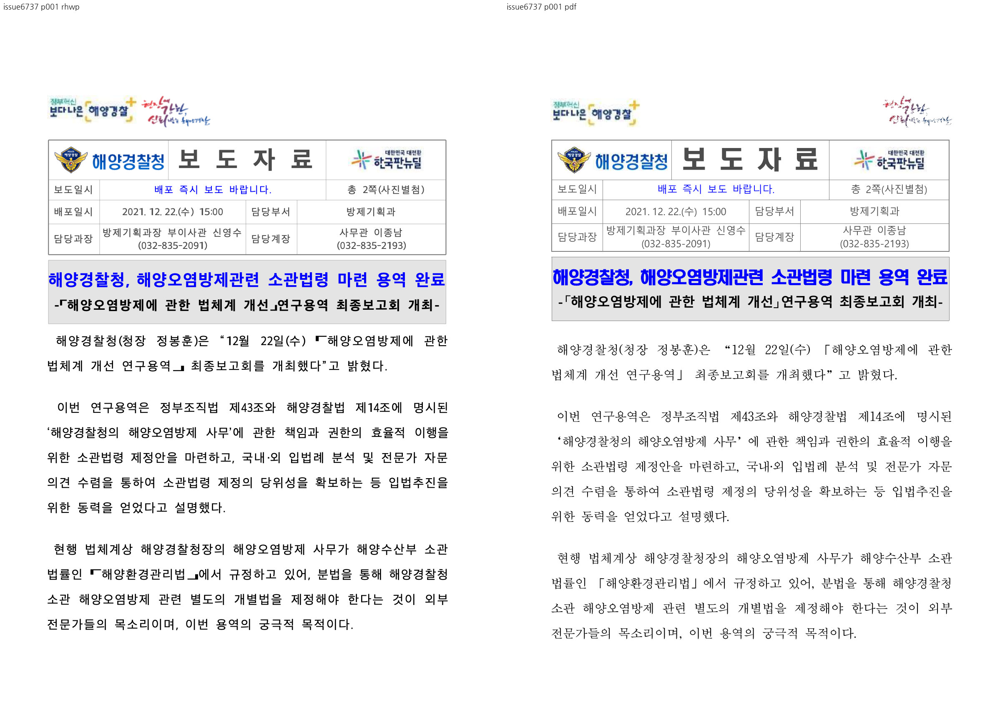

[OVL](../assets/ci_green_batch_20260905/issue6737-overlay-p001.png) · [검토 패널](../assets/ci_green_batch_20260905/issue6737-review-p001.png) · [실행 manifest](../assets/ci_green_batch_20260905/issue6737-run-manifest.json)

기여자 원 head `8b9cd84972fbaf0cdc6255e1afa16cc0175cfd12`의 수정 전 자산이며, 이번 base를 새로 빌드한 이미지가 아니다:

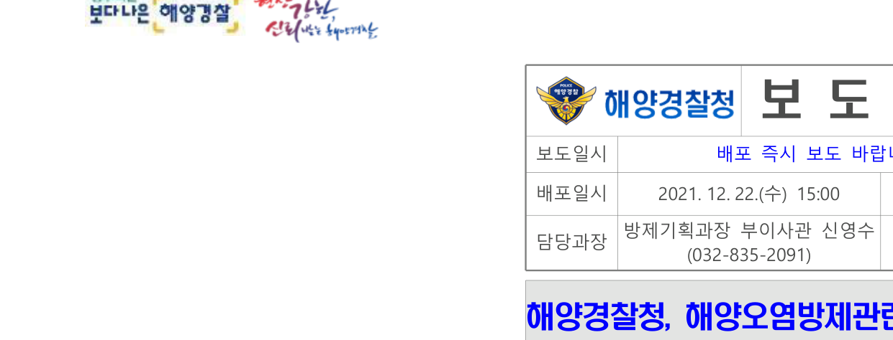

## #6755: 그림·표 동일 줄과 캡션

3쪽의 원맥 사진 오른쪽에 4×8 표가 나란히 놓이며, 마지막 사진 아래 세 캡션이 모두 보인다. 좌표 테스트에 더해 실제 캡션 존재를 직접 확인했다.

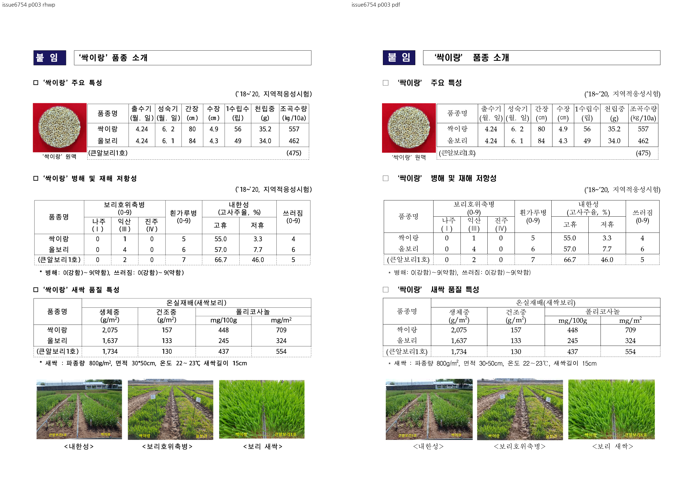

[OVL](../assets/ci_green_batch_20260905/issue6754-overlay-p003.png) · [검토 패널](../assets/ci_green_batch_20260905/issue6754-review-p003.png) · [실행 manifest](../assets/ci_green_batch_20260905/issue6754-run-manifest.json)

기여자 원 head `8e609cfacc4e3428a162a0189362dc0c14417743`의 수정 전 자산:

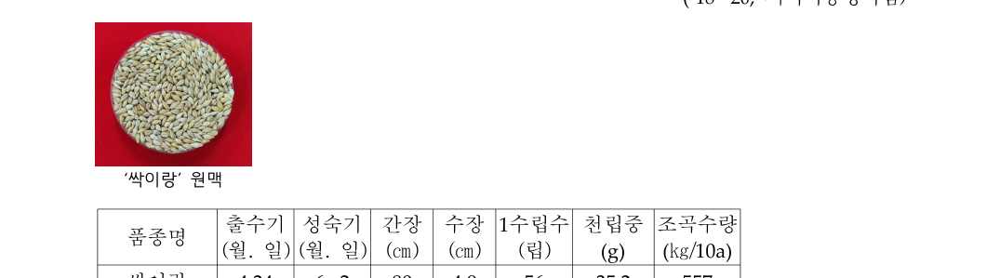

## #6745: 페이지 하단 본문 보존

27469 문서 7쪽은 본문과 쪽번호가 분리되어 있다. 같은 쪽 번호·같은 내용을 직접 대조했다.

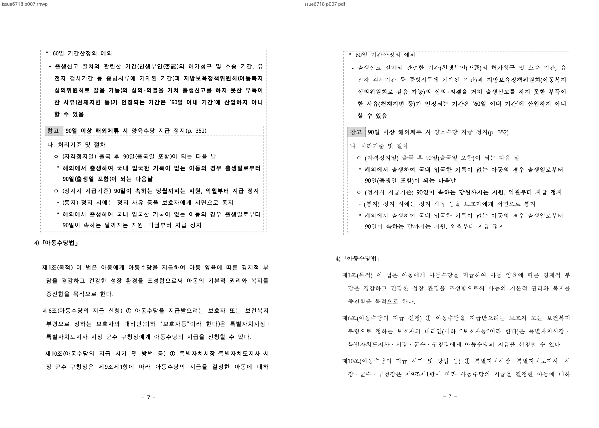

[OVL](../assets/ci_green_batch_20260905/issue6718-overlay-p007.png) · [실행 manifest](../assets/ci_green_batch_20260905/issue6718-run-manifest.json)

issue5966의 **RHWP 물리 60쪽 ↔ 한컴 물리 59쪽**은 대법원 2008두14739·2009두24108, 하단 가맹사업법 문단, 각주 59로 대응을 확인했다. 해당 본문과 각주가 용지 안에 표시된다. RHWP 143쪽과 한컴 142쪽의 전역 pagination 차이, 글꼴·행 위치 차이는 잔여 한계다. 동일 번호 60↔60 자동 sweep의 수치·판정은 다른 내용 비교이므로 제외했다.

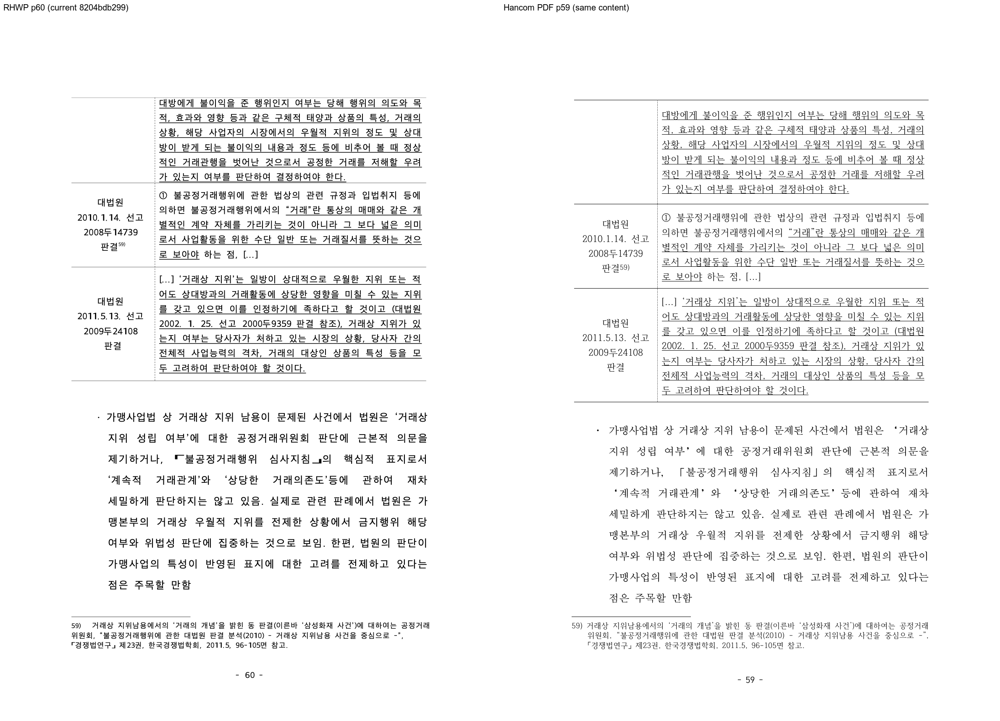

[내용 대응 OVL](../assets/ci_green_batch_20260905/issue5966-overlay-rhwp60-oracle59.png) · [실행 manifest](../assets/ci_green_batch_20260905/issue5966-run-manifest.json)

OVL은 원래 페이지 좌표를 유지하며 기하학적 정렬·왜곡을 하지 않았다. R=한컴 회색, G/B=RHWP 회색으로 합성했다. 빨강은 RHWP 전용, 청록은 한컴 전용 잉크다. 숫자만으로 승인하지 않았다.

기여자 원 head `8675504abef2ab50bed61df686a90c71cb606887`의 과거 devel A/B이며 이번 실행의 base A/B로 오인하지 않는다:

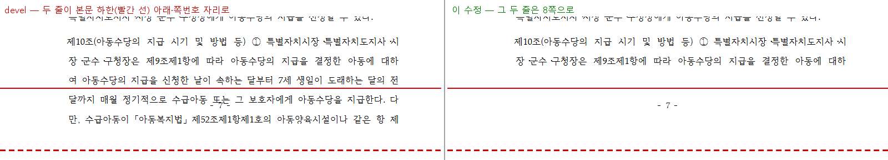

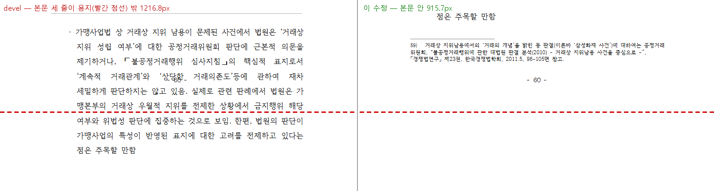

## #6751: 발견한 결함과 메인터너 보정

실제 브라우저에서 Delete 후 undo는 셀 내용을 복원했지만 블록은 `null`이었다. 기존 6개 소스 가드는 통과해도 실행 중 선택 메타데이터 전달 누락을 검출하지 못했다.

- 원인: 일반 snapshot 분기는 `new SnapshotCommand(..., desc.operation)`만 호출해 `desc.selectionBefore`를 버렸다.
- 보정: 일반 SnapshotCommand의 선택 보관과 `selectionBefore()`를 추가하고 생성 시 선택을 전달했다. HF/FN 문맥 분기나 redo 선택 해제 정책은 변경하지 않았다.
- 회귀: 일반 분기의 전달 연결 가드 및 실제 snapshot execute/undo/redo·내용·선택·리소스 반환 테스트 2개 추가.
- 브라우저: 셀 [0,1,7,8], 글자 수 **118→98→118→98**. 비선택 셀 내용은 모두 불변. undo 선택 복원, redo 해제, 빈 셀 중복 삭제의 유령 히스토리 없음, Escape 후 CHECK 입력(103자)을 확인했다.
- 실행 조건: F5/Delete/Escape/타이핑은 Chrome 키 입력, 범위 확대와 undo/redo는 Studio API. 최초 스킨 선택 창을 닫고 실행했다. 초기 창 때문에 키가 막힌 준비 실패는 제품 결함과 구분했다.

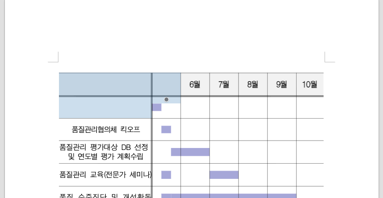

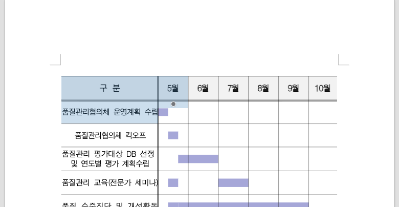

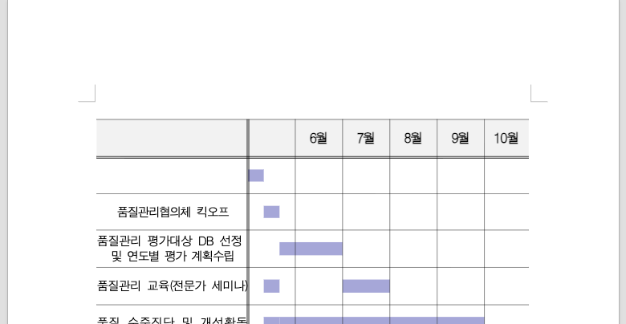

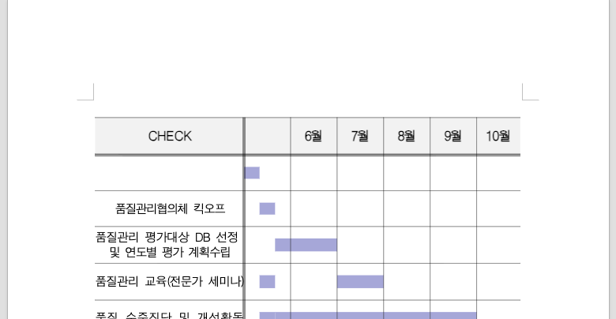

[실측 JSON](../assets/ci_green_batch_20260905/pr6751-functional.json) · [보정 patch](../assets/ci_green_batch_20260905/pr6751-maintainer-correction.patch)

## #6736: 실제 재조판 경계의 IME

첫 삽입에서 저장 줄 경계 22가 재조판되어 비경계가 되었고 기존 exact 좌표를 유지하는 정상 fallback을 확인했다. 그 뒤 현재 줄 경계 26에서 다시 조합하자 이전 줄 끝 `(381.3,125.8)` 대신 다음 줄 시작 `(75.6,146.5)`에 오버레이가 놓였다.

[실측 JSON](../assets/ci_green_batch_20260905/pr6736-functional.json). 실제 WASM과 Chrome CDP IME 입력을 사용했으며, OS 한글 IME의 사람 수동 검증으로 기록하지 않는다.

## 비시각 PR의 계약

- #6743: 실제 원본 변환 바이트 보존 및 실제 크기 변경 시 무효화 3개 회귀.
- #6747: raw 필드 목록의 파일·필드명·개수 재귀 대조.
- #6750: 저장 캐럿 API 주석과 실제 반환 구현·타입의 일치.
- #6752: 조회 캐시 9개 회귀, PDF 바이트 동등성과 ToUnicode 보존. 전체 export 시간은 미측정.

렌더러 수정 3건의 대상 페이지 대조와 현재 전체 자동 회귀를 수행했다. 기여자의 984문서 전후 A/B를 이번에 재실행한 것으로 기록하지 않으며, 모든 페이지의 픽셀 동일성이나 모든 플랫폼 수동 입력을 완료했다고 확대하지 않는다.

## 원격 후속 처리 경계

이 문서는 로컬 승인 판단이다. 통합 PR 생성 전 사용자 승인, 최종 head의 CI·mergeability 확인, merge SHA의 devel CI 성공 이후에만 원 PR/closing issue 댓글과 close를 진행한다. 댓글에는 SHA 고정 raw image를 직접 삽입하고 기존 댓글을 수정해 중복을 피한다. contributor fork branch는 보존한다. #6750 첫 기여자 환영 절차를 포함한다.
