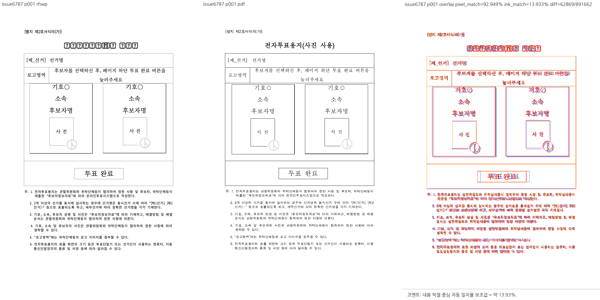
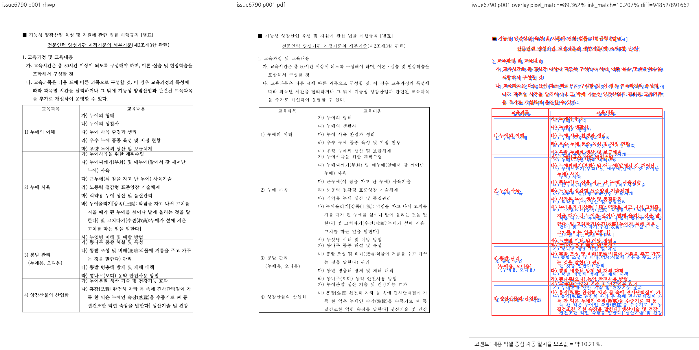
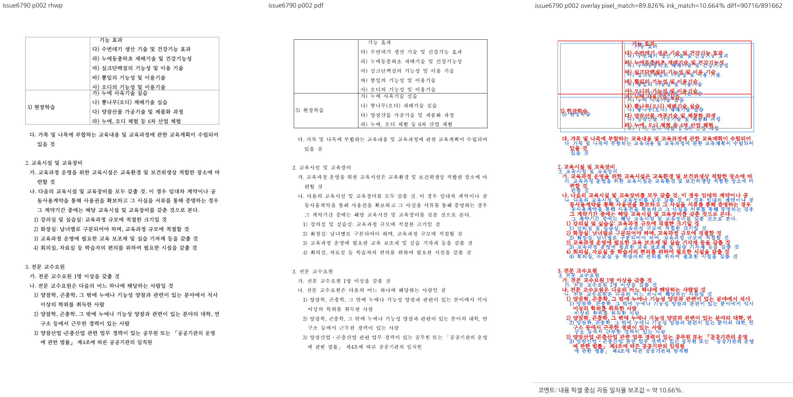
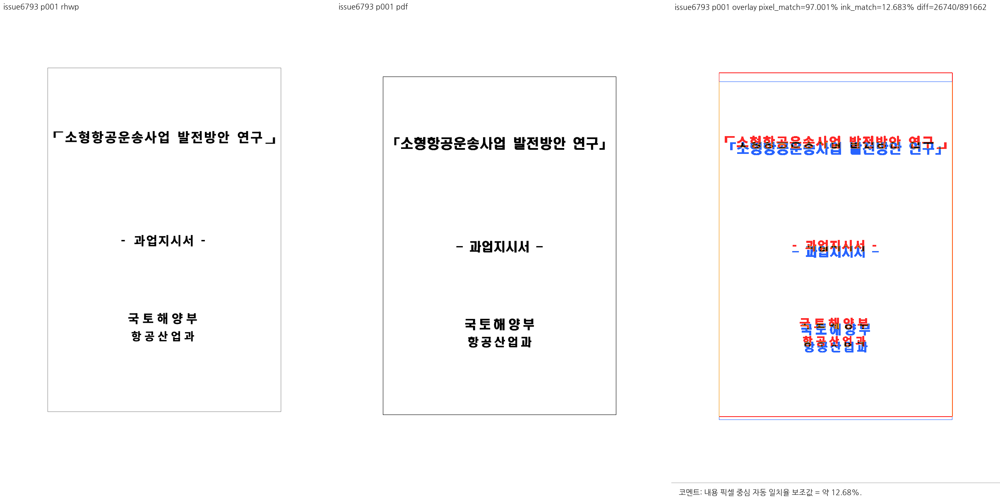
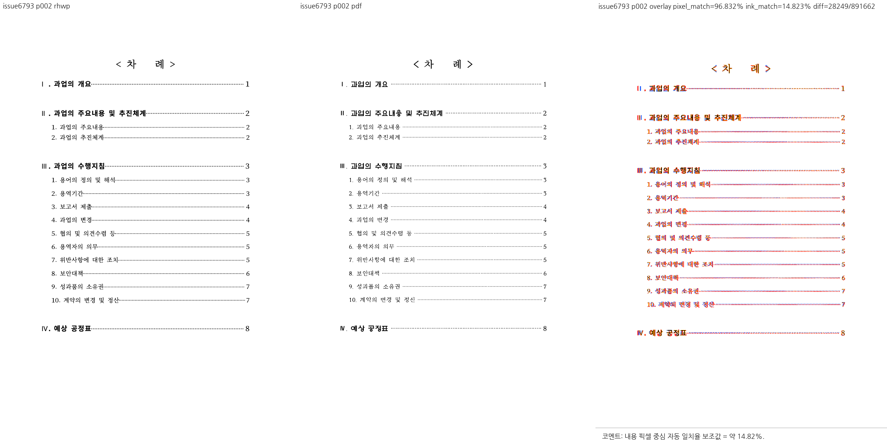
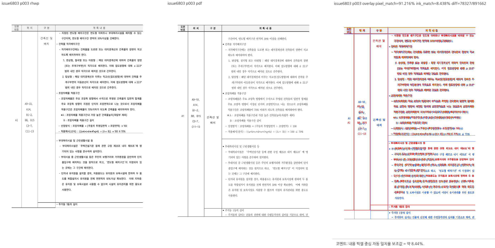
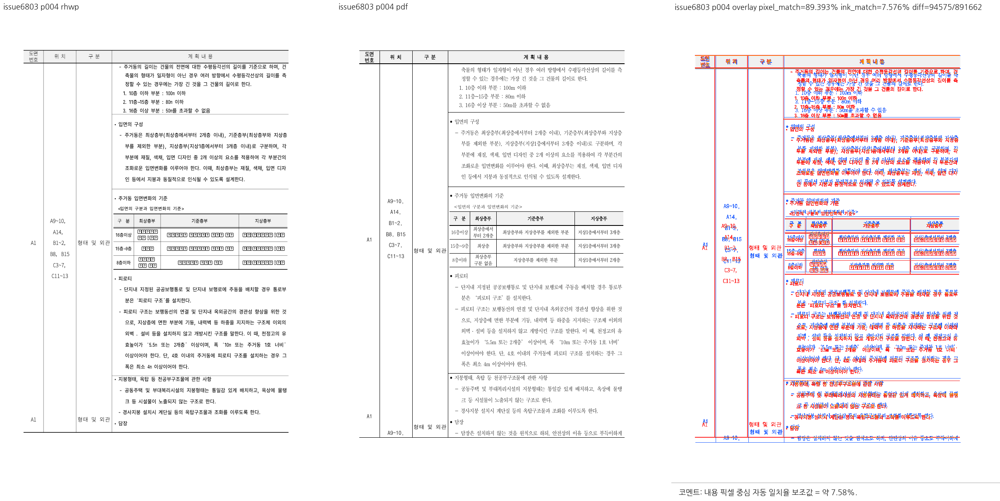

# planet6897 CI 완료 PR 누적 검증 및 시각 대조

## 결론

**#6796 후속까지 통합한 현재 로컬 후보는 전체 회귀 9,153개 통과, 실패 0개, skip 46개로 검증을 완료했다.** 이번 집중 7개, fmt·clippy·CLI 빌드·manifest 및 축소본 sweep 실행도 통과했다. 이전 집중 50개와 Native Skia 6개는 선행 제품 보정 단계의 결과로 구분한다.

**#6796의 후속 미반영 보류 사유를 해소했다.** 전체 원본 CCC 보호를 보존한 채 `9da47cb2`/`097c499f`를 통합하고 축소본과의 좌표 동일성을 검증했다. 축소본은 로고를 대체한 입력으로 시각 차이도 남아 있어 전체 시각 일치로 주장하지 않는다. #6804의 `15a881d0`는 동일 기준선 내용을 `f2047e1f4`에 보존했으며 원 SHA의 체리픽 여부와 구분한다.

| 원 PR | 현재 판정 | 검증 범위와 잔여 사항 |
| --- | --- | --- |
| [#6784](pr_6784_review.md) | 메인터너 보정 후 수용 가능 | 보정 및 로컬 검증 완료. 첫 비-레인 항목을 그리기 전에 Square 밴드를 종료하도록 보정했고, 일반 들여쓰기와 오른쪽 레인의 경계를 공개 회귀 시험으로 고정했다. |
| [#6789](pr_6789_review.md) | 메인터너 보정 후 수용 가능 | 보정 및 로컬 검증 완료. 공유 무리 판정의 0 오프셋·음수 오프셋·가로 겹침·혼합 순서 경계를 공개 API 시험으로 보완했고 6개 집중 회귀가 통과했다. |
| [#6792](pr_6792_review.md) | 메인터너 보정 후 수용 가능 | 증적 정합 보완 및 로컬 검증 완료. 저장 프레임 꼬리 확장의 수용 조건과 공개 회귀가 통과했고, 후속 #6839를 포함한 현재 시각 증적 및 실물 PDF 해시로 기록을 정정했다. |
| [#6794](pr_6794_review.md) | 승인 | 로컬 검증 완료. 표지 하단으로 잘못 귀속되던 차례를 2쪽으로 배치하는 조판 계약이 집중 회귀와 기준 PDF 대조를 통과했다. |
| [#6796](pr_6796_review.md) | 메인터너 보정 후 수용 가능 | 후속 2개 커밋 통합 완료. 전체 원본 보호 2개·축소본 4개·#5734 보호 1개 및 전체 회귀 통과. 축소본은 실제 CCC 잉크 증거와 구분한다. |
| [#6798](pr_6798_review.md) | 메인터너 보정 후 수용 가능 | 보정 및 로컬 검증 완료. 저장 좌표를 무조건 신뢰하던 흐름 오염을 실제 충돌·좌표 유효성·전체 표 수용 조건으로 제한했고, 음성 계약을 포함한 집중 5개가 통과했다. |
| [#6801](pr_6801_review.md) | 메인터너 보정 후 수용 가능 | 최신 원 커밋 포함, 보정 및 로컬 검증 완료. 추가 원 커밋 c7dade57을 포함했고, 탭의 bbox·charX·hit-test와 점선 리더 경계를 함께 보정해 집중 5개 및 KTX 스냅샷을 통과했다. |
| [#6804](pr_6804_review.md) | 메인터너 보정 후 수용 가능 | 공개 fixture·5개 회귀 및 후속 기준선 35/1까지 반영·검증 완료. 원 커밋 체리픽 이력과 동일 변경의 로컬 반영을 구분한다. |
| [#6817](pr_6817_review.md) | 승인 | 로컬 검증 완료. rowspan 셀의 문단 분할·조각 경계 연속성·용지 하한 보호가 집중 3개와 대표 페이지 대조를 통과했다. |
| [#6839](pr_6839_review.md) | 승인 | 통합 회귀 보류 해소, 로컬 검증 완료. 855e238까지 포함한 중첩 행 분할·다음 행 겹침 회귀가 통과했다. 통합을 막던 KTX 스냅샷 실패는 탭 보정에서 해소되어 더 이상 이 PR의 보류 사유가 아니다. |

`메인터너 보정 후 수용 가능`인 행은 현재 보정 및 위 로컬 검증이 끝났음을 뜻한다. 미실시 보정의 계획만 적은 판정이 아니다. `승인`은 PR 범위의 로컬 검토 판정이며 GitHub approve·merge 이벤트가 아니다. #6796의 후속 미통합·미검증 보류도 이번 실행에서 해소됐다. #6804는 변경 내용이 반영·검증됐으므로 원 SHA의 체리픽 이력만 없다는 이유로 보류하지 않는다.

## 기준 및 출처

- 검토일: 2026-09-07.
- 저장소: `/Users/tsjang/rhwp`.
- 브랜치: `review/planet6897-ci-green-20260907`.
- devel 기준: `07bc5e5490f75118f08370de19aeee73ce1667cb`.
- 실제 시험 후보: **`81ec9b869daa27d8546bbbbcb29587df93144f93` 시점의 검증 작업 트리**. 기존 보정 체크포인트와 #6796 후속·원본/축소본 좌표 대조 회귀를 포함한다.
- 최초 9개 PR의 18개 원 커밋 이후 #6839와 각 원 PR 후속을 누적 반영했다. 최신 후보는 10개 원 PR의 통합이며, 선행 #6792 변경을 #6839에서 중복 적용하지 않았다.
- 메인터너 체크포인트: `daf5744bfd4cb62d6c3e6d9b6cd104816da758ec` (#6784/#6798/#6801). 이후 탭 리더/공개 회귀/전체 원본 fixture/실측 기준선 보정을 `f2047e1f4`에 보존했다.
- #6796 후속 `9da47cb2` → `44830b2c1`, `097c499f` → `81ec9b869`를 출처 보존 체리픽으로 통합했다.
- 최신 #6801 c7dade57 → c9945466f 적용에서는 이미 있던 전체 자식 순회와 charX 보호를 유지했다. 순변경은 설명 2줄이며 기능 변경을 이중 계산하지 않는다.
- 원 SHA→로컬 SHA 대응은 각 개별 archive에 보존했다. 별도 PR 단독 before/after를 새로 실행한 것으로 가장하지 않는다.
- #6816 문서 브랜치, policy-controller 작업 worktree, 사용자 pkg, 공유 target 및 stash를 변경·정리하지 않았다.

| 원 PR | 조회한 최신 원격 head | 로컬 반영 상태 |
| --- | --- | --- |
| #6784 | `44432e34437c051575344a27129695f3fce7ca31` | 해당 head 포함 |
| #6789 | `74256bd5b25bd00f9e7bb67bb850cebbea90e223` | 해당 head 포함 |
| #6792 | `0b8e705a4b46dc1d63b38070b69c1a9f2ada15fe` | 해당 head 포함 |
| #6794 | `2bed19a6cf60757508df16c719fe24d593b382b3` | 해당 head 포함 |
| #6796 | `097c499fef6e91e5f1efc0273caf30b38e12ec38` | 097c499f까지 + 전체 원본 보호 및 축소본 좌표 동일성 보정, 검증 완료 |
| #6798 | `deb4396ebe9b2ddd39f46a9e0dbd0a685c735e6b` | 해당 head 포함 |
| #6801 | `c7dade57c5f3b9d4bf2fe663613afe60b953612e` | 해당 head 포함 |
| #6804 | `15a881d02a1e7a1ece63289bd633d54f15066842` | 406833fe 체리픽 포함; 15a881d0의 동일 기준선은 f2047e1f4로 보존·검증 완료, 그 원 SHA 체리픽 이력만 없음 |
| #6817 | `5670dc13eb4e0e95517e5d58a381790f6a7e8580` | 해당 head 포함 |
| #6839 | `855e2386291556536c40f36f7eafae570dce0d6a` | 해당 head 포함 |

원 PR 최신 head는 조회 시 모두 OPEN, MERGEABLE / CLEAN, CI 종합 SUCCESS였다. 원격 worker 링크는 각 archive에 있다. SKIPPED는 실행 성공 건수로 세지 않으며, 과거 head의 외부 CodeQL NEUTRAL을 현재 최신 head 상태로 재사용하지 않는다. 이 원격 CI는 작업 중 보정을 포함한 로컬 통합 후보의 CI가 아니다.

시험을 실행하는 동안 위 10개 원 PR의 head를 다시 조회했다. 모두 OPEN·non-draft·CI 종합 SUCCESS이며 마지막 확인 이후 추가 head 변경은 없었다. PR의 `updatedAt` 변경을 새 코드 push로 해석하지 않았다.

## 최종 후보에서 완료한 시험

| 게이트 | 실제 결과 |
| --- | --- |
| suite prepare/check | 1,189 sources / 5,022 static test attrs / 생성 28 + 예외 20 = 48 integration targets, exit 0 |
| 전체 integration nextest | **9,153 passed / 0 failed / 46 skipped**, 3 slow, summary 276.450초, exit 0 |
| #6796 후속 집중 nextest | **7 passed / 0 failed**, 시험 0.235초, exit 0; 필터 비선택 9,192개 |
| 보안 코퍼스 | 정식 sample 10개를 명시한 전체 실행에 포함, 통과 |
| Rust fmt | `cargo fmt --all -- --check`, exit 0 |
| workspace all-targets clippy | `-D warnings`, exit 0, 22.04초 |
| 현재 후보 CLI 빌드 | `cargo build --locked --target-dir target/pr-review`, exit 0, 64.571초 |
| 축소본 물리 77쪽 sweep | 현재 빌드한 CLI 명시, exit 0, 11.224초; 시각 차이는 아래에 별도 기재 |
| manifest 최종 확인 | exit 0 |
| 코드 후보 whitespace | `git diff --check`, exit 0; 이번 문서 갱신 전 실행 |
| 실제 Studio 상호작용 | 미실행. 공개 API/CLI 대조를 UI 클릭 시험으로 부르지 않음 |

이번 집중 7개는 #6796 전체 원본 2개, 축소본 및 원본/축소본 좌표 비교 4개, #5734 정상 음수 오프셋 보호 1개다. 전체 회귀의 46 skip과 필터 비선택 수를 합산하지 않는다. 새 회귀 4개가 추가되어 이전 9,149개에서 9,153개로 증가했다.

### 선행 검증과 이번 실행의 구분

- 이전 제품 보정 단계의 전체 회귀는 9,149 passed / 0 failed / 46 skipped, 308.732초였다. 이번 최종 수치와 합산하지 않는다.
- 이전 관련 집중 50개는 원 PR 관련 44개, #5585 보호 4개, #5734 보호 1개, KTX SVG 1개로 모두 통과했다. 이 필터를 이번에 다시 실행했다고 쓰지 않는다.
- 이전 Native Skia 그림 placeholder 2개와 direct PDF export 4개가 통과했다. 이번 #6796 후속 후보에서 native feature 시험을 재실행하지 않았다.
- 선행 native/WASM clippy, workspace 빌드, Native Skia lib, Docker 없는 WASM 최적화 빌드도 exit 0이었다. WASM 빌드는 약 3분 21초, 출력은 `/tmp/rhwp-planet-review-20260907.BOaOAW/maintainer-all/wasm-pkg`였으며 사용자 `pkg/`를 덮어쓰지 않았다. 이번 재빌드는 위 CLI뿐이다.
- 과거 placeholder 선택 0개 및 manifest drift는 통과로 세지 않았다. 준비 후 실제 통과한 선행 실행과 이번 manifest 성공을 구분한다.

### 이번에 실행한 주요 명령

새 fixture가 검사에서 빠지지 않도록 보안 코퍼스 입력 10개를 명시했다. 입력은 정식 sample 필수 읽기를 사용하며 개인 경로가 없을 때 정상 return하지 않는다.

```sh
node scripts/rust-test-suite-manifest.mjs --prepare
node scripts/rust-test-suite-manifest.mjs --check
cargo fmt --all -- --check
cargo clippy --locked --workspace --all-targets --target-dir target/pr-review -- -D warnings

export RHWP_SECURITY_SWEEP_SAMPLES_JSON='["samples/issue6778/156757920-animal-welfare-husbandry-guidelines.hwp","samples/issue6787/16774617-electronic-ballot-form.hwp","samples/issue6790/17544911-sericulture-training-criteria.hwp","samples/issue6793/1611000-201000141-small-air-transport-study.hwp","samples/issue6782/1480000-201900042-chemical-product-labeling-study.hwp","samples/issue6797/156160455-social-pig-farm-income.hwp","samples/issue6800/1192000-202100017-policy-research-report.hwp","samples/issue6795/1341000-201100013-cyber-university-application.hwp","samples/issue6803/1376496-neighborhood-facility-land-table.hwp","samples/issue6782/1480000-201900042-chemical-labeling-standards.hwp"]'
cargo nextest run --locked --cargo-profile release-test \
  --target-dir target/pr-review --tests --no-fail-fast \
  -E 'test(/(^|::)(issue_6782_[^:]+|issue_5734_cell_float_stack_stored_vpos)::/)'
cargo nextest run --locked --cargo-profile release-test \
  --target-dir target/pr-review --tests --no-fail-fast

cargo build --locked --target-dir target/pr-review
venv/bin/python scripts/visual_sweep.py \
  --rhwp-bin /Users/tsjang/rhwp/target/pr-review/debug/rhwp \
  --key issue6782-reduced \
  --hwp samples/issue6782/1480000-201900042-chemical-labeling-standards.hwp \
  --pdf pdf/1480000-201900042-chemical-labeling-standards-2020.pdf \
  --pages 77 \
  --out /tmp/rhwp-planet-review-20260907.BOaOAW/issue6796-followup/visual-reduced
node scripts/rust-test-suite-manifest.mjs --check
git diff --check
```

순차 실행을 사람이 재현할 수 있도록 정리한 명령이다. 실제 실행기는 각 cargo 명령에 같은 보안 입력 환경 변수를 전달했다. 임시 로그 경로는 `/tmp/rhwp-planet-review-20260907.BOaOAW/issue6796-followup`이며 로그를 커밋하거나 영구 GitHub 증적 링크로 사용하지 않는다.

## 보류 사유 해소와 기준선의 독립 대조

- #6784: 첫 비-레인 항목 paint 전 Square 밴드 종료 및 우단/폭/일반 들여쓰기 계약, 집중 7개 통과.
- #6789: 0 오프셋·가로 겹침·음수·혼합 순서 공개 변형, 집중 6개 통과. 단일 표 전용 변형을 추가했다고 주장하지 않는다.
- #6796: 전체 원본의 정확한 11개 그림·CCC 정체/셀 보호를 보존했다. 최신 축소 입력·원 회귀 3개를 통합하고 원본/축소본 좌표 동일성 회귀를 추가했다. 전체 원본 2개·축소본 4개·#5734 보호 1개 및 전체 회귀를 통과해 후속 미반영 보류를 해소했다.
- #6798: 이미 회피된 표, 범위 밖·합성·누락 anchor의 흐름 점프 방지, 원본 양성·host 보호를 합쳐 집중 5개 통과.
- #6801: bbox/charX/hit-test의 실제 advance 공유 및 논리 탭 경계와 점선 잉크 경계 분리. 집중 5개와 KTX 스냅샷 통과. KTX golden은 변경하지 않았다.
- #6804: 정식 sample 기반 분할 형제 표/페이지 소유/#2813 보호 집중 5개 통과.
- #6792/#6839: 저장 프레임 꼬리 확장 및 중첩 행 이어받기 시험 각각 4개 통과. 뽕잎·오디 26자 누락 및 옛 쪽 분포를 현재 실패로 남기지 않는다.

새 fixture 기준선은 같은 입력 바이트를 격리된 base `07bc5e549` 빌드와 보정 후보에서 독립 비교한 뒤 등록했다.

| 입력 | 항목 | base | 보정 후보 |
| --- | --- | --- | --- |
| issue6795 사이버대학 신청서 | 전체 쪽수 | 44 | 45 |
| 동일 입력 | text-overlap | 136 | 35 |
| 동일 입력 | off-canvas | 1 | 1 |
| issue6782 화학제품 표시 연구 전체 원본 | 전체 쪽수 | 104 | 104 |
| 동일 입력 | text-overlap | 2 | 2 |
| 동일 입력 | off-canvas | 1 | 0 |

#6795의 남은 off-canvas는 물리 29쪽의 동일한 3.36px 하단 이탈이다. #6782의 text-overlap은 물리 14/55쪽 각 1개이며 이전 76쪽 off-canvas는 제거됐다. 이 수치는 전체 시각 일치 여부가 아니라 해당 탐지기의 실측이다.

새 입력 text-overlap 행은 #6795=35, #6782 전체 원본=2이며 off-canvas는 #6795=1만 등록했다. 기존 문서의 허용값을 상향하지 않았다. #6839의 issue6790 값 2→0 강화와 issue6793=16 보존도 유지했다. IR 집중 4개(exit 0, 97.512초) 및 최종 전체 회귀가 통과했다.

#6796 후속으로 별도 축소 입력의 text-overlap=2 행도 추가했다. 위 독립 base 비교 표는 전체 원본에 대한 기존 실측이며 축소본을 base에서 새로 측정한 것으로 쓰지 않는다. 축소본은 이번 전체 회귀의 보안·기준선 검사에 포함되어 통과했다.

## 후속 원격 커밋의 통합 및 검증

### #6796

- 기존 전체 원본 보정을 `f2047e1f4`에 보존한 뒤 `9da47cb2e4410fd29e707c98527651619a807ac2`를 `44830b2c1`로, `097c499fef6e91e5f1efc0273caf30b38e12ec38`를 `81ec9b869`로 출처 보존 체리픽했다.
- README/MANIFEST 및 시험 충돌을 해결하면서 전체 원본·기준 PDF·CCC 보호 시험을 삭제하지 않았다. 축소본을 추가하고 입력 간 11개 그림/호스트 셀 좌표 동일성을 별도 시험으로 확인했다.
- 축소 HWP는 193,536 bytes, SHA-256 `4382eabadb86cde5730a7e7b972cea1828fea0c1c743a654c2a430cc19ae26c0`다. 기여자는 204개 BinData를 1x1 stub으로 바꿨다고 보고했다.
- 축소 PDF는 1,119,717 bytes, SHA-256 `32e0e6d41d53b755b3dc4bcc31937e8b4f0921b282c2e5d3633a3f3617761912`, 103쪽이다. 크기·해시는 실제 로컬 파일에서 확인했고 기존 전체 원본용 PDF와 구분했다.
- 최신 후보의 집중 7개·전체 9,153개가 통과했고 축소본 물리 77쪽을 대조했다. 그림 잉크가 없는 축소본으로 CCC 표시 성공을 주장하지 않으며, 글리프·표 높이 차이도 남아 있다. 이 한계를 기록한 상태에서 PR의 오프셋 조건/회귀 범위를 수용한다.

### #6804

- 원격 15a881d02a1e7a1ece63289bd633d54f15066842는 text-overlap=35, off-canvas=1의 두 기준선 행만 추가했다.
- 두 값은 이미 메인터너가 독립 실측한 보정을 `f2047e1f4`에 보존했고 최신 전체 회귀도 통과했다. 제품/시험 코드 차이가 없으며, 새 변경의 반영이나 검증을 기다리는 상태가 아니다.
- 원 커밋 객체를 체리픽한 것은 아니므로 최종 커밋/PR 기록에서 원 SHA와 동일 변경의 반영 경로를 구분한다. 이를 코드 미반영 또는 머지 보류 사유로 쓰지 않는다.
- 작성자가 보고한 다른 14개 문서 개선은 이번 메인터너가 새로 실측한 결과로 기록하지 않는다.

## 실제 시각 대조 방법

- 준비된 기준 PDF를 재사용했고 중복 변환하지 않았다.
- 메인터너 보정 후 `maintainer-all/visual-<PR>`의 9개 문서 sweep이 exit 0으로 완료됐다. #6839는 #6792와 동일 입력/PDF 대조를 함께 사용한다.
- 선행 원본 sweep의 선택 물리 23쪽 중 대표 16개를 보존했고, 이번 축소본 77쪽 대표 1개를 추가했다. 직접 연 대표 PNG 총 17개만 공개 증적 디렉터리에 둔다. 전체 문서 모든 페이지의 시각 승인은 아니다.
- 비교 패널은 왼쪽 rhwp, 가운데 기준 PDF, 오른쪽 overlay다. 96 DPI, Chrome/webfont raster 대조이며 화면 전체 캡처가 아니다.
- 기존 대표 16개는 선행 메인터너 보정 단계의 산출물로 재사용했다. 이번에는 `target/pr-review/debug/rhwp`를 새로 빌드해 축소본 대표만 추가했다. #6796 후속의 제품 조건식은 동일하며, 이전 바이너리 해시를 현재 해시로 쓰거나 전체 sweep을 재실행했다고 주장하지 않는다.
- #6801의 `review_202100017.png`는 물리 1쪽이다. 문서 식별자를 페이지 수로 해석하지 않는다.
- 자동 flag 0·배경 포함 pixel match는 전체 시각 수용 근거가 아니다. 대체 글리프, PDF 누락 그림, 잔여 표 높이/내용 경계 차이를 각 PR에 명시했다.
- 선행 임시 경로는 `/tmp/rhwp-planet-review-20260907.BOaOAW/maintainer-all`, 이번 축소본은 `issue6796-followup/visual-reduced`다. 임시 파일은 게시 링크로 사용하지 않는다.

실제 실행한 sweep 형식:

```sh
venv/bin/python scripts/visual_sweep.py \
  --key issue<번호> --hwp <정식 입력 경로> --pdf <기준 PDF 경로> \
  --pages <물리 페이지 선택> --out <임시 출력>
```

## 입력·PDF 및 대표 증적

### PR #6784 / 이슈 #6778

- [개별 판정 및 댓글 계획](pr_6784_review.md).
- 입력: [samples/issue6778/156757920-animal-welfare-husbandry-guidelines.hwp](../../../samples/issue6778/156757920-animal-welfare-husbandry-guidelines.hwp), 1,478,144 bytes.
- 입력 SHA-256: `309494bf58da7c092eca2c6fe55918063d2f538820cbc3fc6f8c8196fcd3586a`.
- 기준: [pdf/156757920-animal-welfare-husbandry-guidelines-2024.pdf](../../../pdf/156757920-animal-welfare-husbandry-guidelines-2024.pdf), engine 2024, 12쪽, 696,994 bytes.
- PDF SHA-256: `de6a57ee0d28cfb66acab4e477cc0b95e31a7939d3ca2e165de46fd5a487296e`.
- 대표 물리 페이지: 1.
- 시각 판정: 물리 1쪽에서 Square 표 옆의 흐름과 그 아래로 복귀하는 배치를 대조했다. 기준 engine 2024 PDF에는 로고/인증 그림이 보이지 않고 rhwp와 본문 크기·배치 차이도 크다. PDF의 그림 누락 원인을 확정하지 않았으며, 이 부분 수용을 전체 문서 시각 일치로 확대하지 않는다.


### PR #6789 / 이슈 #6787

- [개별 판정 및 댓글 계획](pr_6789_review.md).
- 입력: [samples/issue6787/16774617-electronic-ballot-form.hwp](../../../samples/issue6787/16774617-electronic-ballot-form.hwp), 54,272 bytes.
- 입력 SHA-256: `b68b1d54a4e52f282d5ae699f4aa5d8cd5d580c982ec79a1d1e8099e69c1c088`.
- 기준: [pdf/16774617-electronic-ballot-form-2020.pdf](../../../pdf/16774617-electronic-ballot-form-2020.pdf), engine 2020, 2쪽, 85,991 bytes.
- PDF SHA-256: `9728e5ebe54eb9cc4b8f137921602390fdbd426c7f1c0c82cfc76710bb2ca4f1`.
- 대표 물리 페이지: 1.
- 시각 판정: 물리 1쪽에서 두 투표 카드가 같은 줄에 나란히 놓이고 본문 폭에 들어가는 것을 직접 대조했다. 제목 일부의 대체 글리프는 남아 있다. 문서 전체 픽셀 동일 판정은 아니다.



### PR #6792 / 이슈 #6790

- [개별 판정 및 댓글 계획](pr_6792_review.md).
- 입력: [samples/issue6790/17544911-sericulture-training-criteria.hwp](../../../samples/issue6790/17544911-sericulture-training-criteria.hwp), 58,880 bytes.
- 입력 SHA-256: `59857dfd443c282ef3a7384558be36266e7476363d182b0c85d690b9b841dba4`.
- 기준: [pdf/17544911-sericulture-training-criteria-2020.pdf](../../../pdf/17544911-sericulture-training-criteria-2020.pdf), engine 2020, 3쪽, 152,162 bytes.
- PDF SHA-256: `df968a2e9237256e4d03d195c568b0d3ed70218191179ad2b6f6e8f5d37f740e`.
- 대표 물리 페이지: 1, 2.
- 시각 판정: #6839와 같은 입력/PDF로 물리 1-3쪽을 산출했다. 대표 1/2쪽에서 중첩 행의 이어짐, 뽕잎·오디 항목 표시, 현장학습 행 분리를 확인했다. 글꼴 모양·표 선·세부 좌표 차이는 남아 있으므로 전체 문서 동일이나 #6790 전체 해결로 선언하지 않는다.





### PR #6794 / 이슈 #6793

- [개별 판정 및 댓글 계획](pr_6794_review.md).
- 입력: [samples/issue6793/1611000-201000141-small-air-transport-study.hwp](../../../samples/issue6793/1611000-201000141-small-air-transport-study.hwp), 51,200 bytes.
- 입력 SHA-256: `25cc60d379f68246875e968978c13f3273fcc3f6b04fc1fe726434e4626e447d`.
- 기준: [pdf/1611000-201000141-small-air-transport-study-2020.pdf](../../../pdf/1611000-201000141-small-air-transport-study-2020.pdf), engine 2020, 12쪽, 179,155 bytes.
- PDF SHA-256: `34bc3082d666d9112ed073de468586490dd57c93c920bfd6d681e5221e4dda85`.
- 대표 물리 페이지: 1, 2.
- 시각 판정: 기준 PDF와 rhwp는 12쪽이다. 물리 1쪽 표지 및 2쪽 차례의 페이지 소유를 직접 대조했다. 표지 세로 위치·글꼴·세부 간격 차이는 남아 있으며 전체 픽셀 일치를 뜻하지 않는다.





### PR #6796 / 이슈 #6782

- [개별 판정 및 댓글 계획](pr_6796_review.md).
- 입력: [samples/issue6782/1480000-201900042-chemical-product-labeling-study.hwp](../../../samples/issue6782/1480000-201900042-chemical-product-labeling-study.hwp), 6,521,856 bytes.
- 입력 SHA-256: `398d03a5d5e4d6e857086be532d6d9ed0cec9c8ad06f95c17bbb7f83056ae860`.
- 기준: [pdf/1480000-201900042-chemical-product-labeling-study-2020.pdf](../../../pdf/1480000-201900042-chemical-product-labeling-study-2020.pdf), engine 2020, 103쪽, 2,208,597 bytes.
- PDF SHA-256: `f8e5c0408e221080ede9a9a67b153d02d792d22961c738e46749641f32a32e79`.
- 대표 물리 페이지: 77.
- 시각 판정: 기존 전체 원본/PDF의 물리 77쪽에서 CCC가 중국 행 셀 안에 표시됨을 대조했다. rhwp 104쪽, PDF 103쪽이며 인쇄 번호는 각각 56/55여서 표 내용으로 대응했다. 다른 PS/CSA 로고 겹침과 대체 글리프는 남아 있다. 원격에 새로 추가된 stub 입력/PDF의 비교로 이 PNG를 표시해서는 안 된다.


### 축소 입력의 별도 증적: 물리 77쪽

- [축소 입력](../../../samples/issue6782/1480000-201900042-chemical-labeling-standards.hwp): 193,536 bytes, SHA-256 `4382eabadb86cde5730a7e7b972cea1828fea0c1c743a654c2a430cc19ae26c0`.
- [축소 입력용 기준 PDF](../../../pdf/1480000-201900042-chemical-labeling-standards-2020.pdf): engine 2020, 103쪽, 1,119,717 bytes, SHA-256 `32e0e6d41d53b755b3dc4bcc31937e8b4f0921b282c2e5d3633a3f3617761912`.
- 위 크기·해시는 로컬 실물 파일에서 확인했다. 원 PR에 포함된 PDF를 재사용했으며 중복 변환하지 않았다.
- 현재 후보로 `target/pr-review/debug/rhwp`를 빌드한 뒤 물리 77쪽을 새로 대조했다. rhwp는 104쪽, 기준 PDF는 103쪽이며 인쇄 번호 56/55 차이와 글리프·행 높이 차이가 남는다.
- 축소본은 BinData를 1x1 대체 그림으로 바꾼 입력이므로 인증 로고가 보이지 않는다. 이 PNG를 실제 CCC 로고 표시 성공이나 전체 시각 일치의 증거로 사용하지 않는다.
- 축소 전후 11개 그림과 호스트 셀의 좌표 동일성은 별도 공개 API 회귀로 확인했다. 실제 CCC 그림 확인은 위 전체 원본 증적을 사용한다.


### PR #6798 / 이슈 #6797

- [개별 판정 및 댓글 계획](pr_6798_review.md).
- 입력: [samples/issue6797/156160455-social-pig-farm-income.hwp](../../../samples/issue6797/156160455-social-pig-farm-income.hwp), 458,752 bytes.
- 입력 SHA-256: `1b99b763aac36a14a9f463e35ee894a23eb1083780040eab5e0f02a481c694b8`.
- 기준: [pdf/156160455-social-pig-farm-income-2020.pdf](../../../pdf/156160455-social-pig-farm-income-2020.pdf), engine 2020, 11쪽, 393,142 bytes.
- PDF SHA-256: `0b6d2573b68c4e4a59db108766380c0d9e9fe41237be8346d61757b28a485c65`.
- 대표 물리 페이지: 7.
- 시각 판정: 물리 7쪽에서 pi70/71 대상 표가 분리된 배치를 대조했다. 기준 PDF의 일부 그래프 그림 부재와 rhwp 대체 글리프는 남아 있다. 1쪽의 다른 Square 그림/TAC 축을 이 PR의 해결 범위나 신규 회귀로 단정하지 않는다.


### PR #6801 / 이슈 #6800

- [개별 판정 및 댓글 계획](pr_6801_review.md).
- 입력: [samples/issue6800/1192000-202100017-policy-research-report.hwp](../../../samples/issue6800/1192000-202100017-policy-research-report.hwp), 90,112 bytes.
- 입력 SHA-256: `fd0b95cb4239b08e2ab9130b6b697af56dda379f1c9029dbf5f5a0b97af5ceee`.
- 기준: [pdf/1192000-202100017-policy-research-report-2020.pdf](../../../pdf/1192000-202100017-policy-research-report-2020.pdf), engine 2020, 1쪽, 62,122 bytes.
- PDF SHA-256: `34c9173724fa5d2ef5e0b2a796b56c9b564d3f5e0c9224609dffd507921ada48`.
- 대표 물리 페이지: 1.
- 시각 판정: 대상 문서는 실제 1쪽이다. sweep의 review_202100017.png는 문서 식별자에서 유래한 파일명이며 대표 PNG를 물리 1쪽으로 정규화했다. 일부 대체 글리프가 남아 있고 픽셀 대조는 charX/hit-test의 직접 검증이 아니므로 공개 API 회귀 결과를 별도로 사용한다.


### PR #6804 / 이슈 #6795

- [개별 판정 및 댓글 계획](pr_6804_review.md).
- 입력: [samples/issue6795/1341000-201100013-cyber-university-application.hwp](../../../samples/issue6795/1341000-201100013-cyber-university-application.hwp), 613,376 bytes.
- 입력 SHA-256: `3202819ec9712c49b189ecb0e1b4a2d46aba37d01e1654c6917438e8134f42d8`.
- 기준: [pdf/1341000-201100013-cyber-university-application-2020.pdf](../../../pdf/1341000-201100013-cyber-university-application-2020.pdf), engine 2020, 45쪽, 556,998 bytes.
- PDF SHA-256: `3c1d4b0ae00b0f89169a0168b93f27ff4ec975c02743d9655e47bc58c7d289c5`.
- 대표 물리 페이지: 31, 32, 33.
- 시각 판정: 물리 31/32/33쪽에서 앞 표 조각, 별도 심사위원 표, 종합의견의 순서/소유를 직접 대조했다. 31쪽 표 높이·내용 경계 차이 및 대체 글리프는 남는다. 전체 잉크 일치나 #6795의 다른 문서까지 해결했다는 판정은 아니다.


### PR #6817 / 이슈 #6803

- [개별 판정 및 댓글 계획](pr_6817_review.md).
- 입력: [samples/issue6803/1376496-neighborhood-facility-land-table.hwp](../../../samples/issue6803/1376496-neighborhood-facility-land-table.hwp), 32,768 bytes.
- 입력 SHA-256: `2482b695bc92c0cafe661af63c54acea834b6927bf9c666bdf47299910e3801d`.
- 기준: [pdf/1376496-neighborhood-facility-land-table-2020.pdf](../../../pdf/1376496-neighborhood-facility-land-table-2020.pdf), engine 2020, 5쪽, 153,835 bytes.
- PDF SHA-256: `ef7ac0c12d37f8b96f1af5e2d67e812151d9b9862c4f42824fee8bc04a5dda12`.
- 대표 물리 페이지: 3, 4.
- 시각 판정: 물리 1-5쪽 sweep을 산출하고 대표 3/4쪽을 직접 대조했다. rowspan 셀 내용의 이어짐을 확인했지만 글꼴·줄바꿈·세부 쪽 경계까지 전체 동일하다고 주장하지 않는다.





### PR #6839 / 이슈 #6837

- [개별 판정 및 댓글 계획](pr_6839_review.md).
- 입력: [samples/issue6790/17544911-sericulture-training-criteria.hwp](../../../samples/issue6790/17544911-sericulture-training-criteria.hwp), 58,880 bytes.
- 입력 SHA-256: `59857dfd443c282ef3a7384558be36266e7476363d182b0c85d690b9b841dba4`.
- 기준: [pdf/17544911-sericulture-training-criteria-2020.pdf](../../../pdf/17544911-sericulture-training-criteria-2020.pdf), engine 2020, 3쪽, 152,162 bytes.
- PDF SHA-256: `df968a2e9237256e4d03d195c568b0d3ed70218191179ad2b6f6e8f5d37f740e`.
- 대표 물리 페이지: 1, 2.
- 시각 판정: #6792와 동일한 입력/PDF에서 대표 1/2쪽을 대조했다. 1쪽의 '생산 기술 및 건강'과 2쪽 '기능 효과'가 이어지고 뽕잎·오디 항목 및 현장학습 행이 보인다. 글꼴·표 선·세부 좌표 차이는 남는다. 전체 문서 픽셀 동일 판정은 아니다.


## 향후 PR·이슈 코멘트 계획 및 보관 경계

1. #6796 후속 및 #6804 동일 변경의 출처를 포함해 최종 통합 head와 실제 원격 CI를 별도로 기록한다. 현재 녹색 로컬 결과를 아직 존재하지 않는 통합 PR 또는 merge SHA의 CI로 쓰지 않는다.
2. 실제 merge와 devel CI가 성공한 뒤 [post_merge.md](../../manual/pr_review/post_merge.md)에 따라 원 PR·관련 이슈의 현재 상태와 closing reference를 조회한다. 부분 수용인 #6790/#6795를 전체 해결로 자동 종료하지 않는다.
3. 각 개별 archive의 템플릿처럼 대표 PNG를 코멘트 본문에 직접 표시한다. 실제 증적 포함 merge SHA의 raw URL, 기준 PDF 링크, 물리 페이지와 잔여 범위를 함께 적는다.
4. 기존 메인터너 후속 댓글이 있으면 수정하고 중복 등록하지 않는다. UTF-8 body file로 게시·수정한 뒤 API로 body를 재조회한다. 기여자 댓글을 덮어쓰지 않는다.
5. 최종 대표 PNG와 준비된 기준 PDF만 공개 증적 대상으로 유지한다. 로그, 중간 PNG/SVG/JSON, 임시 진단 소스, generated suite 산출물 및 임시 pkg는 커밋하지 않는다.
6. 로컬 체크포인트 `f2047e1f4`와 체리픽 `44830b2c1`, `81ec9b869`를 만들었다. 이후 작업지시자의 PR 생성 승인에 따라 개별 review·공통 시각 기록·대표 PNG와 9월 7일 오늘할일을 같은 통합 branch에 포함한다. 검토 판정 시점에는 원격 PR·CI·merge·후속 처리가 완료되지 않았다. reviewer를 자동 지정하지 않으며 사용자/다른 작업의 파일·branch·worktree·stash·공유 target을 보존한다.

## 통합 PR 준비 시점의 기준선 구분

로컬 전체 회귀는 위 `07bc5e549` 기반 후보에서 완료했다. PR 준비 중 원격 `devel`이 `1098e7210452a1bfe536729963844d023b499b5f`까지 전진한 것을 확인했다. 이미 검증한 후보를 rebase하거나 다른 제품 변경과 섞지 않았으며, 현재 base와의 호환성은 생성하는 통합 PR의 최신 CI에서 별도로 확인한다. 오늘할일은 기존 source 기록에 이번 검토 항목만 추가하고 최신 devel의 다른 작업 기록을 복사하지 않았다.
