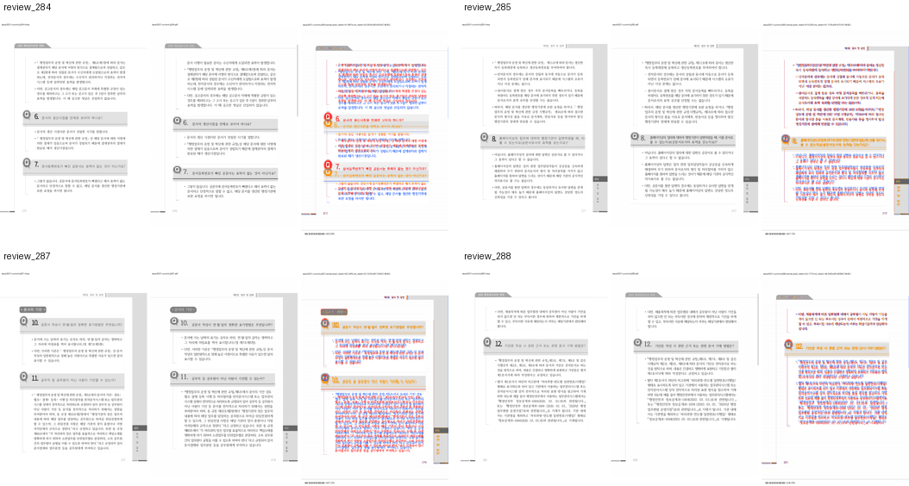

# PR #4773 검토: 저장 RowBreak 표의 물리 fragment 경계

## 메타데이터

| 항목 | 값 |
| --- | --- |
| PR | [#4773](https://github.com/edwardkim/rhwp/pull/4773) |
| 관련 이슈 | [#3931](https://github.com/edwardkim/rhwp/issues/3931) |
| 작성자 | `edwardkim` |
| reviewer | `jangster77` 요청 완료 |
| base / head | `devel` / `task_m100_3931` |
| code candidate | `d81d11e545883ce8817b665ee64bd9262874da58` |
| 작성 시점 merge 상태 | `MERGEABLE`, `BLOCKED` |
| 규모 | 14 files, +1,412 / -28, 8 commits |

base route: collaborator_self_merge
modifiers: intake_and_review.md, local_validation.md, visual_fixture_evidence.md, rework_and_exceptions.md
loaded documents: pr_review_workflow.md, pr_review/README.md, collaborator_self_merge.md,
intake_and_review.md, local_validation.md, visual_fixture_evidence.md, rework_and_exceptions.md
current head at review start: `d81d11e545883ce8817b665ee64bd9262874da58`

## 변경 범위와 코드 판정

- 빈 host 문단의 다행 RowBreak 표에서 저장 내부 reset과 flow anchor가 어긋날 때, 완결된 구조
  증거가 있는 경우에만 기존 fragment scanner가 현재 쪽 조각을 만들도록 한다.
- 질문 11의 24.5px pitch와 16줄 전체 높이는 유지하고 물리 p287의 12줄과 p288의 4줄 소유권을
  고정한다. 특정 파일명·쪽수·문단 인덱스 예외나 전역 tolerance는 없다.
- #4763 terminal response tail은 가시 텍스트가 있는 control-free 문단 경계에서만 억제한다.
  control-only local reset과 질문 14 중첩 도형은 기존 source-frame 계약을 유지한다.
- partial table host를 확인하지 못하면 margin을 회수하지 않는 fail-closed 경로를 사용한다.
- 1,000줄을 넘는 PR이므로 즉시 admin merge 대상이 아니다. 코드 검토, simulation, 시각 판정과
  최신 trailing head CI를 분리해 확인한다. 줄 수의 상당 부분은 단계 문서와 실제 fixture 래칫이지만
  renderer 다섯 파일의 위험 경계를 축소해서 보지 않는다.

## 로컬 검증 결과

- 최신 `upstream/devel` `99f6c9312` 위로 충돌 없이 rebase했다. 직전 기준과 새 기준 사이에는
  `src/renderer/` 변경이 없다.
- `issue_3930_hwpx_hwp_save_layout` 3/3과 `issue_3931_declared_rowbreak` 5/5가 통과했다.
- `cargo nextest run --cargo-profile release-test --target-dir target/pr-review --tests
  --test-threads 12 --no-fail-fast`는 6,027/6,027 통과, 38 skip이다.
- `cargo clippy --all-targets -- -D warnings`, `cargo fmt --check`, `git diff --check`가 통과했다.
- Native Skia 공식 세 축은 58/58, 2/2, 4/4 통과했다.
- `docker compose --env-file .env.docker run --rm wasm` 공식 최적화 빌드가 통과했다.
- Studio `npm test`는 923건 중 922 통과, 1 skip, 실패 0이다.
- Windows Chrome 150 CDP에서 Vite HTTP fixture로 HWP/HWPX 각각 383쪽, source format,
  지정 page owner와 Canvas2D 경로를 확인했다. WSL 절대 경로의 host file input은 Windows Chrome이
  읽을 수 없으므로 기존 `loadHwpFile` HTTP 계약을 사용했다.

## 시각 검증

- 원본 HWP: `samples/2025 행정업무운영 편람(최종).hwp`, SHA-256
  `40d6d05eac4d55bdc4b0c62c42d93af104d5123b447581246f36fd15de7bd46f`
- 원본 HWPX: `samples/2025 행정업무운영 편람(최종).hwpx`, SHA-256
  `c6dd7e847a99f219681afc5a29c80a9665c04df9cda4d820a3350d739664fdf6`
- 한컴 2020 HWP PDF: `pdf/2025 행정업무운영 편람(최종)-hwp-kopub-2020.pdf`, SHA-256
  `6c7be7602cb92bb9b5e6a0b66e9cd80700fceabeade89fabd1a0fcd32adc4413`
- 한컴 2020 HWPX PDF: `pdf/2025 행정업무운영 편람(최종)-hwpx-kopub-2020.pdf`, SHA-256
  `5c11205cb43ba3a1ca3e607e4019b69a937332526a1b740d3dda754dcc4e3f0a`
- 임시 근거: `output/3931/visual/current/issue3931-current/`의 compare·overlay·review 4쪽.
  검토 페이지는 물리 p284, p285, p287, p288이며 자동 accuracy 보조값은 62.59162%,
  61.11530%, 67.22229%, 46.20458%다.
- 대표 asset: `mydocs/pr/assets/pr_4773_issue3931_rowbreak_review.png`, SHA-256
  `9896cd128a5aebd625aa59122aeab19f3075653e7353263602b86ce40a838180`
- 작업지시자가 네 동일 물리 쪽과 7702 Studio 렌더링을 확인하고 시각 판정 통과를 선언했다.

## CI와 위험

review 문서 작성 시점의 code candidate에서는 CI preflight와 Render Diff preflight가 성공했고,
CodeQL·Canvas visual diff·lint 일부가 진행 중이다. 이 문서와 asset을 추가한 trailing head에서는
GitHub Actions가 다시 실행되므로 작성 시점 상태를 최종 merge 근거로 사용하지 않는다.

로컬 headless Chrome UI 전체 초기화는 WASM 383쪽과 `CanvasView.loadDocument` 완료 뒤 진행 표시
갱신 구간에서 장시간 정체됐다. Windows Chrome CDP의 직접 WASM·CanvasView 계약은 두 형식 모두
통과했으므로 #3931 renderer 차단 결함으로 분류하지 않되, Studio 대형 문서 초기화 성능 관측은
후속 이슈 후보로 남긴다.

## 결론

코드·fixture·플랫폼·시각 검증에서 #3931 변경을 막는 결함은 발견하지 못해 merge 후보로 권고한다.
다만 대형 PR 규칙에 따라 즉시 admin merge하지 않는다. 이 review·asset·오늘할일을 포함한 최신
trailing head에서 reviewer 의견, GitHub Actions 전건 성공, `MERGEABLE`/`CLEAN`과 작업지시자 승인을
다시 확인한 뒤 merge를 판단한다. merge 후에는 #3931 종료와 원격·로컬 branch 정리를 수행한다.
