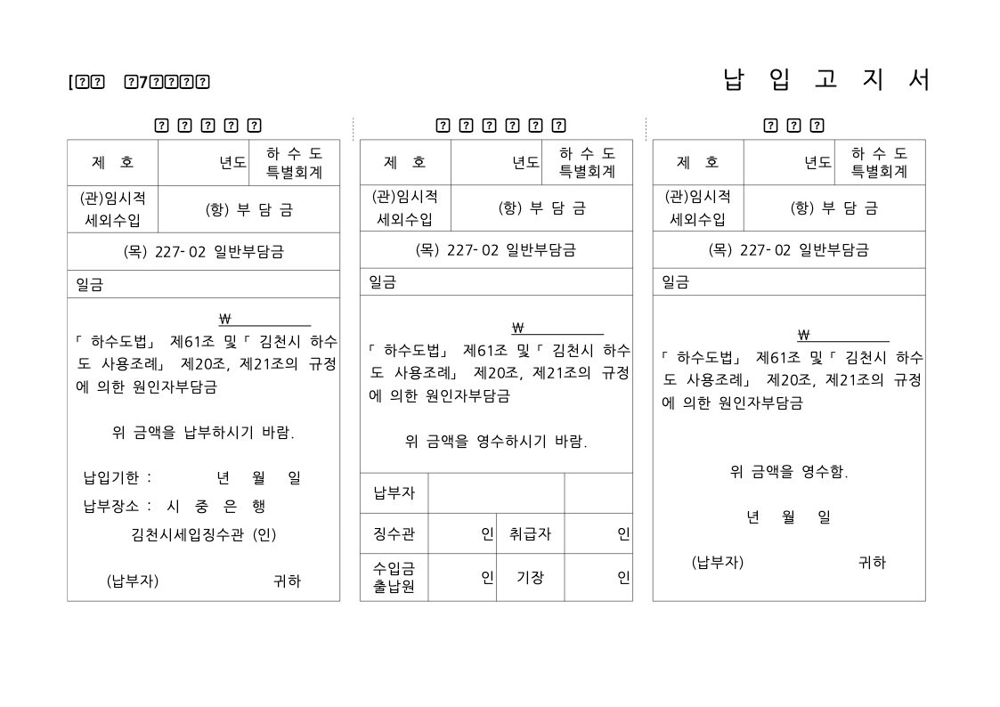
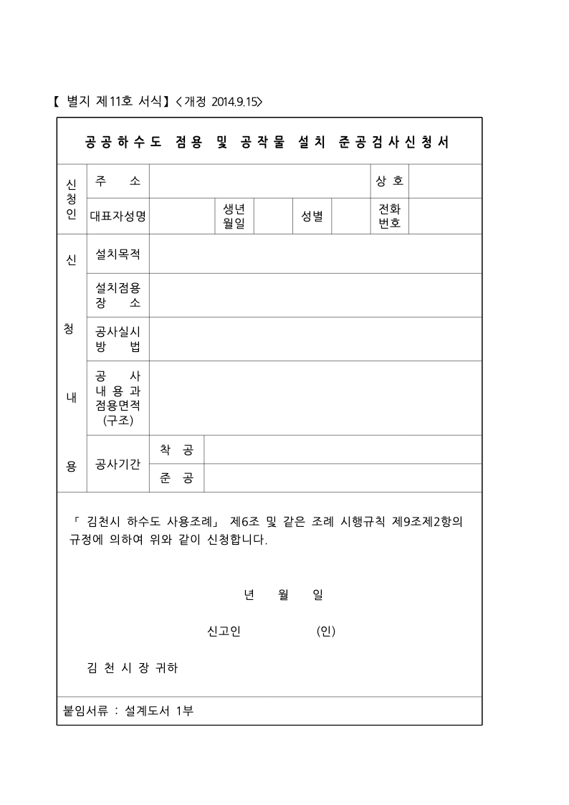
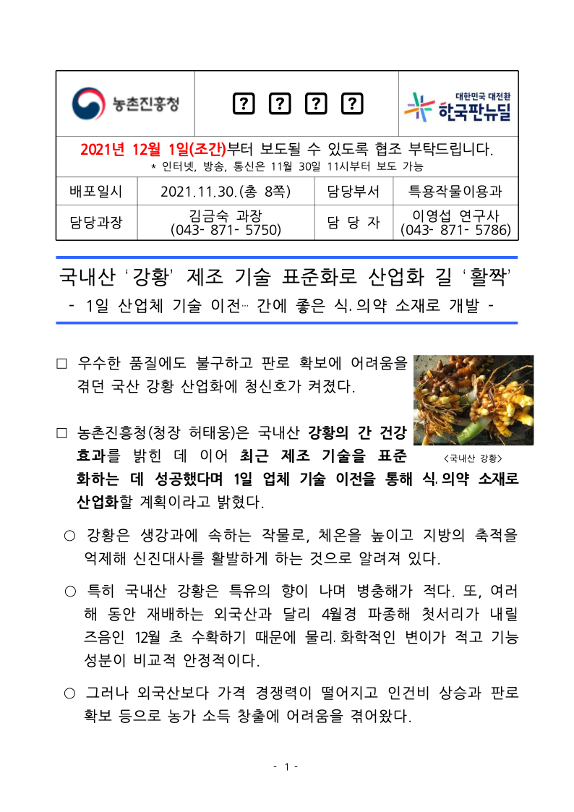

# PR #6683-#6710 통합 정식 Fixture 시각 Sweep

- 작성일: 2026-09-04
- 대상 통합 브랜치: `review/green-ci-batch-20260904-full`
- 대상: PR #6709의 Issue #6202, PR #6710의 Issue #5057 정식 HWP fixture
- 목적: 비공개 경로 의존을 제거한 fixture가 실제 렌더 대상에 포함되는지 확인하고, PNG·SVG 산출물과 한계를 보존한다.

## 입력과 재현 조건

| 대상 | 정식 입력 | SHA-256 | 저장본 | 논리 쪽수 | 인쇄 조건 |
| --- | --- | --- | --- | ---: | --- |
| #5057 | `samples/issue5057/21484591-gimcheon-sewage-ordinance.hwp` | `87ac4934e661fd0e177d35f355030bff26d2b764bc25b0ccf69aa7cc66f6dfc7` | 한컴오피스 2010 | 13 | `printMethod=4` N-up |
| #6202 | `samples/issue6202/156483689-turmeric-industry-standardization.hwp` | `bd24e80fda9e298ffb05dcdb64c22752a4ed78716b358076db26b2e721e41dc4` | 한컴오피스 2018 | 8 | `printMethod=4` N-up |

```sh
CARGO_TARGET_DIR=target/pr-review/green-ci-batch-20260904-full \
  cargo build --release --features native-skia

target/pr-review/green-ci-batch-20260904-full/release/rhwp \
  export-png <입력.hwp> -o <출력/png> --compat 2022 --profile high-quality

target/pr-review/green-ci-batch-20260904-full/release/rhwp \
  export-svg <입력.hwp> -o <출력/svg> --compat 2022 --json
```

`--compat 2022`는 CLI가 2018·2020 저장본까지 포괄한다고 명시한 호환 경로다. N-up은 물리 인쇄 시트와 논리 페이지가 일대일이 아닐 수 있다는 뜻이므로, 이 문서는 한컴 PDF와의 물리 페이지 동등성을 주장하지 않는다.

## 산출물

- [#5057 PNG 13쪽](../assets/pr_6683_6710_green_ci_batch_20260904/formal-fixture-render/issue5057/png/)
- [#5057 SVG 13쪽](../assets/pr_6683_6710_green_ci_batch_20260904/formal-fixture-render/issue5057/svg/)
- [#5057 SVG 매니페스트](../assets/pr_6683_6710_green_ci_batch_20260904/formal-fixture-render/issue5057/svg-manifest.json)
- [#6202 PNG 8쪽](../assets/pr_6683_6710_green_ci_batch_20260904/formal-fixture-render/issue6202/png/)
- [#6202 SVG 8쪽](../assets/pr_6683_6710_green_ci_batch_20260904/formal-fixture-render/issue6202/svg/)
- [#6202 SVG 매니페스트](../assets/pr_6683_6710_green_ci_batch_20260904/formal-fixture-render/issue6202/svg-manifest.json)

### 직접 확인한 대표 화면

#5057 7쪽: 표 양식 3개가 렌더됐으나, 일부 글자가 대체 글리프 상자로 나타났다.



#5057 11쪽: 신청서 표가 렌더됐다. 로그에는 이 문서 전체에서 표 겹침 4건과 표 하단 `2.6px` 초과 1건이 남았다.



#6202 1쪽: 표·본문·이미지는 렌더됐으나, 상단 표 일부 글자가 대체 글리프 상자로 나타났다.



## 관찰 결과와 판정

- #5057: `LAYOUT_TABLE_OVERLAP` 4건과 `LAYOUT_OVERFLOW` 1건이 PNG·SVG 생성 시 재현됐다.
- #6202: 이번 렌더 명령에서는 레이아웃 진단이 출력되지 않았다.
- 두 대표 화면 모두 일부 글자가 대체 글리프 상자로 보였다. 이 실행 환경의 글꼴 부재라고 단정하지 않았으며, 해당 글리프의 원본 글꼴 가용성과 한컴 기준 PDF 또는 동일 환경 화면 증적이 필요하다.
- 전체 integration test는 `ir_field_sweep_baseline`에서 #5057 `0 -> 367`, #6202 `0 -> 35`의 `list_header_width_ref` 차이를 검출해 종료 코드 `101`로 실패했다.

**판정: 머지 보류.** 이 문서는 정식 fixture가 실제 테스트·렌더 입력으로 사용됐음을 보이는 재현 증적이다. 한컴 PDF와의 시각 동등성 증명이나 회귀 무결성 통과를 대신하지 않는다.

## 2026-09-04 메인터너 보정과 시각 증적 범위

보류 원인이던 fixture 직렬화 기준선은 `src/serializer/control.rs`의 HWP5 `LIST_HEADER` width reference 보정으로 해소됐다. 파싱 원본 셀의 `0`은 보존하고, 확장 바이트가 없는 새 셀만 `0x0400` 기본값을 사용한다. IR field sweep, #1623 focused regression, 전체 integration test가 모두 통과했다.

이 보정은 HWP export 직렬화 경로만 변경한다. 본 sweep에서 관측한 N-up 물리 페이지, 설치 글꼴에 따른 글리프 상자, #5057의 `LAYOUT_TABLE_OVERLAP` 및 2.6px overflow 진단을 PNG/SVG 렌더러 보정으로 해결했다고 주장하지 않는다. 해당 항목은 현재 산출물의 실제 관찰과 1:1 한계로 보존한다.

### 결론

정식 fixture의 구조적 회귀 게이트는 **메인터너 보정 됨 수용 가능** 상태다. 이 시각 증적은 한컴 PDF와의 픽셀 또는 물리 페이지 동일성 증명이 아니라, 현 rhwp PNG/SVG 산출물의 검토 범위를 기록한다.
