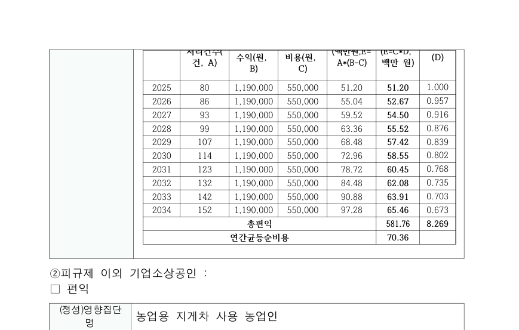
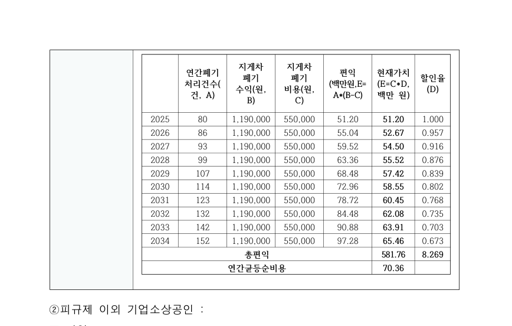
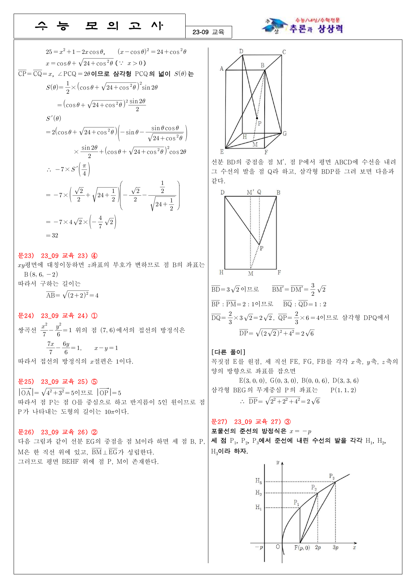
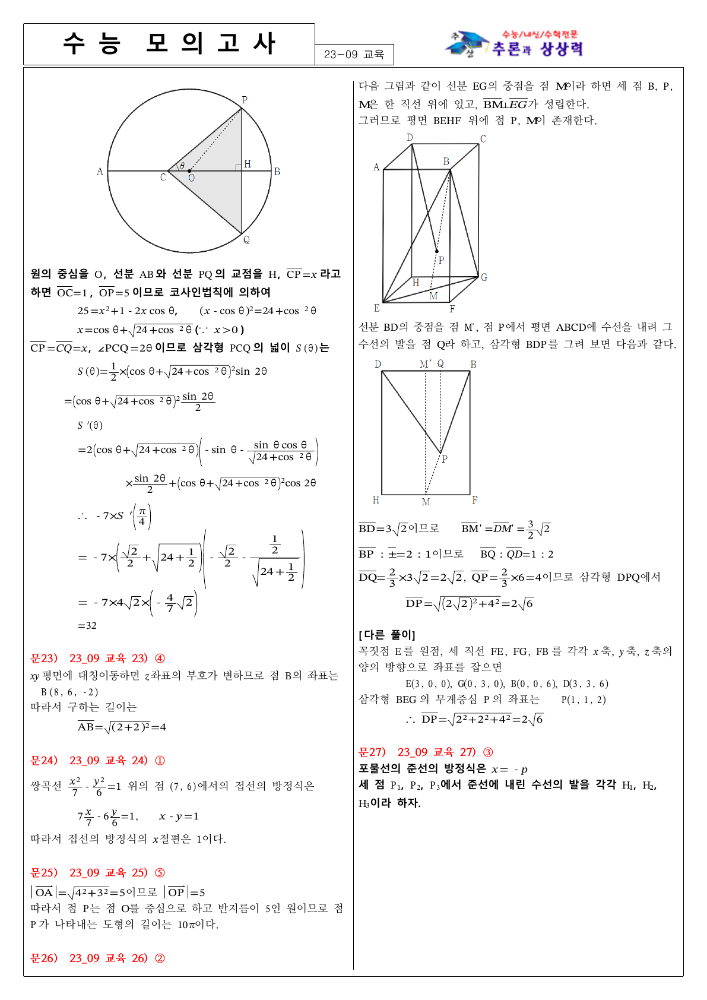
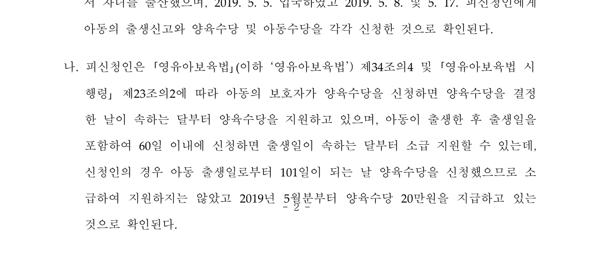
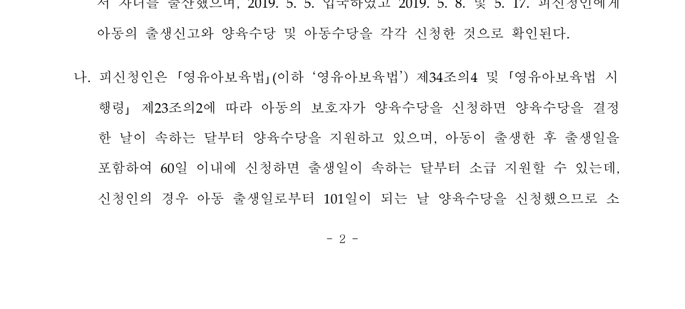

# planet6897 #6716·#6719·#6721 시각 증적 기록

## 목적과 판정 범위

이 기록은 체리픽 통합에서 수용하는 국소 layout 계약의 시각 자산 출처와 한계를 보존한다.
전체 문서의 pixel-perfect 일치 또는 전체 페이지 충실도를 선언하는 visual sweep은 아니다.

- 통합 브랜치: `review/planet6897-green-ci-batch-20260904`
- source 적용: #6716 `77cb4ed2`, #6719 `70f71aced`, #6721 `8a6a52775`
- 메인터너 보정: 공식 fixture 등록 `5315343e2`, native HWP5 zero-vpos 범위 축소 `5bc1c4e8b`
- 최종 코드 검증: `9016 tests run: 9016 passed (3 slow, 1 leaky), 46 skipped`

## #6716: 80550 셀 내부 중첩 표의 `vertOffset`

원 PR의 p31 비교 자산은 수정 전·수정 후·Hancom 기준을 함께 제공한다. 수용 범위는
`TopAndBottom` 셀 안 중첩 표의 signed `vertOffset` 선행 축이다.

| 수정 전 | 수정 후 | Hancom 기준 |
| --- | --- | --- |
|  |  |  |

- [수정 전 파일](../../report/6697-cell-nested-table-vert-offset/before_p31.png): `50402ccfc8d72cb68bbbd2bcab59198ed625604596539077304ae12401816ff9`
- [수정 후 파일](../../report/6697-cell-nested-table-vert-offset/after_p31.png): `b7af54ba86785716e4e67bdd4aef5d22fc51ba20cdcc858f6fcbdc705185181c`
- [Hancom 기준 파일](../../report/6697-cell-nested-table-vert-offset/oracle_p31.png): `f5a4cc02662d3d09f26bc9350d7560526a873d601680bcd053e96612903d808e`

공식 fixture의 전역 baseline `off-canvas=7`, `text-overlap=38`은 별도 잔여 상태이며, 이 p31
국소 축의 수용을 전역 시각 품질 통과라고 확장하지 않는다.

## #6719: 3-09월 교육 통합 문서의 endnote 제목

동일 p18에 대해 보존한 Hancom 2020 기준과 rhwp 후보 렌더다. 이 자산은 #6719 단독 후보에서
생성됐고, 뒤이은 #6716/#6721 체리픽 및 메인터너 보정이 누적되기 전 것이다. 따라서 #6550의
국소 증적으로만 사용한다.

| Hancom 2020 기준 | rhwp 후보 |
| --- | --- |
|  |  |

- [Hancom 기준 PNG](../assets/pr_6719_planet6897_20260904/hancom-2020-p18.png): `ce05afb0e32cf2056dae578463ace84c28e81749df0f4cab494f08da633c1dc1`
- [rhwp 후보 PNG](../assets/pr_6719_planet6897_20260904/rhwp-p18.png): `620ddf6de6911e7bf93ee1c31a95b7835c2f0ebe1eaf0703090ad657583ab1a2`
- [rhwp 후보 PDF](../assets/pr_6719_planet6897_20260904/rhwp-3-09월_교육_통합_2023.pdf): `438d1a3cf28fbe4023c2eaf50fe7c396d526852f84d327ff6d1c60defc624593`

최종 통합 head에 대해서는 해당 source regression을 포함한 전체 9,016건 회귀가 통과했다. 이
문서는 이전 후보 PNG/PDF를 최종 head 산출물로 오기하지 않는다.

## #6721: native HWP5 `vpos == 0` 되감김

원 PR의 page 2 source 자산은 zero-vpos page reset의 국소 전후를 제공한다. 최종 코드에서는
전역 zero-vpos 규칙이 아니라 저장 line-segment 계약에 일치할 때만 이 동작을 허용하도록
범위를 좁혔다.

| 수정 전 | 수정 후 |
| --- | --- |
|  |  |

- [수정 전 파일](../../report/6718-native-hwp5-zero-vpos-rewind/before_p2.png): `22399f19935a8582b8f8bc29ecc7121ed972683974f445b6a2045938dfe30b12`
- [수정 후 파일](../../report/6718-native-hwp5-zero-vpos-rewind/after_p2.png): `e625021f7ae4e198839b3c52812877482065526f7e6a71ecca951b65a7a2eade`

공식 fixture의 `text-overlap=2` 및 원 PR이 분리한 page 8 tail overflow는 이 국소 page-reset
증적의 범위 밖이다.

## export 방법의 제한

이 기록은 `export-png` 또는 `export-svg`를 최종 시각 oracle로 사용하지 않는다. 현재 두 export
결과가 `rhwp-studio` 화면 렌더와 다르게 동작하는 known discrepancy가 있어, 그 결과로 최종 통합
head의 시각 정합을 주장하면 안 된다. 여기의 asset은 source/후보 증적의 provenance를 보존하고,
최종 통합의 실행 보증은 targeted control과 전체 회귀 결과로 한정한다.
