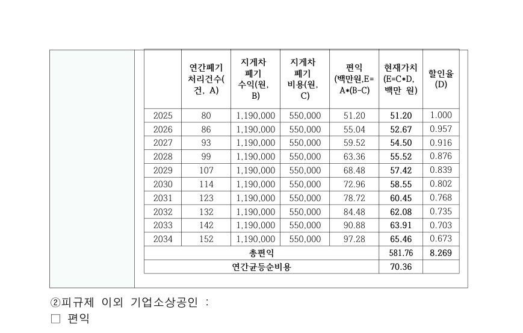

# PR #6716 검토 기록

- 원 PR: [#6716](https://github.com/edwardkim/rhwp/pull/6716)
- 기여자: `planet6897`
- 원본 head: `4162fe46dbaf4f809a9fd747cdc23364f5d61672`
- 통합 적용 commit: `8b183f656e3e14d54d2aa7d83a969718253a4645`

## 판정: 메인터너 보정 됨 수용 가능

이 기록의 수용 범위는 Issue #6697 전체가 아니라, `TopAndBottom` 배치의 셀 안에 중첩된 표가
저장된 signed `vertOffset`을 따라야 하는 선행 축이다. 원 PR이 의도적으로 제외한 초안 #6702의
텍스트 복구와 전역 문서 충실도는 이 판정에 포함하지 않는다.

## 반영 및 보정

- 원 변경은 셀 내부 중첩 표의 `vertOffset`을 반영하고, host의 마지막 셀 문단만 흐름 높이를
  부담하도록 한다.
- 공개 정식 fixture `samples/issue6697/80550-agricultural-machinery-act-amendment.hwpx`와
  manifest를 추가해 private 경로 없이 재현 가능하게 했다.
- 통합 검증 중 확인된 기존 문서 전역 anomaly는 baseline으로 명시했다. 이 fixture의 현 baseline은
  `off-canvas=7`, `text-overlap=38`이며, 이를 0으로 만들었다고 주장하지 않는다.

## 실제 검증

`upstream/devel` rebase 전 통합 후보에서 다음 전체 회귀를 완료했다. 이 PR head는 그 뒤 최신
`upstream/devel` 위로 rebase됐으므로, 병합 판정에는 PR CI 결과를 별도로 사용한다.

```text
cargo nextest run --locked --cargo-profile release-test \
  --target-dir target/pr-review-planet6897-green-batch-20260904 \
  --tests --no-fail-fast

Summary [238.794s] 9016 tests run: 9016 passed (3 slow, 1 leaky), 46 skipped
```

이 결과에는 #6716 원본의 회귀 테스트와 새 공식 fixture를 포함한 integration test가 포함된다.

## 시각 증적 범위

원 PR이 제시한 80550 문서의 p31 범위 증적은 아래 source asset이다. 원본 head에서의
수정 전·후·Hancom 기준 비교이며, 이 문서가 전체 페이지 또는 전역 anomaly가 모두 정합한다고
의미하지는 않는다.

| 구분 | 자산 | SHA-256 |
| --- | --- | --- |
| 수정 전 | [before_p31.png](../../report/6697-cell-nested-table-vert-offset/before_p31.png) | `50402ccfc8d72cb68bbbd2bcab59198ed625604596539077304ae12401816ff9` |
| 수정 후 | [after_p31.png](../../report/6697-cell-nested-table-vert-offset/after_p31.png) | `b7af54ba86785716e4e67bdd4aef5d22fc51ba20cdcc858f6fcbdc705185181c` |
| Hancom 기준 | [oracle_p31.png](../../report/6697-cell-nested-table-vert-offset/oracle_p31.png) | `f5a4cc02662d3d09f26bc9350d7560526a873d601680bcd053e96612903d808e` |



## 보류 범위

- #6702의 텍스트 복구 초안은 이 체리픽에 포함하지 않았다.
- 80550 문서의 p30/p31 외 시각 품질은 이 source 범위 증적으로 판정하지 않는다.
- 원 PR을 직접 병합하는 것이 아니라, 이 통합 브랜치의 provenance-preserving 체리픽으로
  수용 후보로 반영한다.
