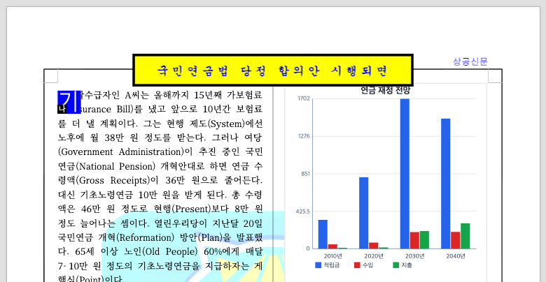

# PR #6736 검토 - 줄바꿈 경계의 IME 조합 오버레이 좌표

## 판정: 승인

현재 WASM과 Chrome에서 재조판된 soft-wrap 경계의 IME 오버레이가 다음 줄로 이동함을 확인했다. 이 PR 범위의 머지 보류 사유는 해소됐으며 별도 제품 보정 없이 수용 가능하다.

이 판정은 아래에 고정한 통합 후보의 로컬 검토 결과다. 원 PR을 직접 merge했다는 뜻이나 아직 생성하지 않은 통합 PR의 GitHub CI 성공을 뜻하지 않는다. 통합 PR 생성·push는 작업지시자 승인을 받았으며, merge는 최신 head CI 확인과 별도 승인 대상이다.

## 검토 기준과 체리픽 출처

- 원 PR: https://github.com/edwardkim/rhwp/pull/6736
- 기여자: `lpaiu-cs`; 사전 리뷰어: `jangster77`.
- 검토한 원 PR head: `5f97fea87041c75d782a0223a299f7e9ff806f7b`.
- 이 PR의 마지막 체리픽 commit: `c9716618d5edc9f5a5d22d89dee814644d2c83aa`.
- 통합 브랜치: `review/ci-green-batch-20260905`.
- 공통 base: `f7426ad95f2eb6f30732749bc50b32d60a3f343a`.
- 최종 코드 후보: `e207bb081ce3e56bad4f97c766add153ed28c28e`. [#6751 메인터너 TS 보정](../assets/ci_green_batch_20260905/pr6751-maintainer-correction.patch)과 [overflow-cell 기준선 강화](../../../tests/fixtures/overflow_cell_baseline.tsv)를 별도 보정 commit으로 포함했다. 위 작업 트리에서 통과한 검증 내용과 동일하며 리뷰·증적 문서는 뒤의 별도 commit이다.
- 현재 통합 검토 대상은 #6736, #6743, #6745, #6746, #6747, #6750, #6751, #6752, #6755의 9건이다.
- [후보 파일 해시](../assets/ci_green_batch_20260905/candidate-sha256.txt), [공통 검증·시각 증적](ci_green_batch_20260905_visual_sweep.md).

## 변경 및 코드 검토

- `line-start-affinity.ts`는 두 번째 이후 시각 줄의 시작일 때만 줄을 명시해 좌표를 다시 구한다. 비경계 위치는 기존 좌표를 유지한다.
- `input-handler.ts`에서 조합 오버레이 폭 계산 전에 보정한 시작점을 사용하고, 기존 셀 경계 정보는 보존한다.
- 머리말·꼬리말·각주와 2단 이상 중첩 셀은 지원 문맥을 벗어나므로 기존 경로를 유지한다. 이 영역까지 수정됐다고 주장하지 않는다.

## 실제 검증 결과

| 검증 | 이번 실행 결과 |
| --- | --- |
| 기준선 강화 후 Rust 전체 nextest | 9,043 통과, 46 skip, 실패 0; 241.513초, exit 0 |
| Native Skia lib | rhwp 3,930 통과/13 ignored; 나머지 workspace lib 182 통과 |
| Native Skia 그림/PNG | 2 통과 |
| Native Skia 직접 PDF | 4 통과 |
| 메인터너 TS 보정 후 Studio 전체 | 1,399 통과, 1 skip, 실패 0 |
| TypeScript --noEmit | 통과 |
| host/WASM/전체 대상 clippy | 모두 통과, -D warnings |
| workspace build, fmt, suite manifest | 모두 통과 |
| WASM | 현재 Rust 후보 host build 성공; Docker 사용 안 함 |

검증 통과 사실과 실행 수치는 위 표에 기록했다. Rust 회귀 뒤 추가한 제품 보정은 TypeScript 두 파일뿐이므로 Rust 소스·fixture는 동일하며, TS 보정 뒤 Studio 전체·타입 검사·해당 브라우저 검증을 다시 수행했다. 공통 문서에 명령·환경·통과 결과를 기록했다.

원 PR의 아래 CI는 해당 원 head에서 앞서 수집한 이력이며, 오늘의 통합 후보 CI로 재사용하지 않는다. 분석 결과를 중복 조회한 최신 원격 상태라고 주장하지 않는다.

- [Analyze (rust)](https://github.com/edwardkim/rhwp/actions/runs/33919148286/job/101173295805): `SUCCESS`.
- [adapter inter-diff](https://github.com/edwardkim/rhwp/actions/runs/33919148318/job/101173260988): `SUCCESS`.
- [CI Impact Policy](https://github.com/edwardkim/rhwp/actions/runs/33919792364): `SUCCESS`.

### 기준선 재검토 보정과 재검증

overflow-cell 기준선을 `48→32`로 강화하고 0개로 해소된 87개 허용 행을 제거한 뒤 전체 Rust 회귀를 다시 실행했다. **9,043 통과, 46 skip, 실패 0; 241.513초, exit 0**이며 overflow-cell 16개 파티션도 모두 통과했다. 새 dump의 비영 문서 12건은 강화한 기준선과 정확히 일치했다. [기준선 보정 증적](../assets/ci_green_batch_20260905/overflow-cell-ratchet-check.json). 이번 추가 실행은 Rust 전체 회귀이며, 제품 소스가 같은 Native Skia·lint·WASM 및 TS 보정 후 Studio·브라우저 검증은 기존 통과 결과를 유지한다.

## 시각 증적 및 기능 검증

저장 줄 경계 offset 22는 첫 입력 뒤 재조판으로 비경계가 되어 exact 좌표를 유지했다. 재조판된 경계 offset 26에서 다시 조합했을 때 (381.3, 125.8) 대신 (75.6, 146.5)에 오버레이가 놓였다. CDP Input.imeSetComposition과 실제 WASM으로 확인했으며, OS 한글 IME를 사람이 수동 조작한 검증으로 기록하지 않는다.



[기능 실측 JSON](../assets/ci_green_batch_20260905/pr6736-functional.json)

기여자의 과거 A/B 이미지와 이번 현재 후보 이미지는 공통 증적 문서에서 출처를 구분했다. 전체 픽셀 일치율만으로 승인하지 않았으며, 이번 PR의 명시된 계약을 기준으로 판정했다.

## 범위와 잔여 조건

다음 페이지로 넘어가는 조합, 중첩 셀, 창 크기 변경 시 오버레이 재계산은 이번 PR의 해결 범위가 아니다.

현재 로컬 검토 범위의 머지 보류 사유는 없다. 실제 원격 병합 전에는 승인받은 최종 통합 head의 required checks와 `MERGEABLE`/`CLEAN`을 다시 확인해야 한다.

## Merge 후 contributor PR comment 계획

이 절은 게시 초안이며 아직 PR·이슈 댓글이나 close를 수행하지 않았다. [후속 처리 7.3·7.4](../../manual/pr_review/post_merge.md)와 [리뷰 기록 3.1](../../manual/pr_review/intake_and_review.md)을 따른다.

- 원 PR: [#6736](https://github.com/edwardkim/rhwp/pull/6736). 직접 merge가 아니라 출처를 보존한 체리픽 통합으로 수용했음을 명시한다.
- 이슈 처리 범위: [#6553](https://github.com/edwardkim/rhwp/issues/6553)의 IME 줄 경계 범위에만 같은 기능 증적을 남긴다. [#4150](https://github.com/edwardkim/rhwp/issues/4150), [#1951](https://github.com/edwardkim/rhwp/issues/1951), [#785](https://github.com/edwardkim/rhwp/issues/785)는 설계 참조이며 댓글·close 대상에 포함하지 않는다. #6553은 전체 해결 범위와 closing keyword를 확인한 뒤에만 종료 여부를 결정한다.
- 검증 내용과 한계: 실제 WASM/Chrome CDP IME 검증에서 재조판 후 경계 26의 오버레이가 이전 줄 끝 (381.3,125.8)이 아니라 다음 줄 시작 (75.6,146.5)에 놓였다. OS 한글 IME의 사용자 수동 검증은 아니다. PDF 대조가 아니므로 flagged/pixel match/visual_accuracy_proxy_percent는 적용하지 않는다.
- 통합 PR 번호와 실제 merge SHA, 원 head·메인터너 보정 SHA를 구분하고, 최종 통합 head의 PR CI 및 해당 merge SHA의 devel CI 실제 run/job direct link와 결과를 게시 시점에 채운다. 아직 없는 번호·SHA·CI 성공을 미리 확정하지 않는다.
- 로컬 검증은 위 표의 실제 통과 수와 skip·미검증 범위만 요약한다. 원시 `.log`를 커밋·첨부하거나 로그 링크를 게시하지 않는다.
- 이 리뷰의 고정 링크: [개별 검토 기록](https://github.com/edwardkim/rhwp/blob/<merge-commit-sha>/mydocs/pr/archives/pr_6736_review.md).
- 이미지의 안정 경로는 `mydocs/pr/assets/ci_green_batch_20260905/`다. 아래 Markdown 이미지를 PR 댓글과 해당 이슈 댓글 본문에 직접 넣는다. 문서 링크나 이미지 다운로드 링크만으로 대체하지 않는다.

### 댓글에 직접 표시할 증적

```markdown
- 문서 비교 기준: [Visual Sweep 정본](https://github.com/edwardkim/rhwp/blob/devel/mydocs/manual/verification/visual_sweep_guide.md#github-merge-comment)


```


### 함께 남길 자료 링크

- [pr6736-functional.json](https://github.com/edwardkim/rhwp/blob/<merge-commit-sha>/mydocs/pr/assets/ci_green_batch_20260905/pr6736-functional.json)

### 게시·수정 및 종료 순서

1. 승인된 통합 PR merge 및 해당 merge SHA의 devel CI 성공 뒤, 이미지·PDF·리뷰가 그 commit과 devel에 실제 존재하는지 확인한다. 모든 `<merge-commit-sha>`를 확정 SHA로 치환한 뒤에만 게시한다.
2. PR·이슈 기존 댓글을 조회한다. 같은 merge·증적의 댓글이 있으면 그 댓글 ID를 수정하며 새 댓글을 중복 등록하지 않는다. 이미 내용이 완전하면 수정도 생략하고 permalink만 남긴다.
3. 신규 댓글은 UTF-8 BOM 없는 본문 파일을 `gh pr comment` 또는 `gh issue comment --body-file`로 게시한다. 기존 댓글은 같은 본문 파일을 `gh api --method PATCH repos/edwardkim/rhwp/issues/comments/<comment-id> -F body=@<body-file>`로 반영한다.
4. 게시·수정 뒤 API로 body를 재조회하여 한글·실제 줄바꿈·SHA 고정 이미지 Markdown·대상 PR/이슈와 첨부 범위를 대조한다. 인증 값이나 로컬 임시 경로를 댓글에 노출하지 않는다.
5. closing keyword와 실제 해결 범위를 확인한다. auto-close된 이슈도 검증 댓글이 없다면 남기고, 이미 있는 동일 댓글은 재사용한다. 미해결·참조 이슈는 종료하지 않으며 원 PR은 체리픽 수용 사실을 기록한 뒤 필요한 close만 수행한다. contributor fork branch는 보존한다.

## 이전 후보 이력

이전 후보 `a6a8001b30babbb9961c8b1568abf05d72a3be80`의 9,043 통과/Studio 1,461 통과는 과거 결과다. 이번 판정의 근거는 위 **현재 9건 통합 후보 재실행** 및 TS 보정 후 검증이며, 과거 결과는 이력으로만 구분한다.
