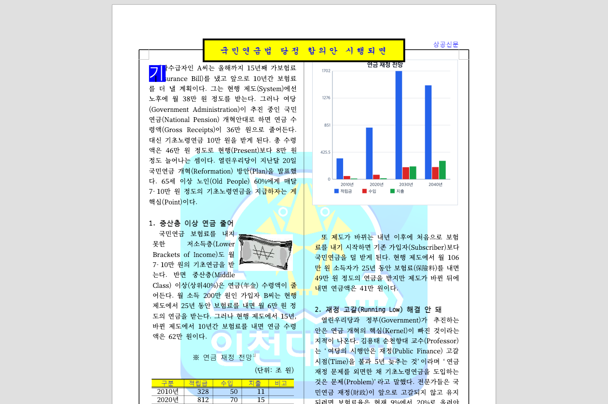
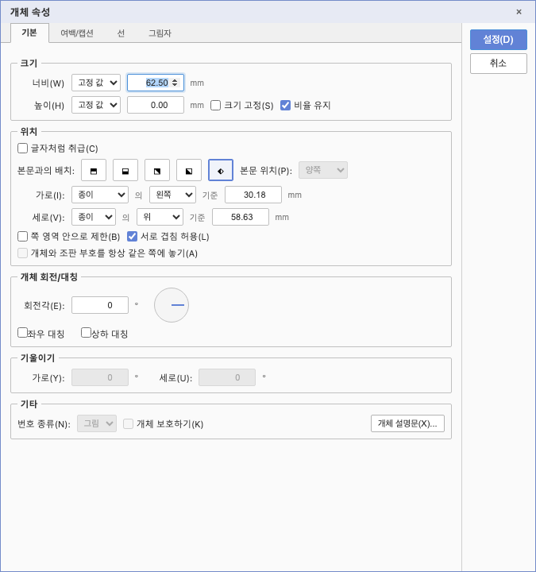
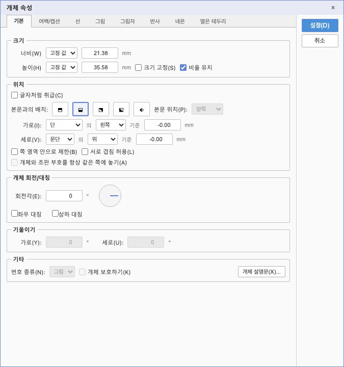

# PR #6739·#6770 직접 시각·동작 검증

## 판정과 검증 기준

- 검증일: 2026-09-05. #6739는 **승인**, #6770은 **메인터너 보정 완료·수용 가능**이다.
- 기준: `upstream/devel@1f861362ab372f9fa26e38f9a534a89286f641c4`.
- 체리픽 후보: `5bc8e87f5879d3308ae006bcc8e53410477ee580`.
- 메인터너 보정은 아직 미커밋이다. 소스·회귀 테스트 두 파일의 diff SHA-256은 `e00d6c035ce675020915a2c00a089e86792ba70a6a668d0c46589132ff74fd67`이다.
- 검증 환경: macOS, Node `24.15.0`, Chrome `152.0.7977.82`, Chrome CDP, Canvas2D, `screen` 프로필, 1280×1000 viewport, deviceScaleFactor 1.
- `/Users/tsjang/rhwp`의 소스를 별도 Vite `127.0.0.1:7718`에서 열었다. 사용자 Vite를 중지하거나 기존 탭을 조작하지 않았다. 검증용 Chrome과 Vite는 종료했다.
- WASM은 `CARGO_TARGET_DIR=target/review-lpaiu-6739-6770 scripts/wasm-pack-locked.sh --target web --out-dir pkg`로 새로 빌드했다. `wasm-opt`까지 성공했고 4분 34초가 걸렸다. Docker는 사용하지 않았다.
- WASM SHA-256: `f531f4d540839b4d2630f3ffb120d5704ef31659e17acd28236f3d7328743321`.

이 기록은 실제 Studio UI 동작 검증이다. PDF 변환·페이지 전체 픽셀 일치·모든 OS의 IME 동등성을
주장하지 않는다. 기여자 한컴 측정은 원 이슈의 참고 근거이며 이번 직접 측정과 구분한다.

## 실행 결과

| 검증 | 실제 결과 |
| --- | --- |
| 보정 전 Studio `npm test` | 1,414 통과, 1 건너뜀, 실패 0 |
| 추가 경계값 검사 | 원 코드에서 `image unchanged horizontal -1` 실패 재현 |
| 보정 후 Studio `npm test` | 1,424 통과, 1 건너뜀, 실패 0; 신규 회귀 10개 |
| 보정 후 별도 경계값 대조 | 개체 5종 × 오프셋 8개 = 40개 시나리오, assertion 160개 통과 |
| TypeScript | `tsc --noEmit` 성공 |
| Studio 배포 빌드 | `npm run build` 성공; 기존 큰 청크 경고는 오류와 구분 |
| 최적화 WASM | 성공 |
| Chrome 동작 검사 | 13개 항목 통과; 초기 안내창 해제 뒤 IME 핵심 시나리오 재검증·재캡처 |
| 코드 whitespace | `git diff --check` 성공 |

Rust 소스 변경이 없어 전체 Rust 회귀·Rust lint 재실행은 생략했다. 원 PR CI와 이후 통합 PR CI는
개별 리뷰에서 구분하며, 이 로컬 검증 결과만으로 GitHub merge를 승인하지 않는다.

## #6739: 정상 조합과 부적합 좌표 폴백

입력은 `samples/143E433F503322BD33.hwp`, SHA-256은
`1bcdc7a2de38680cdb715556f40c8477f8242131d28de949b09e945022bf35fa`다.
본문 문단 1에서 CDP `Input.imeSetComposition`과 `Input.insertText`로 조합·확정을 수행했다.
최초 편집으로 저장 조판이 다시 계산된 후 실제 줄 경계 offset 26을 선택했다.

| 상태 | 관측값 | 판정 |
| --- | --- | --- |
| 정상 줄 경계 | 원 시작 `(381.3,125.8)` → 보정 시작 `(75.6,146.5)`, 캐럿 `(88.9,147.1)` | 다음 줄에 조합 박스 표시 |
| 정상 표시 DOM | left `95.75`, top `156.5`, 폭 `13.3 px` | 통과 |
| 이전 줄 좌표를 주입하고 가드만 우회한 대조 | left `401.45`, top `135.8`, 폭 `7.98 px`; 일반 캐럿 숨김 | 잘못된 줄의 최소 폭 박스 재현 |
| 같은 주입 좌표에 실제 가드 적용 | 오버레이 숨김, 일반 캐럿 left `109.05`, top `157.1` | 통과 |
| 페이지 불일치 주입 | 오버레이 숨김, 현재 페이지 일반 캐럿 표시 | 통과 |
| 가드 복귀 후 조합 확정 | 조합 종료, 검사한 본문 텍스트 보존 | 통과 |

정상 좌표는 실제 WASM 조회값이며 가드 발동 대조는 명시적 좌표 주입이다.
이를 현재 자연 입력에서 잔상이 계속 발생한다는 증거로 해석하지 않는다.

### 정상 줄 경계

### 가드 우회 대조

### 실제 가드 적용

세 이미지를 직접 열어 첫째 문단의 표시 위치를 비교했다. 잘못된 박스는 이전 줄 끝에 있고,
가드 적용 후에는 다음 줄의 일반 캐럿으로 복귀한다. 초기 안내창이 겹친 캡처는 포함하지 않았다.

셀 경계 전달·제거, 조회 실패 시 원 좌표 유지와 혼합 run 높이의 허용은 실제 브라우저 모듈에
통제된 조회값을 주어 검사했다. 거대 중첩 셀의 모든 페이지, 머리말·각주와 OS별 실제 키보드 IME를
전수 검사한 결과로 확대하지 않는다.

## #6770: 실제 속성창과 저장 데이터

### 가로선의 무변경 확인과 실제 이동

입력은 `samples/group-box.hwp`, SHA-256은
`d05b13579a40be6cdcb1251c80e84cd19076e497a01fdef834e04c3a206d5bfc`다.
대상은 `s0p2c0`의 가로선이다. 실제 속성창의 `설정(D)` 버튼으로 적용했다.

| 검사 | 실제 결과 |
| --- | --- |
| 무변경 확인 | 가로 `8554`, 세로 `16620`, 너비 `17716`, 높이 `1` 유지 |
| 전송 패치 | 위치 키 없음; 기존 그림자 값만 전달 |
| 가로 `40.00 mm` 편집 | 가로 `11339`, 세로 `16620` |
| 대상 선의 SHAPE_COMPONENT | 원본·최초 export·무변경 확인·동일 좌표 대조군 모두 239바이트 동일 |
| 전체 저장 파일 비교 | 무변경 확인 파일과 동일 좌표 재적용 대조군 8,704바이트 동일 |

대상 선의 도형 레코드 SHA-256은 `6d905b36ac3906f0fc3e59e00b1705c83c4cc325aad395e27c133754a010c8f8`이다.
전체 파일을 무조건 원본과 비교한 첫 검사는 다른 그룹 레코드의 재직렬화 차이를 검출했다.
이를 숨기거나 임의 허용값으로 통과시키지 않고, 동일 좌표 `8554`를 재적용해 section을 재직렬화한
대조군을 따로 만들었다. 무변경 확인 결과와 이 대조군은 전체 바이트가 일치했다.
두 파일의 SHA-256은 `7c97bc8c22e72700b5dcc7e87f3a85183da47f072a194f80d473be51c125188f`다.
따라서 대상 선의 원본 데이터 보존을 확인했지만 전체 문서 무손실 저장을 주장하지 않는다.

### 실제 셀 그림과 메인터너 경계값 보정

입력은 `samples/basic/issue1994_behindtext_table_20200830.hwp`, SHA-256은
`8e7a95cf591944bff56050879fa90251921ec57e28eac66d40c6fb8ad103016f`다.
대상 셀 그림은 본문 문단 31, 경로 `[(0,0,0)]`, 내부 control 0이다.

- 원본 `97 / -365`는 무변경 확인 후 그대로 유지됐다.
- 가로 `-1.00 mm` 편집은 패치에 `-283`을 전달하고 제한된 셀에서 가로 `0`으로 배치됐다. 바꾸지 않은 세로 `-365`는 유지됐다.
- 영역 제한을 껐다 켜면 세로도 `0`으로 제한됐다. 실제 제한 동작을 무력화하지 않았다.
- 경계값 검사는 이 그림의 제한을 끈 뒤 `-1 / -1`을 명시적으로 설정한 것이다. 원본 문서에 이 값이 있었다고 주장하지 않는다.
- 실제 폼의 `-0.00 / -0.00`을 그대로 확인해도 위치 키가 전송되지 않고 `-1 / -1`이 보존됐다. 이는 메인터너 보정 후 결과다.

다른 셀 그림 `s0p0`, 경로 `[(2,0,0)]`에서도 위치 `31512 / 91`의 무변경 보존을 확인했다.
그림 자르기 값은 기존 표시 왕복으로 `1133→1134`, `1700→1701`이 관측됐다. 해당 축은 이번 위치
오프셋 PR 밖의 잔여 사항이며, 모든 속성의 완전한 무변경 적용으로 포장하지 않는다.

## 증적 보존과 댓글 계획

저장소에는 위 대표 PNG 5개만 보존했다. 로그, 중간 PNG, 분석 JSON, 임시 export HWP는 `/tmp`의
검증 산출물이며 커밋 대상이 아니다. 해시 계산용 보조 코드 오류와 초기 안내창이 겹친 캡처는
제품 실패 또는 최종 시각 증적으로 집계하지 않았다.

통합 merge와 devel CI 성공 및 작업지시자 승인 뒤, 개별 리뷰의 댓글 계획에 따라 이 문서의 실제
검증 범위·좌표·제한을 적고 대표 이미지를 직접 표시한다. 이미지 주소는 확정된 merge SHA를 넣은
`https://raw.githubusercontent.com/edwardkim/rhwp/<merge-commit-sha>/mydocs/pr/assets/pr_6739_6770_20260905/<PNG>`를
사용한다. 미확정 SHA로 댓글을 게시하거나 source PR·issue를 먼저 닫지 않는다.

## 2026-09-05 PR 게시 승인 후 확정 기록

- 작업지시자가 메인터너 보정과 검토 기록의 커밋 및 통합 PR 생성을 승인했다. 앞의 미커밋/승인 대기 표기는 로컬 검증 당시 상태이며, 게시 준비 단계에서는 이 절을 따른다.
- #6739의 최신 source head는 `facfdf93ea5ef1b5e43a30121251bce0365a0775`로 유지됐다.
- #6770의 최신 source head는 `d8d8828f5ea6acf7506db20f541ac1186f00755d`다. 기여자가 선행 #6763의 통합을 반영하여 `1f861362ab372f9fa26e38f9a534a89286f641c4` 위로 재배치했다.
- `git range-diff`에서 이전 `d07f721fade0e2397284b5b1119898d1c42f54e0`과 최신 `d8d8828f5ea6acf7506db20f541ac1186f00755d`의 기능 패치는 `=`로 확인됐고, `git cherry HEAD <최신 source head>`도 이미 적용된 패치(`-`)로 판정했다. 로컬 `5bc8e87f5879d3308ae006bcc8e53410477ee580`의 기존 provenance를 보존하며 같은 기능을 중복 체리픽하지 않았다.
- 검토 branch의 기준 `upstream/devel`도 `1f861362ab372f9fa26e38f9a534a89286f641c4`로 동일하다. 검증한 메인터너 보정 diff의 SHA-256 `e00d6c035ce675020915a2c00a089e86792ba70a6a668d0c46589132ff74fd67`과 커밋 직전 diff가 일치했다.
- 실제 소스 변경이 없으므로 기존 Studio 1,424 통과/실패 0/skip 1, TypeScript 검사, Studio 및 WASM 빌드, CDP 검증 결과를 재사용한다. 이번 게시 단계에서 테스트를 다시 실행했다고 기록하지 않는다. 통합 PR 최신 head의 GitHub CI 결과는 별도로 기다려야 한다.
- 최종 판정은 #6739 **승인**, #6770 **메인터너 보정 완료, 수용 가능**이다. 원 PR/관련 이슈 comment와 close, 통합 PR merge, branch/target 정리는 이번 게시 작업에서 수행하지 않는다.

- 메인터너 code/test 보정 커밋: `f7c53792ca966521567a79078247fb28a2b1111a`. 검토 문서, 오늘할일 및 코멘트용 PNG 5개는 이 커밋 뒤의 별도 기록 커밋으로 포함한다.
