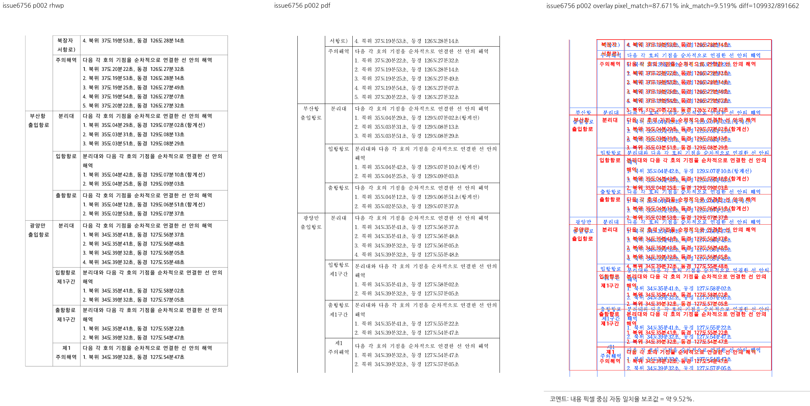
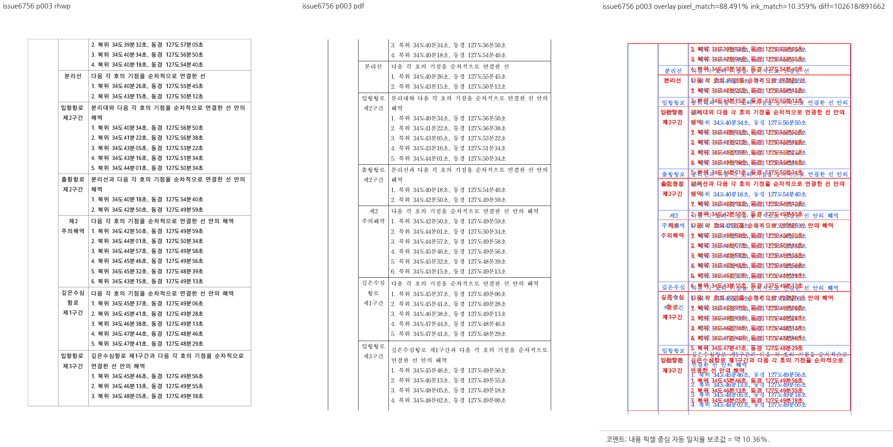
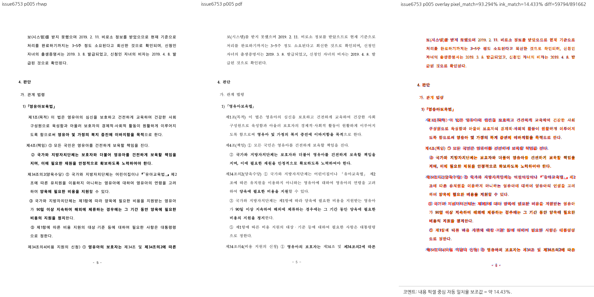
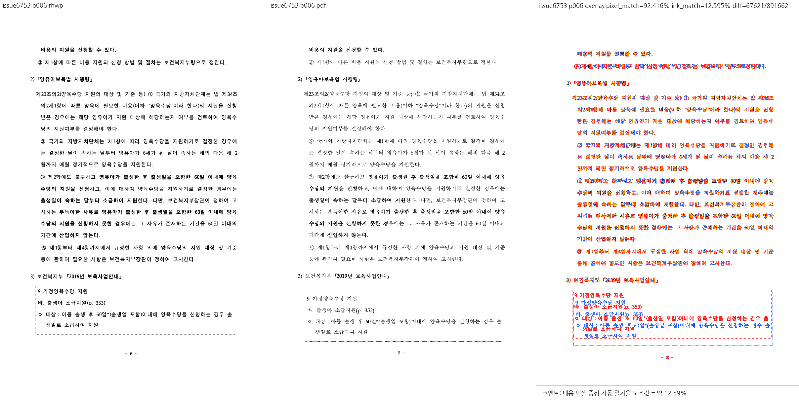
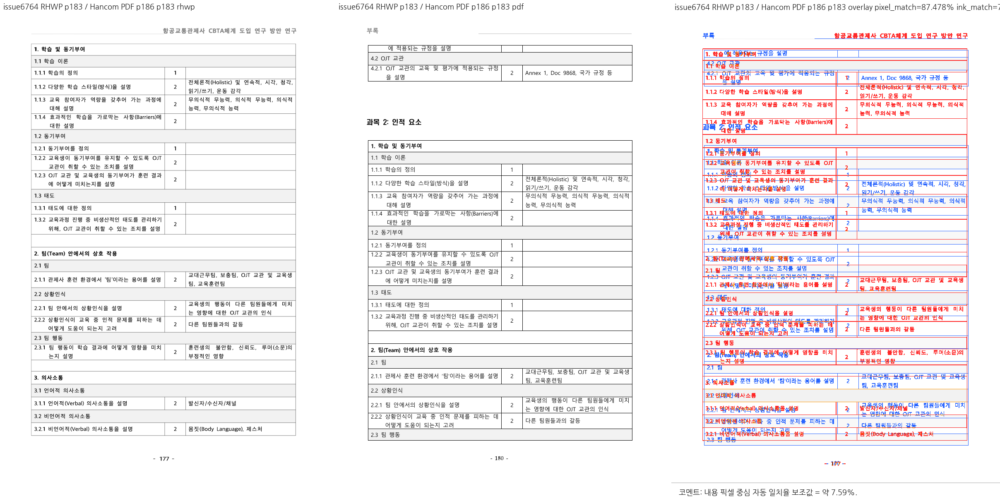
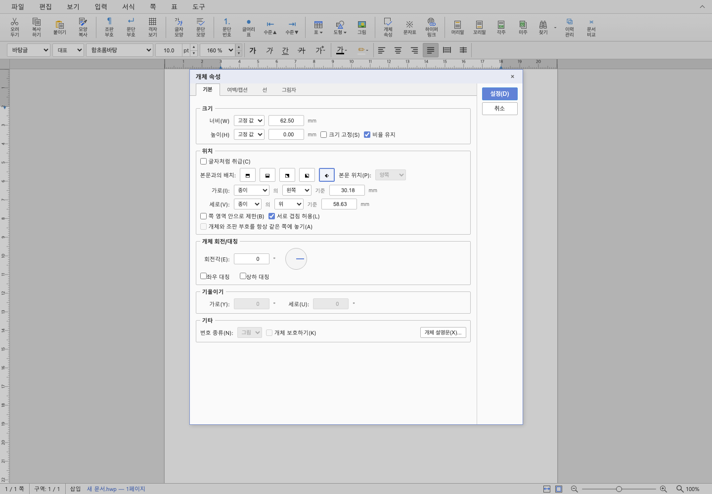
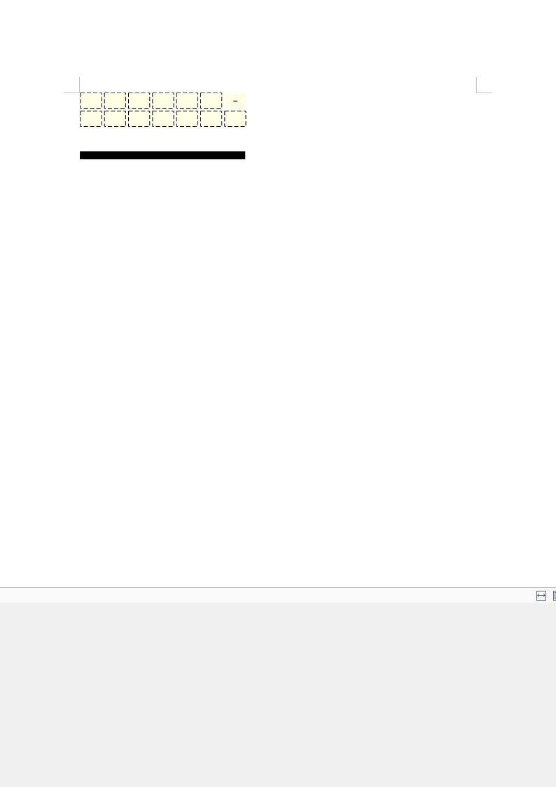
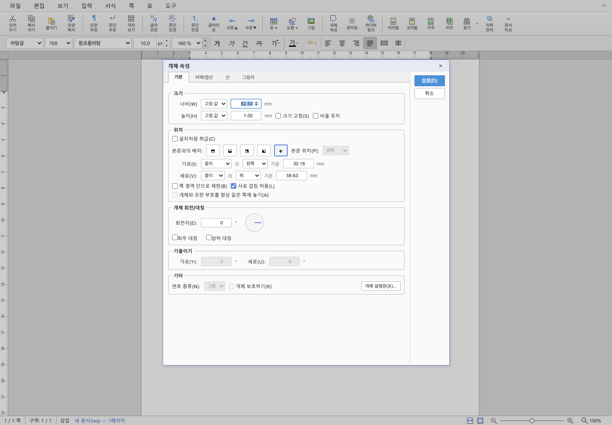

# PR #6759·#6760·#6762·#6763·#6768 시각 검증과 최종 증적

## 기록 범위

2026-09-05. [시각 증적 절차](../../manual/pr_review/visual_fixture_evidence.md)와
[PDF/SVG visual sweep 정본](../../manual/verification/visual_sweep_guide.md#github-merge-comment)을 따른다.
작업지시자의 시각 확인과 GitHub approve·merge 승인은 별도이며, 이 문서는 실행한 사실과 제한 범위를 기록한다.

검증 브랜치는 `review/ci-green-6759-6768-20260905`, 기준 devel은
`2c144b180dd776aa450c499778510199ae6cdf89`이다. 체리픽 HEAD
`d87b3037e5aeb6b662904b0182c361d5a2929108`에 당시 미커밋 메인터너 보정을 더한 상태를 사용했다. 해당 보정은 이후 `902a208b515e83024502f004a2adaf84c33f18de`로 커밋했다.

- native 시각 검증 후보 바이너리 SHA-256: `2edf5134fb14f1a3fafa1a28a1b0673d0206ca55642abaf0ee51b8a35919c58f`.
- 기준 devel 비교 바이너리 SHA-256: `d34749fbff8d855ef6f019a6ea9b59b272e287399ea72c2adfa5f229c57ed5fc`.
- 새 WASM SHA-256: `f531f4d540839b4d2630f3ffb120d5704ef31659e17acd28236f3d7328743321`.
- 전체 검증·최초 실패·보정 결과는 [공통 검증 기록](pr_6759_review_impl.md)에 정리했다.

## 입력과 최종 기준 PDF

| 대상 | 정식 입력 | 기준 PDF | 저장 제품 / MCP | 페이지 |
| --- | --- | --- | --- | --- |
| #6760 / #6756 | [지정항로 HWP](../../../samples/issue6756/17253153-traffic-safety-designated-routes.hwp) | [2020 기준 PDF](../../../pdf/17253153-traffic-safety-designated-routes-2020.pdf) | Hancom 2020 / engine 2020 | 한컴 5, rhwp 5 |
| #6762 / #6753 | [양육수당 HWP](../../../samples/issue6718/27469-child-allowance-retroactive-support.hwp) | [기존 2020 기준 PDF](../../../pdf/issue6718-27469-2020.pdf) | 기존 정본 재사용, 재변환 안 함 | 한컴 12, rhwp 12 |
| #6768 / #6764 | [CBTA HWP](../../../samples/issue6764/1613000-202200037-air-traffic-controller-cbta.hwp) | [2020 기준 PDF](../../../pdf/1613000-202200037-air-traffic-controller-cbta-2020.pdf) | Hancom 2018 / engine 2020 | 한컴 204, 후보 rhwp 201 |
| #6763 / #6758 | [group-box HWP](../../../samples/group-box.hwp) | 편집 동작이므로 PDF로 대체하지 않음 | 실제 Studio / 새 WASM | 1쪽의 선 개체 |

### #6756 신규 정본

- HWP 크기 122,368 bytes, SHA-256 `0bb29b403355463d16c8dab2107431cb258ec73f8ada8ec564f2200fd8aa2721`.
- 마지막 저장 제품: Hancom 2020, 버전 `11.0.0.8362`.
- 비동기 MCP engine 2020 job `6b83b2dc-e45b-4e48-98c1-03c248bc383f`, 완료 상태 success.
- PDF 66,169 bytes, 5쪽, SHA-256 `deb6aad07fde6198443c95360a2dcbaea7781dce66e769c4754c0fb8fca8f6be`.
- 원본 출처와 등록 정보는 [sample README](../../../samples/issue6756/README.md) 및 [MANIFEST](../../../samples/issue6756/MANIFEST.json)에 보존한다.

### #6764 신규 정본

- HWP 크기 12,851,712 bytes, SHA-256 `8ef9de3f35690bf9d7994527f77cb02d4a4fcff447c219a78fbc2855d64be6e7`.
- 마지막 저장 제품: Hancom 2018, 버전 `10.0.0.7888`.
- 비동기 MCP engine 2020 job `73d907b3-7270-455a-a646-39bbb3127017`, 완료 상태 success.
- PDF 3,819,665 bytes, 204쪽, SHA-256 `6ad5521bde00e9cda7631191ce8d2e57f66a890816aab8ed8496eb65113003b3`.
- 원본 출처와 등록 정보는 [sample README](../../../samples/issue6764/README.md) 및 [MANIFEST](../../../samples/issue6764/MANIFEST.json)에 보존한다.
- HWP 메타데이터의 페이지 값과 실제 렌더 페이지 수를 섞지 않는다.

## 대조 방식과 실제 지표

native CLI의 SVG·render tree를 생성하고 SVG를 Chrome의 웹 폰트 환경에서 raster했다.
한컴 PDF와 96 DPI, pixel diff threshold 32 기준으로 compare·overlay·review 패널을 생성했다.
완료된 패널은 실제로 열어 본문·페이지 하단·대응 행을 확인했다.
이 결과는 Studio canvas의 직접 출력이나 전체 픽셀 일치 증명이 아니다.

| 대상 | rhwp 물리 페이지 | PDF 물리 페이지 | pixel match | visual accuracy proxy |
| --- | ---: | ---: | ---: | ---: |
| #6756 | 2 | 2 | 87.67111% | 9.51875% |
| #6756 | 3 | 3 | 88.49138% | 10.35929% |
| #6753 | 5 | 5 | 93.29410% | 14.43331% |
| #6753 | 6 | 6 | 92.41630% | 12.59484% |
| #6764 내용 대응 표 | 183 | 186 | 87.47844% | 7.58904% |

proxy 수치를 “전체 fidelity 정확도”로 해석하지 않는다. 글꼴, 행 배분, 선행 제목·표 꼬리의 위치가 달라
잉크 겹침은 낮다. 자동 후보가 없다는 사실도 사람의 범위별 대조를 대신하지 않는다.

## #6760 / #6756: 중복 행과 용지 하단

2·3쪽을 선택해 2쪽 모두 대조 완료했고 자동 후보는 0개였다.
2쪽 끝의 항목 1이 3쪽 머리에 재출현하지 않으며 3쪽은 항목 2에서 3·4로 이어진다.
선택 페이지에서 글자가 용지 하단을 넘어가는 모습은 보이지 않는다.

한컴은 2쪽에 항목 1·2를 함께 배분하고 3쪽을 3·4로 시작하므로 쪽별 행 배분은 남은 차이다.
5쪽 전체를 합친 문자 빈도 차이는 0이지만 문자 순서까지 동일하다는 뜻은 아니다.

## #6762 / #6753: 5쪽 본문 하한과 6쪽 첫 문장

5·6쪽 대조 완료, 자동 후보 0개. 5쪽 마지막 본문은 용지 안에 있고,
6쪽 첫 문장은 “비용의 지원을 신청할 수 있다.”다.
12쪽 각각의 문자 빈도 차이는 0이다. 6쪽 인용 상자의 높이·여백과 글꼴 차이는 별도 잔여 사항이다.

## #6768 / #6764: 표 조각의 내용 대응 비교

rhwp 물리 183쪽의 학습 표와 PDF 물리 186쪽의 같은 내용을 매핑했다.
원 PDF는 수정하지 않았으며, 대조 도구에 넘기는 raster의 페이지 키만 대응시켰다.
한컴 쪽에는 선행 표의 꼬리·제목이 있고 rhwp 쪽은 표가 위에서 시작한다.

대상 표는 `rows=46, cols=3, pi=4, ci=0`, bbox `x=75.6, y=75.6, w=638.8, h=947.5`다.
실물 회귀는 이 표가 하나이고 source row 0~22 및 학습·팀 항목 텍스트가 존재하며 용지 안에 있음을 확인한다.
직접 연 패널에서도 해당 내용을 확인했다. 표가 사라져서 경계 탐지가 줄어든 것으로 판정하지 않는다.

### 잔여 문제와 issue 상태

- 기준 devel의 rhwp 200쪽이 후보에서 201쪽으로 바뀌었으나 한컴 204쪽과는 다르다.
- text-overlap은 23→23, off-canvas는 6→5다. 모든 잔여 탐지를 오탐으로 분류하지 않았다.
- 물리 182쪽 제목 “과목 2: 인적 요소”의 용지 초과 61.4667 px는 기준 devel에서도 같았고 후보에도 남는다.
- 다른 표의 하단 초과는 물리 136·151·168쪽에서 약 2.0767·9.1167·13.3567 px다.
- 기준 devel 물리 186쪽의 다른 본문 초과 3.7733 px는 후보 물리 187쪽으로 이동해 남는다.
- anomaly JSON의 page index는 0부터, 이 기록의 물리 페이지는 1부터 센다. 초기 탐색 페이지 선택을 정확한 anomaly 페이지 매핑으로 바꾸어 주장하지 않는다.
- 전체 #6764 issue는 OPEN으로 유지한다. 이 PR의 수용 범위는 큰 표 조각 초과 해소 축이다.

추가 탐색 sweep은 물리 3·4·42·70·135·150·167·181·182·183·186쪽 11개에서 산출을 완료했다.
그 11개 모두를 사람이 직접 비교 완료했다고 주장하지 않는다.
코멘트에 필요하지 않은 탐색 패널과 원시 SVG·JSON은 보관 대상에서 제외했다.

## #6763 / #6758: 실제 Studio CDP 치수 왕복 확인

새 WASM과 Chrome `Chrome/152.0.7977.82`에서 `section=0, paragraph=2, control=0`의 선을 사용했다.
무변경 전·후 모델은 `width=17716, height=1` HWPUNIT이고 표시값은 `62.50 / 0.00` mm였다.

이어 비율 유지를 해제하고 CDP로 열린 높이 폼에 정확히 `1.00`을 채웠다.
실제 설정 버튼을 클릭한 뒤 모델은 `width=17716, height=283`이었다.
세 번째 속성 창에서 표시 `62.50 / 1.00` mm를 확인하고 다시 무변경 설정해도 같은 모델 치수가 유지됐다.
최종 스크립트는 **exit 0**이며 모델 setter를 직접 호출하지 않았다.

이전 30초 timeout은 canvas 대신 편집 textarea에 포커스를 주도록 수정해 해소했다.
숫자 부분 선택으로 잔여 소수부가 남은 키보드 자동화 문제는 CDP 폼 입력과 적용 전 값 단언으로 분리했다.
제품 소스는 추가 변경하지 않았다. 모든 키보드 숫자 편집 UX 또는 다른 개체 종류의 검증으로 확대하지 않는다.

대표 PNG를 직접 열어 적용 후 재열기에서 높이 1.00 mm가 표시되는 것을 확인했다.
PC 전체 화면이 아닌 Studio 앱 영역이다. 원시 JSON·실행 로그·중간 캡처는 커밋하지 않는다.

별도의 renderer Studio canvas 캡처는 첫 문서 페이지 준비 대기에서 중단된 상태 그대로다.
따라서 #6756·#6753·#6764의 새 Studio canvas 이미지가 모두 산출됐다고 기록하지 않는다.

## 코멘트에 사용할 최종 파일과 제외 정책

`mydocs/pr/assets/pr_6759_6768_20260905/`에는 위 PNG 9개만 남긴다.
최종 기준 PDF와 정식 sample·MANIFEST는 별도로 보존한다.
중간 PNG·SVG·분석 JSON·run manifest·로그·HTML은 커밋하지 않는다.
이번 제외 파일 585개는 로컬 진단용 `/tmp/rhwp-pr6759-uncommitted-artifacts-6HfF7i/`로 옮겼다.
이 경로는 영구 증적 링크가 아니며, 코멘트는 이 문서와 위 최종 파일만 참조한다.

## Merge 후 contributor PR comment 계획

- #6759: 제품 렌더 변경이 없으므로 불필요한 이미지를 붙이지 않고 테스트 결과를 기록한다.
- #6760·#6756: 2·3쪽 패널 두 개를 직접 표시하고 중복 해소와 남는 쪽 배분 차이를 함께 설명한다.
- #6762·#6753: 5·6쪽 패널 두 개와 경계 회귀 결과, 인용 상자·글꼴 차이를 함께 기록한다.
- #6763·#6758: 무변경 전·창·후 및 명시적 변경 후 재열기 PNG 네 개를 사용한다. CDP에서 확인한 높이 1→1→283→283과 너비 보존을 기록하고, 원격 merge·devel CI 성공 전에는 게시하지 않는다.
- #6768·#6764: 183↔186쪽 내용 대응 패널을 표시하고 표 축의 부분 수용과 남는 제목 문제를 명시한다. #6764는 닫지 않는다.
- 통합 merge SHA와 실제 PR/devel CI가 확정되고 성공한 뒤에만 게시한다. 같은 merge SHA의 기존 댓글이 있으면 새 댓글 대신 수정한다.
- UTF-8 `--body-file`로 작성하고 API로 body를 재조회한다. 아래 URL의 placeholder를 실제 merge SHA·상대 PNG 경로로 바꾸며, raw 이미지는 댓글에서 직접 보이게 한다.

~~~markdown
문서 비교: [PDF/SVG visual sweep 가이드](https://github.com/edwardkim/rhwp/blob/devel/mydocs/manual/verification/visual_sweep_guide.md#github-merge-comment)

~~~

현재 원 PR·issue에 comment·close를 실행하지 않았고 통합 PR도 생성하지 않았다.
