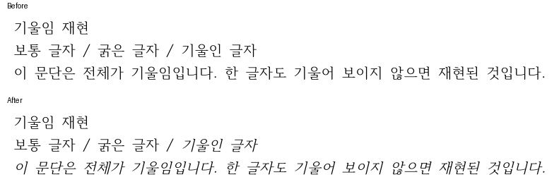

# PR #6775 self-review

## 접수와 범위

| 항목 | 확인 내용 |
| --- | --- |
| PR | [#6775](https://github.com/edwardkim/rhwp/pull/6775) |
| 관련 이슈 | [#5874](https://github.com/edwardkim/rhwp/issues/5874), `Closes #5874`로 연결 |
| 작성자 / 검토자 | `jangster77`, 작성자 self-review |
| base / head branch | `devel` / `fix/5874-pdf-synthetic-italic` |
| 구현 commit | `ce67652fef69b03eee7340a7a88e439cf33c695c` |
| 최초 PR candidate | `5b797351490df0a6b96f5735c18cc9cd733a6bc0` |
| 최초 규모 | 14 files, +692/-1, 3 commits; 오늘할일 미포함 |
| 생성 직후 참고 상태 | non-draft, MERGEABLE / BLOCKED, CI 진행 중 |
| metadata | issue와 동일 assignee `jangster77`; issue label/milestone 없음 |

자기 PR이므로 reviewer를 지정하지 않았고 GitHub approve event도 만들지 않았다. 위 CI와
mergeability는 작성 시점 참고값이며 최종 merge 조건이 아니다.

- base route: `collaborator_self_merge.md`
- modifiers: `intake_and_review.md`, `local_validation.md`, `visual_fixture_evidence.md`,
  `review_only_fast_pass.md`
- loaded documents: `pr_review_workflow.md`, `pr_review/README.md`, 위 기본/보조 문서,
  `verification/visual_sweep_guide.md`의 GitHub merge comment 절

## 검토 결과

- 이슈 원본 HWPX를 `upstream/devel@2c144b180`에서 재현했다. 기울임 유무를 바꾼 PDF가
  byte-identical이어서 단순한 작성자 환경 문제로 판단하지 않았다.
- 기본 SVG/usvg/svg2pdf 경계에서 요청 style과 실제 glyph face를 구분한다. 정규 face로만
  fallback된 수평 기울임 text에 baseline 고정 shear를 적용하며 실제 italic/oblique는 보존한다.
- 혼합 face/style, 다중 baseline, 세로쓰기와 개별 glyph 회전 등 전체 합성이 안전하지 않은
  경우에는 무음 왜곡 대신 경고한다. 경고는 문서 본문과 글꼴 이름을 노출하지 않는다.
- `src/**`의 source-side test는 추가하지 않았다. 새 계약 7개는 `tests/cases/`에 있고,
  generated suite/manifest, Cargo 변경, raw log와 임시 PNG/SVG/JSON은 diff에 없다.
- `upstream/devel@bb42e5790`과의 merge simulation이 충돌 없이 통과했다. 기존 code/test와
  Cargo 내용은 검증 후 바뀌지 않았으며, 오늘할일을 넣으려고 source history를 리베이스하지 않았다.

## 완료한 검증

검증 환경은 Linux, 공유 `target/pr-review`, 컴파일 job 2개, 전체 nextest thread 12개다.
각 Cargo 명령을 순차 실행하고 최종 exit code 0을 확인했다.

| 검증 | 결과 |
| --- | --- |
| fmt, native/WASM lib/workspace all-target Clippy | 모두 통과 |
| workspace build, suite manifest check | 통과 |
| 합성 기울임 focused 계약 | 7개 통과 |
| 전체 기본 nextest | 9,051 통과, 46 skip, 실패 0; 테스트 409.994초 |
| Native Skia lib | 4,112 통과, 13 ignore |
| Native Skia placeholder / direct PDF | 2개 / 4개 통과 |
| host WASM `--no-opt` 진단 빌드 | 통과 |
| 새 fixture IR sweep / overflow-cell | 신규·증가 0건 / 16개 partition 통과 및 기준선 일치 |
| 문서 링크와 `git diff --check` | 통과 |

실행 명령과 IR 기준선의 기존 차이는 [Stage 3](../../working/task_m100_5874_stage3.md)에 기록했다.
Docker가 설치되지 않아 [개발 환경 안내](../../manual/dev_environment_guide.md)의 host WASM
대체 진단 경로를 사용했다. 최적화 배포 빌드와 브라우저 시각 검증의 성공을 주장하지 않는다.
원본 문제는 native-only 기본 PDF 경계이고 웹/공통 layout을 수정하지 않았다.

## 시각 증적과 판정

렌더 출력 변경과 HWPX가 함께 있으므로 직접 시각 증적이 필요한 경우로 분류했다.
이번 결함은 SVG 이후 PDF 변환에 있어 SVG 재-raster만으로 판정하지 않았다. 실제 CLI의
수정 전후 PDF를 144 DPI로 raster하고, 대표 PNG를 직접 열어 부분 기울임과 문단 기울임,
일반 글자의 보존 및 한글/도구 라벨 판독 가능 여부를 확인했다.

- 입력: [italic-repro.hwpx](../../../samples/issue5874/italic-repro.hwpx), 1페이지.
- 비교: [수정 전 PDF](../../../pdf/issue_5874/before.pdf), [수정 후 PDF](../../../pdf/issue_5874/after.pdf).
- 원본 기울임 입력과 italic 제거 대조본은 보정 전 0 pixels 차이, 보정 후 7,162 pixels 차이였다.
- 일반 글자 대조본은 수정 전과 byte-identical이다. 페이지 수 1과 추출 텍스트도 동일했다.
- `visual_sweep.py` 자동 후보 수, `pixel_match`, `visual_accuracy_proxy_percent`는 **미산출**이다.
  native PDF A/B 비교의 차이 픽셀 수를 한컴 fidelity나 사람 판정 정확도로 바꾸어 쓰지 않는다.
- 작성자 한컴 PNG는 기울임 존재 여부의 독립 참고자료이며 다른 플랫폼/글꼴의 화면이다.



| 자료 | SHA-256 |
| --- | --- |
| 최소 HWPX | `cc03b646e5ba294575d8d254de00368b7a085bb51f1abbbdedcd3b2608f81dc5` |
| 수정 전 PDF | `994d2664fef74a5a801d7075c24554512c3e865f48b6603aac976b70081d34e1` |
| 수정 후 PDF | `dddfd2cd76315377841469564bd45f0db692dd86b6f7fbcd50bb5575fd9f4740` |
| 전후 비교 PNG | `cb903da01dcc3f927ea2c74b9e45c0b9d625ca682f4cc5810412e8785221f7f7` |
| 작성자 한컴 PNG | `0c70a494a0658ee9efff4403c86ba6aae2eef58d1b0a72167b80a83c749e6043` |

## 잔여 범위와 CI

- Native-Skia direct PDF와 Text IR v2 synthetic-style authority의 합성 기울임은 구현 범위 밖이다.
  Native Skia 통과는 기존 backend의 회귀 검증이지 이 기능의 신규 지원 근거가 아니다.
- 기울임 페이지의 XML 검사·재parse 비용이 추가된다. 성능 전후 benchmark와 macOS 실기기
  검증은 미수행이다. 일반 페이지의 단일 usvg parse는 유지한다.
- 최초 [CI run](https://github.com/edwardkim/rhwp/actions/runs/33965216622)은 작성 시점 진행 중이다.
  로컬 성공을 GitHub CI 성공으로 대체하지 않는다. code candidate CI 완료 전에 trailing push하면
  재사용할 녹색 후보가 없을 수 있으므로 전체 CI 재실행을 정상 가능성으로 구분한다.

## Merge 후 contributor PR comment 계획

본건은 self PR이므로 닫을 contributor PR은 없다. 별도 승인 뒤 #5874와 필요 시 #6775에 다음
근거를 게시한다. 이 절은 게시 계획이며 현재 코멘트 승인이나 이슈 종료를 대신하지 않는다.

1. [Visual Sweep의 GitHub merge comment 정본](https://github.com/edwardkim/rhwp/blob/devel/mydocs/manual/verification/visual_sweep_guide.md#github-merge-comment)을 연결하고,
   native PDF 경계라 동등한 실제 PDF A/B 판정을 사용했으며 자동 sweep 지표는 미산출임을 적는다.
2. 1페이지, 보정 전후 0→7,162 차이 pixels, 일반 대조본·추출 텍스트·페이지 수 보존과
   기본 PDF에 한정한 결론을 설명한다. 검증 로그 없이 실제 통과 사실만 적는다.
3. 아래 두 이미지를 `<merge-commit-sha>`가 확정되고 asset이 `devel`에 포함된 뒤 본문에 표시한다.
   최소 HWPX/전후 PDF와 이 review 문서는 같은 SHA의 다운로드·근거 링크로 제공한다.

```markdown


```

게시할 때에는 UTF-8 본문 파일을 `--body-file`로 전송하고 API 재조회 및 raw URL 확인으로
줄바꿈·한글·이미지 표시를 검증한다. 임시 산출물이나 raw log는 추가하지 않는다.

## 최종 판정

- 판정: **승인**. 위 code candidate의 기본 PDF 보정 범위에 대한 작성자 self-review 판정이다.
- 검증한 코드와 필수 증적을 최초 PR로 생성한 뒤, 이 review와 오늘할일만 trailing commit으로
  같은 branch에 추가한다. 이 trailing commit에는 source/test/asset 변경을 섞지 않는다.
- merge 전 조건: 최신 trailing head의 required checks 성공, mergeability 재확인, 작업지시자 merge 승인.
- GitHub approve, merge, issue close, 후속 코멘트는 수행하지 않았다.
