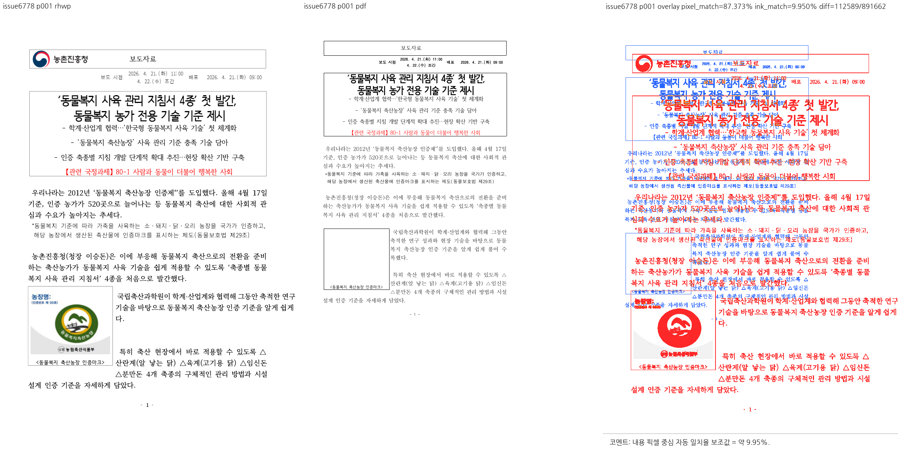

# PR #6784 검토 기록

## 판정: 메인터너 보정 후 수용 가능

**보정 및 로컬 검증 완료.** 첫 비-레인 항목을 그리기 전에 Square 밴드를 종료하도록 보정했고, 일반 들여쓰기와 오른쪽 레인의 경계를 공개 회귀 시험으로 고정했다.

이 판정은 아래 로컬 후보의 PR 변경 범위에 한정한다. GitHub 승인 이벤트·원 PR 직접 merge·전체 이슈 해결 또는 전체 문서 시각 동일을 뜻하지 않는다.

## 검토 기준과 적용 이력

- 검토일: 2026-09-07.
- 원 PR: [#6784](https://github.com/edwardkim/rhwp/pull/6784), 관련 이슈 [#6778](https://github.com/edwardkim/rhwp/issues/6778).
- 제목: 수정(renderer): Square 표 옆 레인에서 렌더 흐름도 host 줄만 전진한다 (#6778)
- 누적 브랜치: `review/planet6897-ci-green-20260907`.
- 기준 devel: `07bc5e5490f75118f08370de19aeee73ce1667cb`.
- **실제 로컬 시험 대상: `81ec9b869daa27d8546bbbbcb29587df93144f93` 시점의 검증 작업 트리.** 메인터너 체크포인트 `f2047e1f4`와 #6796 후속 체리픽 2개, 전체 원본/축소 입력의 좌표 대조 회귀를 포함한다.
- 이번에 조회한 원격 head: `44432e34437c051575344a27129695f3fce7ca31`, OPEN, MERGEABLE / CLEAN.
- 로컬에 반영한 원 PR 범위: `44432e34437c051575344a27129695f3fce7ca31`까지. 해당 원격 head를 포함한다.
- 검토 경로: collaborator 매개 외부 PR의 출처 보존 체리픽 통합. 10개 원 PR을 함께 시험했으며 단독 before/after를 새로 실행한 것처럼 기록하지 않는다.
- 메인터너 체크포인트 `daf5744bfd4cb62d6c3e6d9b6cd104816da758ec`의 #6784/#6798/#6801 보정과 후속 작업 중 보정을 구분한다.
- 기존 reviewer 요청은 유지했다. 이번 테스트·문서 갱신에서 reviewer나 통합 PR owner review를 추가 요청하지 않았다.

| 원 커밋 | 로컬 적용 커밋 |
| --- | --- |
| `b46816cbb74a72a0f3a1e2d406cecb3024bfb424` | `df1148836` |
| `bb3e2b6514f6b37b20c6784f6a7f8068ddb2c852` | `2ff59ec66` |
| `49564e719c043826205ca4ec52c30c3583d8be8d` | `b0c556f04` |
| `44432e34437c051575344a27129695f3fce7ca31` | `669edf500` |

## 검토 결과와 보정 상태

- 메인터너 체크포인트에서 저장 vpos가 없는 첫 비-레인 항목에도 paint 전에 밴드 종료를 적용했다. 기존의 다음 항목 좌표만 보정하던 보류 사유를 해소했다.
- 일반 들여쓰기, 저장 우단과 좁은 폭 조건, 저장 vpos 없는 첫 항목을 공개 DocumentCore 변형 시험으로 보호한다. 기존 양성/왼쪽 레인/본문 하한 시험과 합쳐 7개가 통과했다.
- 과거의 source-side predicate 시험 삭제를 그대로 승인한 것이 아니다. 현재 공개 입력과 실제 배치 결과로 계약을 검증했다. 모든 가능한 들여쓰기 문서를 증명했다는 의미는 아니다.

## 기존 코멘트 상세 대조

| 기존 댓글 | 요청 또는 주장 | 현재 후보에서의 판단 |
| --- | --- | --- |
| [5557137399](https://github.com/edwardkim/rhwp/pull/6784#issuecomment-5557137399) | 일반 들여쓰기, 근거 없는 50%, 전폭 복귀, 설명 정합 요청 | 메인터너 보정으로 밴드 종료를 현재 항목 paint 전으로 옮겼고, 일반 들여쓰기·우단/폭·저장 vpos 부재 변형 시험이 통과했다. |
| [5557671983](https://github.com/edwardkim/rhwp/pull/6784#issuecomment-5557671983) | 기여자 구현 및 predicate 시험 보완 설명 | 당시 predicate 시험의 추가·삭제 이력과 현재 공개 API 회귀를 구분한다. 현재 후보에는 새 공개 경계 시험이 포함되어 있다. |
| [5557944081](https://github.com/edwardkim/rhwp/pull/6784#issuecomment-5557944081) | source-side 시험을 공개 integration 계약으로 이전 요청 | source-side 시험을 다시 늘리는 대신 tests/cases의 공개 회귀로 대상 계약을 고정했다. |
| [5560144455](https://github.com/edwardkim/rhwp/pull/6784#issuecomment-5560144455) | CI 복구 및 음성 fixture 부재 고지 | 당시 미이관 고지는 과거 상태다. 현재 일반 들여쓰기 및 첫 비-레인 항목의 보정·검증은 완료됐다. |

댓글에 적힌 기여자 환경의 과거 실측과 이번 로컬 시험을 구분한다. 이번에 새 댓글이나 review thread를 게시하지 않았다.

## 실제 검증 결과

### 원 PR 최신 head CI

원격 `44432e34437c051575344a27129695f3fce7ca31`의 조회 시 종합 상태는 **SUCCESS**다. 아래 결과는 원 PR의 CI이며 작업 중 보정을 포함한 로컬 통합 후보의 원격 CI가 아니다.

| 원 PR 최신 head 검사 | 조회 결과 |
| --- | --- |
| [Canvas visual diff](https://github.com/edwardkim/rhwp/actions/runs/34098558333/job/101667592140) | SUCCESS |
| [adapter inter-diff](https://github.com/edwardkim/rhwp/actions/runs/34098558571/job/101667601649) | SUCCESS |
| [Analyze (javascript-typescript)](https://github.com/edwardkim/rhwp/actions/runs/34098558653/job/101667616008) | SUCCESS |
| [prop roundtrip](https://github.com/edwardkim/rhwp/actions/runs/34098558515/job/101667610462) | SUCCESS |
| [Analyze (python)](https://github.com/edwardkim/rhwp/actions/runs/34098558653/job/101667615953) | SUCCESS |
| [Analyze (rust)](https://github.com/edwardkim/rhwp/actions/runs/34098558653/job/101667615924) | SUCCESS |
| [Build & Test](https://github.com/edwardkim/rhwp/actions/runs/34098558597/job/101671287557) | SUCCESS |
| [CodeQL](https://github.com/edwardkim/rhwp/runs/101668422262) | SUCCESS |

조회한 preflight 및 실행 worker는 완료 상태다. `cancel-stale-runs`, `WASM Build`, `Frontend unit gates`, `Workflow promotion preflight`, `Refresh nextest target duration data`의 SKIPPED는 실행 통과 건수에 넣지 않는다.

### 누적 후보의 로컬 시험

- 최신 전체 integration 회귀: **9,153 통과 / 0 실패 / 46 skip**, `--no-fail-fast`, nextest summary 276.450초, exit 0.
- 정식 fixture 10개(기존 9개와 #6796 축소본)를 `RHWP_SECURITY_SWEEP_SAMPLES_JSON`에 명시해 최신 전체 회귀의 보안 코퍼스 검사를 통과했다. 자동 변경 파일 탐지에만 의존하지 않았다.
- 이전 제품 보정 단계의 관련 집중 회귀: **50 통과 / 0 실패**, 0.245초, exit 0. 이번에 동일 필터를 재실행했다고 쓰지 않는다.
- 이번 #6796 후속 집중 회귀: **7 통과 / 0 실패**, 0.235초, exit 0. 원본 2개, 축소본 4개, #5734 보호 1개이며 필터 비선택 9,192개는 전체 회귀의 skip 46개와 구분한다.
- 이전 집중 실행에서 이 PR의 [집중 시험 원본](../../../tests/cases/issue_6778_square_beside_lane_render_flow.rs): **7개 통과**.
- 최종 Rust fmt, workspace all-targets clippy(`-D warnings`), suite prepare/check, `git diff --check` 통과. 이 검사는 본 문서 갱신 전 코드 후보에 대해 실행했다.
- 이전 제품 보정 단계에서 Native Skia 그림 placeholder **2개**, direct PDF export **4개**가 통과했다. 이번 #6796 후속 후보에서 native feature 실행을 다시 수행하지 않았으며, 과거 선택 0개 및 manifest 불일치를 통과로 세지 않는다.
- 앞선 동일 제품 보정 단계의 workspace 빌드·WASM clippy·Native Skia lib·Docker 없는 WASM 빌드도 exit 0이었다. 전부 이번 최종 실행에서 다시 수행했다고 쓰지 않는다.
- 정확한 실행 명령, 기준선 독립 비교, 후속 원 커밋의 통합 내역는 [통합 검증 및 시각 기록](planet6897_ci_green_20260907_visual_sweep.md)을 따른다.

이전 관련 집중 실행의 실제 통과 항목(위 최신 전체 회귀에도 포함):

- `maintainer_first_item_without_stored_vpos_starts_below_the_square_band`
- `left_lane_flow_is_untouched`
- `square_beside_lane_starts_next_to_the_table_not_below_it`
- `square_band_closes_below_the_table_bottom`
- `square_beside_lane_text_stays_inside_the_body`
- `maintainer_square_lane_requires_the_right_edge_and_narrow_width`
- `maintainer_plain_indents_do_not_rewind_into_the_square_band`

## 시각 증적과 판정 한계

물리 1쪽에서 Square 표 옆의 흐름과 그 아래로 복귀하는 배치를 대조했다. 기준 engine 2024 PDF에는 로고/인증 그림이 보이지 않고 rhwp와 본문 크기·배치 차이도 크다. PDF의 그림 누락 원인을 확정하지 않았으며, 이 부분 수용을 전체 문서 시각 일치로 확대하지 않는다.

- 원본: [samples/issue6778/156757920-animal-welfare-husbandry-guidelines.hwp](../../../samples/issue6778/156757920-animal-welfare-husbandry-guidelines.hwp), 1,478,144 bytes.
- 원본 SHA-256: `309494bf58da7c092eca2c6fe55918063d2f538820cbc3fc6f8c8196fcd3586a`.
- [기준 PDF](../../../pdf/156757920-animal-welfare-husbandry-guidelines-2024.pdf): engine 2024, 12쪽, 696,994 bytes.
- 기준 PDF SHA-256: `de6a57ee0d28cfb66acab4e477cc0b95e31a7939d3ca2e165de46fd5a487296e`.
- 기존에 준비된 PDF를 재사용했다. 해시·크기는 이번에 확인한 파일 값이며 옛 재변환 파일의 메타데이터를 재사용하지 않는다.
- 이 대표 PNG는 이전 메인터너 보정 단계의 `maintainer-all` sweep 산출물이며 이번에 다시 생성했다고 쓰지 않는다. 이후 #6796 후속은 음수 오프셋 조건식의 설명·변수명 정리와 별도 입력/회귀 추가로, 기존 원본의 렌더 조건을 확대하지 않았다. 새 축소본 대조는 #6796 기록에 별도로 보관한다.
- 자동 flag나 전체 배경을 포함한 pixel match를 시각 수용률로 사용하지 않는다. 실제 Studio UI 클릭 검증은 수행하지 않았다.

### 대표 증적: 물리 1쪽



## 남은 사항과 다음 단계

현재 로컬 후보에서 이 PR의 코드·경계 회귀 보류 사유는 해소됐다. 기준 PDF의 누락 그림 및 문서 전체 배치 차이는 별도 범위로 남기며, 최종 통합 PR의 CI와 merge 후 gate는 아직 수행하지 않았다.

#6796의 후속 `9da47cb2`/`097c499f`는 전체 원본 보정을 보존한 채 통합했고, 집중 7개·전체 9,153개 회귀와 축소본 대조를 완료했다. #6804의 `15a881d0`는 동일 기준선 내용을 `f2047e1f4`에 보존한 경우로, 원 SHA의 체리픽 이력과 내용 반영을 구분한다. 시험 중 10개 원 PR을 다시 조회했으며 마지막 확인 이후 추가 head 변경은 없었다.

## PR·이슈 코멘트 게시 계획

[시각 증적 댓글 정본](../../manual/verification/visual_sweep_guide.md#github-merge-comment)과 [post_merge.md](../../manual/pr_review/post_merge.md)를 따른다. 아래는 게시 계획이며 이미 게시하거나 승인받은 GitHub 조치가 아니다.

1. 최종 통합 head를 확정하고 실제 PR/merge SHA 및 devel CI가 성공한 뒤 수용 결과를 기록한다. 원 PR 직접 merge가 아니라 출처 보존 체리픽 통합 수용임을 명시한다.
2. #6778의 목표 흐름 보정 수용과 PDF 누락 그림·전체 시각 일치를 구분한다. 실제 이슈 범위 및 잔여 사항을 확인한 뒤 종료 여부를 판단한다.
3. 같은 작업의 메인터너 후속 댓글이 이미 있으면 그 댓글을 수정하고 중복 등록하지 않는다. 기여자의 기존 댓글을 덮어쓰지 않는다.
4. 아래 대표 PNG를 코멘트 본문에 직접 표시하고 기준 PDF 링크, 물리 페이지, 실제 보정 범위와 잔여 차이를 함께 적는다. `<MERGE_SHA>`는 증적이 실제 포함된 SHA로 바꾼다.
5. UTF-8 body file로 게시·수정한 뒤 API로 body를 재조회한다. closing reference와 실제 issue 상태를 확인하며 PR close와 issue close를 별도로 처리한다.

```markdown

[기준 PDF](https://github.com/edwardkim/rhwp/blob/<MERGE_SHA>/pdf/156757920-animal-welfare-husbandry-guidelines-2024.pdf)
```

## 이번 작업 상태

이번 후속 작업에서는 기존 보정 체크포인트 `f2047e1f4` 및 출처 보존 체리픽 `44830b2c1`, `81ec9b869`를 로컬에 만들었다. 이후 작업지시자의 PR 생성 승인에 따라 검토 문서·대표 PNG·오늘할일을 같은 통합 branch에 포함한다. 검토 판정 시점에는 통합 PR의 원격 CI·merge·후속 처리가 완료되지 않았다. reviewer를 자동 지정하지 않으며 로컬 시험 성공을 통합 PR의 원격 CI 성공으로 쓰지 않는다.

PR 준비 단계에서 9월 7일 오늘할일에 이번 검토 기록을 추가한다. 로그, 중간 PNG/SVG/JSON, 임시 진단 프로그램, generated suite 산출물, 임시 WASM pkg는 증적 커밋 대상이 아니다. 사용자 `pkg/`, 공유 target, 다른 작업의 branch/worktree/stash는 보존한다.
