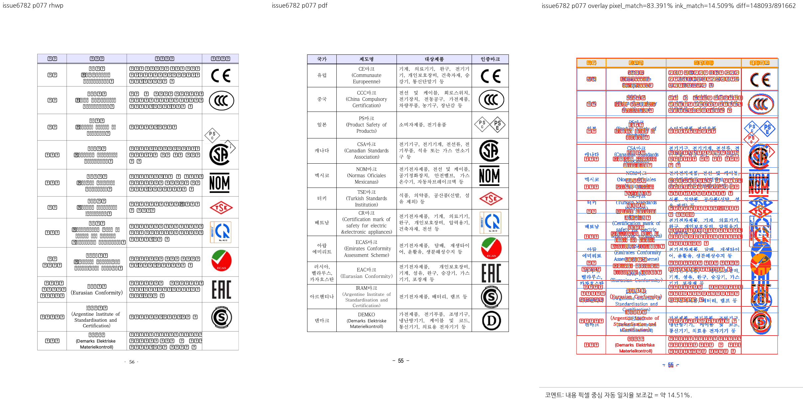
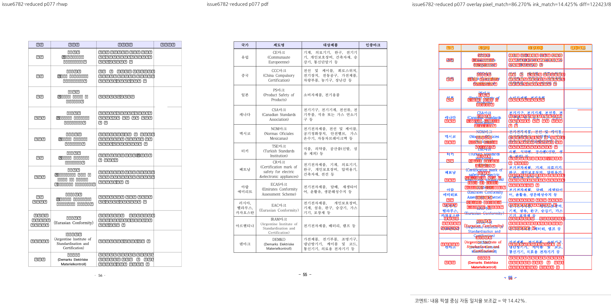

# PR #6796 검토 기록

## 판정: 메인터너 보정 후 수용 가능

**보정·후속 커밋 통합·로컬 검증 완료.** 보류 사유였던 별도 축소 입력과 회귀 미반영을 해소했다. 전체 원본의 CCC 보호 시험을 유지하면서 원 PR의 축소 fixture·PDF·회귀를 함께 통합했고, 두 입력의 그림·셀 좌표 동일성도 추가 시험으로 확인했다.

판정은 음수 오프셋 때문에 그림 전체가 셀의 위쪽으로 이탈하는 PR 변경 범위에 한정한다. GitHub 승인 이벤트·원 PR 직접 merge·#6782 전체 해결이나 전체 문서 시각 동일을 뜻하지 않는다. 원 PR의 원격 CI와 메인터너 보정을 포함한 로컬 통합 시험은 별도 결과다.

## 검토 기준과 적용 이력

- 검토일: 2026-09-07.
- 원 PR: [#6796](https://github.com/edwardkim/rhwp/pull/6796), 관련 이슈 [#6782](https://github.com/edwardkim/rhwp/issues/6782).
- 제목: 수정(renderer): 셀 앵커 그림을 칸 밖으로 내보내는 오프셋은 쓰지 않는다 (#6782)
- 누적 브랜치: `review/planet6897-ci-green-20260907`.
- 기준 devel: `07bc5e5490f75118f08370de19aeee73ce1667cb`.
- **실제 로컬 시험 대상: `81ec9b869daa27d8546bbbbcb29587df93144f93` 시점의 검증 작업 트리.** 메인터너 체크포인트 `f2047e1f4`와 #6796 후속 체리픽 2개, 전체 원본/축소 입력의 좌표 대조 회귀를 포함한다.
- 이번에 조회한 원격 head: `097c499fef6e91e5f1efc0273caf30b38e12ec38`, OPEN, MERGEABLE / CLEAN.
- 로컬에 반영한 원 PR 범위: 최신 `097c499fef6e91e5f1efc0273caf30b38e12ec38`까지. 테스트 중 재조회에서도 후속 head 변경은 없었다.
- 검토 경로: collaborator 매개 외부 PR의 출처 보존 체리픽 통합. 10개 원 PR을 함께 시험했으며 단독 before/after를 새로 실행한 것처럼 기록하지 않는다.
- 메인터너 체크포인트 `daf5744bfd4cb62d6c3e6d9b6cd104816da758ec`의 #6784/#6798/#6801 보정과 후속 작업 중 보정을 구분한다.
- 기존 reviewer 요청은 유지했다. 이번 테스트·문서 갱신에서 reviewer나 통합 PR owner review를 추가 요청하지 않았다.

| 원 커밋 | 로컬 적용 커밋 |
| --- | --- |
| `8dc4e718544526786ce26950c2f0ed64fb217c29` | `4d504fecd` |
| `9da47cb2e4410fd29e707c98527651619a807ac2` | `44830b2c1` |
| `097c499fef6e91e5f1efc0273caf30b38e12ec38` | `81ec9b869` |

## 검토 결과와 보정 상태

- 기존 전체 원본을 정식 sample 경로에서 필수로 읽는 보호 회귀 2개를 `issue_6782_cell_float_full_original.rs`로 보존했다. 개인 절대 경로·환경 변수 부재에 따른 정상 return을 사용하지 않는다.
- CCC를 포함한 정확히 11개 그림, row 4 / col 3, `model_cell_index=19`, `bin_data_id=79`, `para_index=118`, 실제 `page_fragment=false`를 검증한다. CCC bbox는 x=624.4, y=238.7067, width=81.12, height=65.8133px다.
- 원 PR의 축소 입력·PDF·3개 회귀를 통합했다. 전체 원본 및 그 PDF는 삭제하지 않았고 README/MANIFEST 충돌도 양쪽 자료의 역할을 구분해 해결했다.
- 메인터너 회귀 `the_reduced_fixture_preserves_original_cell_image_geometry`를 추가해 두 입력의 104쪽, 11개 그림, 행·열·호스트 셀 위치/높이·그림 bbox가 같은지 확인했다. 좌표 비교의 `1e-7`은 동일성 확인용 부동소수점 오차이며 화면 오차 허용치를 확대하는 기준이 아니다.
- 축소본의 기존 '다른 10개 그림' 시험은 용지 안 배치와 셀 교차를 검사한다. 이 시험만으로 보정 전후 모든 좌표 불변을 증명했다고 쓰지 않으며, 원본/축소본 간 좌표 동일성은 별도 추가 시험의 결과다.
- 제품 조건은 `v_off < 0 && with_offset + pic_h <= content_top`에 한정한다. 후속은 이 조건을 `escapes_above_cell_content`로 명명하고 설명을 좁힌 변경이며 모든 셀 밖 배치로 알고리즘을 확대하지 않았다. #5734의 정상 음수 오프셋 보호도 통과했다.
- 축소본 text-overlap 기준선 2를 추가하되 전체 원본 2, 사이버대학 35/1 및 기존 기준선을 유지했다. 기존 문서의 허용값을 올려 실패를 숨기지 않았다.

## 기존 코멘트 상세 대조

| 기존 댓글 | 요청 또는 주장 | 현재 후보에서의 판단 |
| --- | --- | --- |
| [5557591963](https://github.com/edwardkim/rhwp/pull/6796#issuecomment-5557591963) | CI의 무검증 성공, CCC 누락 허용, 선언 범위 과장 | 전체 원본 필수 읽기·정확한 11개 그림·CCC 정체/셀 계약을 유지했고, 최신 축소 fixture와 3개 원 회귀에 입력 간 좌표 동일성 시험을 추가해 검증했다. 제품 조건은 음수 오프셋으로 그림 전체가 셀 위로 이탈하는 경우로 명확히 제한했다. |

댓글에 적힌 기여자 환경의 과거 실측과 이번 로컬 시험을 구분한다. 이번에 새 댓글이나 review thread를 게시하지 않았다.

## 실제 검증 결과

### 원 PR 최신 head CI

원격 `097c499fef6e91e5f1efc0273caf30b38e12ec38`의 조회 시 종합 상태는 **SUCCESS**다. 아래 결과는 원 PR의 CI이며 작업 중 보정을 포함한 로컬 통합 후보의 원격 CI가 아니다.

| 원 PR 최신 head 검사 | 조회 결과 |
| --- | --- |
| [Canvas visual diff](https://github.com/edwardkim/rhwp/actions/runs/34109779089/job/101703126054) | SUCCESS |
| [adapter inter-diff](https://github.com/edwardkim/rhwp/actions/runs/34109779279/job/101703135366) | SUCCESS |
| [Analyze (javascript-typescript)](https://github.com/edwardkim/rhwp/actions/runs/34109779275/job/101703151023) | SUCCESS |
| [prop roundtrip](https://github.com/edwardkim/rhwp/actions/runs/34109779303/job/101703134195) | SUCCESS |
| [Analyze (python)](https://github.com/edwardkim/rhwp/actions/runs/34109779275/job/101703151011) | SUCCESS |
| [Analyze (rust)](https://github.com/edwardkim/rhwp/actions/runs/34109779275/job/101703151075) | SUCCESS |
| [Build & Test](https://github.com/edwardkim/rhwp/actions/runs/34109779248/job/101706609525) | SUCCESS |
| [CodeQL](https://github.com/edwardkim/rhwp/runs/101703945048) | SUCCESS |

조회한 preflight 및 실행 worker는 완료 상태다. `cancel-stale-runs`, `WASM Build`, `Frontend unit gates`, `Workflow promotion preflight`, `Refresh nextest target duration data`의 SKIPPED는 실행 통과 건수에 넣지 않는다. 이 원격 head까지의 변경을 전체 원본 보호 보정과 함께 통합한 후보로 이번 로컬 전체 회귀를 실행했다.

### 누적 후보의 로컬 시험

- 최신 전체 integration 회귀: **9,153 통과 / 0 실패 / 46 skip**, `--no-fail-fast`, nextest summary 276.450초, exit 0.
- 정식 fixture 10개(기존 9개와 #6796 축소본)를 `RHWP_SECURITY_SWEEP_SAMPLES_JSON`에 명시해 최신 전체 회귀의 보안 코퍼스 검사를 통과했다. 자동 변경 파일 탐지에만 의존하지 않았다.
- 이전 제품 보정 단계의 관련 집중 회귀: **50 통과 / 0 실패**, 0.245초, exit 0. 이번에 동일 필터를 재실행했다고 쓰지 않는다.
- 이번 #6796 후속 집중 회귀: **7 통과 / 0 실패**, 0.235초, exit 0. 원본 2개, 축소본 4개, #5734 보호 1개이며 필터 비선택 9,192개는 전체 회귀의 skip 46개와 구분한다.
- 이번 집중 실행의 시험 파일: [전체 원본 보호 2개](../../../tests/cases/issue_6782_cell_float_full_original.rs), [축소 입력 및 원본 대조 4개](../../../tests/cases/issue_6782_cell_float_offset_outside_cell.rs), 기존 #5734 보호 1개.
- 최종 Rust fmt, workspace all-targets clippy(`-D warnings`), suite prepare/check, `git diff --check` 통과. 이 검사는 본 문서 갱신 전 코드 후보에 대해 실행했다.
- 이전 제품 보정 단계에서 Native Skia 그림 placeholder **2개**, direct PDF export **4개**가 통과했다. 이번 #6796 후속 후보에서 native feature 실행을 다시 수행하지 않았으며, 과거 선택 0개 및 manifest 불일치를 통과로 세지 않는다.
- 앞선 동일 제품 보정 단계의 workspace 빌드·WASM clippy·Native Skia lib·Docker 없는 WASM 빌드도 exit 0이었다. 전부 이번 최종 실행에서 다시 수행했다고 쓰지 않는다.
- 정확한 실행 명령, 기준선 독립 비교, 후속 원 커밋의 통합 내역는 [통합 검증 및 시각 기록](planet6897_ci_green_20260907_visual_sweep.md)을 따른다.

이번 집중 실행의 실제 통과 항목:

- `issue_6782_cell_float_full_original::offset_that_pushes_a_cell_image_out_of_its_cell_is_not_applied`
- `issue_6782_cell_float_full_original::the_ccc_image_is_restored_in_its_original_fragment_cell`
- `issue_6782_cell_float_offset_outside_cell::the_page_still_holds_all_eleven_cell_images`
- `issue_6782_cell_float_offset_outside_cell::the_target_image_sits_inside_its_own_cell_at_the_hangul_position`
- `issue_6782_cell_float_offset_outside_cell::the_other_ten_images_keep_their_offsets`
- `issue_6782_cell_float_offset_outside_cell::the_reduced_fixture_preserves_original_cell_image_geometry`
- `issue_5734_cell_float_stack_stored_vpos::issue_5734_left_cell_floats_stack_by_stored_vpos`

## 시각 증적과 판정 한계

기존 전체 원본/PDF의 물리 77쪽에서 CCC가 중국 행 셀 안에 표시됨을 대조했다. rhwp 104쪽, PDF 103쪽이며 인쇄 번호는 각각 56/55여서 표 내용으로 대응했다. 다른 PS/CSA 로고 겹침과 대체 글리프는 남아 있다. 원격에 새로 추가된 stub 입력/PDF의 비교로 이 PNG를 표시해서는 안 된다.

- 원본: [samples/issue6782/1480000-201900042-chemical-product-labeling-study.hwp](../../../samples/issue6782/1480000-201900042-chemical-product-labeling-study.hwp), 6,521,856 bytes.
- 원본 SHA-256: `398d03a5d5e4d6e857086be532d6d9ed0cec9c8ad06f95c17bbb7f83056ae860`.
- [기준 PDF](../../../pdf/1480000-201900042-chemical-product-labeling-study-2020.pdf): engine 2020, 103쪽, 2,208,597 bytes.
- 기준 PDF SHA-256: `f8e5c0408e221080ede9a9a67b153d02d792d22961c738e46749641f32a32e79`.
- 기존에 준비된 PDF를 재사용했다. 해시·크기는 이번에 확인한 파일 값이며 옛 재변환 파일의 메타데이터를 재사용하지 않는다.
- 이 대표 PNG는 이전 메인터너 보정 단계의 `maintainer-all` sweep 산출물이며 이번에 다시 생성했다고 쓰지 않는다. 이후 #6796 후속은 음수 오프셋 조건식의 설명·변수명 정리와 별도 입력/회귀 추가로, 기존 원본의 렌더 조건을 확대하지 않았다. 새 축소본 대조는 #6796 기록에 별도로 보관한다.
- 자동 flag나 전체 배경을 포함한 pixel match를 시각 수용률로 사용하지 않는다. 실제 Studio UI 클릭 검증은 수행하지 않았다.

### 대표 증적: 물리 77쪽



### 축소 입력의 별도 증적: 물리 77쪽

- [축소 입력](../../../samples/issue6782/1480000-201900042-chemical-labeling-standards.hwp): 193,536 bytes, SHA-256 `4382eabadb86cde5730a7e7b972cea1828fea0c1c743a654c2a430cc19ae26c0`.
- [축소 입력용 기준 PDF](../../../pdf/1480000-201900042-chemical-labeling-standards-2020.pdf): engine 2020, 103쪽, 1,119,717 bytes, SHA-256 `32e0e6d41d53b755b3dc4bcc31937e8b4f0921b282c2e5d3633a3f3617761912`.
- 위 크기·해시는 로컬 실물 파일에서 확인했다. 원 PR에 포함된 PDF를 재사용했으며 중복 변환하지 않았다.
- 현재 후보로 `target/pr-review/debug/rhwp`를 빌드한 뒤 물리 77쪽을 새로 대조했다. rhwp는 104쪽, 기준 PDF는 103쪽이며 인쇄 번호 56/55 차이와 글리프·행 높이 차이가 남는다.
- 축소본은 BinData를 1x1 대체 그림으로 바꾼 입력이므로 인증 로고가 보이지 않는다. 이 PNG를 실제 CCC 로고 표시 성공이나 전체 시각 일치의 증거로 사용하지 않는다.
- 축소 전후 11개 그림과 호스트 셀의 좌표 동일성은 별도 공개 API 회귀로 확인했다. 실제 CCC 그림 확인은 위 전체 원본 증적을 사용한다.



## 남은 사항과 다음 단계

최신 원 PR까지의 통합·필수 fixture·대상 지정 회귀·범위 설명·입력 간 좌표 검증을 마쳤으므로 이 사유로 더 이상 머지 보류하지 않는다. 위 시각 차이는 남아 있어 전체 문서 일치나 #6782의 모든 현상 해결로 확대하지 않는다.

#6796의 후속 `9da47cb2`/`097c499f`는 전체 원본 보정을 보존한 채 통합했고, 집중 7개·전체 9,153개 회귀와 축소본 대조를 완료했다. #6804의 `15a881d0`는 동일 기준선 내용을 `f2047e1f4`에 보존한 경우로, 원 SHA의 체리픽 이력과 내용 반영을 구분한다. 시험 중 10개 원 PR을 다시 조회했으며 마지막 확인 이후 추가 head 변경은 없었다.

원격 통합 PR의 CI, 승인·merge 및 원 PR/이슈 후속 처리는 아직 수행하지 않았다.

## PR·이슈 코멘트 게시 계획

[시각 증적 댓글 정본](../../manual/verification/visual_sweep_guide.md#github-merge-comment)과 [post_merge.md](../../manual/pr_review/post_merge.md)를 따른다. 아래는 게시 계획이며 이미 게시하거나 승인받은 GitHub 조치가 아니다.

1. 최종 통합 head를 확정하고 실제 PR/merge SHA 및 devel CI가 성공한 뒤 수용 결과를 기록한다. 원 PR 직접 merge가 아니라 출처 보존 체리픽 통합 수용임을 명시한다.
2. 원 PR의 이번 변경 수용과 #6782 전체 종료 여부를 구분한다. 실제 통합 merge·devel CI 후 closing reference와 이슈 원문 범위를 확인하기 전에는 자동으로 댓글·close하지 않는다.
3. 같은 작업의 메인터너 후속 댓글이 이미 있으면 그 댓글을 수정하고 중복 등록하지 않는다. 기여자의 기존 댓글을 덮어쓰지 않는다.
4. 아래 대표 PNG를 코멘트 본문에 직접 표시하고 기준 PDF 링크, 물리 페이지, 실제 보정 범위와 잔여 차이를 함께 적는다. `<MERGE_SHA>`는 증적이 실제 포함된 SHA로 바꾼다.
5. UTF-8 body file로 게시·수정한 뒤 API로 body를 재조회한다. closing reference와 실제 issue 상태를 확인하며 PR close와 issue close를 별도로 처리한다.

```markdown

[기준 PDF](https://github.com/edwardkim/rhwp/blob/<MERGE_SHA>/pdf/1480000-201900042-chemical-product-labeling-study-2020.pdf)

축소 입력은 로고 잉크 검증용이 아니며, 아래에는 대체 글리프·표 높이 차이가 남습니다.

[축소 입력용 기준 PDF](https://github.com/edwardkim/rhwp/blob/<MERGE_SHA>/pdf/1480000-201900042-chemical-labeling-standards-2020.pdf)
```

## 이번 작업 상태

이번 후속 작업에서는 기존 보정 체크포인트 `f2047e1f4` 및 출처 보존 체리픽 `44830b2c1`, `81ec9b869`를 로컬에 만들었다. 이후 작업지시자의 PR 생성 승인에 따라 검토 문서·대표 PNG·오늘할일을 같은 통합 branch에 포함한다. 검토 판정 시점에는 통합 PR의 원격 CI·merge·후속 처리가 완료되지 않았다. reviewer를 자동 지정하지 않으며 로컬 시험 성공을 통합 PR의 원격 CI 성공으로 쓰지 않는다.

PR 준비 단계에서 9월 7일 오늘할일에 이번 검토 기록을 추가한다. 로그, 중간 PNG/SVG/JSON, 임시 진단 프로그램, generated suite 산출물, 임시 WASM pkg는 증적 커밋 대상이 아니다. 사용자 `pkg/`, 공유 target, 다른 작업의 branch/worktree/stash는 보존한다.
