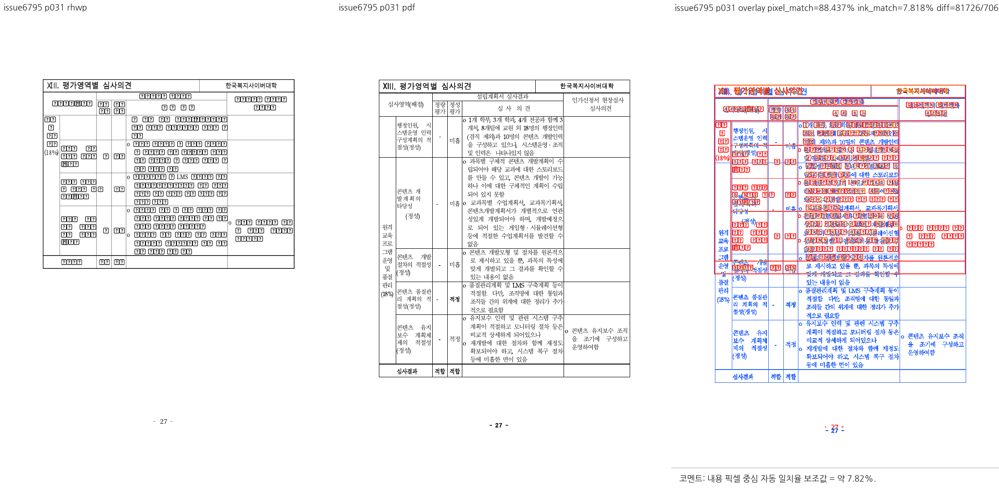
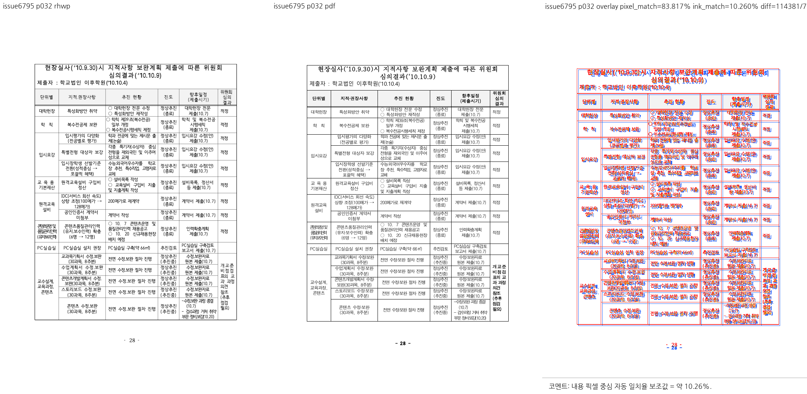
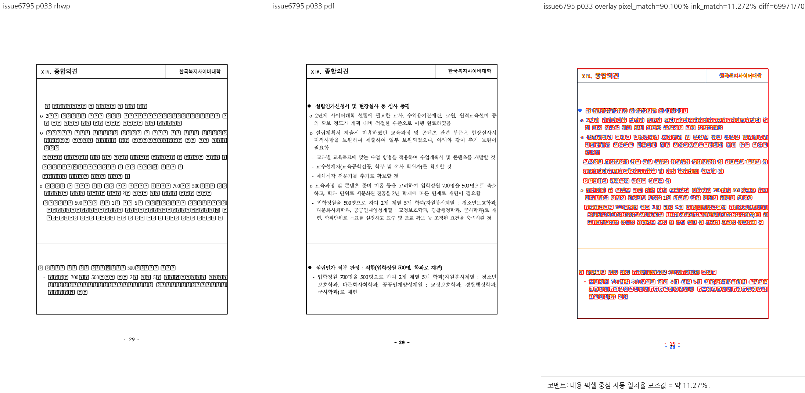

# PR #6804 검토 기록

## 판정: 메인터너 보정 후 수용 가능

**보정 및 로컬 검증 완료.** 공개 fixture·회귀 보정은 `345ad7f30`에 포함됐고, 후속 `15a881d0`의 기준선 `text-overlap=35 / off-canvas=1`도 메인터너의 작업 중 보정으로 이미 반영해 검증했다.

원 커밋 객체의 체리픽 이력과 변경 내용의 반영 여부를 구분한다. `15a881d0` 자체의 체리픽 이력이 없다는 이유로 변경 미반영·검증 미완료로 보류하지 않는다. 이 수용 판정은 이번 PR의 변경 범위이며 GitHub 승인 이벤트·merge·#6795 전체 해결 또는 전체 문서 시각 동일을 뜻하지 않는다.

## 검토 기준과 적용 이력

- 검토일: 2026-09-07.
- 원 PR: [#6804](https://github.com/edwardkim/rhwp/pull/6804), 관련 이슈 [#6795](https://github.com/edwardkim/rhwp/issues/6795).
- 제목: 수정(typeset): 쪼개진 자리차지 표의 형제를 그 조각 위에 겹쳐 놓지 않는다 (#6795)
- 누적 브랜치: `review/planet6897-ci-green-20260907`.
- 기준 devel: `07bc5e5490f75118f08370de19aeee73ce1667cb`.
- **실제 로컬 시험 대상: `81ec9b869daa27d8546bbbbcb29587df93144f93` 시점의 검증 작업 트리.** 메인터너 체크포인트 `f2047e1f4`와 #6796 후속 체리픽 2개, 전체 원본/축소 입력의 좌표 대조 회귀를 포함한다.
- 이번에 조회한 원격 head: `15a881d02a1e7a1ece63289bd633d54f15066842`, OPEN, MERGEABLE / CLEAN.
- 원 커밋 체리픽 범위: `406833fed662c005234dbd1ea664903b9d783aa5` → `345ad7f30`까지.
- 후속 `15a881d02a1e7a1ece63289bd633d54f15066842`의 변경 내용: 같은 두 기준선 행을 메인터너의 작업 중 보정으로 반영해 검증 완료. 그 원 커밋 객체를 체리픽했다고 표기하지 않는다.
- 검토 경로: collaborator 매개 외부 PR의 출처 보존 체리픽 통합. 10개 원 PR을 함께 시험했으며 단독 before/after를 새로 실행한 것처럼 기록하지 않는다.
- 메인터너 체크포인트 `daf5744bfd4cb62d6c3e6d9b6cd104816da758ec`의 #6784/#6798/#6801 보정과 후속 작업 중 보정을 구분한다.
- 기존 reviewer 요청은 유지했다. 이번 테스트·문서 갱신에서 reviewer나 통합 PR owner review를 추가 요청하지 않았다.

| 원 커밋 | 로컬 적용 커밋 |
| --- | --- |
| `42712f1d94d1e750366068b68a866c6520dabe40` | `ee9b03b4e` |
| `406833fed662c005234dbd1ea664903b9d783aa5` | `345ad7f30` |
| `15a881d02a1e7a1ece63289bd633d54f15066842` | 동일 기준선 변경은 커밋 전 메인터너 보정으로 포함; 원 커밋 체리픽 아님 |

## 검토 결과와 보정 상태

- 406833fe 후속까지 반영한 공개 sample과 5개 회귀는 개인 경로·환경 변수 없이 필수 입력을 읽는다. 파일 부재 시 정상 return하던 기존 보류 사유는 해소됐다.
- 분할 형제 표의 페이지 소유·순서·앞 조각 비중첩 및 #2813 whole-placement 구제 보호가 통과했다. 기준 PDF와 rhwp는 45쪽이고 인쇄 27/28/29는 물리 31/32/33에 대응한다.
- 동일 613,376-byte 입력을 base 07bc5e549와 후보에서 독립 비교했다. 쪽수 44→45, text-overlap 136→35, off-canvas 1→1이다. 남은 off-canvas는 같은 물리 29쪽의 3.36px 하단 이탈이다.
- 새 입력의 실측 text-overlap 35와 off-canvas 1을 로컬 기준선에 등록했다. 기존 등록 문서의 허용값을 올리거나 보정 전 136건을 그대로 허용한 것이 아니다.
- 원격 15a881d02a1e7a1ece63289bd633d54f15066842는 위와 동일한 두 기준선 행만 추가했다. 제품/시험 코드 차이는 없지만 그 원 커밋을 체리픽한 것으로 기록할 수는 없다.

## 기존 코멘트 상세 대조

기존 검토에서 대조할 일반 댓글은 없었다. 최신 후속 커밋의 실제 변경과 로컬 보정을 위에서 구분했다.

댓글에 적힌 기여자 환경의 과거 실측과 이번 로컬 시험을 구분한다. 이번에 새 댓글이나 review thread를 게시하지 않았다.

## 실제 검증 결과

### 원 PR 최신 head CI

원격 `15a881d02a1e7a1ece63289bd633d54f15066842`의 조회 시 종합 상태는 **SUCCESS**다. 아래 결과는 원 PR의 CI이며 작업 중 보정을 포함한 로컬 통합 후보의 원격 CI가 아니다.

| 원 PR 최신 head 검사 | 조회 결과 |
| --- | --- |
| [Canvas visual diff](https://github.com/edwardkim/rhwp/actions/runs/34109000543/job/101700636526) | SUCCESS |
| [adapter inter-diff](https://github.com/edwardkim/rhwp/actions/runs/34109000966/job/101700674434) | SUCCESS |
| [Analyze (javascript-typescript)](https://github.com/edwardkim/rhwp/actions/runs/34109000909/job/101700672708) | SUCCESS |
| [prop roundtrip](https://github.com/edwardkim/rhwp/actions/runs/34109000987/job/101700660668) | SUCCESS |
| [Analyze (python)](https://github.com/edwardkim/rhwp/actions/runs/34109000909/job/101700672658) | SUCCESS |
| [Analyze (rust)](https://github.com/edwardkim/rhwp/actions/runs/34109000909/job/101700672635) | SUCCESS |
| [Build & Test](https://github.com/edwardkim/rhwp/actions/runs/34109001192/job/101704516420) | SUCCESS |
| [CodeQL](https://github.com/edwardkim/rhwp/runs/101701568971) | SUCCESS |

조회한 preflight 및 실행 worker는 완료 상태다. `cancel-stale-runs`, `WASM Build`, `Frontend unit gates`, `Workflow promotion preflight`, `Refresh nextest target duration data`의 SKIPPED는 실행 통과 건수에 넣지 않는다. 원격 head의 커밋 객체 자체를 로컬 head라고 쓰지는 않지만, 그 마지막 기준선 변경 내용은 이번 로컬 전체 회귀에 포함됐다.

### 누적 후보의 로컬 시험

- 최신 전체 integration 회귀: **9,153 통과 / 0 실패 / 46 skip**, `--no-fail-fast`, nextest summary 276.450초, exit 0.
- 정식 fixture 10개(기존 9개와 #6796 축소본)를 `RHWP_SECURITY_SWEEP_SAMPLES_JSON`에 명시해 최신 전체 회귀의 보안 코퍼스 검사를 통과했다. 자동 변경 파일 탐지에만 의존하지 않았다.
- 이전 제품 보정 단계의 관련 집중 회귀: **50 통과 / 0 실패**, 0.245초, exit 0. 이번에 동일 필터를 재실행했다고 쓰지 않는다.
- 이번 #6796 후속 집중 회귀: **7 통과 / 0 실패**, 0.235초, exit 0. 원본 2개, 축소본 4개, #5734 보호 1개이며 필터 비선택 9,192개는 전체 회귀의 skip 46개와 구분한다.
- 이전 집중 실행에서 이 PR의 [집중 시험 원본](../../../tests/cases/issue_6795_split_float_sibling_gets_its_own_page.rs): **5개 통과**.
- 최종 Rust fmt, workspace all-targets clippy(`-D warnings`), suite prepare/check, `git diff --check` 통과. 이 검사는 본 문서 갱신 전 코드 후보에 대해 실행했다.
- 이전 제품 보정 단계에서 Native Skia 그림 placeholder **2개**, direct PDF export **4개**가 통과했다. 이번 #6796 후속 후보에서 native feature 실행을 다시 수행하지 않았으며, 과거 선택 0개 및 manifest 불일치를 통과로 세지 않는다.
- 앞선 동일 제품 보정 단계의 workspace 빌드·WASM clippy·Native Skia lib·Docker 없는 WASM 빌드도 exit 0이었다. 전부 이번 최종 실행에서 다시 수행했다고 쓰지 않는다.
- 정확한 실행 명령, 기준선 독립 비교, 후속 원 커밋의 통합 내역는 [통합 검증 및 시각 기록](planet6897_ci_green_20260907_visual_sweep.md)을 따른다.

이전 관련 집중 실행의 실제 통과 항목(위 최신 전체 회귀에도 포함):

- `issue_2813_whole_placement_rescue_still_applies`
- `split_float_sibling_keeps_document_order`
- `split_float_sibling_gets_its_own_page_inside_the_body`
- `no_page_stacks_two_float_tables_on_top_of_each_other`
- `split_fragment_page_holds_only_the_fragment`

## 시각 증적과 판정 한계

물리 31/32/33쪽에서 앞 표 조각, 별도 심사위원 표, 종합의견의 순서/소유를 직접 대조했다. 31쪽 표 높이·내용 경계 차이 및 대체 글리프는 남는다. 전체 잉크 일치나 #6795의 다른 문서까지 해결했다는 판정은 아니다.

- 원본: [samples/issue6795/1341000-201100013-cyber-university-application.hwp](../../../samples/issue6795/1341000-201100013-cyber-university-application.hwp), 613,376 bytes.
- 원본 SHA-256: `3202819ec9712c49b189ecb0e1b4a2d46aba37d01e1654c6917438e8134f42d8`.
- [기준 PDF](../../../pdf/1341000-201100013-cyber-university-application-2020.pdf): engine 2020, 45쪽, 556,998 bytes.
- 기준 PDF SHA-256: `3c1d4b0ae00b0f89169a0168b93f27ff4ec975c02743d9655e47bc58c7d289c5`.
- 기존에 준비된 PDF를 재사용했다. 해시·크기는 이번에 확인한 파일 값이며 옛 재변환 파일의 메타데이터를 재사용하지 않는다.
- 이 대표 PNG는 이전 메인터너 보정 단계의 `maintainer-all` sweep 산출물이며 이번에 다시 생성했다고 쓰지 않는다. 이후 #6796 후속은 음수 오프셋 조건식의 설명·변수명 정리와 별도 입력/회귀 추가로, 기존 원본의 렌더 조건을 확대하지 않았다. 새 축소본 대조는 #6796 기록에 별도로 보관한다.
- 자동 flag나 전체 배경을 포함한 pixel match를 시각 수용률로 사용하지 않는다. 실제 Studio UI 클릭 검증은 수행하지 않았다.

### 대표 증적: 물리 31쪽



### 대표 증적: 물리 32쪽



### 대표 증적: 물리 33쪽



## 남은 사항과 다음 단계

현재 PR 범위의 공개 fixture·5개 회귀·기준선 보정은 반영 및 검증을 완료했다. `15a881d0`의 두 기준선 값도 동일하므로 코드 미반영이나 추가 검증 대기를 보류 사유로 남기지 않는다.

해당 원 SHA와 같은 기준선 변경을 메인터너 체크포인트 `f2047e1f4`에 보존했다는 출처를 기록한다. 이는 새 제품 결함이나 미실행 시험이 아니라 기록상 구분이다.

#6796의 후속 `9da47cb2`/`097c499f`는 전체 원본 보정을 보존한 채 통합했고, 집중 7개·전체 9,153개 회귀와 축소본 대조를 완료했다. #6804의 `15a881d0`는 동일 기준선 내용을 `f2047e1f4`에 보존한 경우로, 원 SHA의 체리픽 이력과 내용 반영을 구분한다. 시험 중 10개 원 PR을 다시 조회했으며 마지막 확인 이후 추가 head 변경은 없었다.

## PR·이슈 코멘트 게시 계획

[시각 증적 댓글 정본](../../manual/verification/visual_sweep_guide.md#github-merge-comment)과 [post_merge.md](../../manual/pr_review/post_merge.md)를 따른다. 아래는 게시 계획이며 이미 게시하거나 승인받은 GitHub 조치가 아니다.

1. 최종 통합 head를 확정하고 실제 PR/merge SHA 및 devel CI가 성공한 뒤 수용 결과를 기록한다. 원 PR 직접 merge가 아니라 출처 보존 체리픽 통합 수용임을 명시한다.
2. #6795에는 이번 fixture 밖의 잔여 축이 있어 OPEN 유지한다. 원 PR의 변경 수용과 이슈 전체 해결은 구분하며, 원 PR close는 실제 통합 merge 및 post-merge gate를 충족한 뒤 처리한다.
3. 같은 작업의 메인터너 후속 댓글이 이미 있으면 그 댓글을 수정하고 중복 등록하지 않는다. 기여자의 기존 댓글을 덮어쓰지 않는다.
4. 아래 대표 PNG를 코멘트 본문에 직접 표시하고 기준 PDF 링크, 물리 페이지, 실제 보정 범위와 잔여 차이를 함께 적는다. `<MERGE_SHA>`는 증적이 실제 포함된 SHA로 바꾼다.
5. UTF-8 body file로 게시·수정한 뒤 API로 body를 재조회한다. closing reference와 실제 issue 상태를 확인하며 PR close와 issue close를 별도로 처리한다.

```markdown


[기준 PDF](https://github.com/edwardkim/rhwp/blob/<MERGE_SHA>/pdf/1341000-201100013-cyber-university-application-2020.pdf)
```

## 이번 작업 상태

이번 후속 작업에서는 기존 보정 체크포인트 `f2047e1f4` 및 출처 보존 체리픽 `44830b2c1`, `81ec9b869`를 로컬에 만들었다. 이후 작업지시자의 PR 생성 승인에 따라 검토 문서·대표 PNG·오늘할일을 같은 통합 branch에 포함한다. 검토 판정 시점에는 통합 PR의 원격 CI·merge·후속 처리가 완료되지 않았다. reviewer를 자동 지정하지 않으며 로컬 시험 성공을 통합 PR의 원격 CI 성공으로 쓰지 않는다.

PR 준비 단계에서 9월 7일 오늘할일에 이번 검토 기록을 추가한다. 로그, 중간 PNG/SVG/JSON, 임시 진단 프로그램, generated suite 산출물, 임시 WASM pkg는 증적 커밋 대상이 아니다. 사용자 `pkg/`, 공유 target, 다른 작업의 branch/worktree/stash는 보존한다.
