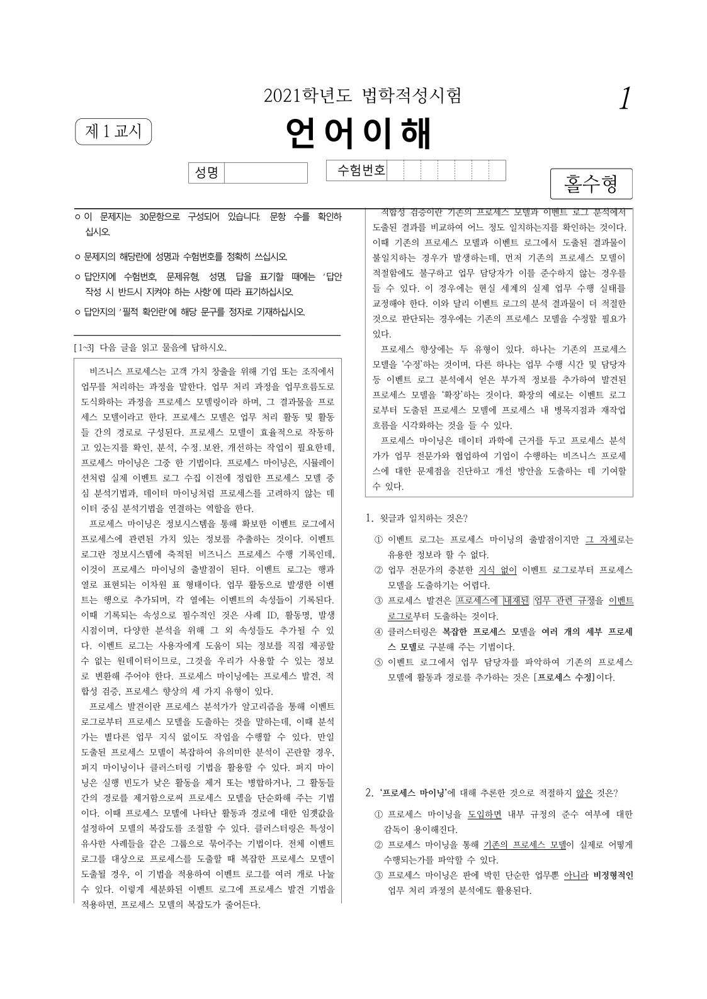

# PR #6808 검토 기록

## 판정: 메인터너 보정 후 수용 가능

같은 속성 값 재적용의 개선에 더해, 메인터너가 실제 그림 리사이즈 Undo/Redo의 원본 변환 복원을 보정했고 실물 회귀 테스트로 확인했다. 최초 보류 사유였던 그림의 원본 행렬 소실과 파생 높이 불일치는 해소되었다. 보정은 로컬 작업 트리에 반영되어 있으며 아직 커밋·push하지 않았다. 이 판정은 원격 병합 승인이나 이슈 #6806의 모든 범위가 해결됐다는 뜻은 아니다.

새 WASM 제품 빌드 및 실제 브라우저에서 새 WASM과 연결한 조작 검증, 최종 통합 PR의 CI는 남아 있다. WASM Clippy 통과를 제품 빌드·브라우저 검증 완료로 표시하지 않는다.

## 검토 기준과 출처

- 검토일: 2026-09-07.
- 원 PR: [#6808](https://github.com/edwardkim/rhwp/pull/6808), 작성자 `lpaiu-cs`, 저장소 `lpaiu-cs/rhwp`.
- 원 head: `6ceedc7ad4d87314b1e650e5080ab0f8e6594a89`. 이번 API 확인에서도 동일하다.
- 체리픽: `9d8a0eaa8`, 원 작성자와 출처 보존.
- 검토 브랜치: `review/ci-green-batch-20260907-2`.
- 기준 devel: `a3a30d99d4aefb15ed0dbed96645eb1ca3595099`.
- 원 체리픽 통합 코드 HEAD: `2c864284557caba4b97d07f104ce957bb756311f`.
- 최종 보정 검증 대상: 위 HEAD에 그림 변환 저널·Studio Undo/Redo 배선·회귀 테스트·생성자 초기화 보정을 더한 미커밋 작업 트리.

## 확인한 개선

그림의 같은 크기·각도 재적용, 도형/묶음의 같은 크기 재적용은 파생 상태를 덮어쓰지 않는다. 200 미만의 정상 치수는 보존하고 퇴화값 0은 여전히 보정한다. 쪽 영역 제한과 겹침 허용은 독립적으로 유지하며 명시적 겹침 허용 해제는 동작한다.

관련 신규 테스트 10개가 통과했다. 가로선 실물 `samples/21_언어_기출_편집가능본.hwp`의 s0p4c0에서 빈 속성 적용 대조군과 전체 getter 속성 재적용의 0번 페이지 SVG가 동일했다. 같은 방식으로 rasterize한 PNG도 바이트 단위로 동일했다.

PNG SHA-256: `da85ffc07dd267c8981dcae28f74f1c2a8584f1f90ae38d8e8611c78e68bf71d`.

이 대조는 현재 후보 안에서 빈 setter와 같은 값 setter를 비교한 것이다. 수정 전 devel 빌드와의 비교나 한컴 정답지 대조로 표시하지 않는다.

## 보정 전 실제 Undo 실패 재현

대상: `samples/3-09월_교육_통합_2023.hwp`, s0p236c0 그림.

1. getter 속성과 원본 변환 상태를 보관했다.
2. height를 400 HWPUNIT 증가시켜 실제 크기를 변경했다.
3. 보관했던 getter 속성을 setter로 다시 적용했다.

| 항목 | 변경 전 | 크기 변경 후 기존 속성 재적용 |
| --- | ---: | ---: |
| 원본 current_height | 7295 | 7296 |
| raw_rendering 길이 | 146바이트 | 0바이트 |
| common 크기 | 원래 값 | 원래 값으로 복원 |

위 표는 보정 전 진단 결과다. common 크기가 돌아온 것만으로 Undo 성공이라고 할 수 없었다. `picture_undo_size_bag_is_identity`는 실제 리사이즈를 먼저 수행하지 않으므로 무변경 크기 봉지 재적용 테스트다. 이 이름을 실제 리사이즈 Undo 복원 증거로 인용하지 않는다. 당시 추가 진단 프로그램의 exit 0도 위 잔여를 출력하고 종료한 결과이지 Undo 통과가 아니다.

기존 `ResizeObjectCommand`는 before/after 속성을 재적용하지만 setter는 실제 크기 변경 시 원본 행렬을 무효화한다. 기존 before 봉지에 손실된 행렬과 원본 파생 치수가 없으므로 값 재적용만으로 복원할 수 없었다. 문서 전체 SnapshotCommand로 단순 우회하면 #3230의 개체 속성 역연산·메모리 예산 설계와 충돌하므로 그 방식은 사용하지 않았다.

## 메인터너 보정 및 보류 해소 근거

- `picture_transform_journal.rs`에서 그림의 common 속성과 ShapeComponentAttr만 보관한다. 문서 전체·이미지 바이트·캡션은 복제하지 않는다.
- 코어가 발급한 ID로 저장 상태와 현재 상태를 교환하여 Undo/Redo를 수행한다. 외부 JSON으로 원본 행렬 바이트를 직접 받지 않는다.
- Studio의 키보드·단일/다중 드래그 리사이즈는 실제 변경 전에 그림 변환을 캡처한다. 그림은 스칼라 setter 대신 저널을 통해 Undo/Redo하고, 다른 개체의 기존 명령은 유지한다.
- 취소·변경 없음·캡처 실패·히스토리 삭제 시 복원 또는 해제 경로를 추가했다. 구버전 WASM에서 필요한 API가 없으면 그림 변경 전에 중단한다.
- `DocumentCore`의 두 생성 경로에 저널 필드 초기화를 반영했다. 첫 검증의 초기화 누락 컴파일 오류는 수정 후 재검증에서 해소되었다.

실물 회귀 `actual_resize_undo_redo_restores_original_transform_without_document_snapshot`는 위 HWP 그림의 높이를 실제로 400 HWPUNIT 변경한 뒤 Undo/Redo를 3회 반복한다.

| 보정 후 확인 항목 | 결과 |
| --- | --- |
| Undo의 raw_rendering | 원본 146바이트와 일치 |
| Undo의 current_height | 원본 7295로 복원 |
| Undo의 common 높이 및 전체 ShapeComponentAttr | 변경 전 상태와 일치 |
| Redo | 실제 리사이즈 직후 상태와 일치 |
| 해제된 ID·잘못된 대상 | 오류 반환 및 문서 무변경 |

본문 실물 HWP는 native 실행으로 검증했다. 셀·머리말 경로 전달, 취소 복원, 다중 선택 캡처 실패 시 해제는 Studio 테스트 대역으로 검증했으며, 이를 해당 위치의 실물 브라우저 검증으로 확대하지 않는다. 가로선 등 다른 개체의 실제 리사이즈 의미론이나 문서 전체 저장 바이트 일치는 이 보정의 완료 주장에 포함하지 않는다.

## 실행 검증

원 체리픽 통합 HEAD에서 전체 회귀 9,194개 실행·9,194개 통과, 46개 건너뜀, exit 0. 이는 메인터너 제품 보정 전 결과이며, 보정 후 전체 Rust 회귀를 재실행한 것으로 표시하지 않는다.

보정 전 추가 집중 검증은 #6808의 10개, #6809의 7개, 보안 코퍼스 6개를 합쳐 23개 모두 통과했다. 필터로 제외된 9,217개를 다시 실행한 것으로 집계하지 않는다.

보정 후 검증 결과는 다음과 같다.

- Rust #6806 집중 회귀: 기존 항등 테스트 10개와 새 실제 Undo/Redo·잘못된 경로 테스트 2개, 합계 12개 통과, exit 0. 필터 제외 9,230개는 미실행이다.
- Studio 전체 테스트: 1,493개 통과, 2개 건너뜀, 실패 0, exit 0. 그림 Undo 등 집중 테스트 18개도 통과했다.
- TypeScript `tsc --noEmit` 통과.
- fmt, native Clippy, WASM 라이브러리 Clippy, workspace build, workspace all-targets Clippy 통과.
- 포맷 반영 후 파생 하네스를 재생성하여 manifest check와 fmt check 통과. 파생 하네스는 커밋 대상이 아니다.

원 head의 [Build/Test](https://github.com/edwardkim/rhwp/actions/runs/34021554609/job/101456659323)와 [Rust CodeQL worker](https://github.com/edwardkim/rhwp/actions/runs/34021554682/job/101455007332)는 intake에서 성공했다. 별도 CodeQL NEUTRAL은 기본 브랜치의 JS/TS·Python 구성 2개를 찾지 못했다는 경고이며 expected skip이나 완전한 분석 성공으로 바꾸어 표시하지 않는다.

## 코멘트와 종료 계획

현재는 원격 승인·수용 코멘트·close를 하지 않는다. #6806은 마지막 API 확인 시 OPEN이며, 이슈 전체 범위와 실제 통합 병합·devel CI를 확인하기 전에는 종료하지 않는다. 해소된 그림 Undo 결함을 현재 잔여 사유로 다시 기록하지 않는다.

보정 후 승인된 통합 PR이 병합되고 devel CI까지 성공한 경우에만 원 PR의 source SHA, 통합 merge SHA, 실제 CI 링크와 수용 범위를 기록한다. 시각 증적은 위 PNG를 merge SHA에 고정된 raw URL의 Markdown 이미지로 코멘트에 직접 표시한다. 기존 코멘트가 있으면 중복 게시 대신 수정하고 본문을 재조회한다. contributor fork 브랜치는 보존한다. 임시 로그·SVG·JSON은 커밋하지 않는다.

## PR 제출 시점 확정 기록 (2026-09-07)

- 통합 브랜치: `review/ci-green-batch-20260907-2`.
- 원본 체리픽 누적 head: `2c864284557caba4b97d07f104ce957bb756311f`.
- 메인터너 코드 보정 및 검증 대상: `fe6d157c0044dd4b402edd3b6435ad0f6edb7c6b`.
  앞선 준비 단계의 미커밋 표기는 당시 상태이며, 보정 코드는 이 커밋으로 확정했다.
- 전체 Rust 9,194개 통과/46개 skip은 보정 전 결과다. 보정 후 Rust 집중 12개,
  Studio 1,493개 통과/2개 skip, TypeScript, fmt, native/WASM lib/workspace all-targets clippy,
  workspace build와 manifest 검사를 완료했다. 보정 후 전체 Rust 회귀는 재실행하지 않았다.
- 새 WASM 제품 빌드와 브라우저 실동작 검증은 미실행이다. WASM lib clippy 및 Studio 테스트를
  실제 새 WASM 제품 실행 결과로 대체하지 않는다. 최신 통합 PR CI는 제출 뒤 확인해야 한다.
- 시각 증적 게시 절차는 [Visual Sweep의 GitHub merge comment 규약](../../manual/verification/visual_sweep_guide.md#github-merge-comment)을 따른다.
  위 증적의 실제 페이지·측정 범위만 인용하고, 미측정 flagged/시각 정확도 수치를 임의로 만들지 않는다.
  메인터너 보정 후 실제 Undo 화면을 새로 촬영한 증적은 없으며, 기존 동일 값 setter 대조 PNG를 그 증적으로 주장하지 않는다.
- merge 이후에는 이 문서에 기록한 대표 PNG를
  `https://raw.githubusercontent.com/edwardkim/rhwp/<실제-merge-SHA>/<해당-PNG-저장소-경로>`로 Markdown 이미지에 직접 삽입한다.
  자산이 devel에 포함되고 실제 devel CI가 성공한 뒤 UTF-8 body-file로 게시하고 API로 본문을 재조회한다.
  동일 목적 댓글이 있으면 이전 댓글을 수정하며 중복 등록하지 않는다. 원 PR의 직접 merge나 전체 관련 이슈 해결로 표현하지 않는다.
