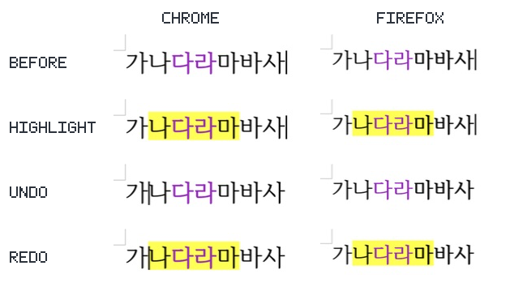
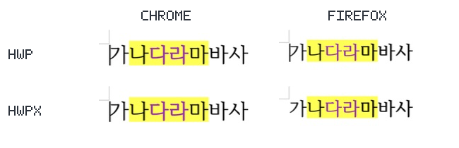

# PR #6814 — 혼합 글자 서식 보존 self-review

> 2026-09-07 후속 상태: 아래의 최초 승인 판정은 기존 후보에 대한 기록이다.
> [리뷰 보정](pr_6814_review_impl.md)의 최종 코드 `01df465fa`에서 로컬 필수 검증을 완료했다.
> Rust 9073개, fresh WASM Studio 1428개 통과 및 8파일 재열기·PNG 비교를 확인해 **push 가능**으로
> 판단한다. 이후 `bb01f0f96`의 Full CI가 성공했고 사용자가 오늘할일 갱신·merge와 최신 devel
> 반영을 승인했다. 아래 병합 준비 기록에 기준선 갱신과 최종 게이트를 구분한다.
> 아래 최초 검증 기록과 이번 재검증 결과는 구분한다.

## 접수 및 경로

- base route: `collaborator_self_merge.md`
- modifiers: `intake_and_review.md`, `local_validation.md`, `visual_fixture_evidence.md`,
  `review_only_fast_pass.md`, `rework_and_exceptions.md` (1,000줄 초과)
- loaded documents: `pr_review_workflow.md`, `pr_review/README.md`, 위 기본·보조 문서 전부.
- current head: `4936663ea4b6019ddc83c0ca0fafe41a0bae3058` (작성 시점 참고값).
- 작성일: 2026-09-06. 작성자 self-review이며 reviewer 지정·GitHub approve event는 수행하지 않는다.
- 사용자 승인: 로컬 검증 결과와 PR 초안 확인 후 “진행해줘”로 push·Open PR 생성을 승인했다.
  merge·이슈 종료·GitHub review/comment는 별도 승인 대상이다.

| 항목 | 작성 시점 참고값 |
| --- | --- |
| PR | [#6814](https://github.com/edwardkim/rhwp/pull/6814) |
| 작성자 | `postmelee` — repository write 권한 |
| 관련 이슈 | [#6788](https://github.com/edwardkim/rhwp/issues/6788), `Closes #6788` |
| base / head branch | `devel` / `codex/6788-preserve-mixed-char-format` |
| 규모 | 29 files, +2095 / -131, 7 commits; 구현·테스트·Hyper-Waterfall 문서·이미지 포함 |
| 상태 | Open, Draft 아님, `MERGEABLE`, `BLOCKED`; GitHub Actions 진행 중 |
| 최초 검증 기준 devel | `51ad998e33ef7f5191b0e1b0b656dc44cef33a1c` |
| 제출 전 최신 devel | `6a193a648dba3df6d5c4cffa0182bc02f3e011ff` |

## 변경 범위와 검토

코어가 선택 시작의 CharShape 하나를 전체 선택에 적용하고 Studio가 문단당 ID 하나만 history에
저장하던 두 손실 경로를 함께 수정했다.

- 기존 구간별로 명시한 속성만 병합하여 글자색·굵기 등 미지정 속성을 보존한다.
- `CharShapeRun` 목록은 시작/끝 offset과 ID로 구성하며 문단·중첩 셀을 capture/restore한다.
  복원 payload의 범위·연속성·ID 유효성을 전체 검사한 뒤 문단을 변경한다.
- Studio는 모든 before 구간을 적용 전에 확보하고 after 구간을 저장한다. 최초 적용 실패 시
  시도한 문단을 역순 복원하며 실패 command와 빈 범위를 history에 넣지 않는다.
- 구버전 WASM의 새 API 누락은 mutation 전에 실패한다. JS/WASM 동시 갱신이 필요하다.
- 셀의 문단별 적용·복원은 batch로 묶고, 범위 복원 후 reflow는 문단 단위다.
- 일반/중첩 셀·머리말/꼬리말·F5 snapshot·pending 서식의 기존 계약을 관련 테스트로 확인했다.
  renderer/layout/serializer 정책, Cargo, CI workflow, baseline과 sample은 변경하지 않았다.

1,000줄 초과이므로 단순 소형 PR 처리로 간주하지 않는다. 단계별 구현/검증과 self-review를
분리해 기록했으며 admin merge를 하지 않는다. 이번 후속 기록에는 코드 보정이 없고 cherry-pick·
충돌 해소·후속 구현 선택도 없으므로 별도 `review_impl`은 만들지 않았다.

## 완료한 로컬 검증 및 제출 전 재확인

검증 후보 `c3b1398e4745f6d0030321df525e787d575f8ab3` 이후 최초 PR head까지
`src`, `crates`, `tests`, `scripts`, `rhwp-studio`, Cargo 파일의 diff가 없음을 재확인했다.
이미 완료한 검증을 재실행 예정으로 기록하지 않으며, 아래는 로컬 실행 결과다.

| 명령·검증 | 결과 |
| --- | --- |
| review suite `--prepare`, `cargo fmt --all` / `--check`, manifest `--check` | 통과 |
| `cargo clippy --locked` native / WASM lib / workspace-all-targets `-D warnings` | 3종 통과 |
| `cargo build --locked --workspace --target-dir target/pr-review` | 통과 |
| `cargo nextest run --locked --cargo-profile release-test --target-dir target/pr-review --tests --no-fail-fast` | 9071 passed, 0 failed, 46 skipped; slow 2, leaky 1 |
| Native Skia lib / placeholder / direct PDF | rhwp 3930 + workspace 182 / 2 / 4 passed, lib 13 ignored |
| Studio `npm test`, binding/manifest 계약 | 1427 / 22 passed, 실패·skip 0 |
| focused Rust / Studio / 실제 WASM-command-history | 15 / 62 / 13개 시나리오 통과 |
| locked host WASM `--no-opt`, Studio·Firefox 확장 build | 통과; Docker 최적화 산출물 검증과 구분 |
| Chrome·Firefox 직접 UI | 각 새 문서 전체/부분 형광펜 적용·Undo/Redo 정상 |
| 각 브라우저의 HWP·HWPX 네 저장본 | 사용자 저장 후 에이전트 직접 재열기 및 문자별 색상 검사 정상 |
| CLI 4상태 × 2포맷 | 8파일 IR diffCount 0; native PNG 8쌍 전체 페이지 비교 0픽셀 차이 |
| 제출 전 `git diff --check`, 변경 Markdown 7개 링크 검사 | 통과 |

제출 전 최신 devel과 `git merge-tree --write-tree upstream/devel HEAD`로 충돌 없는 tree
`0ce86fd9325318432f954d1ff311cb04bf4ef5da`를 얻고 해당 tree의 diff check도 통과했다.
최초 기준 이후 최신 devel에는 이 PR이 변경한 코어 서식·모델·WASM·Studio command 경로의 변경이
없었다. 자동 merge 가능은 컴파일·테스트 호환의 보증이 아니며 최신 head CI는 별도 조건이다.
제출을 위해 source branch에 devel을 merge/rebase하지 않았다.

현재 source에는 `mydocs/orders/20260906.md`가 없고 최신 devel에 다른 PR 기록이 있다.
다른 PR 기록과 source에 없는 링크를 복사하거나 add/add 충돌을 만들지 않도록 이번 상태는
이 self-review 및 기존 타스크 보고서에 기록한다. 최신 devel의 오늘할일은 변경하지 않는다.

## 시각 증적과 잔여 범위

WASM 편집 API가 바뀌므로 직접 사용자-visible 검증을 수행했다. 렌더러·조판 변경이나 한컴
fidelity 주장은 아니므로 PDF Visual Sweep/OVL은 실행하지 않고 실제 UI 기능 검증을 사용했다.
아래는 동일 수정 소스의 로컬 Studio에서 직접 캡처한 문서 영역이며, 본문 픽셀은 수정하지 않았다.

- 두 패널의 SHA-256: `37d3fd8a735aac36749a2ff59ad47a60a4919ccaa024feaf953fb34bf5f693f0`,
  `563a4d3db432e9463c3e6f9b401a15d510db04ee4d583b85ed93f2f9cc00469b`.
- PR 본문 이미지의 SHA 고정 원격 blob은 로컬 blob과 같음을 게시 후 API로 확인했다.
- 형광펜 전후·Undo/Redo에서 보라색과 선택 밖 서식을 보존한다. 재열기 네 파일의 7글자 전부
  색상·음영 값이 기대값과 같으며, 화면·파일 SHA는 [3단계 9절](../../working/task_m100_6788_stage3.md#9-chromefirefox-새-문서부터-직접-ui-재검증-및-실제-저장본-재열기)에 있다.
- 기존 배포 확장은 교체하지 않았고 최적화 배포 패키지 자체의 검증을 주장하지 않는다.
- nextest LEAK 1건의 원인은 확정하지 않았다. 최초 HWPX export의 fill/pattern 속성 차이는
  적용 전부터 관찰됐으며 이슈 대상 색상 보존과 전체 속성 무손실을 구분한다.
- 구간 수에 비례한 capture/restore 비용이 추가되며 정량 성능 벤치마크는 측정하지 않았다.

## Merge 후 contributor PR comment 계획

현재는 계획만 기록하며 게시하지 않는다. merge 및 별도 게시 승인 후 실제 merge SHA에 고정한
`https://raw.githubusercontent.com/edwardkim/rhwp/<merge-commit-sha>/mydocs/pr/assets/issue6788_browser_behavior.png`
와 `issue6788_browser_reopen.png`를 사용한다. `devel`에 asset이 존재함을 확인한 뒤
`--body-file`로 게시하고 API 재조회로 Markdown을 검증한다.

[Visual Sweep 정본](https://github.com/edwardkim/rhwp/blob/devel/mydocs/manual/verification/visual_sweep_guide.md#github-merge-comment)은
PDF 기하 비교 절차이며 이번에는 적용하지 않았다. 확인 범위는 합성 문서 1페이지의 편집·재열기다.
flagged, pixel_match, visual_accuracy_proxy_percent는 측정하지 않았고 임의 수치를 넣지 않는다.
별도 native PNG의 0픽셀 차이를 브라우저 JPEG 또는 한컴 정답지 일치 수치로 전용하지 않는다.

## 최종 판정

- 판정: **승인** — 검증한 후보의 이슈 범위에 대한 작성자 self-review 판정이다.
- 근거: 구간별 병합·복원 회귀, 필수 lint·전체 테스트, 두 브라우저 실제 UI와 네 저장본 재열기.
- merge 전 조건: review 기록을 포함한 최신 PR head의 required checks 성공, 최신 devel과의
  충돌/호환 상태 재확인, 작업지시자의 별도 merge 승인.
- GitHub Actions는 작성 시점에 진행 중이다. 이전 로컬 성공을 GitHub CI 성공으로 취급하지 않는다.
  녹색 GitHub candidate가 아직 없으므로 trailing 문서 head의 fast-pass를 미리 단정하지 않는다.
- 이 기록은 GitHub approve·merge·issue close 승인이 아니며 해당 조치를 수행하지 않았다.

## 병합 준비 — 2026-09-07 후속

- base route: `collaborator_self_merge.md`.
- modifiers: `intake_and_review.md`, `local_validation.md`, `visual_fixture_evidence.md`,
  `review_only_fast_pass.md`, `multi_pr_update_branch.md`, `rework_and_exceptions.md`, `post_merge.md`.
- loaded documents: `pr_review_workflow.md`, `pr_review/README.md`, 위 기본·보조 문서.
- 녹색 candidate: `bb01f0f964c18b8beed25daccd9bb8c875e60535`.
  [Full CI](https://github.com/edwardkim/rhwp/actions/runs/34057450989),
  [CodeQL](https://github.com/edwardkim/rhwp/actions/runs/34057450998),
  [Render Diff](https://github.com/edwardkim/rhwp/actions/runs/34057450848),
  Adapter inter-diff·Proptest·CI Impact Policy 성공을 확인했다.
- 오늘할일이 source에는 없고 devel에만 있어, 사용자 추가 승인 후 current base
  `56706247f4950286117496c41f5b2c4b1cdbddc5`를 merge commit `3e9451552`로 반영했다.
  실제 tree `4c61a2064547130de403f35d5884c0641275204f`는 자동 merge-tree와 같으며 수동 코드 보정은 없다.
- `mydocs/orders/20260907.md`는 기존 #6818 본문을 보존하고 todo 표에 #6788의 완료한 검증과
  남은 최종 검사·병합을 구분해 추가한다. 문서만 single-parent trailing commit으로 잇는다.
- Cargo manifest/lock과 npm lock은 바뀌지 않았다. devel의 Studio 변경에 대해 `npm test`
  **1492 passed, 0 failed, 0 skipped**, TypeScript/Vite 빌드를 다시 통과했다.
- 통합 코드 `3e9451552`의 Rust 집중 회귀 `issue_6788_mixed_char_format`은
  **17 passed, 173 filtered/skipped**로 재통과했다. 로그는 기존 검증 경로의 `merge-focused.log`다.
- 기존 code candidate의 Full CI와 자동 current-base bridge를 근거로 광범위 Rust 전체 회귀는
  중복 실행하지 않는다. 최종 head의 fast-pass/Full 판정과 required aggregate 성공은 별도로 확인한다.
- 판정: **승인**. 병합 전 최신 head/CI/mergeability 재확인 조건은 유지하며 `--admin`을 사용하지 않는다.
  이 문서 작성 시점에는 merge와 이슈 종료를 아직 수행하지 않았다.
