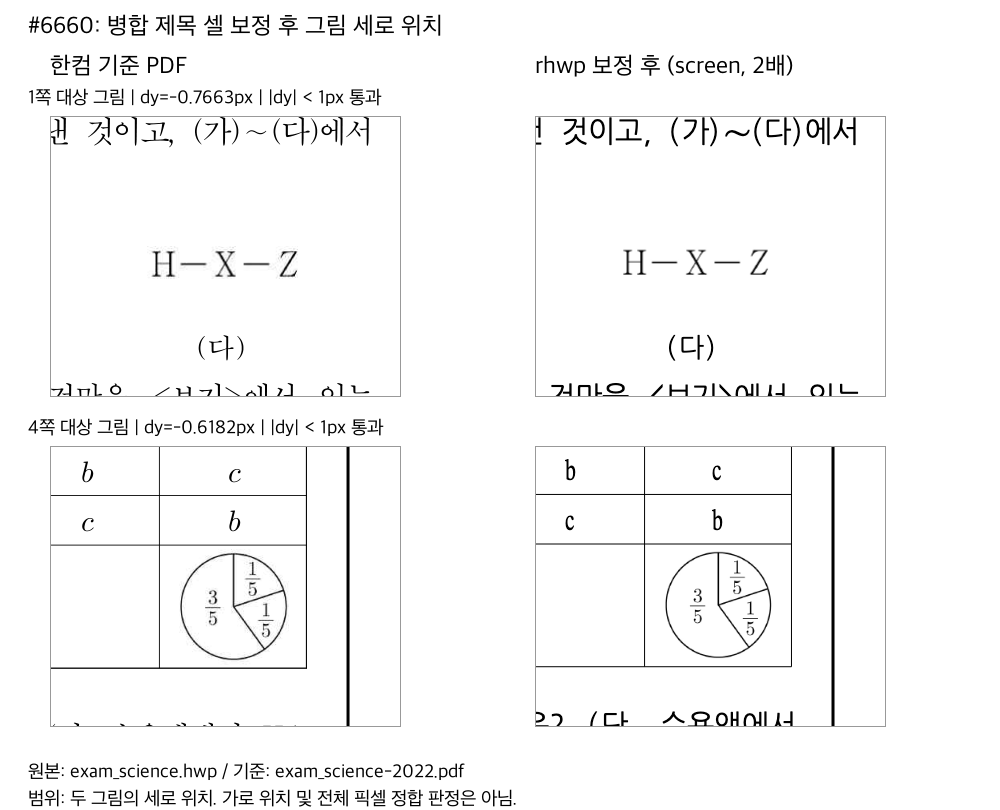

# PR #6818 검토: 그림 정렬·TAC 줄 간격·병합 셀 높이 잔여 보정

## 최종 판정: 승인

현재 검증한 제품 코드의 주장 범위는 수용한다. 이는 GitHub approve event나 이미 merge됐다는 뜻이 아니다.
문서 trailing head의 CI와 최신 merge 상태를 확인한 뒤에만 승인된 일반 merge와 후속 처리를 진행한다.

## 1. 접수와 검토 대상

| 항목 | 2026-09-07 기록 시점 값 |
| --- | --- |
| PR / 작성자 | [#6818](https://github.com/edwardkim/rhwp/pull/6818) / `jangster77` |
| 경로 | collaborator self-review. reviewer 지정과 GitHub approve event 없음 |
| base | `devel@4f039316ff2b0726742f4266ebac7d6e497d4686` |
| 제품 코드 head | `f7c59821f2d79598eda7ede6d7e5878b21a2b2d2` |
| head branch | `fix/6699-6662-residual-image-layout-20260906` |
| 코드 후보 규모 | 2 commits, 13 files, `+918/-6`. 이 문서 trailing commit 이전 값 |
| 원격 상태 | Open, non-draft, `MERGEABLE`, `CLEAN`. merge 전 재조회 필요 |
| 종료 대상 | [#6699](https://github.com/edwardkim/rhwp/issues/6699), [#6660](https://github.com/edwardkim/rhwp/issues/6660) |
| 부분 보정 / 범위 밖 | [#6665](https://github.com/edwardkim/rhwp/issues/6665)는 부분 보정만 수용. 상위 [#6662](https://github.com/edwardkim/rhwp/issues/6662)와 함께 종료하지 않음 |

`97ee926d8c99ff12e9408c4dfd953a24927c9741`에 1차 보정을 보존하고, 새 위치 회귀에서 재현한
#6660의 1.1337px 실패를 분석한 뒤 `f7c59821f2d79598eda7ede6d7e5878b21a2b2d2`로 2차 보정을 완료했다.
처리 순서는 코드 보존, 분석, 코드 수정, 실측 결과 기록, 커밋이었다. 이미 병합된 다른 PR을 다시
체리픽하거나 contributor commit을 재작성한 통합 PR은 아니다.

## 2. 변경과 발견 사항

- #6699: TAC 그림 뒤 텍스트의 마지막 양수 자간을 중앙/오른쪽 정렬 점유 폭에 중복 계산하지 않았다.
  실제 글자 사이 자간과 왼쪽 정렬은 유지했다. 대상 로고의 최대 dx는 1.41px에서 0.41px로 줄었고,
  대조한 나머지 13개 그림 위치는 유지됐다. [1차 분석](../../working/task_m100_6699_stage1_terminal_tracking.md).
- #6665: HWP5 저장 줄의 TAC 도형 높이 하한이 적용될 때 빠진 후속 줄 간격을 보존했다.
  두 2024 변형의 4·5·7쪽 및 기준 글줄 8개를 확인했고, 두 변형의 전체 47쪽 중 해당 페이지들만
  변경됐다. `미주사이20`의 다른 쪽에 남은 큰 흐름 오차까지 해결한 것으로 판정하지 않는다.
  [1차 분석과 한계](../../working/task_m100_6665_stage1_shape_line_spacing.md).
- #6660: 병합 복원 후 단일행 여유를 회수하고, 선언에 딱 맞는 저장 한 줄 제목에 비활성 fallback
  하단 여백을 중복 복원하지 않았다. 명시적 여백·여러 줄·실제 내용 넘침과 #6124의 잘림 보호를 유지했다.
  [2차 원인·검증 결과](../../working/task_m100_6660_stage2_merged_title_padding.md).
- 제품 코드에 파일명·제목·특정 페이지 좌표 분기를 추가하지 않았고, 기존 golden/baseline을 완화하지 않았다.
- 렌더링 변경이므로 Cargo 통과만으로 시각 판정을 대체하지 않았다. 이전 로컬 단계에서 직접 생성·열람한
  한컴 PDF/출력 대조와 geometry 계약을 근거로 삼았다. 문서 trailing 단계에서는 같은 테스트를 반복하지 않았다.

## 3. 완료한 로컬 검증

Mac에서 고정 `CARGO_TARGET_DIR=target/pr-review`, `CARGO_BUILD_JOBS=4`로 순차 실행했다.

| 검증 | 실제 결과 |
| --- | --- |
| 관련 집중 회귀 | 22개 통과 |
| `cargo nextest run --locked --cargo-profile release-test --target-dir target/pr-review --tests --test-threads 6 --no-fail-fast` | 9,105개 통과, 46개 skip, 실패 0건 |
| fmt check, native Clippy, WASM32 lib Clippy | 모두 통과 |
| workspace build, workspace all-target Clippy, suite manifest check | 모두 통과 |
| Native Skia 전체 lib, 이름 필터 없음 | 4,112개 통과, 13개 ignored |
| Native Skia PNG / direct PDF 통합 회귀 | 2개 / 4개 통과 |
| doc tests | 8개 통과, 3개 ignored |
| `scripts/wasm-pack-locked.sh --target web --out-dir pkg` | wasm-opt 포함 성공, 2분 38초, exit 0 |

WASM은 승인된 Mac native 경로이며 Docker 실행 결과가 아니다. wasm-bindgen 사전 빌드 다운로드 경고 뒤
cargo-install fallback으로 완료됐다. 원시 실행 로그와 임시 PNG/SVG/JSON은 커밋하지 않았다.

## 4. 제품 코드 head의 실제 GitHub CI

아래 결과는 모두 `f7c59821f2d79598eda7ede6d7e5878b21a2b2d2`에 귀속되며 trailing head의 결과가 아니다.

| Workflow / gate | 실제 결과 |
| --- | --- |
| [CI](https://github.com/edwardkim/rhwp/actions/runs/34040774706) | SUCCESS. preflight, lint, Native Skia, archive A–D 생성과 실행 worker, Build & Test 모두 성공 |
| [CodeQL workflow](https://github.com/edwardkim/rhwp/actions/runs/34040774741) | SUCCESS. Rust 실제 분석 성공. JavaScript/Python은 미선택 언어로 분석 step skip |
| [CodeQL 통합 check](https://github.com/edwardkim/rhwp/runs/101509159832) | NEUTRAL. devel의 JavaScript/Python 구성 2개가 이번 분석에 없다는 경고. 3언어 분석 성공으로 기록하지 않음 |
| [Render Diff](https://github.com/edwardkim/rhwp/actions/runs/34040774605) | preflight와 Canvas visual diff SUCCESS |
| [Adapter inter-diff](https://github.com/edwardkim/rhwp/actions/runs/34040774766) | preflight와 worker SUCCESS |
| [Proptest roundtrip](https://github.com/edwardkim/rhwp/actions/runs/34040774748) | preflight와 worker SUCCESS |
| [CI Impact Policy](https://github.com/edwardkim/rhwp/actions/runs/34041576284) | SUCCESS. `rust=1`, `render=1`, `skia=1`, `ql=rs`, `fe=none` |

CI preflight는 `fast_pass=false`, `reason=no-trailing-review-only-commits`,
`impact_reason=classified:rust+rust-render`였다. 초기 코드 후보의 필수 heavy worker가 실제 실행된
것을 확인했다. 별도 WASM Build, frontend gates, workflow promotion, duration refresh job은
SKIPPED였으며 실행 성공으로 세지 않았다. 모든 check는 성공 또는 현재 정책이 허용한 skip/neutral로
종료됐고 pending/실패/취소는 없었다.

## 5. 시각 증적과 판정 한계

#6660은 기존 [원본 HWP](../../../samples/exam_science.hwp)와
[한컴 PDF](../../../pdf/exam_science-2022.pdf) 4쪽을 재사용했다. PDF 높이 1190pt에
원본 높이 `111685 HU / 75`를 대응시켰으며 반올림된 페이지 bbox로 배율을 정하지 않았다.

| 대상 | 한컴 y | 보정 후 rhwp y | dy | 판정 |
| --- | ---: | ---: | ---: | --- |
| 1쪽 문단 28의 대상 그림 | 1085.0663 | 1084.3 | -0.7663px | 1px 미만 통과 |
| 4쪽 문단 109의 대상 그림 | 1011.5182 | 1010.9 | -0.6182px | 1px 미만 통과 |



이 PNG는 현재 코드의 native-skia `export-png --profile screen --scale 2`와 한컴 PDF에서 같은
페이지 좌표를 자른 직접 증적이다. 라벨·한글·수치를 열어 판독했다. PC 전체 화면이나 원 기여자의
이미지를 새 검증처럼 사용한 것이 아니다. 원시 visual-sweep `flagged`, `pixel_match`,
`visual_accuracy_proxy_percent`는 미산출(N/A)이며 임의 백분율을 만들지 않는다. geometry 기준을
벗어난 대상은 0/2개다. 글꼴·가로 위치·전체 픽셀 일치의 통과를 뜻하지 않는다.

6개 문서 22쪽의 전후 render-tree에서 페이지 수와 페이지별 텍스트/이미지 순서가 유지됐다.
#6124 대조 문서 8쪽은 render-tree 자체가 동일했다. 사전 992개 파일 구조 탐색을 전수 render-tree
비교로 표현하지 않는다. #6665의 47쪽 대조도 문서 전체 시각 일치로 확대 해석하지 않는다.

| 보존 입력/증적 | SHA-256 |
| --- | --- |
| `samples/exam_science.hwp` | `22d29786a80d68a9b2ad9294c2dab4915e0eced941e790e37390b14312b8b6a8` |
| `pdf/exam_science-2022.pdf` | `41c328a5523000d4b9a51fdd1d9d9c228633711db304440724736178eab2bd73` |
| `samples/table-in-tbox.hwp` | `02b0ced8b96cec5b6e1cad6dd1926b701a2875ea9591c589e57edf7653daf4af` |
| `pdf/table-in-tbox-hwp-2020.pdf` | `b98203aa0680dd24ebf1f5ee78dc5ce8ba4689bfe3611865aa965e4fcf578495` |
| `mydocs/pr/assets/issue_6660_20260906/picture-position-comparison.png` | `12ea84460034d8106dd2fa05b93b77cb75852f6a049cb324e669b7168a605d4f` |

## 6. Trailing commit과 merge 전 게이트

이번 기록은 [2026-09-07 오늘할일](../../orders/20260907.md)과 함께 같은 PR의 선형 문서 commit으로
추가한다. source/test/workflow/sample/PDF/PNG는 변경하지 않는다. 최신 devel에도 오늘 날짜 파일이
없음을 확인했으며, 다른 날짜의 항목을 복사하거나 기록을 위해 rebase/base merge하지 않는다.

1. 변경 Markdown의 링크와 diff check, 최신 devel 기준 merge simulation을 수행한다.
2. 같은 head branch에 trailing commit을 push하고 최신 SHA의 CI·merge 상태를 다시 확인한다.
3. [#6816](https://github.com/edwardkim/rhwp/pull/6816) 이후 실제 CI 재사용 판정을 확인한다. 이번 선형
   trailing 사례만으로 mydocs-only base merge bridge 예외까지 실증했다고 주장하지 않는다.
4. 작업지시자의 2026-09-07 merge/후속 처리 승인에 따라 일반 merge commit으로 병합한다.
   문서 포함 규모가 1,000줄을 넘더라도 admin 우회하지 않고 별도 코드 검증·시각 대조·simulation을 유지한다.
5. devel 동기화와 merge SHA의 push CI 완료 후 아래 계획으로 후속 처리한다. 별도 문서 PR은 만들지 않는다.

이 기록 자체는 아직 확정되지 않은 trailing/devel CI나 merge SHA를 성공으로 기재하지 않는다.

## 7. Merge 후 contributor PR comment 계획

자기 PR의 완료 기록으로 적용한다. 비교 절차 정본은
[Visual Sweep GitHub merge comment](https://github.com/edwardkim/rhwp/blob/devel/mydocs/manual/verification/visual_sweep_guide.md#github-merge-comment)다.

- PR #6818 코멘트에는 실제 merge SHA, 위 코드 CI, 최신 trailing CI, devel push CI/CodeQL 결과를 구분한다.
- #6660의 1·4쪽, dy -0.7663/-0.6182px, 22쪽의 명시적 경계 대조, N/A인 픽셀 지표와 한계를 그대로 적는다.
- 대표 PNG 경로는 `mydocs/pr/assets/issue_6660_20260906/picture-position-comparison.png`다.
  최종 merge SHA가 devel에 포함되고 asset이 존재할 때 아래 형식으로 직접 표시한다.

```markdown

```

- #6660 이슈에는 이 PNG와 commit 고정 원본/PDF/검토 기록을 함께 남긴다.
- #6699 이슈에는 로고 1.41→0.41px, 나머지 13개 그림 유지, 실제 테스트 결과와 commit 고정
  `samples/table-in-tbox.hwp`, `pdf/table-in-tbox-hwp-2020.pdf`, 분석/검토 기록을 남긴다.
  #6660 PNG를 #6699 자체의 시각 증적으로 전용하지 않는다.
- closing reference와 실제 auto-close 여부를 확인한다. 같은 merge SHA와 증적의 maintainer 기록이
  있으면 중복 게시하지 않는다. CLOSED여도 해당 기록이 없으면 후속 코멘트를 남긴다.
- 승인 범위의 #6699/#6660만 필요한 종료 처리를 하고 #6665/#6662나 과거 PR은 닫거나 반복 코멘트하지 않는다.
- UTF-8 body file로 게시하고 API로 body를 재조회한다. 수치·링크·직접 이미지가 계획과 일치해야 한다.
- [post_merge 절차](../../manual/pr_review/post_merge.md)에 따라 작업 전용 local branch만 clean/미사용과
  merge 반영을 확인한 뒤 정리한다. 기본 작업공간과 공유 `target/pr-review`는 보존한다.
  upstream 원격 branch 삭제는 별도 승인 없이는 수행하지 않는다.
