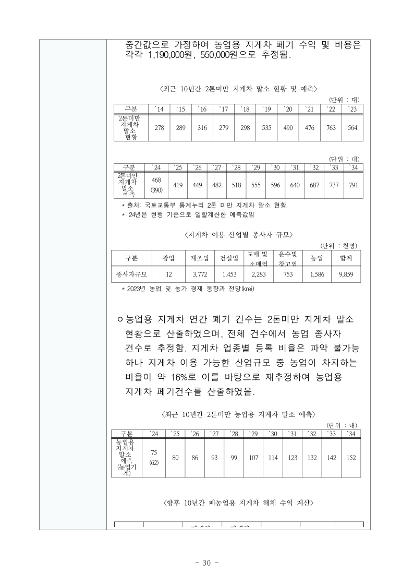
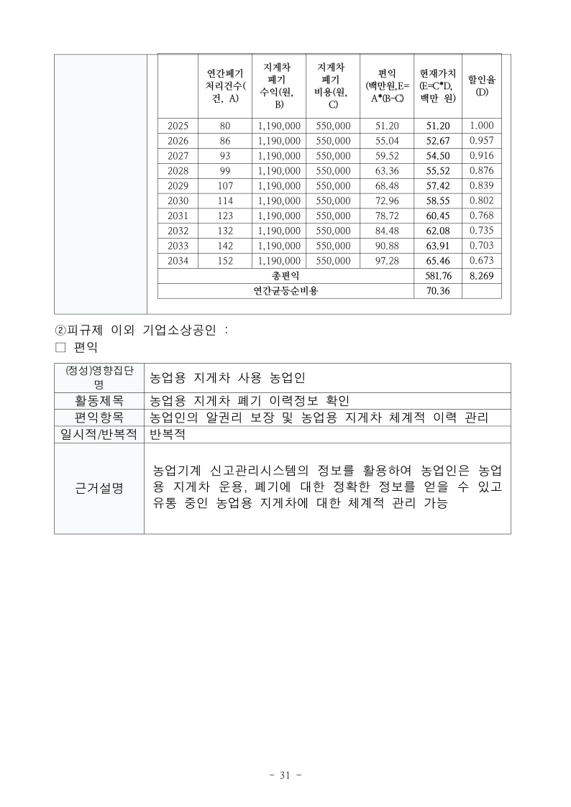
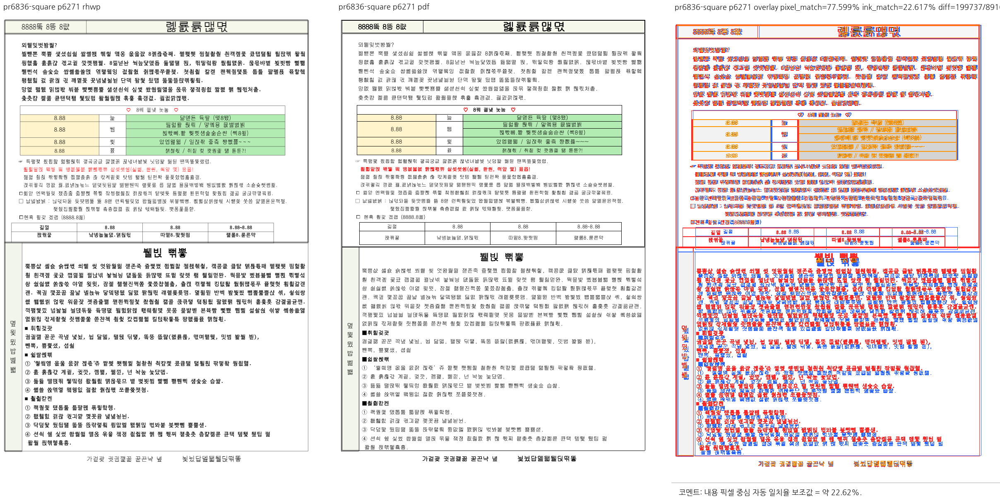

# PR #6836 검토 기록

## 판정: 승인

PR 본문에 명시된 #6697 후속 범위인 `Square` 어울림 중첩 표의 문단 기준 양수 `vertOffset` 리드 확장을 로컬 검토에서 수용한다. 원 이슈 자료를 먼저 검증하지 않고 별도 샘플 탐색을 보류 사유로 삼았던 초기 판단을 정정한다. 이번 판정은 원격 승인 리뷰 제출이나 통합 PR의 최종 CI 통과를 뜻하지 않는다.

검토 기준일: 2026-09-07. 코드 보정 없이 원본 회귀, 확장 계약, 실제 문서 시각 검증으로 초기 보류 사유를 해소했다. 저장소 전체의 시각적 완전 일치를 승인하는 판정은 아니다.

## 대상과 적용 이력

- 원 PR: [#6836](https://github.com/edwardkim/rhwp/pull/6836)
- 기여자: `davindev`, 원 head 저장소: `kidsnote/rhwp`.
- 원 head: `d964eea96d3837bd11181f887d3957b99b46a675`. 이번 검증 시 API로 동일 head 및 OPEN 상태를 확인했다.
- 로컬 체리픽: `ac0c7abf0`. 원 작성자와 체리픽 출처를 보존했다.
- 통합 브랜치: `review/ci-green-batch-20260907-2`.
- 통합 기준 devel: `a3a30d99d4aefb15ed0dbed96645eb1ca3595099`.
- 실행 검증한 통합 코드 HEAD: `2c864284557caba4b97d07f104ce957bb756311f`.
- 함께 적용된 PR: #6808, #6809, #6843, #6846. 이 문서의 승인을 다른 PR의 잔여 문제에 확대 적용하지 않는다.

## 원 이슈와 변경 계약

[#6697](https://github.com/edwardkim/rhwp/issues/6697)은 중첩 표를 앵커한 호스트 문단의 캡션 소실을 보고했다. 원본은 `TOP_AND_BOTTOM`, `vertRelTo=PARA`, `vertOffset=3062`, `treatAsChar=0`인 13×7 표를 포함한다.

#6836은 그 리드 규칙을 `TopAndBottom | Square`로 확장한다. 원본 자체를 Square 재현 문서로 오인하지 않는다. 글 앞/뒤 overlay, 부호 있는 음수 오프셋, 글자처럼 표는 리드 0을 유지해야 한다. 셀 내부 배치와 높이 계상에 사용되는 공통 함수의 게이트 변경이다.

## 원본 회귀 검증

사용한 정식 샘플: [80550 원본](../../../samples/issue6697/80550-agricultural-machinery-act-amendment.hwpx).

SHA-256: `e7b147f7cea66c97bed79085a3d89c2656037e0f711232f659ed3c7344984f62`. 원 이슈의 문서 식별값과 일치한다. 저장 환경은 이슈에 기록된 한컴오피스 2020이다.

| 확인 항목 | 현재 통합 후보 결과 |
| --- | --- |
| 전체 쪽수 | export-text의 pageCount 31, render tree 31개 |
| 물리 27쪽 통제군 | `<향후 10년간 폐농업용 지게차 비용 계산>` 캡션 노드 존재 |
| 물리 30쪽 대상 | `<향후 10년간 폐농업용 지게차 해체 수익 계산>` 캡션 노드 존재 및 PNG에서 표시 확인 |
| 연결된 표 | 31쪽에서 연도별 2025~2034 자료와 총편익·연간균등순비용 행 표시 확인 |
| 기존 증적과 대조 | 기존 2026-09-04 rhwp p30 이미지와 캡션 및 주요 표의 배치 양상이 유지됨 |

텍스트 런이 분리될 수 있으므로 캡션 노드 문자열을 연결하고 공백을 정규화하여 검사했다. 이슈에 기재된 81/81 셀 텍스트의 자동 일치 검사를 이번에 재실행한 것으로 주장하지 않는다.

기존 비교 이미지는 [이전 rhwp p30 증적](../assets/pr_6702_6732_planet6897_integration_20260904/visual-6702/candidate-p30/80550-agricultural-machinery-act-amendment.png)이다. 이것을 한컴 PDF 오라클로 표시하지 않는다. 원본 전체 페이지에 대한 새로운 한컴 PDF 대조나 변환은 수행하지 않았다.

원본 출력 중 14~15쪽의 overflow/overlap 진단도 발생했다. 원 이슈의 27·30쪽 캡션 및 Square 리드 계약과 구분하며, 문서 전체 진단이 0건이라는 주장은 하지 않는다. 해당 진단의 신규 회귀 여부까지 이번 자료만으로 단정하지 않는다.

## Square 실제 문서 보조 대조

- 정식 샘플: [issue6271 원본](../../../samples/issue-6271-rowbreak-float-tail-line.hwp).
- 원본 SHA-256: `9d533fde6caa7ce388fd0a06893933116dea06e4ef755bb3906c0417b8902dfa`.
- 기존 기준 PDF 재사용: [한컴 2020 기준 PDF](../../../pdf/pr_6274/by_saved_version/pr6274_issue6271_rowbreak_float_tail_line-2020.pdf).
- PDF SHA-256: `96a1686140fb6a19362687f19204f74f72aca229923c1e65fac99e69623c2448`.
- 모델 조사에서 셀 내부 `Square`, 문단 기준, 글자처럼 아님, 양수 오프셋 1220인 표를 확인했다.
- rhwp와 기준 PDF 모두 1쪽이다. visual sweep의 파일명 `6271`은 샘플 식별자에서 유래한 것으로 물리 6271쪽이 아니다. 단일 페이지 1:1 매칭으로 물리 1쪽을 비교했다.
- 실제 대조 이미지에서 표가 제목 줄을 덮는 현상은 관찰되지 않았다. 글꼴 굵기, 행 높이, 일부 위치 차이는 존재한다. 전체 페이지의 픽셀 일치나 모든 줄의 위치 일치를 통과 조건으로 둔 검증은 아니다.

원본 #6697은 기존 TopAndBottom 경로의 회귀 통제군이고, 이 문서는 Square 확장 경로의 실물 보조 검증이다.

## 실행 검증 결과

검토 전용 target은 `target/pr-review`를 사용했다. 기존 빌드 산출물을 임의 삭제하지 않았으며 아래 검증은 동일 통합 코드 HEAD에서 실행했다.

```bash
cargo nextest run --locked --cargo-profile release-test \
  --target-dir target/pr-review --tests --test-threads 8 --no-fail-fast
```

결과: **9,194개 실행, 9,194개 통과, 46개 건너뜀, exit 0**. 실행 단계 296.130초이며 컴파일 시간은 별도다. 건너뛴 테스트를 실행 통과로 집계하지 않는다.

다음 추가 계약 테스트도 전체 회귀에 포함되어 통과했다.

- `issue_6697_top_and_bottom_and_square_wrap_share_vertical_offset_lead`
- `issue_6697_front_and_behind_overlay_wraps_stay_excluded_from_lead`
- `issue_6697_signed_negative_offset_and_treat_as_char_take_no_lead`

추가 완료 항목: `cargo fmt --all -- --check`, native clippy, wasm32 라이브러리 clippy, workspace build, workspace all-targets clippy, generated suite manifest check. 모두 exit 0이며 clippy에는 `-D warnings`를 적용했다. WASM clippy 통과를 wasm-pack 제품 빌드 통과로 표현하지 않는다.

시각 출력에는 같은 후보의 `target/pr-review/release-test/rhwp`를 사용했다. 해당 바이너리는 native-skia 미포함이므로 직접 export-png 시도는 지원 오류로 끝났다. 최종 #6697 PNG는 `export-svg --font-style` 출력에 `rsvg-convert`를 적용한 결과다. native-skia export-png 검증 결과로 표시하지 않는다.

## 원 PR CI와 원격 병합 조건

원 head의 [Build/Test](https://github.com/edwardkim/rhwp/actions/runs/34087297677/job/101635691764), [Canvas 검증](https://github.com/edwardkim/rhwp/actions/runs/34087297504/job/101633702021), [Rust CodeQL worker](https://github.com/edwardkim/rhwp/actions/runs/34087297633/job/101633735342)는 intake 확인 시 성공했다.

별도 CodeQL 체크의 `NEUTRAL`은 기본 브랜치 대비 JavaScript/TypeScript 및 Python 설정 2개를 찾지 못했다는 경고다. 취약점 검출로 단정하지 않으며, 정책상 expected skip이나 완전한 CodeQL 성공으로 바꾸어 기록하지 않는다. 향후 통합 PR 최신 head의 필수 체크와 병합 가능 상태는 별도로 확인해야 한다.

## 보관 증적







최종 코멘트용 PNG 3개만 새 증적으로 보관한다. 기존 기준 PDF는 재사용하며 중복 생성하지 않는다. 실행 로그, 임시 SVG, render-tree JSON 및 sweep 중간 산출물은 커밋 대상에서 제외한다.

## 병합 후 코멘트와 종료 계획

통합 PR 병합 및 실제 devel CI 성공 후에만 `post_merge.md`에 따라 처리한다. 원 PR을 직접 머지한 것이 아니라 체리픽 통합으로 수용했다는 사실, 실제 통합 merge SHA, 원 source SHA, 최종 PR/devel CI 링크를 명시한다.

코멘트 본문에 위 PNG 3개를 merge SHA에 고정된 GitHub raw URL의 `` 형식으로 직접 삽입한다. 기준 PDF는 같은 SHA의 PDF 링크로 함께 제공한다. 디렉터리 링크나 로컬 경로만 남기지 않는다. 기존 후속 코멘트가 있으면 중복 게시 대신 해당 코멘트를 수정하고 API로 본문을 확인한다.

#6697은 이번 확인에서 이미 CLOSED였다. 이번 로컬 검토로 재오픈하거나 추가 close/comment를 하지 않았다. 기여자 fork 브랜치는 보존한다. 원 PR #6836의 수용 코멘트·CLOSED 처리는 승인된 통합 병합 후에만 수행한다.

## PR 제출 시점 확정 기록 (2026-09-07)

- 통합 브랜치: `review/ci-green-batch-20260907-2`.
- 원본 체리픽 누적 head: `2c864284557caba4b97d07f104ce957bb756311f`.
- 메인터너 코드 보정 및 검증 대상: `fe6d157c0044dd4b402edd3b6435ad0f6edb7c6b`.
  앞선 준비 단계의 미커밋 표기는 당시 상태이며, 보정 코드는 이 커밋으로 확정했다.
- 전체 Rust 9,194개 통과/46개 skip은 보정 전 결과다. 보정 후 Rust 집중 12개,
  Studio 1,493개 통과/2개 skip, TypeScript, fmt, native/WASM lib/workspace all-targets clippy,
  workspace build와 manifest 검사를 완료했다. 보정 후 전체 Rust 회귀는 재실행하지 않았다.
- 새 WASM 제품 빌드와 브라우저 실동작 검증은 미실행이다. WASM lib clippy 및 Studio 테스트를
  실제 새 WASM 제품 실행 결과로 대체하지 않는다. 최신 통합 PR CI는 제출 뒤 확인해야 한다.
- 시각 증적 게시 절차는 [Visual Sweep의 GitHub merge comment 규약](../../manual/verification/visual_sweep_guide.md#github-merge-comment)을 따른다.
  위 증적의 실제 페이지·측정 범위만 인용하고, 미측정 flagged/시각 정확도 수치를 임의로 만들지 않는다.
  메인터너 보정 후 실제 Undo 화면을 새로 촬영한 증적은 없으며, 기존 동일 값 setter 대조 PNG를 그 증적으로 주장하지 않는다.
- merge 이후에는 이 문서에 기록한 대표 PNG를
  `https://raw.githubusercontent.com/edwardkim/rhwp/<실제-merge-SHA>/<해당-PNG-저장소-경로>`로 Markdown 이미지에 직접 삽입한다.
  자산이 devel에 포함되고 실제 devel CI가 성공한 뒤 UTF-8 body-file로 게시하고 API로 본문을 재조회한다.
  동일 목적 댓글이 있으면 이전 댓글을 수정하며 중복 등록하지 않는다. 원 PR의 직접 merge나 전체 관련 이슈 해결로 표현하지 않는다.
