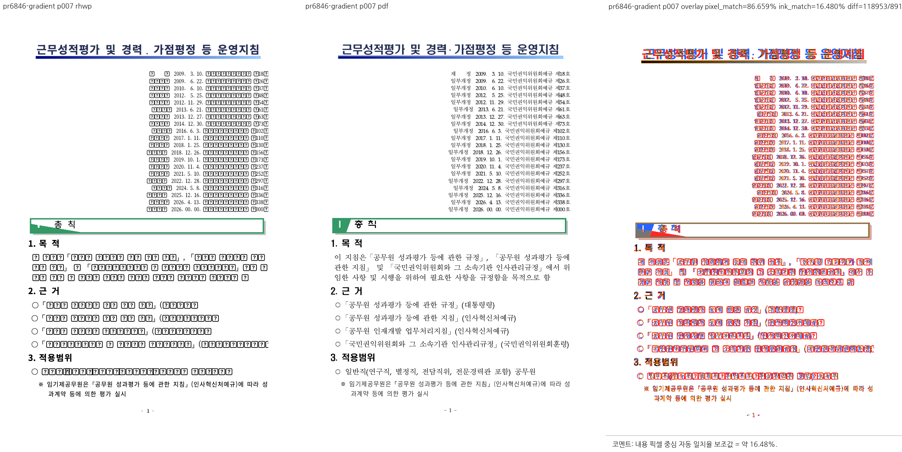
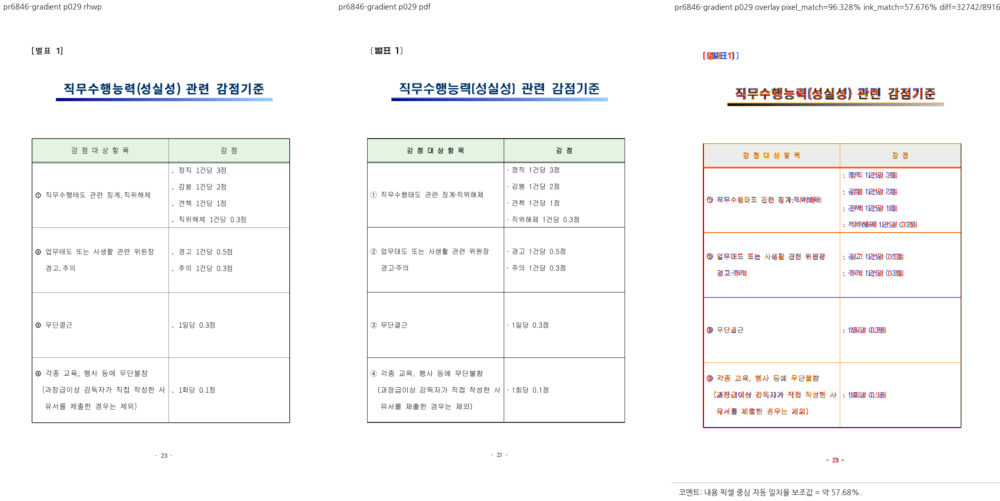

# PR #6846 검토 기록

## 판정: 승인

그라데이션의 `step`·`stepCenter`를 렌더 stop으로 전달하는 PR 범위는 수용한다. 테스트와 기존 한컴 PDF의 실제 시각 대조를 완료하여 초기 미검증 보류 사유를 해소했다. 별도 이슈 #6845의 그라데이션 각도 문제나 페이지 전체 폰트·조판 일치를 해결한 판정은 아니다.

## 출처와 기준

- 검토일: 2026-09-07.
- 원 PR: [#6846](https://github.com/edwardkim/rhwp/pull/6846), 작성자 `planet6897`.
- 원 head: `89c373596247b1eeac9902f55a955d8c1417a7b8`. 이번 API 확인에서도 동일하다.
- 체리픽: `2c8642845`, 작성자와 출처 보존.
- 브랜치: `review/ci-green-batch-20260907-2`.
- 기준 devel: `a3a30d99d4aefb15ed0dbed96645eb1ca3595099`.
- 실행 검증 코드 HEAD: `2c864284557caba4b97d07f104ce957bb756311f`.
- 대상 이슈: [#6822](https://github.com/edwardkim/rhwp/issues/6822). 별도 잔여 [#6845](https://github.com/edwardkim/rhwp/issues/6845). 이번 API 확인 시 둘 다 OPEN.

## 검토 및 실행 검증

`expand_gradient_steps`가 band별 시작·종료 위치와 색상을 구성하고, `stepCenter`를 중심 위치 변환에 반영한다. 기본 중심 50의 항등 변환과 퇴화 step 입력은 기존 동작을 유지한다. border fill과 drawing 경로에서 공유한다.

신규 계약 테스트 4개가 전체 회귀에 포함되어 통과했다. 추가 3색 통제군은 위치 0·0.3·1에서 step 2·3·50·32767과 center 0·50·100·255를 조합한 16건이다. stop 개수, 유한값, 0~1 범위 및 비감소 순서를 확인했다. 이 수치 검사는 모든 gradient 종류의 한컴 시각 일치를 뜻하지 않는다.

전체 회귀: 9,194개 실행·9,194개 통과, 46개 건너뜀, exit 0. fmt, native/WASM clippy, workspace build, workspace all-targets clippy, suite manifest check 통과. 별도 제품 코드 보정은 하지 않았다.

## 실제 시각 증거와 한계

정식 샘플: [113424_evaluation_guideline.hwpx](../../../samples/issue6551/113424_evaluation_guideline.hwpx).

원본 SHA-256: `21cf24446bcf558c62b715965a62e8d656e9dcd64e8b071b110f571cc3fb81e0`.

기존 기준 PDF: [한컴 2024 변환본](../../../pdf/113424_evaluation_guideline-2024.pdf).

PDF SHA-256: `e05bd3ec209a09825954004cf204d701e3428366b6700d707a10b70d939b332c`.

기존 46쪽 PDF를 재사용했으며 추가 변환하지 않았다. 같은 후보의 `target/pr-review/release-test/rhwp`와 visual sweep으로 물리 7·29쪽을 비교했다. 요청한 두 쪽 모두 산출되었으며 누락은 없었다.

| 페이지 | 관찰 |
| --- | --- |
| 7쪽 | 제목 막대의 녹색·흰색 단계 경계가 출력된다. 각도에 따른 쐐기 모양은 기준 PDF와 차이가 남으며 #6845와 구분한다. 일부 본문 글리프가 대체 문자로 보여 페이지 전체 성공으로 표시하지 않는다. |
| 29쪽 | 파란색 그라데이션 막대의 단계 표현을 기준 PDF와 대조했다. 글꼴, 행 높이와 일부 표 경계 위치 차이는 남는다. |

대체 글리프 원인을 이번 검증에서 확정하지 않았으며, 그 차이를 PR 개선 효과로 집계하지 않는다. 원 기여자의 개선 배수·픽셀 수치를 이번 검토자의 재측정 결과로 인용하지 않는다. 수정 전 빌드를 새로 만들어 얻은 전후 비교가 아니라 현재 후보와 기존 오라클의 대조다.

## 원 CI 및 최종 병합 조건

원 head의 [Build/Test](https://github.com/edwardkim/rhwp/actions/runs/34119614775/job/101738549022), [Canvas 검증](https://github.com/edwardkim/rhwp/actions/runs/34119614675/job/101734443849), [Rust CodeQL worker](https://github.com/edwardkim/rhwp/actions/runs/34119614828/job/101734491550)는 intake에서 성공했다. 별도 CodeQL NEUTRAL은 기본 브랜치 대비 JS/TS·Python 구성 2개를 찾지 못했다는 경고로, 정책상 expected skip이나 완전한 분석 성공으로 바꾸어 표시하지 않는다.

통합 PR 최신 head의 필수 체크와 mergeability 확인은 별도이며 현재 원격 승인·merge·close는 하지 않았다.

## 병합 후 코멘트와 종료 계획

승인된 통합 PR 병합 및 devel CI 성공 후 원 source SHA, 통합 merge SHA, 실제 CI 링크와 시각 검증 범위를 원 PR과 실제 closing reference 대상 이슈에 기록한다. #6822의 단계 표현과 #6845의 각도 잔여를 구분하고 #6845를 함께 닫지 않는다.

위 PNG 2개는 merge SHA에 고정된 raw URL의 Markdown 이미지로 코멘트에 직접 표시하고, 기준 PDF는 같은 SHA의 PDF 링크로 제공한다. 기존 후속 코멘트가 있으면 중복 게시 대신 수정한다. UTF-8 body file을 사용하고 API로 본문을 재조회한다. contributor fork 브랜치는 보존한다. 중간 SVG·JSON·로그 및 중복 PDF는 커밋하지 않는다.

## PR 제출 시점 확정 기록 (2026-09-07)

- 통합 브랜치: `review/ci-green-batch-20260907-2`.
- 원본 체리픽 누적 head: `2c864284557caba4b97d07f104ce957bb756311f`.
- 메인터너 코드 보정 및 검증 대상: `fe6d157c0044dd4b402edd3b6435ad0f6edb7c6b`.
  앞선 준비 단계의 미커밋 표기는 당시 상태이며, 보정 코드는 이 커밋으로 확정했다.
- 전체 Rust 9,194개 통과/46개 skip은 보정 전 결과다. 보정 후 Rust 집중 12개,
  Studio 1,493개 통과/2개 skip, TypeScript, fmt, native/WASM lib/workspace all-targets clippy,
  workspace build와 manifest 검사를 완료했다. 보정 후 전체 Rust 회귀는 재실행하지 않았다.
- 새 WASM 제품 빌드와 브라우저 실동작 검증은 미실행이다. WASM lib clippy 및 Studio 테스트를
  실제 새 WASM 제품 실행 결과로 대체하지 않는다. 최신 통합 PR CI는 제출 뒤 확인해야 한다.
- 시각 증적 게시 절차는 [Visual Sweep의 GitHub merge comment 규약](../../manual/verification/visual_sweep_guide.md#github-merge-comment)을 따른다.
  위 증적의 실제 페이지·측정 범위만 인용하고, 미측정 flagged/시각 정확도 수치를 임의로 만들지 않는다.
  메인터너 보정 후 실제 Undo 화면을 새로 촬영한 증적은 없으며, 기존 동일 값 setter 대조 PNG를 그 증적으로 주장하지 않는다.
- merge 이후에는 이 문서에 기록한 대표 PNG를
  `https://raw.githubusercontent.com/edwardkim/rhwp/<실제-merge-SHA>/<해당-PNG-저장소-경로>`로 Markdown 이미지에 직접 삽입한다.
  자산이 devel에 포함되고 실제 devel CI가 성공한 뒤 UTF-8 body-file로 게시하고 API로 본문을 재조회한다.
  동일 목적 댓글이 있으면 이전 댓글을 수정하며 중복 등록하지 않는다. 원 PR의 직접 merge나 전체 관련 이슈 해결로 표현하지 않는다.
