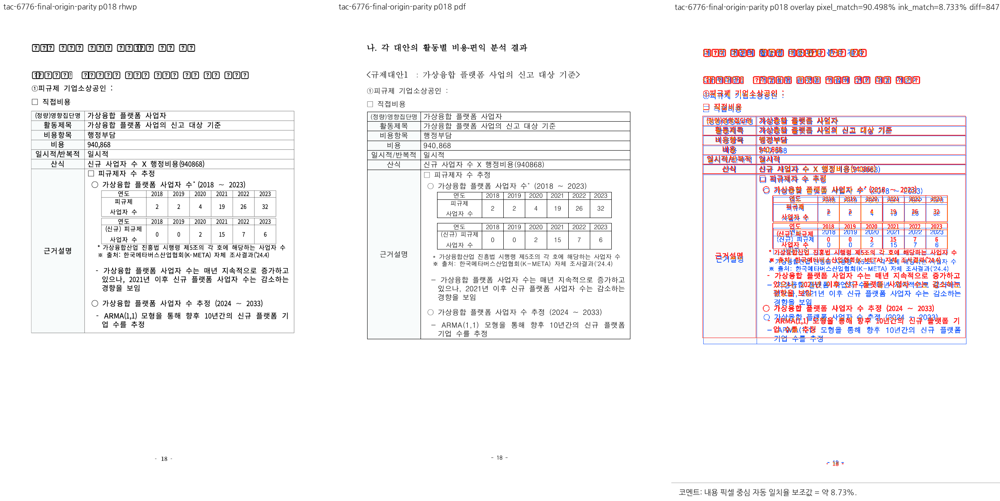
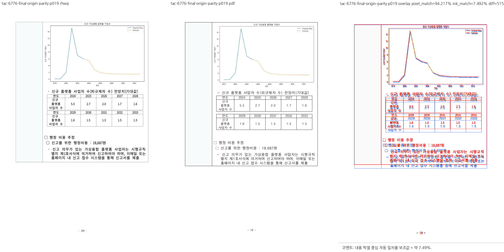
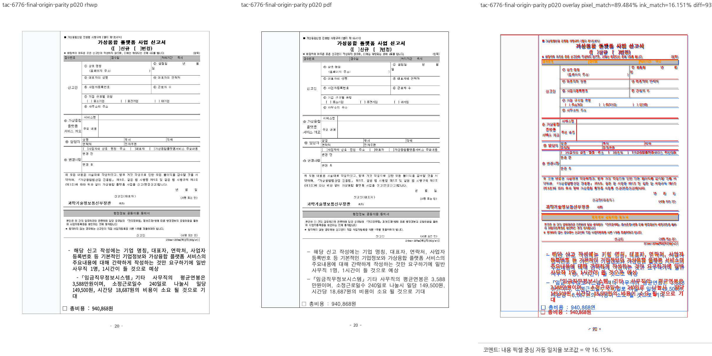
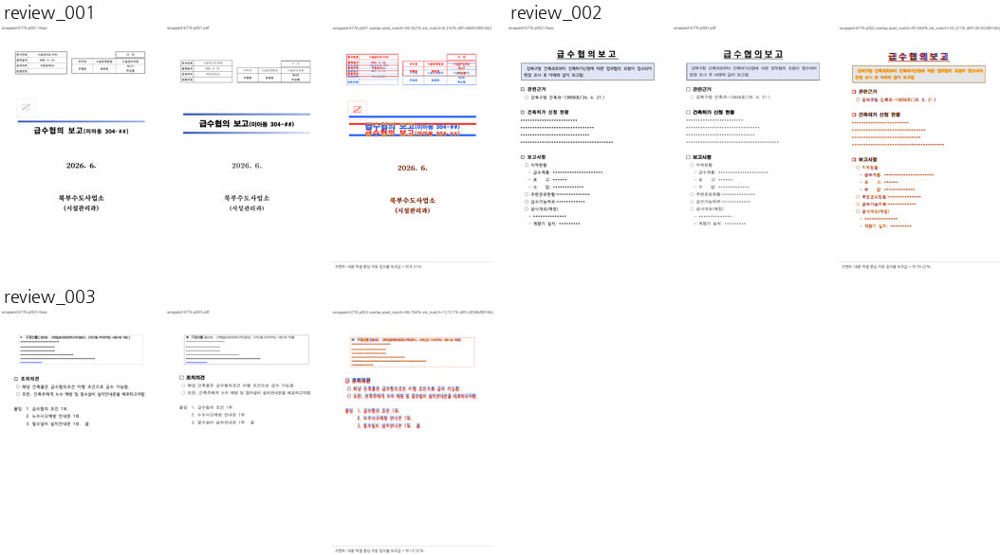

# PR #6853 검토

## 판정: 메인터너 보정 완료, 수용 가능 (그림 흐름·페이지 분할 범위)

원문 중첩 표의 빈 문단 높이와 TAC 표 뒤 간격을 실제 배치 및 분할 회계에 반영했다. 물리 18쪽은 그래프 직전 설명으로 끝나고, 19쪽은 그래프로 시작하며, 큰 그림은 20쪽 상단에 온전히 놓인다. 테스트의 페이지 번호만 바꾼 이전 보정으로는 부족했던 시각 보류 사유를 제품 코드 보정으로 해소했다.

**통합 판정은 메인터너 보정 완료, 수용 가능(검토 범위 한정)이다.** #6853의 물리 18·19쪽 그래프 분할과 추가 보정 중 발생한 #1939 HWPX 왕복 렌더 회귀를 해결했다. 최종 미커밋 작업 트리에서 8스레드 전체 회귀 9,241건이 통과했다. 아래에 명시한 글꼴·세부 간격 및 개별 PR의 범위 밖 차이를 전체 시각 일치로 해석하지 않는다. 최종 커밋의 원격 CI와 머지 승인은 별도다.

## 검토 기준과 출처

- 검토일: 2026-09-08. [원 PR](https://github.com/edwardkim/rhwp/pull/6853), [관련 이슈](https://github.com/edwardkim/rhwp/issues/6776).
- 원 head: `ae0d816ac7ac0ac9f07b0c07c30cd792bd4a090e`. [원 PR CI](https://github.com/edwardkim/rhwp/pull/6853/checks)는 확인 당시 통과했다.
- 적용 원 커밋: ae0d816ac7ac0ac9f07b0c07c30cd792bd4a090e. 로컬 커밋: b1127b352. 체리픽의 원 커밋 출처를 보존했다.
- 기준 upstream/devel: `91147aec332651309029faac521d19106305c6f5`. 체리픽 완료 head(보정 전): `d66f2a6a5aaccc8deae4d77877835ce1a5fdeb86`.
- 브랜치: `review/planet6897-ci-green-20260908`. 이번 재검증 대상은 위 체리픽 SHA에 #6853 조판·테스트 보정과 #1939 왕복 동등성 보정을 더한 미커밋 작업 트리다. 아직 새 커밋 SHA는 없으며 문서·PDF 갱신을 원격 CI 검증 완료로 해석하지 않는다.

## 보류 사유와 실제 보정

1. 원문은 .hwpx 확장자이지만 실제 바이트는 HWP5다. 등록 샘플과 다운로드 원문의 SHA-256은 동일하며, 해당 중첩 셀에는 저장 LINE_SEG나 그래프 직전 명시적 쪽나눔이 없다.
2. 중첩 빈 문단에 CharPr/ParaPr 기반 줄 높이를 복원하는 것만으로는 출력이 바뀌지 않았다. RowBreak 1×1 셀의 빈 문단을 겹침용 spacer로 간주해 높이를 0으로 접는 후속 처리가 남아 있었기 때문이다.
3. 저장 좌표가 없는 HWP5 원본/계보 HWPX 빈 문단의 줄박스를 보존하고, NO_LS TAC 표 전용 문단의 뒤 간격을 표 배치 후 한 번만 반영했다. 분할된 문단은 마지막 원문 유닛을 소유하는 조각에만 뒤 간격을 적용한다. 제품 코드에 문서명·페이지 번호·그림 ID·임의 여백을 넣지 않았다.
4. 원본 HWP5에만 적용한 중간 보정은 #1939 왕복 렌더 테스트에서 475.87px > 1.0px 실패를 만들었다. 원본과 HWP5 계보 HWPX에 기존 공통 조건 hwp5_stored_pagination_layout을 적용해 해결했다. 일반 HWPX까지 조건을 확대하지 않았다.
5. #6776 테스트는 그림의 단일 존재·용지 경계 검사에 더해 작은 그래프가 물리 19쪽 본문 상단에 놓이는 조건을 확인한다. 큰 그림의 단일 배치와 비-TAC 음성 대조도 유지했다. #1939의 1px 허용치와 구조 동일성 검사는 변경하지 않았다.

보정 경로: [문서 로드](../../../src/document_core/commands/document.rs), [표 조판](../../../src/renderer/layout/table_layout.rs), [그림 회귀 테스트](../../../tests/cases/issue_6776_cell_tac_picture_accounting.rs). 추가 실패를 검출한 [왕복 회귀 테스트](../../../tests/issue_1939.rs)는 기존 계약 그대로 통과했다.

## 실제 검증

- 최종 전체 회귀: 8스레드, 9,241 통과·실패 0·46 건너뜀, exit 0, 실행 388.355초.
- #6776 3건과 #6854 4건 및 #1939 왕복 검사를 최종 전체 실행에서 함께 통과했다.
- 중간 실패 이력: 조판 보정 직후 9,240 통과·#1939 1건 실패·46 건너뜀(390.437초). 형식 동등성 추가 보정 뒤 위 최종 결과로 해소했다.
- 별도 Native Skia·Studio·Clippy·WASM 등의 이전 결과와 최종 변경의 검증 범위는 [공통 기록](pr_6849_6867_planet6897_visual_sweep.md)을 따른다.

## 시각 증적과 한계

[새 한컴 기준 PDF](../../../pdf/78494-virtual-convergence-industry-decree-2020.pdf)의 SHA-256은 367fb3749f571521eef2036fe4327ce5b9cf6b7728966257328c1144f08ff8c9다. 아래 18·19·20쪽 PNG는 #1939 형식 동등성 추가 보정까지 포함한 최종 작업 트리의 바이너리로 새로 생성한 대조 자료다. 기존 비-TAC 음성 대조 PNG는 별도로 표시했다. 최종 전체 회귀 통과 후 CLI를 다시 빌드해 물리 페이지 경계와 용지 안 그림 배치를 직접 확인했다.









글꼴 대체와 일부 문단·표 간격 차이는 남아 있다. 수용 범위는 그림 흐름 회계, 물리 18·19쪽 분할 및 용지 안 단일 배치다. 문서 전체가 한컴 PDF와 픽셀 단위로 동일하다는 판정은 아니다.

## 후속 코멘트 계획

최종 PR/devel CI와 모든 머지 조건 충족 뒤 실제 통합 merge SHA, 메인터너 보정 내용, 8스레드 전체 회귀 및 실제 PR/devel CI 결과를 원 PR/관련 이슈에 UTF-8 body-file 방식으로 기록한다. 원 PR 직접 머지가 아니라 출처 보존 체리픽 수용임을 명시한다. 같은 작업의 기존 코멘트가 있으면 수정하고 중복 게시하지 않는다.

18·19·20쪽 PNG는 실제 merge SHA의 raw.githubusercontent.com URL을 Markdown 이미지로 직접 삽입하고, 기준 PDF는 같은 SHA의 pdf/ 경로를 연결한다. 증적 생성 시점과 남은 글꼴·세부 간격 차이도 명시한다. 게시 후 API로 본문을 재조회하고 실제 closing reference와 이슈 상태에 따라 필요한 close를 처리한다. 현재 원격 작업은 수행하지 않았다.

## 최신 검증: 조판·왕복 보정 완료, 8스레드 전체 회귀 통과

- 검증 대상: 체리픽 완료 head에 중첩 빈 셀 문단 복원, NO_LS 빈 문단 높이 보존, TAC 표 뒤 간격 반영, HWP5 원본/계보 HWPX 공통 조판 조건 및 #6776 경계 테스트 보정을 더한 미커밋 작업 트리.
- 최종 전체 회귀: 9,241건 실행, **9,241 통과·실패 0·46 건너뜀**, 느린 테스트 3건, exit 0. 실행 388.355초, 테스트 바이너리 빌드 6분 33초.
- 실행 ID: daba02f9-1099-415a-98a1-d7dbc5d85541. 78개 테스트 바이너리, 8스레드, no-fail-fast로 끝까지 실행했다.
- #1939 HWP5 원본 → HWPX 왕복 렌더 테스트와 #6776의 물리 19쪽 그래프 배치·용지 경계 테스트를 포함해 모두 통과했다. 허용치 완화나 실패 테스트 제외로 통과시킨 것이 아니다.
- 시각 대조: #1939 형식 동등성 보정까지 포함한 최종 작업 트리의 CLI를 새로 빌드하고 기준 PDF와 물리 18·19·20쪽을 재산출했다. 18쪽에는 그래프가 없고, 19쪽에는 312.4px 그래프가 y=78.9667px에, 20쪽에는 725.36px 그림이 y=78.9667px에 배치됨을 SVG 좌표와 세 대조 PNG에서 확인했다. CLI 빌드는 exit 0, 1분 37초이며 바이너리 SHA-256은 6f5e9f7ce8de9ea5d78840a56dd8201a48571e55c11386e5abfbebd0b8708296이다. 원문과 기준 PDF는 변경하지 않았다.
- 남은 한계: 글꼴 대체와 일부 세부 간격 차이는 남는다. 페이지 경계 해결을 픽셀 단위 동일성으로 주장하지 않는다. Native Skia·Studio·Node/Python 계약·fmt·TypeScript·Clippy·WASM의 이전 결과를 이번 최종 변경의 재실행 결과로 표시하지 않는다.

```sh
cargo nextest run --locked --cargo-profile release-test --target-dir target/pr-review --tests --test-threads 8 --no-fail-fast
```

로그는 임시 경로에만 보관하고 커밋에 추가하지 않는다. 이번 증적 갱신에서는 최종 CLI 빌드와 18·19·20쪽 시각 대조를 수행했고 전체 회귀는 반복하지 않았다. 이 절은 증적 갱신 당시의 기록이며, 이후 상태는 아래 PR 생성 직전 최종 기록을 따른다.

## PR 생성 직전 최종 기록 (2026-09-08)

- 메인터너 보정 커밋: `64f33cfc1c96d893c7e081b987349994dbff2717`. 앞 절의 미커밋 작업 트리 검증은 이 커밋으로 보존한 보정 내용에 해당한다.
- 사용자 승인 후 최종 필수 lint를 순차 재실행했다. suite prepare/check, fmt/check, native Clippy, WASM32 Clippy, workspace build, workspace all-target Clippy가 모두 종료 코드 0으로 통과했다.
- native Clippy 25.79초, WASM32 Clippy 13.87초, workspace build 43.49초, workspace all-target Clippy 30.62초다. 대상 디렉터리는 `target/pr-review`다.
- 전체 회귀는 이미 완료한 8스레드 결과인 **9,241 통과, 0 실패, 46 건너뜀**, 388.355초를 사용하며 이번 lint 실행 중 반복하지 않았다.
- 오늘할일과 개별 리뷰, 최종 기준 PDF 7개, 코멘트용 PNG 12개를 같은 통합 PR에 포함한다. 임시 로그·중간 PNG/SVG/JSON 및 generated suite는 추가하지 않는다.
- 이 기록 작성 시점에는 최종 head의 원격 CI와 병합이 아직 수행되지 않았다. 로컬 검증 통과를 원격 CI 통과로 대체하지 않는다. 원 source PR/이슈의 코멘트·종료는 병합 후 절차로 남긴다.
