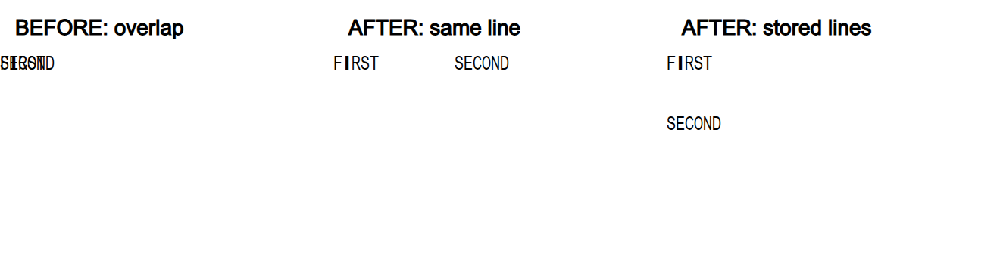

# PR #6863 검토: 내장 표 도형과 저장 페이지 소유권

## 최종 판정

**메인터너 보정 후 수용 가능.** 원 head의 내장 표 인라인 도형 겹침을 `0ee3641be`에서 보정했다.
원 14건과 신규 위치 회귀 4건을 합친 18건이 통과했고, 유사 문서 4종 40쪽 SVG는 보정 전과 동일하다.
대표 7쪽 및 공개 합성 before/after PNG를 직접 확인했다. 비공개 원본 제출 불가는 보류 사유로 삼지 않는다.
보정 head의 전체 nextest 9,260건, 세 Clippy, workspace build, Native Skia 3종이 통과했다.
WASM `--no-opt` 빌드, native/WASM 42쪽 SVG 일치, 실제 브라우저 9쪽 SVG/Canvas 검증도 통과했다.
Docker 미설치로 최적화 배포 빌드는 미실행이다. 원 contributor head에는 보정이 없으므로 직접
merge하면 안 된다. 보정 포함 PR을 위한 로컬 검증/기록은 준비됐으며 새 원격 head CI와 merge 승인은 별도다.
remote push, GitHub 검토 코멘트, approve, merge는 수행하지 않았다.

## 접수와 적용

| 항목 | 확인 내용 |
| --- | --- |
| 원 PR | <https://github.com/edwardkim/rhwp/pull/6863> |
| 작성자 | `kyunghwan-AITeam`, merged PR 0건인 첫 기여자 |
| 원 head | `1e82075a8ba4d79ac12fb11255a8563f87ce2281` |
| base | `devel`, 동기화 SHA `a7de17ff8ed911727fa5ff129945b341c79f8c7d` |
| 검토 branch | `review/kyunghwan-pr6863-20260908` |
| 적용 head | `2e17c6a80f7050d92f9b4a28476f3e6dec6e5c5b` |
| 적용 tree | `45f60b0f040a4f513cdcedb81bdc19033899b8c3` |
| 재현 고정 commit | `6bb9b5298` |
| 메인터너 보정 code head | `0ee3641be` |
| 규모 | source 5개, test 4개, 총 9개 파일; 대규모 변경 검토 |
| reviewer | `jangster77` 요청 확인 |
| 본문과 대화 | #6863 본문, #6735, 대체된 #6749 확인; #6863 issue/inline comment 및 review 없음 |

기본 경로는 collaborator external PR이다. intake, local validation, first-time contributor,
대규모 변경 및 visual fixture evidence 지침을 함께 적용했다. 최신 devel에서 다음 원 커밋을 순서대로
체리픽했으며 충돌은 없었다. 보정 전 적용 tree는 `git merge-tree --write-tree` 결과와 같다.
이후 사용자 승인으로 별도 회귀/보정 commit을 추가했으며 contributor history는 변경하지 않았다.

| 원 커밋 | 적용 커밋 | 내용 |
| --- | --- | --- |
| `2a99237d4` | `19752975a` | 내장 표 셀 Shape 복원 |
| `227186df5` | `865822830` | 병합 셀 열 폭 |
| `c1cf80ec8` | `2cad0dc48` | PageHide/NewNumber 소스 페이지 |
| `839d2fbe8` | `56bea84d1` | native HWP5 page-tail |
| `1e82075a8` | `2e17c6a80` | 회귀 fixture 경계 조정 |

#6735의 원 범위는 내장 표 셀 Shape 누락이다. 이번 PR은 그 수정에 열 폭, 쪽 제어, page-tail 변경을
추가했고, 닫힌 #6749를 대체한다고 명시한다. 네 원인과 검증 범위를 분리해 검토했다.

## 발견 사항

### P2: 내장 표의 인라인 Shape가 같은 위치에 겹침 (메인터너 보정 완료)

보정 전 위치: `src/renderer/layout/table_cell_content.rs:1320` 및 `:1354`.
원 PR 분기는 TAC Shape마다 `line_segs.first()`를 사용하고, 동일한 `inner_area`와 문단 정렬을
`layout_cell_shape_with_parent_path`에 전달한다. 이 helper의 TAC 분기는 셀 왼쪽/가운데/오른쪽을
기준으로 x를 계산하므로 도형별 inline 위치와 앞 개체가 차지한 폭을 반영하지 않는다.

공개 합성 IR `TextBox -> Table -> Cell -> Paragraph`에 너비 6000 HU인 `FIRST`, `SECOND` 글상자를
각각 TAC Shape로 넣었다. 셀 폭은 24000 HU이므로 두 개체가 같은 줄에 충분히 들어간다.

- 같은 문단, 두 도형: 두 label의 렌더 트리 위치가 모두 `(0, 0)`이었다. SVG에서도 두 도형의 80px
  사각형과 글자 시작점이 같고, 브라우저 PNG에서 글자가 겹친다.
- `char_count=17`, 저장 줄 `(text_start=0, vpos=0)`과 `(text_start=8, vpos=3000)`을 부여해도
  두 번째 도형이 다음 줄로 내려가지 않고 첫 도형 위에 겹쳤다.
- 각각의 분리 위치 assertion은 exit 101로 실패했다. 원 PR의 도형 회귀 2개는 문단마다 도형이 하나여서
  텍스트 존재와 cell path만 검사하므로 이 오류를 잡지 못한다.



기존 일반 표 셀의 `src/renderer/layout/table_layout.rs:6409` 부근처럼 도형별
`inline_shape_position`, 대상 줄, 가로 진행 위치를 소비하도록 보정했다. 한 문단의 도형 2개,
둘째 줄 도형, 도형 앞 텍스트, 가운데/오른쪽 정렬을 회귀로 추가했고 cell path와 floating 동작도 유지했다.
수정 전 새 회귀 2건이 실제 실패한 뒤, 보정 후 네 module 18건이 통과했다.
독립 probe도 같은 줄 `(0,0)/(80,0)`, 다른 줄 `(0,0)/(0,40)`으로 분리되어 exit 0이다.
구현 단계별 근거는 [보정 기록](pr_6863_review_impl.md)을 따른다.

독립 재현 코드는 임시 `output/pr6863/shape_probe.rs`에 보존했다. Cargo의 example 자동 발견이 꺼져 있어
`cargo run --example`은 target 없음(exit 101)이었고, 실제 재현은 검토 빌드의 rlib에 직접 링크해 수행했다.

```bash
rustc --edition 2021 output/pr6863/shape_probe.rs \
  --extern rhwp=output/pr6863/librhwp-default.rlib \
  -L dependency=target/pr-review/release-test/deps -o output/pr6863/shape-probe
output/pr6863/shape-probe
output/pr6863/shape-probe --multiline
```

직접 링크에는 보정 head의 default-feature rlib를 사용한다. 위 파일은 Native Skia 검증으로 공유
target의 feature 구성이 바뀌기 전에 보존한 사본이다. `output/pr6863/rhwp-corrected`는 보정 후
default CLI이고 `output/pr6863/rhwp-candidate`는 보정 전 비교용 실행 파일이다.

## 보정 전 검증 기록

- suite `--prepare`, `--check`: exit 0, 1206 sources / 5124 static attrs / 48 integration targets.
  생성 harness는 검증에만 사용했고 stage하지 않았다.
- focused nextest: **14 passed**, 필터 밖 701 skipped, exit 0. 빌드 6분 36초, 테스트 0.054초.
  `issue_6735_textbox_table_cell_shape` 2, `textbox_embedded_table_span_widths` 2,
  `page_controls_in_split_paragraph` 5, `tac_group_page_bottom_overflow` 5.
- 독립 추가 재현: 같은 줄/다른 줄 도형 분리 assertion **2건 실패**. SVG 좌표와 Chrome PNG를 직접 확인.
- 최신 devel 비교용 `cargo build --locked --profile release-test --target-dir target/pr-review --bin rhwp`:
  exit 0, 5분 11초. 비교 뒤 검토 branch로 돌아왔다.
- `git diff --check`: 통과.
- 원 head [CI run 34180828567](https://github.com/edwardkim/rhwp/actions/runs/34180828567)의
  Lint, Native Skia, Archive A/B/C/D와 Build & Test 성공을 재조회했다.
  [CodeQL](https://github.com/edwardkim/rhwp/actions/runs/34180828596),
  [Render Diff](https://github.com/edwardkim/rhwp/actions/runs/34180828423),
  [Adapter](https://github.com/edwardkim/rhwp/actions/runs/34180828582),
  [Proptest](https://github.com/edwardkim/rhwp/actions/runs/34180828547)도 성공했다.
- 코드 보정 없는 clean current-base review이므로 local_validation 4.3.0에 따라 녹색 원 head의
  광범위 전체/Native Skia CI를 참고하고 중복 로컬 전체 회귀는 실행하지 않았다.
  이 보정 전 단계에서는 로컬 Clippy 전체 묶음, 신규 WASM 빌드 및 WASM 런타임 검증을 수행하지 않았다.
  native CLI SVG의 browser raster와 WASM 실행은 구분한다. 보정 후 새 head 검증은 다음 절에 기록한다.

focused 실행은 `--locked --cargo-profile release-test --target-dir target/pr-review --no-fail-fast
--test-threads 4`로, suite 024/023/018/015에서 위 네 module 이름을 OR 필터로 선택했다.
같은 Cargo target을 쓰는 명령은 순차 실행했다. 검증 로그는 커밋에 보관하지 않는다.

## 보정 후 검증 결과

- 집중 nextest: **18 passed / 677 filtered skipped**, exit 0, 실행 0.068초.
  원 14건 + 같은 줄/저장 줄/정렬/앞선 텍스트 4건이다. manifest에서 suite를 다시 해석했다.
- `cargo fmt --all -- --check`, `git diff --check`, manifest `--check`: 통과.
  1206 sources / 5128 static attrs / 48 integration targets.
- 독립 probe 2종: exit 0. Chrome으로 before/after 실제 SVG를 raster하여 겹침 해소를 직접 확인했다.
- `scripts/visual_sweep.py`를 보정 바이너리로 다시 실행했다. 4문서 전체 40쪽 SVG는 보정 전과
  byte-identical이며 아래 대표 7쪽의 PNG를 다시 열어 판정했다. PDF는 기존 파일을 재사용했다.
  평균 비교 수치와 science p2의 기존 차이도 아래 보정 전 표와 동일하다.
- 보정 바이너리 SHA-256:
  `ef407f4e48c3aed60a814fc73c36c8d532480641cc77c48e7f681320ad6608dc`.

### PR 직전 전체 게이트

검증 code head는 `0ee3641be`다. 보정 전 원 head CI를 재사용하지 않고 다음 명령을 순차 실행했다.
Cargo 공통 옵션은 `--locked --target-dir target/pr-review`, build jobs는 2다.
테스트 시간은 실행 시간이며 빌드 시간은 따로 적었다.

| 게이트 | 결과 | 소요 |
| --- | --- | --- |
| fmt, manifest `--check` | 통과 | manifest 2초 |
| native root Clippy `-D warnings` | 통과 | 1분 10초 |
| WASM32 lib Clippy `-D warnings` | 통과 | 1분 00초 |
| workspace build | 통과 | 3분 00초 |
| workspace all-target Clippy `-D warnings` | 통과 | 2분 40초 |
| 전체 nextest | **9,260 passed**, 46 skipped, 6 slow, exit 0 | 빌드 10분 43초, 실행 408.906초 |
| Native Skia lib | **4,112 passed**, 13 ignored, exit 0 | 빌드 5분 22초, rhwp 실행 18.32초 |
| Native Skia placeholder | **2 passed**, exit 0 | 실행 1.115초 |
| Native Skia 직접 PDF | **4 passed**, exit 0 | 실행 0.557초 |
| WASM locked wrapper `--no-opt` | 통과, exit 0 | 전체 412초, Rust 빌드 6분 33초 |
| native/WASM SVG parity | 6문서 **42쪽 일치**, exit 0 | 실문서 40쪽 + 합성 2쪽 |
| Chrome WASM SVG/Canvas | **9쪽 통과**, page error 0, exit 0 | 대표 실문서 7쪽 + 합성 2쪽 |

Native Skia lib 합계는 rhwp 3,930건과 보조 library 182건이다. 전체 nextest의 대형 표
`issue_2063`도 305.553초에 통과했다. `slow`는 실패가 아니다. focused Skia의 필터 밖
217/184 skipped는 전체 회귀 누락으로 합산하지 않는다.

```bash
cargo nextest run --locked --cargo-profile release-test --target-dir target/pr-review \
  --tests --test-threads 12 --no-fail-fast
cargo test --locked --profile release-test --target-dir target/pr-review \
  --features native-skia --lib -- --test-threads 8
node scripts/run-rust-test.mjs issue_2225_missing_picture_placeholder -- \
  --cargo-profile release-test --target-dir target/pr-review --features native-skia
node scripts/run-rust-test.mjs render_p37_direct_pdf_export -- \
  --cargo-profile release-test --target-dir target/pr-review --features native-skia
```

WASM은 Docker 미설치로 local validation에 명시된 진단 경로
`CARGO_TARGET_DIR=target/pr-review scripts/wasm-pack-locked.sh --target web --out-dir pkg --no-opt`를
사용했고 exit 0을 확인했다. Docker 표준 최적화 배포 빌드의 통과로 대체 표기하지 않는다.

실제 WASM 검증에는 이 빌드의 `pkg/rhwp.js`와 `pkg/rhwp_bg.wasm`을 로드했다.
`svg_native_wasm_diff.mjs`로 위 실문서 4종 40쪽과 합성 HWPX 2종 2쪽을 비교해 전부 일치했다.
Chrome 152.0.7977.75에서 `HwpDocument` 생성, page count, `renderPageSvg`, `renderPageToCanvas`를
실행했다. 대표 실문서 7쪽과 합성 2쪽의 Canvas PNG를 전부 직접 열어 확인했다.
합성 두 도형은 가로 80px 또는 세로 40px로 분리되고, 실문서는 본문/표/쪽 번호를 유지했다.
Canvas ink pixel은 합성 각 312개, 실문서 20,093~109,771개로 비어 있지 않았다.
첫 임시 검사 스크립트는 `<text>FIRST</text>` 단일 노드를 가정해 실패했으나 실제 SVG는 글자별
노드였다. 직접 자식 text를 합산하도록 검사만 수정한 뒤 위 9쪽이 통과했다. 제품 코드는 바꾸지 않았다.

```bash
node scripts/svg_native_wasm_diff.mjs <위 실문서 4종 및 합성 HWPX 2종> \
  --rhwp output/pr6863/rhwp-corrected --pkg pkg --out output/pr6863/wasm-parity --keep-match
node output/pr6863/browser-validation.mjs
```

실행 스크립트/로그/JSON/임시 HWPX/SVG/PNG는 `output/pr6863` 아래에만 보존하며 커밋하지 않는다.
영구 재현은 `tests/cases/issue_6735_textbox_table_cell_shape.rs`의 6개 계약 테스트를 사용한다.

## 유사 실문서 시각 검토

비공개 원본 대신 기존 입력과 한컴 PDF를 재사용했다. MCP 재생성은 하지 않았다.
각 입력의 `rhwp info --json`을 확인했으며 89쪽 원본 자체의 재현 성공으로 확대 해석하지 않는다.

| 입력 | 저장 제품 | 기준 PDF | 전체 쪽 | 직접 PNG 판정 |
| --- | --- | --- | --- | --- |
| `samples/issue5721/2568129_textbox_float_tables.hwp` | 2020 | `pdf/pr_5770/issue5721_2568129_hancom2020.pdf` | 1 | p1, 글상자 표와 본문 보존 |
| `samples/exam_science.hwp` | 2022 | `pdf/exam_science-2022.pdf` | 4 | p2, 본문/글상자 잔여 배치 차이 |
| `samples/issue6143/156555538_securities_settlement_review.hwpx` | 2020 | `pdf/pr_6275/by_saved_version/pr6275_issue6206_securities_settlement_review-2020.pdf` | 17 | p2, `- 1 -` 재시작 보존 |
| `samples/rowbreak-problem-pages.hwp` | 2024 | `pdf/rowbreak-problem-pages-2024.pdf` | 18 | p1, p2, p17, p18, 내용/쪽 번호 보존 |

securities PDF는 기존 파일명의 `-2020`과 달리 PDF Creator가 `Hwp 2022 0.0.0.0`이다.
이 검토에서 2020 엔진 산출물이라고 새로 인증하지 않았으며, 기존 승인된 기준 PDF를 그대로 사용했다.

[Visual Sweep 정본](../../manual/verification/visual_sweep_guide.md#github-merge-comment)을 따라
`fidelity_compare.py --text-only --export-all-svg --layout-ledger`로 40쪽 원장을 생성했다.
각각 범위 0..0, 0..3, 0..16, 0..17이며 `--source`, `--reference-pdf`는 위 표를 사용했다.
`RHWP_BIN=output/pr6863/rhwp-candidate`로 같은 산출물을 재현할 수 있다.
실제 최초 실행에는 이 binary를 복사하기 전 동일한 `target/pr-review/release-test/rhwp`를 사용했다.

이어 `scripts/visual_sweep.py --rhwp-bin <candidate> --hwp <입력> --pdf <기준>
--pages <1-based 쪽> --out <임시 출력>`으로 대표 **7쪽**을 Chrome webfont/96 DPI에서 대조했다.
Python은 저장소 venv, Chrome은 152.0.7977.75이며 SVG/raster 도구 라벨도 직접 확인했다.

| 대상 | 판정 쪽 수 | flagged 쪽 | 평균 pixel match | 평균 visual accuracy proxy |
| --- | ---: | ---: | ---: | ---: |
| nested-textbox | 1 | 0 | 96.52054% | 18.58024% |
| science | 1 | 1 | 89.00458% | 10.13054% |
| numbering | 1 | 0 | 85.90643% | 24.26231% |
| rowbreak | 4 | 0 | 88.90378% | 46.86543% |

과학 시험지는 전수 원장에 셀 텍스트 겹침 후보 6개가 있고 p2 sweep에도 배치 후보가 남는다.
**최신 devel과 candidate를 같은 `export-svg --font-style` 옵션으로 다시 비교한 40쪽은 전부 바이트
단위 동일했다.** 따라서 대체 문서의 잔여 폰트/배치/머리말 차이를 이번 PR의 신규 회귀로 분류하지 않는다.
이 결과는 이 4개 대체 문서에서 차이가 없다는 뜻이며 PR의 모든 새 분기를 실문서로 발동했다는 뜻은 아니다.

도구 한계: nested-textbox의 단일 SVG 파일명에 문서 ID `2568129`가 들어 있어 fidelity page-count 원장은
SVG 0으로 적었다. 실제 SVG 1개, render tree 1개, PDF 1쪽을 확인했고 sweep의 단일 파일 대응으로
physical p1을 판정했다. `review_2568129.png`는 2568129쪽이 아니라 실제 p1이다.

임시 원장/compare/overlay/review/JSON/SVG는 `output/pr6863/fidelity-*`, `output/pr6863/visual*`에 있다.
커밋 대상은 아래 코멘트용 최종 PNG 4개와 검토/보정 문서다. 오늘할일은 생성하지 않았다.

## 입력과 binary SHA-256

| 역할 | SHA-256 |
| --- | --- |
| nested HWP | `d842dffbfdd54fdb18c311d693b49be2ad72bc82c714de86e55972e6dd714c6a` |
| nested PDF | `9da4dc31d88562779f23a20745488ac0007f3837f992b7f0aacb206fbf98e27a` |
| science HWP | `22d29786a80d68a9b2ad9294c2dab4915e0eced941e790e37390b14312b8b6a8` |
| science PDF | `41c328a5523000d4b9a51fdd1d9d9c228633711db304440724736178eab2bd73` |
| numbering HWPX | `972289548a2691d72ed5f1a923cf355a9cb6934a1872e49b808dc179aa715a62` |
| numbering PDF | `490dfbbb9e3866fb368854c3c653205ca565f97b952a81b51bf6a976df01d5ff` |
| rowbreak HWP | `10b6ab6548610e18c82ba78a1c844a00107fedbb28c195cb05e6fd20626d33ed` |
| rowbreak PDF | `9bfe742e084152eb5e204ba66873bffb0af742adc9d4ca89012dc3ce8434b7a2` |
| candidate binary | `7629fd00b383afb04ee520ef668237ec99ca66a09f408b8b987b8b1b698fbc3e` |
| devel binary | `18cc6eae37e553ff0cdeb485c4965c638be2ad411050ac02c8f55de4cb63777e` |
| 보정 후 WASM (`--no-opt`) | `b52657145d0e5a4b6c1d6a0a479afe2c1c7c9c23cb98a898b24269f43b129511` |

## 코멘트 초안과 보류 해제

첫 기여에 대한 감사와 공개 합성 회귀 제공에 대한 확인을 먼저 전한다. 비공개 자료 공개를 요구하지 않는다.
현재 상태는 아래처럼 설명하되, 실제 GitHub 게시 전 작업지시자 승인을 받는다.

> 첫 기여와 공개 합성 회귀 테스트 제공에 감사드립니다. 검토 중 확인한 내장 표 셀의 인라인
> 도형 겹침은 메인터너 보정으로 처리했습니다. 도형별 인라인 좌표와 저장 줄 위치를 반영하고,
> 같은 줄·다른 줄·정렬·앞선 텍스트 회귀를 추가했습니다. 집중 테스트 18건과 전체 회귀
> 9,260건, Clippy 3종 및 Native Skia 검증이 통과했습니다. 기존 유사 문서 4종 40쪽의 SVG는
> 보정 전과 동일했고 대표 7쪽을 한컴 PDF와 직접 대조했습니다. WASM 진단 빌드(`--no-opt`)와
> native/WASM 42쪽 SVG 일치, 실제 브라우저 9쪽 렌더링도 확인했습니다. Docker 최적화 배포
> 빌드는 이번 로컬 검증 범위에 포함되지 않았습니다. 비공개 원본 제출은 요청하지
> 않습니다. 이는 원본 89쪽 검증을 대신 인증하는 것은 아닙니다. 보정이 포함된 head의 CI를
> 확인한 뒤 병합을 진행하겠습니다.

재현된 겹침, 기존 14개 회귀 유지, 대체 PDF 시각 재확인은 보정 후 확인했다.
변경 후 lint/전체 회귀/Native Skia/WASM 진단 빌드/브라우저 검증을 완료했다.
최신 원격 CI는 별도로 확인하며 Docker 최적화 배포 빌드는 이 로컬 검증에서 실행하지 않았다.
원격 조치는 별도 승인 뒤 진행한다.

## Merge 후 contributor PR comment 계획

현재는 merge 전이므로 완료 코멘트를 미리 게시하지 않는다. 보정 검증 및 승인된 merge 이후에는 아래
대표 asset과 [Visual Sweep 가이드](https://github.com/edwardkim/rhwp/blob/devel/mydocs/manual/verification/visual_sweep_guide.md#github-merge-comment)를
연결하고, 실제 보정 후 수치로 위 표와 판정을 갱신한다.

- `mydocs/pr/assets/pr_6863_inline_shapes_overlap.png`: 공개 합성 before/after 화면.
  왼쪽은 수정 전 겹침, 가운데는 같은 줄 분리, 오른쪽은 저장 줄 분리다.
- `mydocs/pr/assets/pr_6863_nested_textbox_p1_review.png`: 실제 p1의 내장 표 내용 보존.
- `mydocs/pr/assets/pr_6863_numbering_p2_review.png`: 실제 p2의 쪽 번호 재시작.
- `mydocs/pr/assets/pr_6863_rowbreak_p18_review.png`: 마지막 p18 내용과 쪽 번호.

이미지는 asset이 원격에 반영된 뒤에만 다음 Markdown 형식으로 직접 표시한다.

```markdown


```

확정 SHA와 실제 physical page를 넣고 raw URL의 HTTP 200 및 image content-type을 확인한다.
승인된 본문은 실제 줄바꿈을 가진 UTF-8 파일에서 `--body-file`로 게시하고 API 재조회로 이미지 Markdown을
검증한다. 개인 작업 경로/호스트/target 정리 내역은 공개 코멘트에 넣지 않는다.
