# planet6897 12개 PR 시각 증적 기록

## 최신 증적: 로컬 굵은 글꼴 보정 후 재산출

2026-09-09, Visual Sweep 래스터 보정 커밋 `4fe5530d6`으로 기존 SVG와 기존 한컴 PDF 래스터를 사용해 최종 PNG 12장(비교 패널 11장, #6931 단독 화면 1장)을 재산출했다. Rust 제품 소스 `976ecf3f48095ccab2d01fc679dab0b91899a69f`와 PDF 기준본은 변경하지 않았다.

Chrome CDP에서 휴먼명조 일반 글자는 보정 전후 `AppleMyungjo`, 굵은 글자는 보정 전 `.LastResort`에서 보정 후 `AppleMyungjo`로 바뀌었다. 사용 가능한 일반 글꼴이 있는 경우에만 실패한 로컬 Bold 선언을 제거하여 합성 굵기를 사용한다. 이번 증적에서 휴먼명조와 한양중고딕의 복구가 기록됐다. 정상 Bold 및 내장·웹폰트 선언은 유지한다.

Node 회귀 테스트 6/6, 실제 Chrome 배율 1·2 뷰포트 테스트 1/1, CDP 일반·굵은 글자 복구 확인을 통과했다. Rust 전체 회귀는 이번 래스터 전용 수정으로 재실행하지 않았으며, 아래 기존 결과는 당시 제품 소스의 검증 기록이다.

#6926 5쪽의 네모 글리프는 재산출 이미지에서 해소됐다. 원래의 문단 흐름·페이지 배치 차이, #6926 9쪽의 기존 하단 초과 범위 등은 이 수정으로 해소한 것으로 주장하지 않는다. 수치 비교는 동일 기준 PNG에 대한 보조 지표이며 수용 판정의 단독 근거가 아니다.

| 대상 | 쪽 | 픽셀 일치율 | 잉크 일치율 | 최종 증적 |
| --- | --- | --- | --- | --- |
| #6886 | 12 | 91.866% | 43.111% | [PNG](../assets/pr_6886_6932_planet6897_20260909/pr6886-p012.png) |
| #6890 | 1 | 94.205% | 15.632% | [PNG](../assets/pr_6886_6932_planet6897_20260909/pr6890-p001.png) |
| #6897 | 1 | 96.565% | 11.700% | [PNG](../assets/pr_6886_6932_planet6897_20260909/pr6897-p001.png) |
| #6898 | 7 | 94.617% | 49.774% | [PNG](../assets/pr_6886_6932_planet6897_20260909/pr6898-p007.png) |
| #6910 | 4 | 85.096% | 54.726% | [PNG](../assets/pr_6886_6932_planet6897_20260909/pr6910-p004.png) |
| #6915 | 1 | 85.933% | 12.409% | [PNG](../assets/pr_6886_6932_planet6897_20260909/pr6915-p001.png) |
| #6917 | 8 | 96.433% | 56.234% | [PNG](../assets/pr_6886_6932_planet6897_20260909/pr6917-p008.png) |
| #6926 | 5 | 79.125% | 34.019% | [PNG](../assets/pr_6886_6932_planet6897_20260909/pr6926-p005.png) |
| #6926 | 7 | 82.706% | 30.250% | [PNG](../assets/pr_6886_6932_planet6897_20260909/pr6926-p007.png) |
| #6926 | 9 | 79.066% | 21.746% | [PNG](../assets/pr_6886_6932_planet6897_20260909/pr6926-p009.png) |
| #6932 | 2 | 98.141% | 14.955% | [PNG](../assets/pr_6886_6932_planet6897_20260909/pr6932-p002.png) |
| #6931 | 6 | 비교 기준 PDF 없음 | 산출하지 않음 | [PNG](../assets/pr_6886_6932_planet6897_20260909/pr6931-p006.png) |

아래 최초 기록의 이전 PNG 유지, 글꼴 깨짐 및 측정값에 관한 서술은 재산출 전 기록이며 해당 항목은 이 절로 대체한다.

## 판정 범위

2026-09-09, 소스 `976ecf3f48095ccab2d01fc679dab0b91899a69f`, 브랜치 `review/planet6897-batch-20260909`.
[공통 검증 및 최종 수용 범위](pr_6886_6932_planet6897_impl.md)와 개별 리뷰가 최종 판정의 근거다.
**이 문서는 전체 시각 일치 또는 통합 머지 승인을 뜻하지 않는다.**

후속 메인터너 검증 보정으로 #6910·#6926의 로컬 보류 사유를 해소했다. focused 5개와 전체 회귀
9,327개가 통과했다. 제품 소스를 추가 변경하지 않았으므로 아래 PNG는 기존 산출물을 그대로 유지한다.
#6926의 동일 원본 17쪽 변경 전후 비교에서는 3,090개 노드 중 180개의 x만 18.8~18.9px 달랐고
나머지 속성은 동일했다. 기존 본문 넘침을 이번 가로 여백 PR의 회귀로 판정하지 않는다.

현재 소스로 workspace 빌드를 완료한 `target/pr-review/debug/rhwp`를 사용했다.
SVG/렌더 트리 산출 후 Chrome 웹폰트 래스터와 한컴 PDF의 96dpi 이미지를 대조했다.
아래 11개 비교 이미지를 직접 열어 확인했다. #6931의 독립 PNG도 직접 확인했다.
과거 기여자 이미지를 현재 통합본 산출물로 바꿔 부르지 않는다.

## 현재 재산출 결과

픽셀 일치율은 배경을 포함하고 잉크 일치율은 내용 영역 중심의 보조값이다.
어느 쪽도 자동 합격 임계값으로 사용하지 않는다. 텍스트 대체·페이지 넘침을 별도 기록한다.
좌측은 현재 rhwp, 가운데는 한컴 PDF, 우측은 겹침 비교다.

| PR | 실제 물리 쪽 | 픽셀 일치율 % | 잉크 일치율 % | 직접 관찰한 범위 |
| --- | --- | --- | --- | --- |
| #6886 | 12 | 90.002 | 37.870 | 화살표 세로 프레임 확인; 본문 대체 글리프 잔존 |
| #6890 | 1 | 94.205 | 15.632 | 편집 안내문구는 인쇄 PDF에서 생략됨 |
| #6897 | 1 | 96.481 | 11.628 | 오른쪽 가시 테두리 확인; 제목 대체 글리프 잔존 |
| #6898 | 7 | 94.617 | 49.774 | 두 그림의 위치 대조; 제목·선 잔차 |
| #6910 | 4 | 85.096 | 54.726 | 포스터 전체 표시; 셀 프레임·패딩 잔여 |
| #6915 | 1 | 85.933 | 12.409 | 머리 표 대조; 미세 선 두께는 수치·확대 증적 병행 |
| #6917 | 8 | 96.433 | 56.234 | 공정도가 설명문 아래에 배치됨 |
| #6926 | 5 | 76.932 | 31.999 | 기존 본문 흐름·글꼴 차이; 가로 여백 계약 수용 |
| #6926 | 7 | 79.929 | 27.153 | 목표 x 재현, 텍스트 재현 잔여 |
| #6926 | 9 | 76.872 | 19.750 | 기존 본문 하단 넘침 유지; 변경 귀속 분리 완료 |
| #6932 | 2 | 98.141 | 14.955 | 최소 사각형의 큰 밀림 해소; 작은 위치 차이 |

단일 페이지 문서 #6890·#6897의 원 산출물 이름은 각각 `review_2249811.png`, `review_3194097.png`다.
도구가 파일명의 문서 ID를 페이지 숫자로 추출하여 상단에도 같은 숫자가 표시된다.
실제 비교는 각각 **1쪽 단일 페이지끼리** 수행했고 보관 파일명은 p001로 명확히 했다.
이는 수백만 페이지를 검사했다는 뜻이 아니다.

## 현재 비교 이미지

### #6886 물리 12쪽

화살표 세로 프레임 확인; 본문 대체 글리프 잔존.

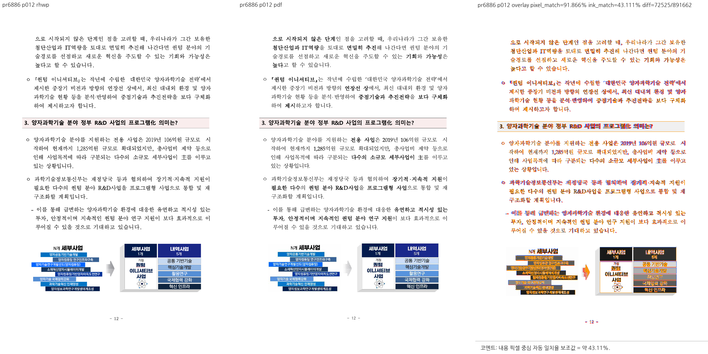

### #6890 물리 1쪽

편집 안내문구는 인쇄 PDF에서 생략됨.

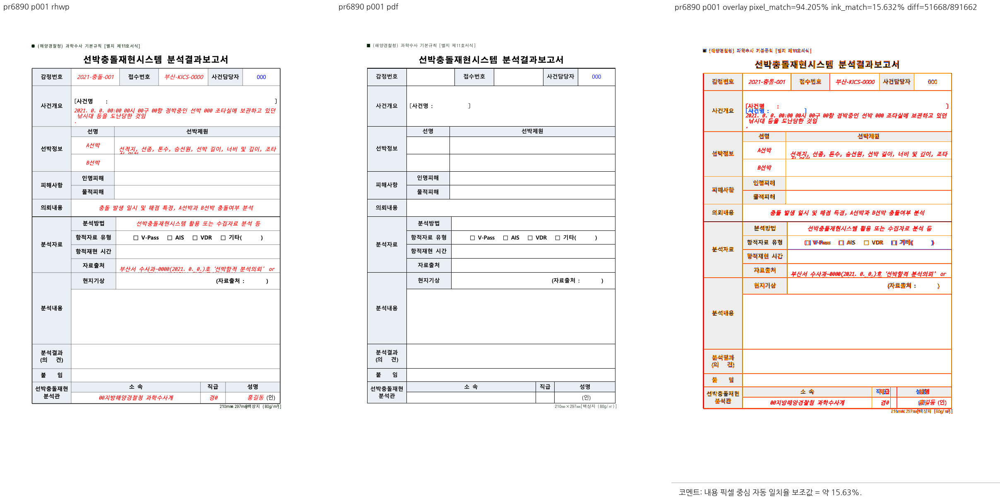

### #6897 물리 1쪽

오른쪽 가시 테두리 확인; 제목 대체 글리프 잔존.

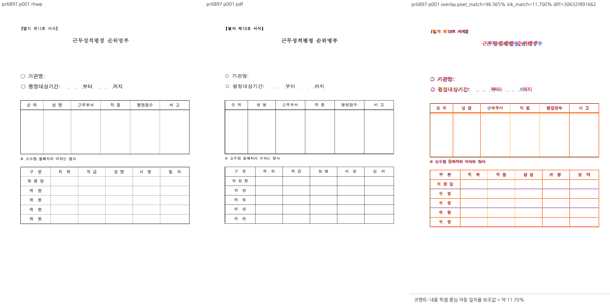

### #6898 물리 7쪽

두 그림의 위치 대조; 제목·선 잔차.

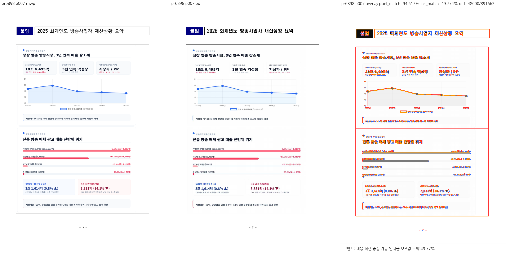

### #6910 물리 4쪽

포스터 전체 표시; 셀 프레임·패딩 잔여.

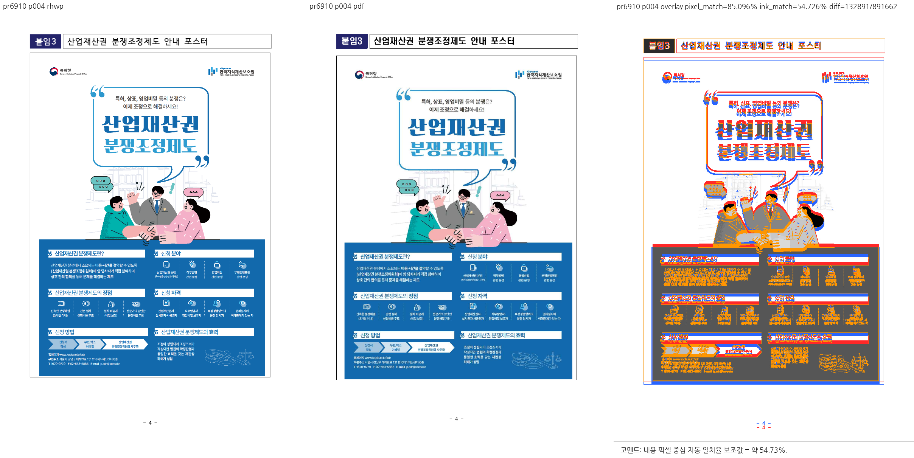

### #6915 물리 1쪽

머리 표 대조; 미세 선 두께는 수치·확대 증적 병행.

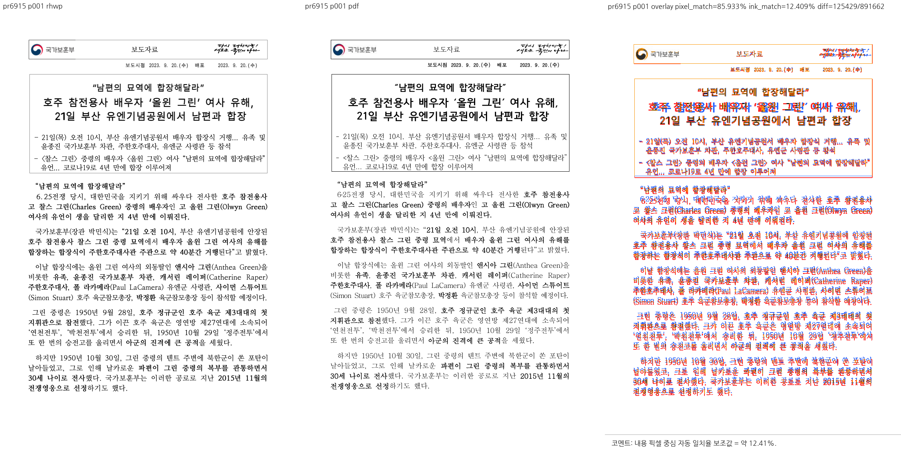

### #6917 물리 8쪽

공정도가 설명문 아래에 배치됨.

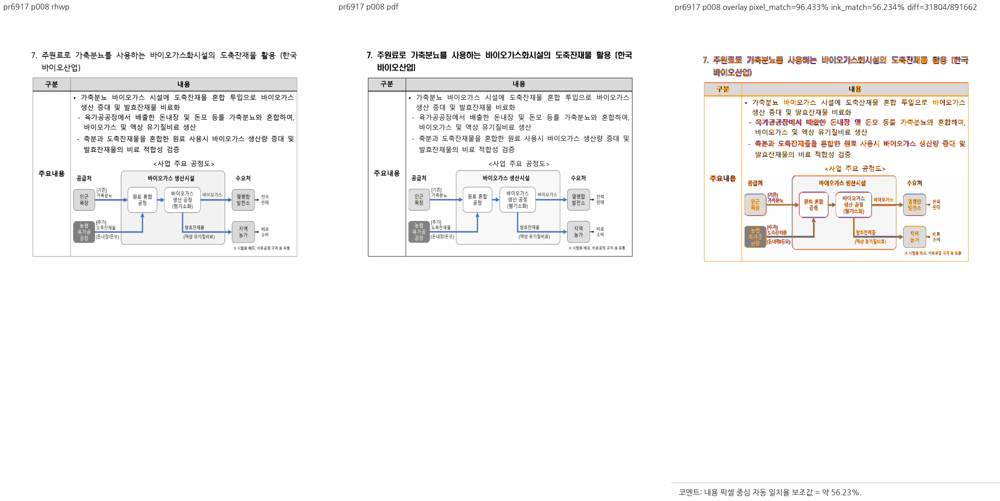

### #6926 물리 5쪽

기존 본문 흐름·글꼴 차이는 남는다. 변경 전후 대조와 전용 회귀를 통과한 가로 여백 계약만 수용한다.

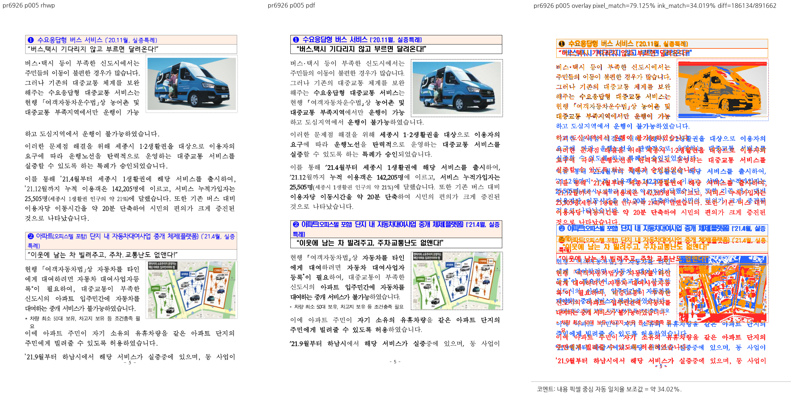

### #6926 물리 7쪽

목표 x 재현, 텍스트 재현 잔여.

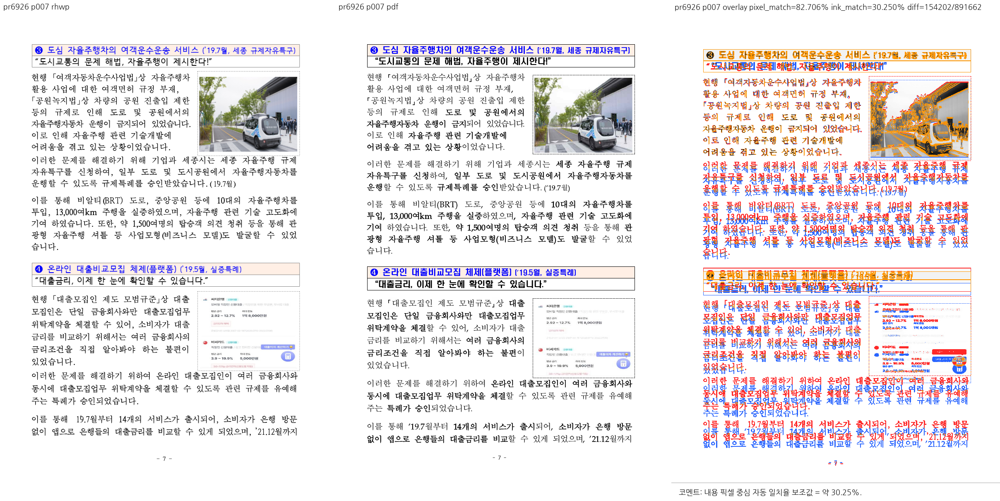

### #6926 물리 9쪽

본문 하단 넘침은 #6926을 제거한 대조본에도 동일하다. 가로 여백 계약은 수용하되 전체 본문 재현이 해결됐다고 주장하지 않는다.

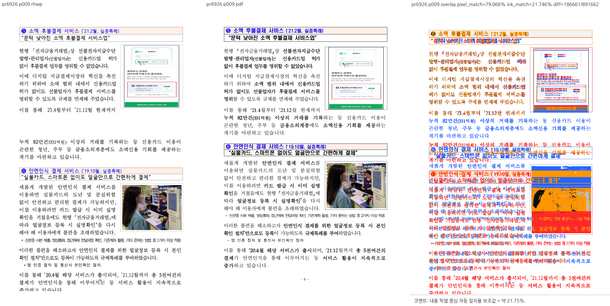

### #6932 물리 2쪽

최소 사각형의 큰 밀림 해소; 작은 위치 차이.

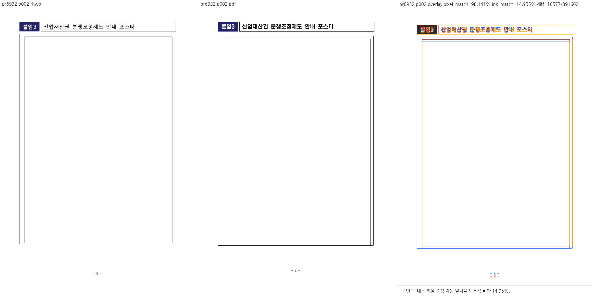

## #6931 WMF 정렬의 현재 산출

원본 `148726703_sjcu1112.hwp`의 물리 6쪽을 산출했다. 문서 내부에 찍힌 쪽수는 `-2-`다.
전체 87쪽이며 이번 직접 시각 확인은 물리 6쪽에 한정한다.
차트 제목은 테두리 아래에 있고, 본문의 일부 굵은 글자는 대체 글리프로 남아 있다.
새 한컴 PDF 또는 Windows GDI+ 산출물이 아니다.

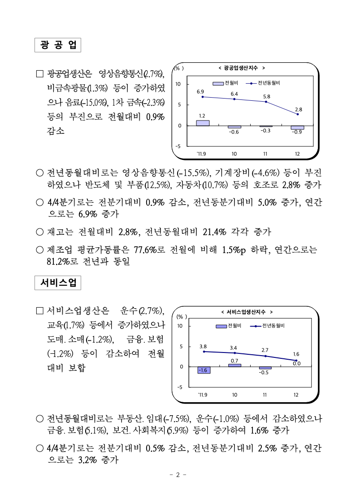

공식 계약은 [MS-WMF TextAlignmentMode Flags 2.1.2.3](https://learn.microsoft.com/en-us/openspecs/windows_protocols/ms-wmf/2cf0d802-5db7-42f6-bb75-50ff195a6c7c)를 확인했다.
기여자가 제공한 [확대 이미지](../../../mydocs/report/6919-wmf-default-text-align/crop-after.png)는 제공 증적으로 별도 취급한다.

## #6905와 #6906의 비이미지 계약

- #6905: 새 WASM과 Chrome에서 로드/리사이즈 후 scrollTop 0→0, 사용자 스크롤 뒤 600→630을 실제 측정했다. 정지 이미지로 스크롤 동작을 대신 증명하지 않는다.
- #6906: 문자 정본은 제공된 한컴 HWPX다. U+25A1 보존·정상 서로게이트 쌍 유지 회귀가 통과했다. PDF의 글리프 모양을 문자열 정답으로 취급하지 않는다.
- #6915의 600dpi [기여자 확대 대조](../assets/issue6913/border-width-grid.png)는 직접 열어 확인했지만 16종 MCP 실험을 이번에 다시 수행한 것은 아니다.

## #6926 새 전체 기준 PDF의 출처

- 원본: `/Users/tsjang/Downloads/korea_downloads/중소벤처기업부/156492236_220119_(보도참고자료)_규제샌드박스_시행_3주년(규제자유툭구단).hwpx`.
- 원본 SHA-256: `af198ad2dff0c1ad0458d7147ca8fcf42b45b0d2e5ceb2e10353debc8250a5b9`.
- 기존 PDF 두 개는 `pdf/issue3820/`, `pdf/issue4090/`의 축약본이므로 전체 문서 정본으로 대용하지 않았다.
- 비동기 MCP `start → status → download`, engine `2020`, 한컴 버전 `12.0.0.4605`, 43.202초, 전처리 없음.
- 결과: [전체 기준 PDF](../../../pdf/156492236-regulatory-sandbox-full-2020.pdf), 17쪽, 926,826 bytes.
- PDF SHA-256: `54139a4760f911f57861f33920f5755e07eee85c1cf2cfedfd6c272e25a5c3e9`.
- 서버 URL·토큰·비공개 환경 파일 내용은 기록하지 않는다.
- x 수치 재현과 roundtrip PASS만으로 전체 PDF 일치를 주장하지 않는다. 9쪽 본문 넘침은 A/B로 확인한 기존 잔여이며 #6926의 가로 여백 변경을 보류하는 근거로 사용하지 않는다.

## 다른 새 적용 자료의 식별

| 대상 | 원본 SHA-256 | 제공 기준 PDF SHA-256 |
| --- | --- | --- |
| #6915 | cebb9069b4ab6755ad0ec660c4cc5015aa8f98f23d004f3f6448199fd1fe0ebe | 23a09fc3c5604cc06edaa40358c569b94fd79d8b74e71d99ac33f0abf3631c8d |
| #6917 | 424f0264dcf10740d086b769f1e388cd7bd1b3e1a3cd2b140b93715a60b1eae6 | 36ba72a6d4d4d70aed82868604aa3b3b14600df05a2279b47b8954b2a8b1941f |
| #6932 | 36b0d159391dc8f96006a56fd6a146d9b229f05749e5a1420eb42548607f15e9 | 5abcb97b4706495b442357c811239393c45e81543aef88a2dd54e5274e75958b |

#6931 원본 HWP의 SHA-256은 `d85750184265ea2e264b73bbdc6879efb054fe01842003f3750794805d4c5abc`다.
기존 기준 PDF는 재변환하지 않았다.

## 보관·댓글 사용 계획

최종 비교 PNG 11개와 #6931 현재 PNG 1개, 새 전체 기준 PDF만 증적 보관 대상으로 추가한다.
임시 SVG, 렌더 트리 JSON, 지표 JSON, 원시 로그와 브라우저 임시 스크립트는 커밋 대상이 아니다.
각 개별 리뷰는 실제 물리 페이지·입력·기준 PDF 및 원 PR별 댓글 계획을 포함한다.
merge 후에는 실제 증적 commit SHA를 고정한 raw 이미지 링크로 PR·이슈 댓글에 직접 표시한다.
현재는 로컬 준비 상태이며 GitHub에 이미지·댓글이 게시됐다고 주장하지 않는다.
