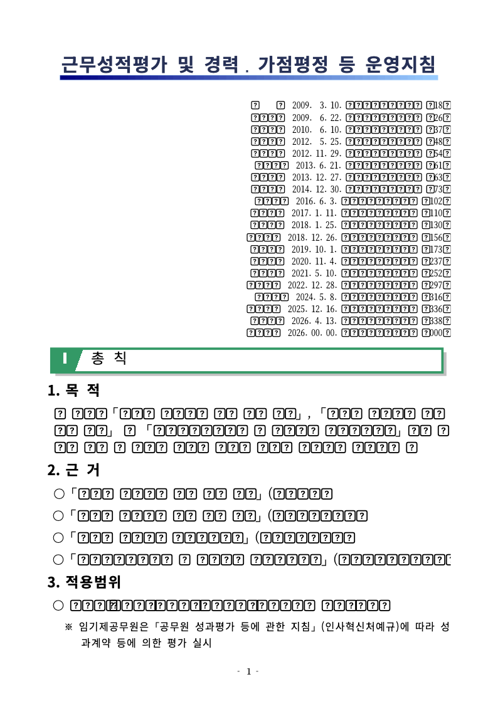
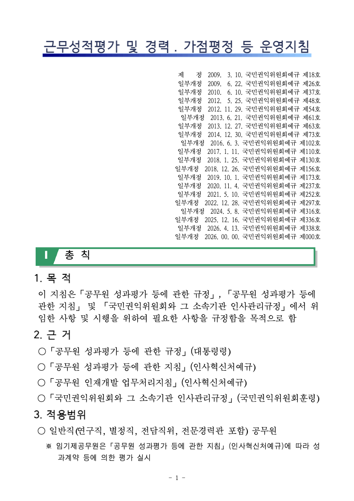

# PR #6893 검토 기록

## 판정: 보정 완료, 수용 가능

- 대상: [PR #6893](https://github.com/edwardkim/rhwp/pull/6893), [Issue #6891](https://github.com/edwardkim/rhwp/issues/6891).
- 경로: collaborator self-merge. 원격 owner reviewer를 자동 지정하지 않는다.
- 구현·증적 커밋: `2b2bff3bb`. 이 문서는 같은 PR의 trailing commit이다.
- 로컬 검토는 통과했다. 최종 head의 원격 CI는 이 기록 작성 시 미확인이다. CI 통과나 머지 완료로 기록하지 않는다.

## 원인과 보정

기존 `scripts/rasterize-svg-webfonts.mjs`가 SVG의 모든 `@font-face`를 제거해 `export-svg --font-style`에서 제공하는 로컬 별칭과 휴먼명조의 안전한 대체 순서를 잃었다. 기존 단위 테스트도 이 삭제 동작을 요구하고 있었다.

보정은 원래 선언을 보존하고 동일 family의 웹폰트 재공급을 제외한다. 텍스트의 최종 한글 fallback은 유지하지만 단일 family만 받아야 하는 `@font-face` descriptor는 변경하지 않는다. 실제 런타임 호출자는 Visual Sweep이며 Studio, Rust 렌더러, 전역 폰트 규칙과 rasterizer 기본 선택은 변경하지 않았다.

## 수행한 검증

| 항목 | 실제 결과 |
| --- | --- |
| JavaScript 단위 테스트 | `node --test scripts/tests/rasterize-svg-webfonts.test.mjs`, 6개 통과 |
| 실제 Chrome 캡처 | `VISUAL_SWEEP_CHROME="/Applications/Google Chrome.app/Contents/MacOS/Google Chrome" python3 -m unittest scripts.tests.test_webfont_raster_viewport`, 1개 통과, 1배·2배의 네 모서리 보존 |
| JavaScript 구문 검사 | 변경한 구현·테스트 파일 `node --check` 통과 |
| 공백 검사 | `git diff --check` 통과 |
| 시각 대조 | 기존 동일 SVG의 물리 7쪽을 새 helper로 96 DPI 재래스터화. 기존 PNG·한컴 PDF 7쪽과 직접 대조, 한글 본문의 네모 물음표 해소 확인 |
| Chrome 실제 폰트 | CDP `CSS.getPlatformFontsForNode`로 휴먼명조 지정 표본 `제`의 실제 폰트 `AppleMyungjo`, glyphCount 1 확인 |

## 시각 증적과 재현 범위

- 입력: [113424_evaluation_guideline.hwpx](../../../samples/issue6551/113424_evaluation_guideline.hwpx), 물리 7쪽. 문서에 인쇄된 쪽 번호는 1이다.
- 기존 기준: [한컴 2024 PDF](../../../pdf/113424_evaluation_guideline-2024.pdf), 46쪽. 새 PDF를 만들지 않고 기존 정본을 사용했다.
- 이번 재산출은 저장된 SVG를 재사용하여 Rust 재빌드·레이아웃 재계산을 섞지 않은 래스터화 단계 검증이다.
- 입력 SHA-256: `21cf24446bcf558c62b715965a62e8d656e9dcd64e8b071b110f571cc3fb81e0`.
- PDF SHA-256: `f2db782bb42cabd2b96cd8985415554803ad7d4322904177a9e1bc903115bf6d`.
- 동일 SVG SHA-256: `ded69e439982c79530575b96d0b6979298aaba5168a60c280d567e1c5e7fb006`.
- 수정 전 PNG SHA-256: `16185e809108f414bab0480bb6ec336836e60b8da33e755f4d45dde8eb3bee05`.
- 수정 후 PNG SHA-256: `be3c775005e99826724dafd0e3395a02d7201a11ba7e217c1550dfb18d3046fd`.

### 수정 전

### 수정 후

## 검증 한계

46쪽 전체 및 다른 문서 전체를 재검증하지 않았다. Chrome 표본 한 글자의 폰트 결과를 전체 문자에 일반화하지 않는다. 안전한 로컬 대체 폰트를 사용하므로 한컴 원래 서체와의 굵기·형상 차이 및 제목 배치 차이는 남을 수 있다. Studio와 픽셀 단위 동등성을 입증한 결과가 아니다. 이 PR은 본문 글리프 깨짐을 유발한 검증 도구의 선언 삭제 문제를 해결한다.

Rust 소스는 변경하지 않았으므로 Rust 전체 회귀 테스트·WASM 빌드는 수행하지 않았다. 임시 SVG·HTML·JSON·로그는 커밋하지 않으며, 코멘트에 직접 사용할 최종 PNG 두 장만 추가했다.

## PR·이슈 후속 코멘트 계획

`post_merge.md`에 따라 최종 head PR CI 및 merge SHA의 devel CI가 통과한 뒤 처리한다. 현재는 실행하지 않았다.

- #6891의 실제 자동 close 여부와 기존 댓글을 확인한다. 같은 merge SHA의 후속 댓글이 있으면 중복 등록하지 않는다.
- UTF-8 body file로 원인, 보정, 위 로컬 테스트, 실제 PR/devel CI, 7쪽 검증 범위를 기록한다.
- 이 문서 및 기존 PDF를 최종 merge SHA에 고정한 링크로 연결한다.
- `https://raw.githubusercontent.com/edwardkim/rhwp/<merge-sha>/mydocs/pr/assets/issue_6891_visual_sweep_fonts_20260908/before-p007.png`와 `after-p007.png`를 Markdown 이미지로 삽입해 댓글 안에서 직접 비교할 수 있게 한다.
- 게시 뒤 API로 본문을 재조회한다. 로컬 검토 결과를 원격 CI 성공으로 대체하지 않는다.
- PR #6893에는 병합된 self-review와 실제 CI를 중복 없이 확인한다. 다른 원 PR·이슈를 다시 닫거나 댓글을 반복하지 않는다.
