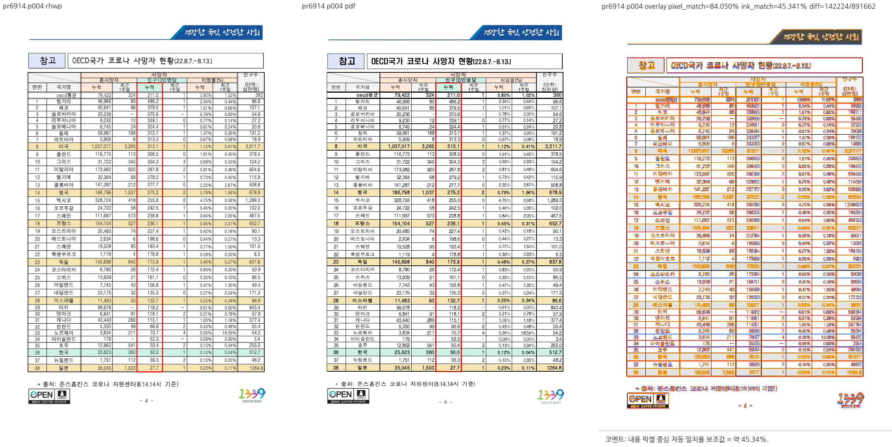
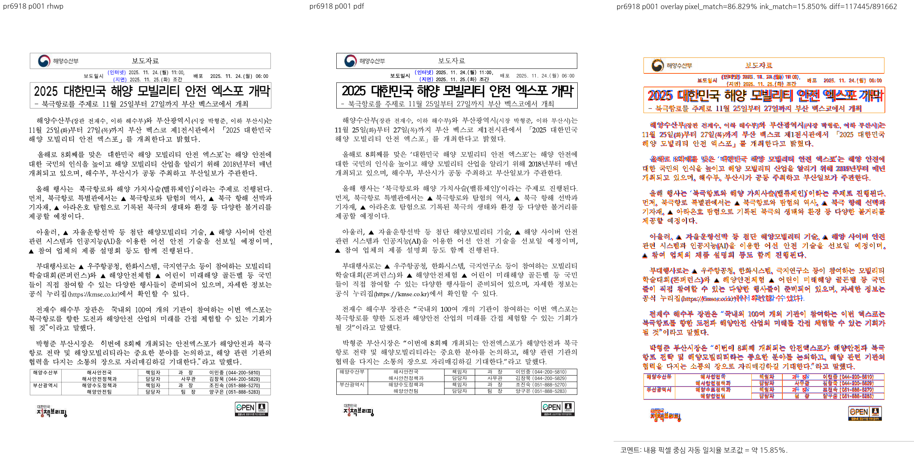

# PR #6914·#6918 직접 시각 대조

## 검증 상태

- 날짜: 2026-09-09, macOS, Chrome webfont rasterizer, 96dpi, pixel threshold 32.
- 통합 HEAD: `3d382f53f9167a9d18b74bfc07820e4eeb6d5700` 및 미커밋 #6914 보정.
- 검증 layout blob: `d65d0fd850972913ca77955c2d0ec5f49821a3fa`.
- 바이너리: `target/pr-review/release-test/rhwp`.
- 바이너리 SHA-256: `dadf5abe13b441aa9379d5f8cc61846b676e67abe431f1ca5c27ddbaf7638972`.
- 집중 테스트 빌드 후의 바이너리를 명시적으로 사용했다. 오래된 기본 debug 바이너리를 사용하지 않았다.
- [Visual Sweep 정본](../../manual/verification/visual_sweep_guide.md#github-merge-comment)을 따랐다.

## 원본과 기준 PDF

| PR | 역할 | 경로 | 확인 SHA-256 |
| --- | --- | --- | --- |
| #6914 | 원본 HWP | `samples/issue6900/156521182-covid-press-clarification.hwp` | `165f4a2b98fc1740f4a453c7f3fd1a964666d585cb89ea2dd4b2b0ba9dbb7e7a` |
| #6914 | 2020 기준 PDF | `samples/issue6900/pdf/156521182-covid-press-clarification-2020.pdf` | `e98065c932702775fbff8b8afff4136915d02802fb5cf0ca74bcc1433cb938dd` |
| #6918 | 원본 HWPX | `samples/issue6888/156730935-marine-mobility-expo.hwpx` | `6fa11e6a8d3be9289d23a1f861e9833e5b2473b63d0f4b5bf6092feb164aac21` |
| #6918 | 2024 기준 PDF | `samples/issue6888/pdf/156730935-marine-mobility-expo-2024.pdf` | `c50925420f79d6b78c775e290accf1e1bb30422c886818d7e64b75a402a29dc1` |

첨부 PDF 원본은 각 `samples/issueN/pdf/` 아래에 보존하고 그대로 기준으로 사용한다.
새 MCP 변환은 하지 않았다. 처음 루트 `pdf/`에 추가했던 동일 사본 2개는 사용자 지시에 따라
SHA-1과 PDF version을 확인한 뒤 제거했다. 첨부 원본과 대표 비교 PNG는 유지한다.

| 첨부 PR | 첨부본/사본 공통 SHA-1 | PDF version | 페이지 수 | 처리 |
| --- | --- | --- | --- | --- |
| #6914 | `bdab63f2fceb0d451406f08db6ecb8f691ad8e0d` | 1.6 | 4 | 첨부본 재사용, 검토 중 추가한 동일 사본 제거 |
| #6918 | `80fafdb6665ff0aba3d96cb126a83331b529c9f4` | 1.6 | 2 | 첨부본 재사용, 검토 중 추가한 동일 사본 제거 |

실제 SHA-256도 원 manifest와 일치했다. 아래 비교 명령은 처음부터 첨부본 경로를 사용했으므로
중복 사본 제거로 기존 시각 대조 결과가 바뀌지 않는다.
저장 제품/engine 정보는 원 manifest의 Hancom 2018→2020, Hancom 2024→2024 기록에 근거하며,
이번에 MCP 서버의 생성 이력을 독립 재인증한 것은 아니다. pdfinfo로 4쪽/2쪽 및 A4를 확인했다.

## 실행

```bash
venv/bin/python scripts/visual_sweep.py \
  --rhwp-bin target/pr-review/release-test/rhwp --key pr6914 \
  --hwp samples/issue6900/156521182-covid-press-clarification.hwp \
  --pdf samples/issue6900/pdf/156521182-covid-press-clarification-2020.pdf \
  --page 4 --out /tmp/rhwp-6914-6937-visual-20260909
venv/bin/python scripts/visual_sweep.py \
  --rhwp-bin target/pr-review/release-test/rhwp --key pr6918 \
  --hwp samples/issue6888/156730935-marine-mobility-expo.hwpx \
  --pdf samples/issue6888/pdf/156730935-marine-mobility-expo-2024.pdf \
  --page 1 --out /tmp/rhwp-6914-6937-visual-20260909-pr6918
```

두 실행 모두 종료 코드 0. SVG/render-tree 전수 export는 각각 4쪽/2쪽이며, PDF 실제 총쪽수와
같다. raster와 직접 시각 대조는 각각 지정한 1쪽만 수행했다.

| PR | 대조 쪽 | 자동 후보 | pixel match | ink / visual proxy |
| --- | --- | --- | --- | --- |
| #6914 | 4쪽 | 0/1 | 84.04956% | 45.34051% |
| #6918 | 1쪽 | 0/1 | 86.82853% | 15.84985% |

## 직접 확인한 결과

#6914: 출처 줄이 표 아래와 꼬리말 로고 사이에서 판독 가능하며 로고에 가리지 않는다.
표 마지막 행도 유지된다. 집중 테스트에서 출처 줄과 뉴질랜드/일본 행 위치를 함께 확인했다.



#6918: 담당자 표 전체가 본문 안에 표시되고 도형은 표 아래에 남는다. 담당자 표와 도형
위치 각각의 집중 테스트가 통과했다.



두 패널의 라벨과 한글 본문은 판독 가능했다. 글꼴·자간·굵기·미세 위치 차이는 남는다.
proxy는 내용 픽셀 일치율이지 정확도 점수가 아니며, 후보 0은 전체 문서 무결성/동일성의 증명이 아니다.
#6914의 별도 3문서 악화 A/B는 이 기록의 확인 범위에 포함하지 않는다.

## 보존과 코멘트

직접 연 대표 review PNG 2개만 `mydocs/pr/assets/pr_6914_6937_20260909/`에 보존한다.
원시 PNG, SVG, render-tree/metric JSON, 로그는 위 /tmp 경로에만 두고 커밋하지 않는다.
각 PR review의 comment 계획대로 merge SHA 고정 raw URL로 대표 PNG를 표시하며, 실제 대조 범위와
위 지표/한계를 함께 적는다. 임시 경로를 GitHub의 영구 증적 링크로 사용하지 않는다.
