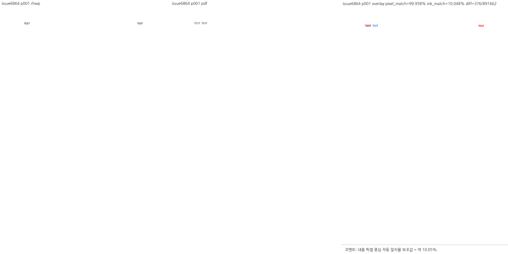
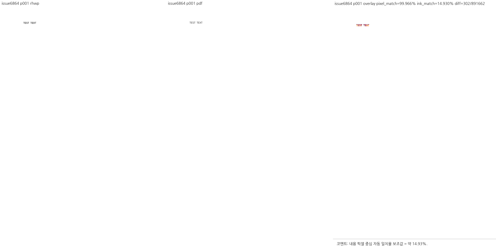

# PR #6962 검토: 머리말 양쪽 정렬과 HWP3 호환성

## 판정: 승인

[#6864](https://github.com/edwardkim/rhwp/issues/6864)의 짧은 머리말이 페이지 폭으로 벌어지는 결함을 수정했고, HWP3의 서로 다른 정렬 의미를 보존했다. 아래 로컬 검증과 코드 후보 CI가 모두 통과했다. 이 판정은 명시한 변경 범위에 대한 승인이다. 문서 trailing head의 CI, 병합 및 devel CI 완료를 선기록하지 않는다.

## 검토 대상과 경로

- PR: [#6962](https://github.com/edwardkim/rhwp/pull/6962), 작성자·검토자 `jangster77`, 2026-09-10 KST.
- 경로: collaborator self-merge. 별도 reviewer나 저장소 owner를 자동 지정하지 않았다.
- base: `devel`, `a3cd825c23d550e0c5f46b4e2eb3735a537f23f2`.
- 검증 코드 후보: `14df452d8f1114223d8082f9063a414a73e8274f`.
- 구현 `9daf72099` 후 devel 병합 `ba39385ad6664743113dc445697432d5316de7a5`, 호환성 보정 `14df452d8` 순서다. 기존 실패를 숨기기 위한 rebase나 baseline 완화는 하지 않았다.
- 이 문서와 [오늘할일](../../orders/20260910.md)은 코드 후보 CI 완료 후 같은 source branch의 문서 전용 trailing commit에 추가한다.

## 원인과 보정

1. 저장 줄 정보가 있는 머리말·꼬리말이라는 이유로 `Justify`의 마지막 줄까지 강제 분배하던 renderer 예외를 제거했다. 일반 양쪽 정렬의 마지막 줄은 자연 폭을 유지한다.
2. 초기 호환성 보정은 모든 HWP3 머리말의 `Justify`를 `Split`으로 바꿔 #5554 회귀를 일으켰다. 이 일괄 변환을 제거했다.
3. 실제 원본 바이트에서 `SO-SUEOP.hwp` 머리말 정렬값은 `7`, `hwp3-sample11.hwp`는 `6`이었다. 기존 파서는 두 값을 모두 기본 `Justify`로 처리했다.
4. 원값 `6`은 `Justify`, `7`은 `Split`으로 명시적으로 매핑하고, `7`의 `KEEP_WORD`도 보존했다. 파일명·특정 문구·머리말 위치를 조건으로 삼지 않는다.
5. 한컴 `engine 2020` 재변환으로 sample11의 `JUSTIFY/KEEP_WORD`와 SO-SUEOP의 `DISTRIBUTE_SPACE/KEEP_WORD`를 확인했다. 공개 형식 문서도 HWP3 정렬 필드의 유효 범위를 0~7로 명시한다. 상세 매핑의 근거는 실제 한컴 변환 대조다.

관련 코드: [`paragraph_layout.rs`](../../../src/renderer/layout/paragraph_layout.rs), [`hwp3/mod.rs`](../../../src/parser/hwp3/mod.rs), [`issue_6864_header_justify.rs`](../../../tests/cases/issue_6864_header_justify.rs), [`issue_1692.rs`](../../../tests/issue_1692.rs).

공식 자료: [한컴 HWP 3.x 형식, 5절 문단 모양 자료 구조](https://cdn.hancom.com/link/docs/%ED%95%9C%EA%B8%80%EB%AC%B8%EC%84%9C%ED%8C%8C%EC%9D%BC%ED%98%95%EC%8B%9D3.0_HWPML_revision1.2.pdf).

## 실제 로컬 검증

macOS에서 전용 `CARGO_TARGET_DIR=target/issue6864-header-justify-20260910`를 사용했다. Cargo 작업은 순차 실행했고 회귀 테스트 thread는 8개다.

| 항목 | 실제 결과 |
| --- | --- |
| #1692·#5554·#6864 집중 회귀 | 15개 통과 |
| 전체 회귀 | 9,385개 통과, 실패 0, skip 46개, 297.463초 |
| 신규 sample 보안 회귀 | 실제 HWP 1개를 입력으로 전달, hidden/injection/unicode 탐지기 검사 통과 |
| fmt | 통과 |
| native·WASM32·workspace all-target Clippy | 모두 통과 |
| workspace build | 통과 |
| suite manifest·source-side 정책 | 통과, source-side 4,205개/298개 모듈 |
| Native Skia library | 4,112개 통과, ignored 13개 |
| Native Skia PNG·직접 PDF 회귀 | 각각 2개·4개 통과 |
| 실제 WASM 빌드 | 통과, wasm-opt 완료 |
| 실제 WASM API | 원본 HWP·HWP 왕복·HWPX 왕복 3개 통과, 모두 1페이지·머리말 폭 63 |
| Visual Sweep | 1/1페이지 산출·대조, 누락 0 |

전체 회귀 실행:

```sh
RHWP_SECURITY_SWEEP_SAMPLES_JSON='["samples/issue6864/header-justify.hwp"]' \
CARGO_TARGET_DIR=target/issue6864-header-justify-20260910 \
cargo nextest run --locked --cargo-profile release-test \
  --tests --no-fail-fast --test-threads 8
```

전체 회귀의 기존 #5554 기대값을 완화하지 않았다. 기존 실패 이후 보정한 전체 검증이 위 결과다. 마지막 WASM 검증에서 임시 스크립트가 `pageCount()`를 속성으로 취급한 오류는 스크립트만 수정하고 3개 모두 재실행해 통과했다.

Studio·npm·편집 command 변경이 없어 별도 Studio E2E는 실행하지 않았다. WASM API의 실제 열기·저장·재열기는 실행했다. 전용 성능 벤치마크는 추가 측정하지 않았으며 속도 개선을 주장하지 않는다.

## 코드 후보 GitHub CI

다음은 모두 `14df452d8f1114223d8082f9063a414a73e8274f`의 결과다.

- [CI](https://github.com/edwardkim/rhwp/actions/runs/34376371990): preflight, Lint, Native Skia, archive A/B/C/D 빌드 및 실행 worker, Frontend package gates, `Build & Test` 성공.
- [CodeQL](https://github.com/edwardkim/rhwp/actions/runs/34376371887): Python·JavaScript/TypeScript·Rust 분석 및 최종 `CodeQL` 체크 성공. Rust 분석 중의 일시적 `NEUTRAL`은 최종 성공으로 전환됐다.
- [Render Diff](https://github.com/edwardkim/rhwp/actions/runs/34376371675): preflight와 Canvas visual diff 성공.
- [Adapter inter-diff](https://github.com/edwardkim/rhwp/actions/runs/34376371908), [Proptest](https://github.com/edwardkim/rhwp/actions/runs/34376371902): preflight·실행 worker 성공.
- [CI Impact Policy](https://github.com/edwardkim/rhwp/actions/runs/34378094574): 성공.
- 별도 WASM Build, Frontend unit gates, Workflow promotion preflight, devel용 duration refresh는 해당 PR 실행 정책에 따른 skip이다. 실제 WASM 빌드 검증은 로컬 결과와 구분한다.
- 문서 작성 직전 `MERGEABLE/CLEAN`, pending·failure·cancelled 없음. 문서 trailing head는 다시 CI를 확인한다.

## 시각 증적 및 원본 출처

- 공개 원본: [header-justify.hwp](../../../samples/issue6864/header-justify.hwp), [출처 기록](../../../samples/issue6864/README.md). #6864 본문의 공개 Drive 원본을 변경 없이 저장했다.
- 원본 SHA-256: `257d44ccb7a48315e5e799c18db0f0117a2fcccb7807ac99f27d5d3a6d7fe5f7`.
- 기준: [한컴 PDF](../../../pdf/issue6864-header-justify-2020.pdf), 1페이지. 마지막 저장 제품 Hancom Office 2020 `11.0.0.1623`에 맞춰 MCP `engine 2020`을 사용했다.
- MCP PDF job `d56fa213-aa63-41c1-a640-1669f9260c97`: succeeded, 다운로드 SHA 확인. Creator Hwp 2022 / Producer Hancom PDF 1.3.0.550, PDF 1.6.
- PDF SHA-256: `7fde631eaf2903f6409ec988541097fd3e9b7387c3798274a3cf1ec16154cd82`.
- HWP3 한컴 HWPX 교차 대조 job: sample11 `7769b9ef-4f81-401e-a830-2092064a3d3f`, SO-SUEOP `a81b6dba-b286-4869-9c41-239bb5122343`. 모두 succeeded이며 기존 공개 HWPX의 해당 머리말 정렬과도 일치했다. 임시 변환 중간물은 커밋하지 않았다.
- 비교 범위: 같은 원본의 1쪽 전체, rhwp / 한컴 PDF / overlay. 수정 전 비교 바이너리는 base `d8e4ab727b70b6abfcf11766134e09a9a9bfc982` 기준이며 수정 후는 최종 호환성 보정 코드 기준이다.
- 머리말 `TEST TEXT`: `{x:113.4,y:75.6,w:567,h:12}` → `{x:113.4,y:75.6,w:63,h:12}`. 페이지 폭으로 벌어지는 현상이 해소됐다.
- 수정 전/후 자동 후보는 모두 0/1이다. 따라서 후보 0이라는 사실만 승인 근거로 사용하지 않고, 실제 이미지와 렌더 트리 폭을 확인했다.
- 수정 후 픽셀 일치율 약 99.966%, 잉크 일치율 약 14.93%. 빈 페이지의 높은 픽셀 일치율을 과대 해석하지 않는다. 글꼴·래스터·미세 좌표 차이는 남으며 전체 픽셀 동일성은 승인 범위가 아니다.





- before PNG SHA-256: `0c4bbb708d351d122865a6d29f762807313ef63df60c4e8117b5b8485cfad7f8`.
- after PNG SHA-256: `427ea84567228317d52e0055ea3f7ddc10de35dc07a59ec8b34ce1a8d66983e7`.
- 커밋 대상은 원본 sample·기준 PDF·위 대표 PNG뿐이다. `.log`, 중간 SVG/JSON, 연락판 등 임시 산출물은 제외했다.

## Merge 후 contributor PR comment 계획

1. 문서 trailing head의 CI와 `MERGEABLE/CLEAN`을 확인하고 일반 merge commit으로 병합한다. merge SHA의 devel CI까지 성공 또는 정책상 expected skip임을 확인한 뒤 댓글을 게시한다.
2. [Visual Sweep GitHub merge comment 지침](../../manual/verification/visual_sweep_guide.md#github-merge-comment)을 명시한다. 같은 원본 1/1페이지, 자동 후보 0/1의 한계, 실제 폭 567→63, 글꼴·래스터 잔여 범위를 기록한다.
3. 실제 merge SHA로 고정한 `https://raw.githubusercontent.com/edwardkim/rhwp/<merge-sha>/mydocs/pr/assets/issue6864-header-justify-20260910/before-p001.png` 및 `after-p001.png`를 Markdown 이미지로 직접 표시한다. 기준 PDF와 이 archive review도 merge SHA 고정 링크로 연결한다.
4. PR #6962와 Issue #6864에 실제 merge SHA, PR 코드·문서 head CI, devel CI 결과를 구분해 기록한다. issue 신고자 `musicmark`에게 제보에 감사한다. 같은 merge SHA의 기존 댓글이 있으면 중복 등록하지 않는다.
5. PR 본문에는 `Closes #6864`가 있다. devel 대상 PR의 GraphQL closing references는 조회 당시 비어 있었으므로 자동 종료를 추정하지 않는다. Close Issues 실행과 실제 issue 상태를 API로 확인하고, OPEN이면 승인된 수동 close를 수행한다. #1692·#5554는 호환성 검증 대상으로만 언급하고 종료하지 않는다.
6. UTF-8 body file의 `--body-file`로 게시한 뒤 API로 본문·이미지 링크·한글 보존을 확인한다. 확인하지 않은 post-merge 재사용 성공을 주장하지 않는다.
7. clean devel과 merge 포함, 실행 중인 작업 부재를 확인한 뒤 이번 local/upstream 임시 branch와 전용 target만 정리한다. 기본 작업공간·공유 `target/pr-review`·다른 작업의 브랜치와 target은 보존한다.

병합 후 확정되는 SHA·CI·종료 상태는 위 댓글에 기록한다. 문서만을 위한 별도 후속 PR은 만들지 않는다.
