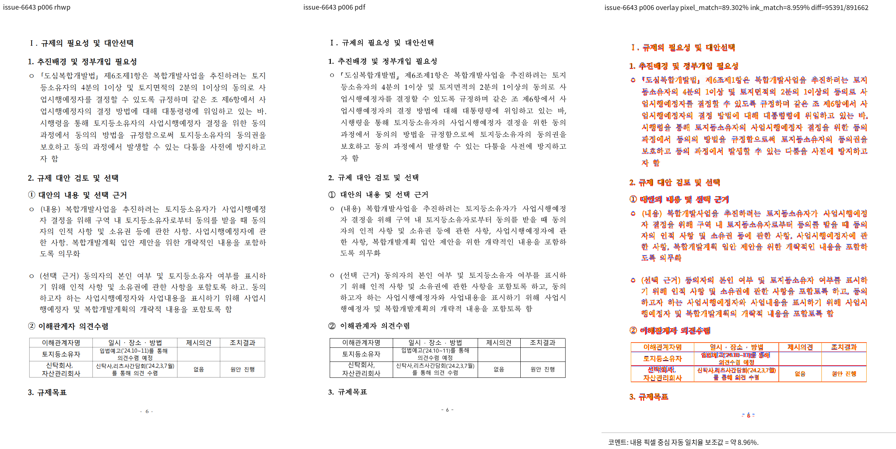

# PR #6979 self-review: #6643 블록 래퍼 표 수평 여백 보정

## 식별과 판정

- PR: https://github.com/edwardkim/rhwp/pull/6979
- 관련 이슈: Refs #6643. 전체 해결이 아니므로 자동 종료 키워드를 사용하지 않는다.
- 작업일/환경: 2026-09-10, Ubuntu Linux, 96 DPI, webfont rasterizer.
- 경로: collaborator self-review. 외부 reviewer를 지정하지 않으며 GitHub approve를 대신하지 않는다.
- 브랜치: `fix/6643-wrapper-margin-20260910`, push 대상 `upstream`.
- 검증 기준: `a3cd825c23d550e0c5f46b4e2eb3735a537f23f2`.
- 검증한 코드 후보: `7415b6f1d3931ea212a719232a3404401ad2d88c`.
- 판정: **승인 (수평 보정 범위의 self-review)**. GitHub CI 완료와 작업지시자의 최종 시각·merge 승인은 별도이며 아직 완료되지 않았다.
- PR 생성 시 base는 `0d36da4096fab2fef0e0a654e466fa449330d7a6`으로 전진했다. 당시 API 결과는 `mergeable: true`, `mergeable_state: blocked`였다. 최신 base 위 재검증이나 CI 성공을 뜻하지 않는다.
- 검증 코드 이후 Rust 변경 없이 문서와 대표 PNG만 trailing commit으로 추가한다. PR 게시를 위해 로컬 테스트를 반복하거나 rebase하지 않았다.

## 수정 범위

`src/renderer/layout/table_layout.rs`에서 원본 HWP의 최상위 1x1 블록 래퍼를 풀 때 `Column | Para` 기준 왼쪽 바깥 여백을 보존한다. 재귀 helper가 이미 적용한 여백을 전달하여 중복 가산을 막는다. inline, depth, profile, offset 및 정렬·배치 조건은 제한하며 세로 위치는 변경하지 않는다. 테스트 source와 baseline 기대값은 바꾸지 않았다.

## 로컬 검증 결과

아래 단계는 기존 검증에서 순차 실행하여 모두 exit 0으로 종료했다. 문서 후속 commit에서는 다시 실행하지 않는다.

```bash
node scripts/rust-test-suite-manifest.mjs --prepare
cargo fmt --all -- --check
cargo clippy --locked --target-dir target/pr-review -- -D warnings
cargo clippy --locked -p rhwp --lib --target wasm32-unknown-unknown --target-dir target/pr-review -- -D warnings
cargo build --locked --workspace --target-dir target/pr-review
cargo clippy --locked --workspace --all-targets --target-dir target/pr-review -- -D warnings
node scripts/rust-test-suite-manifest.mjs --check
cargo nextest run --cargo-profile release-test --target-dir target/pr-review --tests --test-threads 12 --no-fail-fast
```

- 전체 회귀: **9,383 passed, 46 skipped, 5 slow**, 테스트 실행 506.946초(컴파일 제외).
- Manifest: 원본 1,241개, integration target 48개. 파생 suite/manifest는 PR에 포함하지 않는다.
- Nextest의 `profile.ci-duration-observation.junit.report-skipped` 미인식 경고는 있었지만 종료 코드는 0이었다.
- 기존 #6648 중첩 표 여백 회귀 통과.
- #6378 CLI 계약 별도 확인: `samples/tac-img-02.hwp` 66쪽, HWPX 67쪽. 두 입력의 첫 Table bbox는 `(79.4, 119.6, 631.2, 898.2)px`로 동일했다.
- source SHA-256: `a41a159979a49fddc70f63208cfb870ef3e1acb48d4828bf619dec9e4b56b7c9`.
- 최종 workspace/sweep 바이너리 `target/pr-review/debug/rhwp` SHA-256: `7d3d9d57dc648d21c1ce2ea8162823cbfe1156f3c997c3995a9223fcfdaba578`.

## 시각 증적과 직접 판독

- 입력: `samples/80168_regulatory_analysis.hwp`, SHA-256 `c8ad10fe9f07be5119cd804278017aefa46e555bbee4f05f0f5132fe4f591a22`.
- 기존 기준 PDF: `pdf/80168_regulatory_analysis-2022.pdf`, SHA-256 `7af457d9ec502132b1035582c16b1ba783e7faff71da0feef202690382bb1b95`.
- PDF metadata: Creator `Hwp 2022 12.0.0.4547`, Producer `Hancom PDF 1.3.0.550`, PDF 1.4, 157쪽, 595 x 841pt A4. 기존 PDF를 재사용했고 새 변환·복사본을 만들지 않았다.
- 전체 157쪽 fidelity/SVG/render-tree 누락 없음. 같은 provenance로 sweep을 10쪽(6, 23, 37, 50, 63, 79, 93, 111, 127, 146)까지 확장하여 exit 0으로 완료했다.
- 10쪽의 이전 후보 대비 차이는 line x +1.88px이며 line 수·y·텍스트는 동일했다. 이전 후보는 Column-only 수정본이며 별도 빌드한 upstream baseline이 아니다.
- 6쪽: 기준 x 79.32, 이전 77.47, 보정 79.35px. **수평 오차 1.85px → 0.03px**. y 881.76 대 기준 882.71px로 기존 -0.95px 차이는 남는다.
- rhwp 146쪽의 대응 내용은 기준 PDF **145쪽**이다. x 79.35 대 기준 79.32px, y 396.49 대 기준 404.04px로 기존 -7.55px 차이가 남는다. 같은 번호의 PDF 146쪽과 비교한 수평 회귀 의심은 다른 내용의 비교였으므로 철회했다.
- 자동 지표 평균 pixelmatch 92.03058%, visual_accuracy_proxy/ink 8.25289%, flagged 0쪽. 폰트·래스터 차이와 내용 페이지 대응 차이가 있으므로 문서 전체 fidelity 통과로 해석하지 않는다.
- 최종 6쪽 review PNG와 기준 PDF 145쪽 raster를 직접 열어 판독했다. 잘못 대응한 146쪽 review PNG는 최종 증적에서 제외했다.
- 재현 명령·상세 매핑: [검증 작업 기록](../../working/issue_6643_wrapper_margin_20260910.md).

### 대표 증적



## 잔여 문제와 증적 보관 정책

수평 여백 보정의 직접 실측과 회귀는 통과했지만, 세로 오차와 페이지 내용 배치 차이는 남는다. #6643 전체 해결 또는 원본과의 완전 일치를 주장하지 않는다. 별도 LINE_SEG 존재 가드는 추가하지 않았다.

`visual_fixture_evidence.md`에 따라 위 대표 PNG 1개만 포함한다. 원본 HWP와 기존 기준 PDF는 원래 경로를 사용한다. 이번 작업의 임시 SVG, render-tree/metric/manifest JSON, TSV, raw PNG, 중복 비교·overlay·contact sheet, 실패 후보, 원시 로그는 제거했으며 커밋하지 않는다. `target/pr-review`와 다른 작업 자료는 보존했다.

## CI 및 merge 상태

- 코드 후보 push와 PR 생성 완료. 문서·증적은 같은 PR의 trailing commit으로 기록한다.
- GitHub 최신 head CI: 완료 확인 전. 로컬 검증 성공과 구분한다.
- Docs fast-pass 적용 여부도 아직 확인하지 않았다. 코드 후보 CI가 진행 중이면 후속 head에 전체 CI가 실행될 수 있다.
- Merge SHA: 없음. Merge, issue 종료, 원격 브랜치 정리는 이번 PR 생성 작업에서 수행하지 않는다.

## Merge 후 contributor PR / 관련 이슈 comment 계획

- 외부 contributor PR을 대체하거나 닫는 작업이 아니다. 관련 #6643에는 수평 보정 범위와 남은 세로·페이지 배치 문제를 명시하고 이슈를 열어 둔다.
- 게시 시 실제 merge SHA, 최종 head CI 결과/링크, 위 코드 후보 SHA를 구분하여 기록한다. 현재는 comment를 게시하지 않는다.
- 사용할 파일은 `mydocs/pr/assets/pr_6979_20260910/pr6979-p006-review.png` 1개다. 게시 시 해당 파일이 포함된 실제 commit SHA를 사용하여 `https://raw.githubusercontent.com/edwardkim/rhwp/<asset-commit-sha>/mydocs/pr/assets/pr_6979_20260910/pr6979-p006-review.png`로 고정한다.
- 코멘트 초안: "PR #6979에서 원본 HWP 블록 래퍼의 왼쪽 바깥 여백을 보정했습니다. 6쪽 수평 오차는 1.85px에서 0.03px로 감소했고 전체 회귀는 9,383 passed / 46 skipped였습니다. 세로 오차와 페이지 내용 배치 차이는 남아 있어 #6643은 열어 둡니다. 아래 대표 증적과 merge/CI 식별 정보를 참고해 주세요."
- [시각 검증 가이드](https://github.com/edwardkim/rhwp/blob/devel/mydocs/manual/pr_review/visual_fixture_evidence.md)를 함께 연결한다. UTF-8 본문 파일을 `--body-file`로 게시하고 당시 API 응답에서 본문·이미지 링크를 확인한다. 게시 승인 및 실제 후속처리는 별도 단계다.

## 최종 PR CI 및 merge 후 확정 기록 (2026-09-10)

이 절은 위 PR 생성 당시의 CI 대기·merge 미실행 상태를 갱신한다. 로컬 검증의 코드·바이너리 SHA와 관측값은 그대로 유효한 당시 기록이며, 통합 head에서 로컬 테스트를 재실행했다는 의미는 아니다.

- 최종 PR head: `9197ae2106f97fba8763af09836419f125fc3747`. 기존 `66acdbf38b32b168950bc4fbf40d0014e3eaa293`에 devel `0d36da4096fab2fef0e0a654e466fa449330d7a6`을 병합한 commit이다. #6962의 기존 upstream 변경과 오늘할일 내용이 함께 들어왔으며 이를 되돌리지 않았다.
- 최신 head의 대기·실패 검사 없음과 `MERGEABLE/CLEAN`을 확인하고 `--match-head-commit`으로 해당 SHA를 고정하여 일반 merge했다. 관리자 우회나 강제 push는 사용하지 않았다.
- 실제 merge: `9fd43f73b3cee477ef4fbb029db3873d0459767a`, 2026-09-10 05:28:59 UTC (14:28:59 KST).
- [CI / Build & Test](https://github.com/edwardkim/rhwp/actions/runs/34440109569): 성공. Lint, Native Skia, archive A/B/C/D 빌드 및 회귀 실행 성공.
- [CodeQL](https://github.com/edwardkim/rhwp/actions/runs/34440109541): Rust 포함 분석 완료, 실패·대기 없음.
- [Render Diff](https://github.com/edwardkim/rhwp/actions/runs/34440109342): Canvas visual diff 성공.
- [Proptest](https://github.com/edwardkim/rhwp/actions/runs/34440109561), [Adapter inter-diff](https://github.com/edwardkim/rhwp/actions/runs/34440109575): workflow 성공, 해당 실행 worker는 정책상 skip. 실행된 회귀 통과와 혼동하지 않는다.
- [CI Impact Policy](https://github.com/edwardkim/rhwp/actions/runs/34441174244): 최종 success.
- Frontend gates, 독립 WASM Build, Workflow promotion 및 devel용 duration refresh 등의 skip은 실제 실행 결과와 구분한다.
- 원 코드 PR의 merge SHA가 `upstream/devel`에 포함됨을 확인했고 로컬 devel을 fast-forward했다. 대표 PNG가 해당 tree에 존재함도 확인했다.
- 후속 문서 처리: **후속 기록 PR 필요**. review·대표 PNG·오늘할일은 원 PR에 이미 포함됐으며 이 archive review의 merge 뒤 확정값만 문서 전용 PR로 보완한다. collaborator 절차에 따라 오늘할일을 반복 갱신하지 않고 새 asset이나 로그도 추가하지 않는다.
- Merge commit의 [devel CI](https://github.com/edwardkim/rhwp/actions/runs/34441242161), [CodeQL](https://github.com/edwardkim/rhwp/actions/runs/34441242192) 등은 이 기록 작성 시 진행 중이었다. 최종 PR CI 성공과 별개이며 후속처리 결과 코멘트에서 실제 확인 시점의 상태를 구분한다.

### 확정된 merge 후 코멘트 계획

1. 이 후속 기록 PR 완료와 최종 devel 동기화 뒤 관련 issue와 원 PR의 기존 코멘트를 조회한다. 같은 merge SHA·증적 코멘트가 있으면 중복 게시하지 않는다.
2. [#6643](https://github.com/edwardkim/rhwp/issues/6643)은 수평 보정만으로 전체 문제가 해결되지 않아 닫지 않는다. 상태를 확인하고 제보에 감사하며, [PR #6979](https://github.com/edwardkim/rhwp/pull/6979) 및 위 실제 merge SHA·PR CI 링크를 남긴다.
3. [Visual Sweep GitHub merge comment 정본](https://github.com/edwardkim/rhwp/blob/devel/mydocs/manual/verification/visual_sweep_guide.md#github-merge-comment)을 직접 연결한다. 157쪽 중 sweep 10쪽, flagged 0/10, pixelmatch 92.03058%, 내용 픽셀 중심 자동 일치율 보조값 8.25289%를 기록한다. 이는 사람 판정 정확도가 아니며 높은 값일수록 유사하고 낮은 값은 차이 검토가 필요하다. 폰트·래스터 및 페이지 내용 대응 차이 때문에 전체 fidelity 성공으로 해석하지 않는다.
4. 6쪽의 x 오차 1.85px → 0.03px 개선과 남은 y -0.95px, rhwp 146쪽 ↔ 기준 PDF 145쪽의 y -7.55px 차이를 명시한다. 이전 후보는 Column-only 수정본이며 upstream 별도 baseline이 아니었음을 유지한다.
5. 실제 merge SHA에 고정한 아래 대표 PNG 1개를 Markdown 이미지로 직접 표시한다. 다른 작업 asset, raw PNG, 임시 로그를 게시하지 않는다.
6. 후속 문서 PR 및 devel CI는 원 코드 PR CI와 구분하여 실제 확인 결과를 적는다. UTF-8 본문 파일을 `--body-file`로 게시하고 API에서 줄바꿈·본문·이미지 URL을 확인한다.
7. 게시 뒤 이번 작업 소유의 `fix/6643-wrapper-margin-20260910`과 문서 후속 브랜치만 정리한다. 원격 브랜치는 사용자의 상시 승인 범위에서 삭제한다. 기본 `/home/tsjang/rhwp`와 공유 `target/pr-review`는 유지하며, 별도 전용 worktree는 현재 없다.


