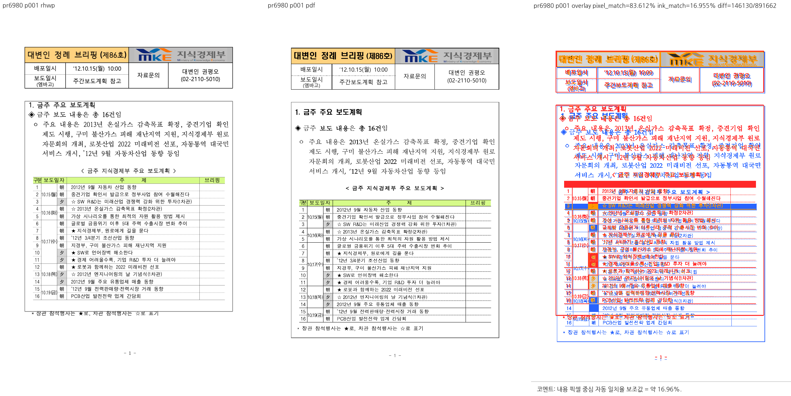

# PR #6980 검토: 표 분할 조각이 소유한 하단 줄의 클립 보존

## 판정: 메인터너 보정 후 수용 가능

검토일: 2026-09-10. 검토자: jangster77.

메인터너 보정 적용 및 검증을 완료했다. 하단 줄을 표시하기 위한 셀 클립 확장과 실제 표 흐름 높이를 분리했다. 원래 셀 하단을 NodeId별로 저장하여 상위 표 높이 계산에는 원래 흐름 하단을 사용하되, 줄 숨김 판정 전에는 표시 클립을 확장한다. #6924 집중 테스트와 본문 넘침 16개 분할 테스트가 모두 통과했다. 기존 기준선을 상향하지 않고 베트남 문서와 거대 셀 HWP/HWPX의 넘침 증가를 제거했다. 새 실행 파일로 1쪽 시각 증적도 재산출하여 하단 범례 보존을 확인했다.

## 검토 기준과 출처

- 원 PR: https://github.com/edwardkim/rhwp/pull/6980
- 검토한 원 PR head: `889133a40f6f5a3405bc5f26b43d0e489509f5f1`.
- 기준 devel: `37bd46a72f9fd9ffd709e35244df79c00e789780`.
- 로컬 통합 브랜치: `review/planet6897-6959-6983-20260910`.
- 체리픽 통합 commit: `bb5dc4b00fc1247374cd8b39f40e113c666745fc`.
- 메인터너 보정은 별도 코드 커밋 `4fc08b5e978e691b5885f6a1bdb0101fda563dc0`에 확정했다. 원 contributor 체리픽 이력은 보존했다.
- 이번 통합은 #6959, #6960, #6967, #6968, #6977, #6978, #6980, #6983의 8개 PR, 총 18개 provenance-preserving 체리픽으로 구성된다.

| 원본 commit | 적용 commit |
| --- | --- |
| `889133a40f6f5a3405bc5f26b43d0e489509f5f1` | `042a8c410b24f48103ecaa9fd8e81f92c96370a8` |

## 보류 사유의 처리 결과

이전 검토에서 통합 회귀 실패 및 미실행 검증 때문에 유지하던 보류 판정은 아래의 실제 검증 결과로 갱신한다. #6967의 형광펜 왕복, #6980의 클립 확장에 따른 흐름 높이 증가, #6983의 누락 fixture 감시 결함은 메인터너 보정으로 해결했다. 기존 넘침 기준선 상향이나 실패 테스트 비활성화로 통과시키지 않았다.

- 새 1쪽 증적: 픽셀 일치율 83.6115%, 내용 픽셀 중심 일치율 16.95508%, sweep 표시 경고 0개.
- 수치와 경고 0개만으로 승인하지 않고 실제 범례 및 페이지 배치를 직접 대조했다.

## PR 범위 재확인 및 최신 집중 검증 (2026-09-10)

작업지시자의 지시에 따라 #6980 본문의 계약인 **조각이 소유한 하단 줄의 실제 출력 보존과 이웃 셀 비회귀**를 중심으로 재검토했다. 문단 간격·페이지 전체 외곽선 정렬은 기존 devel에서도 재현되며, 이번 PR의 해결 주장과 분리한다.

- 제가 추가했던 범위 밖 작은 빈 문단 간격 보정은 제거했다. 그 변경 때문에 다시 실패했던 베트남 문서 114쪽의 `⑦물류⑧기타` 집중 테스트가 통과했다.
- 브리핑 실물 `samples/issue6924/148751598-briefing.hwp`를 등록했다. 새 `issue_6924_briefing_owned_line_kept` 테스트는 범례가 실제 SVG의 첫 페이지에 정확히 한 번 있고 다른 페이지에는 중복되지 않음을 확인한다. 렌더 트리에 텍스트가 있다는 사실만으로 통과시키지 않는다.
- 본문 넘침·텍스트 겹침·용지 밖 배치 각 16개 분할, 관련 복구·음성 대조 및 신규 샘플 보안 스윕을 포함하여 **61개 통과, 실패 0개**, 8 threads, 57.004초였다. 필터 밖 9,399개는 이번 집중 실행에서 실행하지 않았다.
- 신규 실물 샘플의 기준선은 기준 devel `37bd46a72f9fd9ffd709e35244df79c00e789780`에서 측정한 본문 하단 넘침 3건·텍스트 겹침 1건만 등록했다. 기존 문서의 기준선은 높이지 않았다. 용지 밖 배치는 기준 devel에서 0건이다.
- 새 샘플 보안 스윕은 issue6921, issue6956, issue6924의 3개 파일을 명시해 통과했다.
- 파생 harness 재생성 후 manifest 검사, 포맷 검사, source-side 4,205개/298개 모듈 기준선 검사도 통과했다. 파생 harness와 실행 로그는 커밋 대상이 아니다.
- 아래의 전체 9,413개 결과와 빌드·Native Skia 결과는 앞선 실행 기록이다. 이번 실물 샘플·테스트 등록 뒤 전체 회귀를 다시 실행한 것으로 표현하지 않는다. 이번에 확인한 최신 결과는 위 집중 61개다.

**#6980 판정: 메인터너 보정 후 수용 가능.** 소유한 줄 보존과 관련 비회귀에 한정한 판정이다. 브리핑의 세로 간격과 외곽선 차이를 해결 완료했다고 주장하지 않으며, 이 기존 차이만으로 본문 범위의 수용 판정을 보류하지 않는다. 최종 원격 head CI와 merge는 별도 단계다.

## 이전 전체 로컬 검증 기록

- 전체 integration 회귀: **9,413개 통과, 실패 0개, 건너뜀 46개**, 300.674초. `cargo nextest run --locked --cargo-profile release-test --tests --no-fail-fast --test-threads 8`로 실행했다.
- 신규 보안 코퍼스 스윕에는 issue6921 HWP와 issue6956 HWPX를 명시적으로 포함했다.
- 형광펜 3개, 본문 넘침 16개, #6924 1개의 집중 실행: **20개 모두 통과**.
- Native Skia 라이브러리: **4,112개 통과, 실패 0개, ignored 13개**. placeholder 집중 2개 및 직접 PDF export 집중 4개도 모두 통과했다.
- `cargo fmt --all -- --check`, 네이티브·WASM·workspace Clippy 및 workspace build 통과.
- 파생 suite 준비 후 manifest 검사 통과. source-side 테스트 기준선은 **4,205개 / 298개 모듈**로 유지했다.
- 호스트 WASM 빌드 통과, 3분 7초. Docker는 사용하지 않았다.
- Studio TypeScript 검사 통과. Studio 테스트 1,500개 중 **1,498개 통과, 2개 skip, 실패 0개**. 이 결과 이후 TypeScript 코드는 바뀌지 않았다.
- 새 WASM의 Chrome image-crop 실행과 직접 PNG 대조 완료. CanvasKit compat/default 모두 런타임 렌더 완료, 오류·숨은 Canvas2D 오버레이 없음. software surface 검증이며 GPU 경로 검증은 아니다.
- 전용 Cargo target: `target/pr-planet6897-6959-6983-20260910`. 실행 로그와 임시 JSON/SVG/중간 이미지는 `/tmp/rhwp-planet6897-20260910`에만 두며 커밋하지 않는다.

원 PR CI의 기존 조회 결과는 성공 또는 정책상 skip이었으나, #6960·#6968·#6977·#6978·#6980의 CodeQL code-scanning에는 devel 대비 언어 구성 2개 누락에 따른 NEUTRAL이 있었다. 분석 실패와 구분하며, 이 기록은 현재 원격 상태를 재조회한 결과가 아니다. 최종 통합 head의 CI와 필수 check는 push 후 별도로 확인해야 한다.

## 시각 증적과 판정 범위

기준 PDF: [148751598-briefing-2020.pdf](../../../pdf/148751598-briefing-2020.pdf). 기존의 신뢰 가능한 한컴 PDF는 재사용하고, 필요한 최종 기준 PDF만 보관했다.

한컴 기준과 글꼴·줄 간격·표의 세로 위치 및 범례와 외곽선의 상대 위치 차이는 남는다. 판정 범위는 소유한 하단 줄의 누락 방지와 기존 넘침 기준선의 비회귀다. 페이지 전체 레이아웃이 한컴과 같아졌다는 판정이 아니다.

## PR·이슈 코멘트 반영 계획

- 통합 PR의 실제 merge SHA와 최종 PR/devel CI를 확인한 뒤 원 PR 및 실제 연결 이슈에 처리 결과를 남긴다. 원 PR을 직접 merge한 것으로 표현하지 않고 통합 PR의 체리픽 수용 사실을 명시한다.
- 위 PNG를 최종 merge SHA에 고정한 raw GitHub URL로 Markdown 이미지에 넣어 코멘트 안에서 직접 보이게 한다. 기준 PDF가 있으면 같은 SHA의 파일 링크도 제공한다.
- 메인터너 보정이 적용된 범위와 남은 시각 차이를 구분하고, 미실행 GPU 검증이나 원격 CI를 통과로 주장하지 않는다.
- UTF-8 body file로 게시하고 API로 본문을 재조회한다. 같은 처리 결과의 기존 코멘트가 있으면 새로 중복 등록하지 않고 기존 코멘트를 수정한다.
- 연결 이슈의 실제 closing reference와 상태를 확인한 후 종료한다. 첫 기여자 여부 및 해당 안내는 `post_merge.md`에 따라 실제 기여 이력을 확인해 반영한다.
- 원 contributor fork 브랜치를 임의로 삭제하지 않는다. 승인된 이번 작업 소유 임시 브랜치·worktree·target만 완료 후 절차에 따라 정리한다.

이 기록은 통합 PR 제출용이다. 원 PR 코멘트·close와 merge는 아직 수행하지 않았으며, 아래 제출 기준과 merge 전 조건을 따른다.

## PR 제출 기준 확정 (2026-09-10)

- 메인터너 보정 SHA: `4fc08b5e978e691b5885f6a1bdb0101fda563dc0`. 체리픽 마지막 SHA `bb5dc4b00fc1247374cd8b39f40e113c666745fc` 뒤에 보정을 별도 커밋했다.
- 제출 branch: `review/planet6897-6959-6983-20260910`. 원 PR 8개와 provenance-preserving 체리픽 18개를 유지한다.
- 로컬 검토 base는 `37bd46a72f9fd9ffd709e35244df79c00e789780`이다. PR 준비 시 원격 devel은 `ffc88e54fd17be9432d7985cd1c7ffa9aae39d3b`로 전진했다. rebase나 devel merge는 하지 않았고 최신 base와의 통합 검증은 새 PR의 CI 조건이다.
- 이전 전체 회귀는 9,413개 통과, 실패 0개, skip 46개였다. 이후 추가한 briefing fixture·테스트까지 이 전체 실행에 포함됐다고 주장하지 않는다.
- 최종 집중 검증은 61개 통과, 실패 0개, 57.004초, 8 threads였다. 이어 이전 실패와 관련된 3개만 다시 실행하여 3개 통과, 실패 0개, 0.539초를 확인했다. 과거 25개 통과·3개 실패 기록은 현재 결과가 아니다.
- 마지막 테스트 추가 뒤 manifest·fmt·tier 검사는 통과했다. native/WASM/workspace Clippy의 성공은 이전 실행 기록이며, 마지막 테스트·baseline 추가 뒤에는 다시 실행하지 않았다. 최종 head CI의 해당 gate를 merge 전에 확인해야 한다.
- 이번 PR 생성 단계에서는 검증을 추가 실행하지 않았다. CI 완료, merge, issue 종료 및 cleanup 완료를 미리 기록하지 않는다.

## Merge 후 contributor PR comment 계획

- 원 PR #6980에 체리픽 통합 수용 사실, 실제 통합 PR 번호와 merge SHA, 원 변경과 메인터너 보정의 차이를 기록한다. 원 PR을 직접 merge했다고 표현하지 않는다.
- Visual Sweep 및 검증 기록의 정본 direct link는 `https://github.com/edwardkim/rhwp/blob/<merge-commit-sha>/mydocs/pr/archives/pr_6980_review.md`로 고정한다.
- 실제 증적 범위: 1쪽 1개 페이지를 대조했다. pixel match 83.6115%, 내용 픽셀 중심 일치율 16.95508%, flagged 0이다. 소유된 하단 범례가 실제 SVG에 한 번만 그려지는 것을 확인했다. 범례의 프레임 밖 위치와 문단 간격 등 devel에도 있던 전체 페이지 차이는 남아 있으며, 이번 PR의 하단 줄 누락 방지 계약과 구분한다.
- 대표 이미지 안정 경로: [pr6980-p001.png](../assets/pr_6959_6983_planet6897_20260910/pr6980-p001.png). 코멘트에는 `` 형식으로 이미지를 직접 표시한다.
- 코멘트 작성 시 실제 merge SHA로 placeholder를 치환하고 UTF-8 body file과 `--body-file`을 사용한다. 기존 같은 통합 결과 코멘트가 있으면 새로 등록하지 않고 수정하며, 게시·수정 뒤 API로 본문을 재조회한다. PR/devel CI 완료와 관련 issue의 실제 상태를 확인한 뒤 `post_merge.md`에 따라 후속 처리한다.
