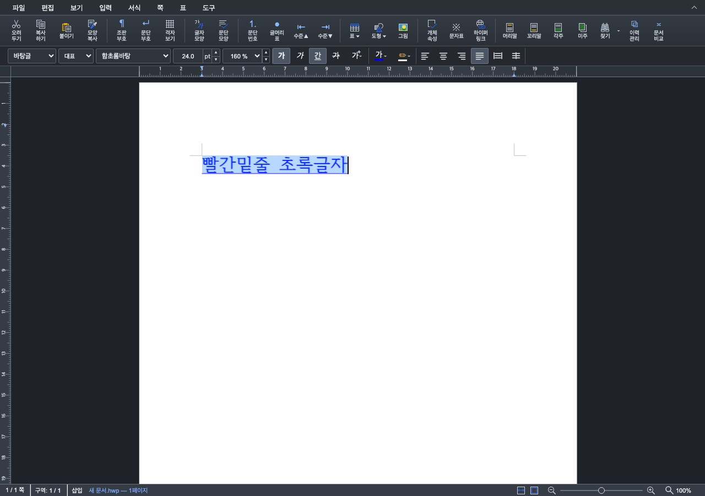
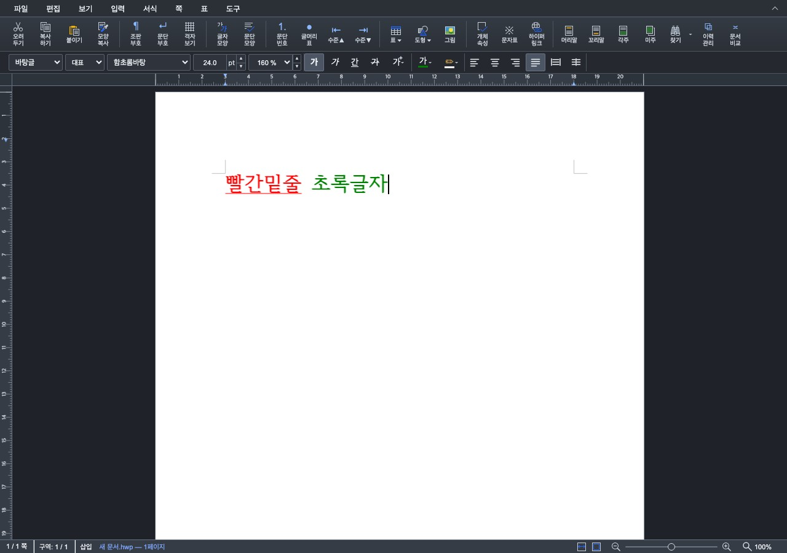
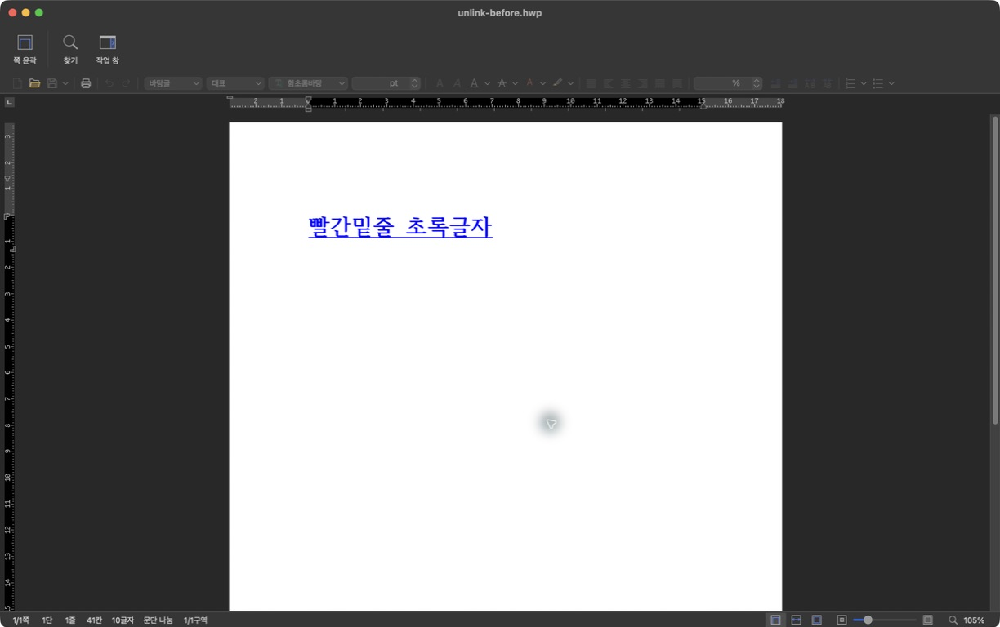
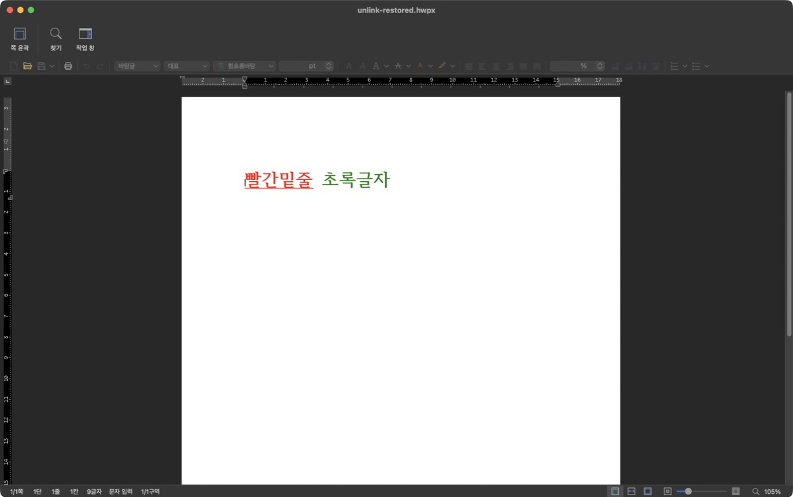
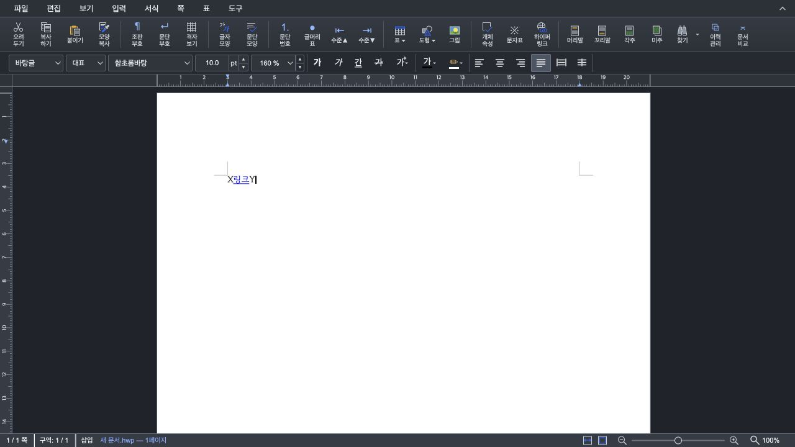
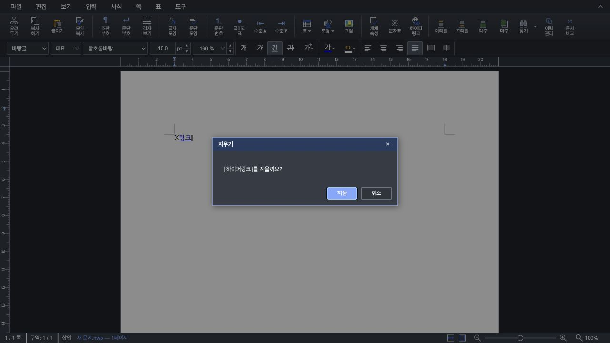

# PR #6984 작성자 self-review

> 2026-09-13 후속 리뷰: 아래 2026-09-10 결과는 당시 후보의 역사 기록이다.
> 최신 계약·보정 이력은 [후속 구현·반영 계획](pr_6984_review_impl.md)을 따른다.
> 링크 앞뒤 입력은 일반 텍스트이며, Delete와 Backspace는 삭제 대상이 링크일 때
> 확인 후 표시 문자열 전체와 필드를 함께 삭제한다. 사용자가 로컬 동작을 확인하고
> PR 반영·코멘트 게시를 승인했다. 병합 승인은 별도다.

## 2026-09-13 병합 준비 최종 검토

- 검토 head: `bf06a239e6d12db4c14a0b6b85edda299b6a624a`.
- 현재 base: `897c6a3d8d7559d314bf863c93bbe28c0d65e945` (`devel`).
- `git merge-tree --write-tree upstream/devel HEAD`: exit 0,
  tree `f44eb00f0e28a234a490f1bbaa251fe3237cbe16`. tree diff 공백 검사도 통과했다.
- 작성자 self-review 경로다. 현재 HTTP/HTTPS 1차 범위에서 새 병합 차단 결함을 발견하지
  못했다. 경계 입력, Delete/Backspace 확인·취소·Undo, 혼합 서식 복원·저장 왕복,
  URL/Command 인코딩, 필드 범위와 출력 geometry의 공통 결과를 코드·실행 증거와 대조했다.
- 전체 로컬 검증 후보 `560a4a1db` 이후 변경은 `mydocs/` 기록·Viewer 화면뿐이다.
  같은 제품·테스트에 대해 이미 완료한 Rust 9,569 passed / 46 skipped, Studio 1,666
  passed / 2 skipped, 3종 Clippy·Native Skia·실제 WASM 21그룹·UI·PDF 결과를 재사용했다.
  검증 후 제품 변경이 없어 광범위 검사를 중복 실행하지 않았다.
- GitHub [Full CI 34714922945](https://github.com/edwardkim/rhwp/actions/runs/34714922945)는
  `c4d2fb1b8`에서 lint, 4개 archive/shard, Native Skia, Frontend package, aggregate가
  실제 실행되어 성공했다. 이 head와 로컬 검증 후보의 제품·테스트는 같다.
- [5b73fad70 CI](https://github.com/edwardkim/rhwp/actions/runs/34715563534)는 위 Full
  candidate를, [bf06a239e CI](https://github.com/edwardkim/rhwp/actions/runs/34715755778)는
  `5b73fad70`을 `build-and-test-green:success`로 재사용했다. 계보의 변경은 허용된
  review-only 경로다. 현재 Build & Test·CodeQL·CI Impact Policy는 성공했다.
- 조회 당시 `MERGEABLE / UNSTABLE`, non-Draft, OPEN이었다. 취소된 이전 정책 평가 job은
  남아 있지만 최신 `CI Impact Policy` status는 success이며 `gh pr checks --required`의
  Build & Test도 success다. 취소를 성공으로 바꾸어 기록하지 않는다. 이 문서의 후속 commit을
  push하면 새 head의 required aggregate·정책 상태·mergeability를 다시 확인한다.

### 조판 원칙 준수 검토

| 항목 | 확인 근거 | 판정 |
| --- | --- | --- |
| 구현 근거와 일반성 | 한컴 도움말의 해제 계약·사용자 경계/삭제 실측·PDF URI 규격. 문서 ID 전용 분기 없음. 교차 필드·미지원 컨텍스트를 명시적으로 차단 | 충족 |
| 측정·배치 일관성 | `hyperlinks_in_layer_tree`가 출력에 쓰는 TextRun의 `replay_positions_for`와 bbox/clip을 소비. SVG와 Skia PDF에 같은 링크 목록 전달; CSS px→PDF pt·Y축 변환은 writer에서 수행 | 충족 |
| 줄 소속과 점유 높이 | 줄 나누기·높이 계산 규칙을 변경하지 않고 기존 출력 트리의 줄별 TextRun을 소비. 새 링크 영역을 이유로 줄 소속을 재추정하지 않음 | 비해당 |
| 사례와 증거 독립성 | 혼합 서식·Unicode·중첩 셀/글상자·경계/실패·왕복 계약 테스트와 한컴 원본/PDF 비교를 구분. 새 저장 파일 4개는 Viewer 직접 판독·링크 실행 확인 | 충족 |
| 기준값 변경 | 기존 baseline·golden·허용치 변경 없음. 저장 무효화 가드는 실제 helper 위임 근거로 등록했고 검사 기준을 완화하지 않음 | 비해당 |
| 주장과 검증 범위 | source SHA와 Full CI·로컬·실제 UI/PDF/Viewer 증거를 연결. 전체 한컴 조판 일치와 외부 재저장 시 보조 정보 보존은 주장하지 않음 | 충족 |

### 검증 입력 커밋 확인 — 충족

아래 14개 입력·기준 파일을 검토 head의 Git blob과 실제 로컬 바이트로 대조했다.
LFS pointer인 경우 실제 object의 SHA-256과 oid를 대조했다. 모두 일치했다.
한컴 원본/PDF의 역할·출처는 [단계 1](../../working/task_m100_6963_stage1.md),
합성 적용/해제 파일은 [서식 복원 증거](../assets/issue6984/unlink-format-evidence.json),
Viewer 결과는 [Viewer 증거](../assets/issue6984/viewer-unlink-evidence.json)를 따른다.

| 저장소 경로 | 실행 파일·검토 commit 내용의 SHA-256 |
| --- | --- |
| `samples/basic/Textmail.hwp` | `3ea41d01844dfe689c58c3aebc4193466df449b954b047c65e6289ded3e6f05c` |
| `pdf/basic/Textmail-2022.pdf` | `c2d295531e6174142dc0222294bfc0aa0f2066d0d125d70f16c54f36ba685715` |
| `samples/hwpx_sample2.hwpx` | `188bdfe21f89e117d8897f4102aa6f741962b23a3019ad2aaf7bdc222d90fdb2` |
| `pdf/hwpx_sample2-hwpx-2020.pdf` | `d69bf2c042f1b3f4713ad838c7d4f7817f2568cea62f1df78731086ebb8e81dc` |
| `samples/hwp-img-001.hwp` | `0d632afcea1111c5af14413f10f91d982055a67257dc73e5e5db2c04c1c00f60` |
| `pdf/hwp-img-001-2022.pdf` | `05b1823e949176cc5309b8788f77dee50fa841d2996804e0a6420a4ea7587250` |
| `samples/hwpctl_Action_Table__v1.1.hwp` | `7076cb9bf6660acad61840dead62a3baeba43b8cb4afe8501777637b2f82fc0e` |
| `pdf/hwpctl_Action_Table__v1.1-2022.pdf` | `2dd05189158df29c171ec76234ec0bb3991e00af82c64f4866e734aefca39d87` |
| `mydocs/pr/assets/issue6984/hyperlink-preservation.hwpx` | `f556dd449ddfd77e19e006214280f3dc5c4d36096d65fbfaaf1a58e7a989ac28` |
| `mydocs/pr/assets/issue6984/hyperlink-preservation.pdf` | `4172302dcec7998f13583c2c6fd98aadea9a83335156f15fb08f490e0eef8b38` |
| `mydocs/pr/assets/issue6984/unlink-before.hwp` | `9e9377db638c1609f08fb53e30cde4e1709ed19bc5933f840b08ee5e3151cd5e` |
| `mydocs/pr/assets/issue6984/unlink-before.hwpx` | `7a3c96187c3f9e3718a02b43e8aebb11f576bdcab634bbe6a3e5382ff20aaeb3` |
| `mydocs/pr/assets/issue6984/unlink-restored.hwp` | `8d6485b58114f787b93dcf6900061a20ce38e5ee96ef98cbff4295054dba1e32` |
| `mydocs/pr/assets/issue6984/unlink-restored.hwpx` | `97297786aeb1efb6c75eaab4c16e3153e5d6c4d97723f6b5296976e7b1dae879` |

### 남는 범위와 병합 순서

F11·편집→고치기·Enter는 별도 후속 기능으로 분리할 것을 권고한다. 파일·메일·책갈피
신규 편집, scheme 없는 주소의 호환성 확대, 외부 재저장에서의 rhwp 복원 정보 보존도
이번 HTTP/HTTPS 1차 완료 판정에 포함하지 않는다. 한컴 PDF와의 기존 배치·clipping 차이는
아래 시각 증적 한계를 유지한다.

병합 준비 판정은 승인이다. 최신 trailing head의 required check·정책 상태·mergeability와
사용자의 명시적 병합 승인이 모두 갖춰진 뒤 일반 merge 경로를 사용한다. `--admin`이나
보호 규칙 우회는 계획하지 않는다. 병합 후에는 이슈 #6963의 1차 완료 범위와 남는 후속
기능을 구분해 기록하고 아래 증적 comment 계획 및 저장소 후속 절차를 적용한다.

## 2026-09-13 원래 글자 모양 복원 보정

- 직전 원격 head: `549a4e099560519ac8aa05c32bbd147c7c9ee33e`.
- 제품·테스트·화면 증거: `4a66e22d9fad86879f554983917f5db697c69168`.
- 저장 무효화 위임 가드 포함 검증 후보: `560a4a1dbf38c33ccccef33ae7577fd6013a65fa`.
- 기존 작성자 self-review 경로를 유지했다. 사용자가 서식 결함 보정과 보정 코멘트 게시를
  승인했다. F11·편집→고치기·Enter 진입 경로는 별도 후속 이슈로 분리할 것을 권고하며
  이번 보정에는 포함하지 않는다. 이 기록은 GitHub approve event나 병합 승인이 아니다.

### 결함·근거·보정 범위

[한컴 2024 속성 없애기 도움말](https://help.hancom.com/hoffice130/ko-KR/Hwp/insert/hyperlink/hyperlink%28delete%29.htm)은
우클릭 ‘하이퍼링크 지우기’ 후 원래 글자 모양으로 돌아가는 동작을 설명한다.
기존 Studio는 검정색·밑줄 없음으로 덮어써 빨간 밑줄 등 원래 서식을 잃었다.
이것은 기존 해제 기능의 결함이며 미구현 기능 제외 항목이 아니다.

- 링크 적용 전에 범위별 글자색·밑줄 종류·밑줄 색을 보존하고 해제할 때 이 세 속성만
  복원한다. 혼합 서식과 방문색을 처리하고 이후 바꾼 굵기·기울임은 유지한다.
- 공통 문자 삽입·삭제와 문단 분할에 복원 범위를 연결했다. 표시 문자열 전체 교체는
  기존 링크 첫 글자의 원래 서식을 이어받는다. 링크 앞뒤 입력·Delete/Backspace 전체 삭제
  확인 계약은 유지한다. 해제는 기존 snapshot 명령에서 실행되어 Undo/Redo 대상이다.
- 원래 서식은 rhwp 전용 HWP stream `/RhwpHyperlinkFormat`과 HWPX entry
  `META-INF/rhwp-hyperlink-format.json`에 저장한다. 표준 필드 Command와 미정의 한컴
  ParameterSet ID를 변경하지 않는다. 링크 ID·현재 문자열/Command 해시·길이를 검증하며
  중복 레코드 ID, 잘못된 정보, 16 MiB 초과 보조 정보는 복원에 사용하지 않는다.
  저장 시 현재 필드에서 재생성하고 마지막 링크 해제 후 보조 정보를 제거한다.
- 복원 정보가 없는 기존 외부 링크는 연결만 해제하고 현재 서식을 유지한다. 외부 프로그램이
  보조 정보를 제거하고 재저장하면 원래 서식 복원을 보장하지 않는다. 이는 한컴 자체의
  원래 서식 저장 규약을 구현했다는 주장이 아니다.
- 본문·중첩 표 셀·글상자, Unicode 편집·부분 삭제 Undo, URI/표시 문자열 수정,
  HWP/HWPX 저장 재열기와 교차 형식 왕복을 검증했다.

### 검증 및 증거

- 필수 prepare, fmt 및 fmt check, native/WASM32/workspace all-target Clippy
  (`--locked`, `-D warnings`), workspace build, manifest check, unit tier 검사 통과.
- 전체 nextest: **9,569 passed / 46 skipped / 0 failed (159.316초)**. 첫 실행은 저장 무효화 가드의 새 API 분류 누락 1건으로
  실패했다. 실제 `commit_hyperlink_paragraph` 위임 경로를 등록하고 전체를 재실행했다.
  Pending 상한·허용치·baseline을 완화하지 않았다.
- Native Skia: **주 lib 3,930 passed / 13 ignored, 보조 lib 182 passed, placeholder 2/2, 직접 PDF 4/4 통과**.
- 실제 WASM·Studio command/history **21개 묶음 통과**. fresh WASM 빌드 통과,
  SHA-256 `8a16f13268ff4c2db10dcb13eb99a806c548b364a14e2c8087a2c543f337f89b`.
  뒤따른 가드 커밋은 테스트 레지스트리만 변경하며 제품·WASM 소스는 동일하다.
- Studio `npm test`: **1,666 passed / 2 skipped / 0 failed**. `npm run build` 통과.
- 실제 Chrome UI E2E: 혼합 서식 텍스트의 도구모음 삽입·우클릭 해제·Undo/Redo,
  기존 경계·Delete/Backspace 확인/취소/전체 삭제·방문 표시 검증 통과.
- 실제 브라우저 저장·재열기·PDF 뷰어 클릭 E2E: **5 PDF / 34쪽 / 81 주석** 통과,
  DOM 대비 주석 사각형 최대 차이 **0.380280pt**. 최초 호출은 시스템 Python에 pypdf가
  없어 검증 단계에서 실패했고 설치된 runtime `PYTHON`을 지정해 전체 E2E를 재실행했다.
- 원시 로그: `/private/tmp/pr6984-format-gates/`. 고정 review worktree와
  `target/pr-review`에서 Cargo 명령을 순차 실행했다. nextest test threads는 8개다.
- 신규 화면의 빨간 밑줄/초록색, 같은 문자열·위치·굵기를 직접 판독했다. 합성 입력의
  사용자 편집 계약 증거이며 한컴 전체 조판과의 일치나 전수 visual sweep 근거는 아니다.
- 잠금 해제 후 새 보조 엔트리를 가진 `unlink-before.hwp`/`.hwpx`와 해제 후
  `unlink-restored.hwp`/`.hwpx`를 한컴 Viewer에서 각각 직접 열었다. 읽기·복구 오류 없이
  적용본의 파란 밑줄, 해제본의 빨간 밑줄·초록색과 문자열을 확인했다.
  HWP와 HWPX 링크를 각각 클릭하고, 사용자의 추가 승인 후 ‘한 번 허용’을 실행했다.
  두 형식 모두 Firefox의 새 Example Domain 탭이 열리고 주소
  `example.com/original-format`에 도착한 것을 확인했다. 검증 입력 4개 파일의 해시는
  기존 커밋 증거와 동일하며 파일을 Viewer에서 편집·재저장하지 않았다.
  Viewer 읽기 확인을 외부 프로그램에서의 편집·재저장 시 보조 정보 보존 검증으로 확대하지 않는다.
  [Viewer 화면·해시](../assets/issue6984/viewer-unlink-evidence.json)를 따른다.
- 기존 PR 본문의 PDF·한컴 Viewer 등 스크린샷 6장을 보존한다. 최신 head CI와
  독립 최종 리뷰·별도 병합 승인은 원격 반영 후 남는 조건이다.

링크 적용 상태:



‘하이퍼링크 지우기’ 후 원래 빨간 밑줄·초록색 복원:



추가 한컴 Viewer 확인(같은 입력 파일):

| 형식 | 링크 적용 상태 | Studio에서 해제 후 저장 |
| --- | --- | --- |
| HWP |  |  |
| HWPX |  |  |

재현: [적용 HWP](../assets/issue6984/unlink-before.hwp),
[적용 HWPX](../assets/issue6984/unlink-before.hwpx),
[해제 HWP](../assets/issue6984/unlink-restored.hwp),
[해제 HWPX](../assets/issue6984/unlink-restored.hwpx),
[전체 파일 해시·WASM 해시](../assets/issue6984/unlink-format-evidence.json).

## 2026-09-13 이전 리뷰 후보 — 경계·삭제 보정

- 기존 원격 head: `065bda2307db18eafa8394a360289c8558ffcc7b`.
- 이번 코드·테스트 후보: `6c6c5c49949c2bc505807f9a8ebbfe21988d1934`.
- 통합 base: `897c6a3d8d7559d314bf863c93bbe28c0d65e945`.
- base route: `collaborator_self_merge.md`; modifiers: `intake_and_review.md`,
  `local_validation.md`, `visual_fixture_evidence.md`, `multi_pr_update_branch.md`,
  `rework_and_exceptions.md`. 모 문서·선택표와 위 자식 문서를 읽고 적용했다.
- 원격 조회 시점에는 Draft였으며 최신 devel 통합 전 오늘할일 충돌이 있었다.
  `a52775869`에서 해당 문서 양쪽 기록을 모두 보존했고 제품 코드의 수동 충돌 해소는 없었다.
  PR 고유 diff의 공백 검사를 통과했다. devel에서 유입된 CRLF·EOF 공백은 변경하지 않았다.

### 보정한 결함과 동작

1. 링크 앞 경계 입력: 검정색 글자라도 실제 필드 범위에 포함되던 불일치를 수정했다.
   새 글자는 BEGIN 슬롯 앞에 삽입하고 필드 시작·끝을 함께 옮긴다. 앞·뒤 경계에서는
   일반 서식과 링크 밖 범위를 유지하며 내부에서만 링크를 확장한다.
2. 삭제 Undo: 글자만 재삽입하면 필드 범위·서식이 원래대로 복구되지 않는 경로에 문단 조각을
   보관·복원한다. 중첩 셀·글상자도 상위 문단의 구조와 함께 복구한다.
3. Delete/Backspace 전체 삭제: 삭제 대상 글자가 링크이면 확인창을 열어 문자열·필드를
   snapshot 한 번으로 삭제한다. 취소는 무변경이며 Undo 한 번으로 모두 복구한다.
   확인창이 열린 동안 문서 세대·대상 내용·편집 가능 상태가 바뀌면 삭제를 거부한다.

최초의 '시작 글자에 링크 색·밑줄을 적용' 방침은 사용자 피드백으로 철회했다.
현재 판단 기준은 사용자 확정 계약과 제공한 한컴 삭제 확인 화면이다. 한컴의 모든 커서·선택
조건을 직접 실측했다는 주장은 아니다. 선택 범위 삭제와 이미 남아 있는 빈 필드의 일괄 정리는
이번 확인창 범위가 아니다. 기존 하이퍼링크 메뉴의 '지우기'는 표시 문자열을 유지한다.

### 이번 후보의 완료 검증

- `node scripts/rust-test-suite-manifest.mjs --prepare`, `cargo fmt --all`, fmt check,
  native/WASM32/workspace all-target Clippy(`--locked`, `-D warnings`), workspace build,
  manifest check, source-side unit tier 검사 모두 통과했다.
- `cargo nextest run --locked --cargo-profile release-test --target-dir target/pr-review
  --tests --test-threads 8 --no-fail-fast`: **9,565 passed / 46 skipped / 0 failed**,
  테스트 실행 156.985초. 하이퍼링크 편집·PDF 회귀를 포함한다.
- 동일 review worktree의 고정 `target/pr-review`에서 Cargo 명령을 순차 실행했다.
  12 logical CPU·24 GiB host에서 테스트 thread 8개를 사용했다.
- 신규·변경 `samples/` 문서는 없어 신규 sample 보안 검사 입력 대상은 없다.
- 원시 로그는 `/private/tmp/pr6984-final-gates/`에 보관하며 커밋하지 않는다.
- Native Skia: 주 lib 3,930 passed / 13 ignored, 보조 lib 182 passed,
  placeholder 2/2, 직접 PDF 4/4를 통과했다.
- fresh WASM: `CARGO_TARGET_DIR=target/pr-review scripts/wasm-pack-locked.sh
  --target web --out-dir pkg --no-opt` 통과. 기존 단계와 같은 host native 진단 경로이며,
  Docker·wasm-opt 배포 빌드 성공으로 확대하지 않는다. WASM SHA-256:
  `3f51bfd6f18a5827fe2586afec79341e1998988bd53c61fbd1af32190ff4e5b6`.
- `node --experimental-transform-types --no-warnings tests/support/hyperlink-wasm.runner.mjs`:
  실제 WASM·Studio command/history **19개 묶음 통과**. 경계·부분 삭제 Undo,
  양방향 전체 삭제·취소·중첩 셀·글상자·저장 왕복·실패 원자 복구를 포함한다.
- Studio `npm test`: **1,666 passed / 2 skipped / 0 failed**. `npm run build` 통과.
- `VITE_URL=http://127.0.0.1:7794 node e2e/hyperlink-ui-issue6963.test.mjs --mode=headless`:
  실제 키 입력·Delete/Backspace 확인/취소/전체 삭제/Undo, 클릭/방문 표시,
  기존 링크 고치기·우클릭 해제까지 통과했다. 별도 headless Chrome을 사용했다.
- 같은 Vite URL에서 `node e2e/hyperlink-pdf-issue6963.test.mjs --mode=headless`를 실행했다.
  `CHROME_PATH`는 설치된 Chrome, `PYTHON`은 pypdf가 준비된 runtime Python을 지정했다.
  실제 저장 명령·HWP/HWPX 재열기·PDF 출력·뷰어 링크 클릭, 5개 PDF·34쪽·81개 주석 검증이
  통과했다. DOM 대비 주석 사각형 최대 오차는 0.380280pt다. 한컴 전체 배치 차이를 뜻하는
  수치가 아니며 기존 비교 문서의 배치·clipping 잔여를 해결했다고 주장하지 않는다.
- 리뷰·구현 기록·충돌 해소한 오늘할일 3개 문서의 내부 링크 검사와 `git diff --check`를 통과했다.

### 최종 후보의 직접 UI 판독

새 WASM을 불러온 새 문서에서 `링크`를 삽입하고 Home·X, End·Y를 입력했다.
X·Y가 검정색·밑줄 없는 일반 텍스트임을 직접 확인했다. 끝에서 Backspace를 한 번 누르면
일반 Y가 지워지고, 다음 Backspace에서 링크 확인창이 뜬다. 확인 후 X만 남았으며,
⌘Z 후 링크 고치기에서 표시 문자열 `링크`와 주소 `https://example.com`을 재확인했다.





- 위 이미지들은 이번 후보의 p1 직접 화면이다. 전수 visual sweep의 픽셀 점수·후보 수는
  측정하지 않았고 한컴 전체 조판 일치 근거로 쓰지 않는다. 일반 글자와 링크의 서식·확인창
  문구가 판독 가능함을 직접 확인했다.
- `boundary-outside.jpg` SHA-256: `6ba7f2bb148647d44e9001a78c5a8be4903347995a9dd1076b1d10bd58edddea`.
- `delete-confirmation.jpg` SHA-256: `41d52a320ec597d0eac1845a8e236ad417f411bb15a5ff005393e6d0b005e718`.

- 검토일: 2026-09-10. GitHub 상태는 최초 제출 head 조회 시점의 참고값이다.
- base route: `collaborator_self_merge.md`.
- modifiers: `intake_and_review.md`, `local_validation.md`, `visual_fixture_evidence.md`,
  `rework_and_exceptions.md`(1,000줄 초과), `review_only_fast_pass.md`.
- loaded documents: `pr_review_workflow.md`, `pr_review/README.md`, 위 기본·보조 문서,
  `dev_environment_guide.md`, `edit_command_review_checklist.md`, 문서·Git 절차.
- 작성자 self PR로 reviewer는 지정하지 않았다. GitHub approve event는 아니다.

## 2026-09-10 후속 UI·표시 문자열 갱신 검증

이하 최초 제출 기록 이후의 제품·테스트 검증 후보는 `fd06747f6`이다.
사용자 요청에 따라 설명 문자열은 이번 PR에서 제외하고, 표시 문자열 편집·웹 탭·미리보기·
방문 표시·컨텍스트 메뉴·주소 전용 호버를 포함한다.
전체 Rust nextest 9,405개, Studio Node 1,502개가 통과했다.
필수 fmt/3종 Clippy/workspace build/manifest, native-skia lib(주 lib 3,930개),
placeholder 2개·직접 PDF 4개, TypeScript/Vite build와 unit tier 정책 검사도 통과했다.
검증은 별도 review worktree에서 수행했고 generated suite는 source PR에 포함하지 않았다.
동일 HWPX를 Studio·macOS 한글 Viewer에서 열고 그 문서의 PDF를 미리보기에서 확인했다.
Viewer는 사용자 승인 후 한 번 허용하여 실제 한컴 홈페이지 이동까지 확인했다.
[단계 10 증거 및 재현](../../working/task_m100_6963_stage10.md)을 따른다.
최신 devel과 merge-tree 충돌 없음. 이 기록은 GitHub approve·merge 승인이 아니다.

## 최초 제출 대상과 범위

| 항목 | 확인값 |
| --- | --- |
| PR / Issue | [#6984](https://github.com/edwardkim/rhwp/pull/6984) / [#6963](https://github.com/edwardkim/rhwp/issues/6963) |
| 작성자·담당 | postmelee / postmelee |
| milestone / labels | v1.0.0 / enhancement, rhwp-studio, serialization, rendering |
| base / source | devel / codex/issue-6963-hyperlinks, upstream 같은 저장소 |
| 로컬 검증 제품·테스트 후보 | `b05cadb0e` |
| 최초 PR 제출 head | `4013da8a2e87f08543f6eb8f062396f8b94a8cca` |
| 조회한 base | `37bd46a72f9fd9ffd709e35244df79c00e789780` |
| 최초 제출 규모 | 47 files, +3,615 / −49 |
| 최초 제출 상태 | OPEN, non-Draft, MERGEABLE, BLOCKED, GitHub 검사 진행 중 |

Studio의 HTTP/HTTPS 텍스트 링크 삽입·수정·해제, undo/redo와 HWP/HWPX 저장 왕복을
연결했다. PDF에는 실제 텍스트 run의 경계·clip으로 계산한 줄·페이지별 Link/URI를 넣는다.
브라우저 인쇄 SVG, CLI SVG PDF, 직접 Skia PDF를 각각 검증했다.

## 코드 및 편집 계약 검토

1. URL·Command codec은 공유하고 Unicode scalar offset으로 필드 범위를 다룬다.
   본문·중첩 셀·글상자 경로를 보존하며 미지원 위치를 명시적으로 제한한다.
2. `executeOperation()` snapshot 경로로 글자·필드 변경을 함께 처리한다. 실패는 원자적으로
   복원하며 취소·동일 주소는 history를 추가하지 않는다. dirty·caret·focus 및 undo/redo,
   모달을 연 뒤 문서 세대·읽기 전용 상태가 바뀌는 경우를 검사했다.
3. 저장 전에 원본 section stream과 cache를 무효화한다. 전체 회귀에서 새 API 3개의
   passthrough guard 분류 누락을 발견해 실제 공통 helper 위임으로 등록했다. 검사 해제나
   Pending 상한 변경 없이 가드 5개 및 전체 9,401개 회귀를 다시 통과했다.
4. 링크 영역은 문자 수 비례 추정 대신 렌더 경계와 clip을 사용한다. 페이지 재배열·변환 실패
   격리·px/pt 및 Y축 변환을 검사했다. 회전·세로쓰기 등 부정확한 영역은 오류로 반환한다.
5. 실제 저장 메뉴의 serializer 바이트를 다시 열고 실제 인쇄 iframe을 Chromium PDF로
   출력했다. OS picker의 write와 native print 호출만 캡처한다. 실제 PDF 뷰어의 글자 위치를
   클릭하고 한글 query·fragment 이동 주소를 확인했다. 목적지 외부 요청은 테스트 응답으로 대체했다.
6. 새 integration 원본은 `tests/cases/`에 있고 generated suite·manifest는 review worktree에서만
   준비했다. source-side unit test, sample, npm/editor API, CI workflow 변경은 없다.

최초 검토 때에는 새 코드 보정이 필요한 추가 문제를 발견하지 못했다. 이후 경계 입력·삭제 Undo와
전체 삭제 UX를 보정했으며 [후속 구현·반영 계획](pr_6984_review_impl.md)에 기록했다.
1,000줄 초과 PR이므로 이번 제출을 즉시 admin merge 근거로 사용하지 않는다.

## 로컬 검증과 GitHub 상태

[최종 통합 검증](../../working/task_m100_6963_stage6.md)에 명령·종료 결과·바이너리 SHA-256을 기록했다.
전용 `/tmp/rhwp-issue-6963-review`의 `b05cadb0e`에서 같은 `target/pr-review`로 순차 실행했다.
최초 제출 head까지의 후속 차이는 문서·중간 증적 정리뿐이다.

| 검증 | 완료 결과 |
| --- | --- |
| Rust 필수 lint 전체 | suite prepare, fmt, native/WASM32/workspace all-target Clippy, workspace build, manifest check 통과 |
| 전체 release-test nextest | 9,401 pass / 46 skip / 0 fail |
| Native Skia | library 4,112 pass / 13 ignored, placeholder 2/2, direct PDF 4/4, hyperlink PDF 9/9 |
| fresh WASM + Studio | native wrapper `--no-opt`, TypeScript, production bundle, Node 1,501 pass / 2 skip, 편집 시나리오 10종 통과 |
| 새 suite 정책 | 23/23 통과 |
| 실제 Chrome 저장·재열기·PDF | 5종 34페이지의 81개 URI 주석 및 뷰어 클릭 통과 |
| merge simulation | 최초 제출 head + 위 base의 무충돌 tree `69e14830c4ec157a698ca862f36203b73c263e6a` |

Docker 데몬 연결이 불가해 매뉴얼이 허용한 native WASM 진단 경로를 사용했다. 최적화 배포 빌드나
최신 base의 merge tree 전체를 로컬 컴파일한 증거로 확대하지 않는다. 원시 로그는
`/tmp/issue6963-gates/final/`, 브라우저 산출은 review worktree의 `output/pdf/issue6963-stage5/`다.

최초 head의 [CI](https://github.com/edwardkim/rhwp/actions/runs/34445352565),
[CodeQL](https://github.com/edwardkim/rhwp/actions/runs/34445352540),
[Render Diff](https://github.com/edwardkim/rhwp/actions/runs/34445352340),
[Adapter](https://github.com/edwardkim/rhwp/actions/runs/34445352578),
[Proptest](https://github.com/edwardkim/rhwp/actions/runs/34445352589)는 최초 조회 시 진행·대기 중이었다.
녹색 code candidate의 GitHub 결과를 아직 확보하지 못했으므로 이번 기록 commit의 fast-pass를
보장하지 않는다. 후속 head에서 Full CI가 실행되면 그 결과를 확인한다.

## 시각·원본 증적과 한계

[PDF/SVG visual sweep 정본](../../manual/verification/visual_sweep_guide.md#github-merge-comment)의
직접 이미지 확인 원칙에 따라, 이번 기능에는 링크 주석 파싱·DOM 영역 대조·동일 잉크 픽셀 비교를
동등한 범위 검증으로 사용했다. 일반 visual_sweep.py 전수 후보 분류는 실행하지 않았다.
따라서 자동 후보 수와 `visual_accuracy_proxy_percent`는 미측정이다.

- 원본 HWP/HWPX와 기존 한컴 PDF 경로·SHA-256·Creator/Producer는
  [단계 1](../../working/task_m100_6963_stage1.md)에 보존했다. 기존 저장소 PDF를 재사용했고 새 MCP PDF를 만들지 않았다.
- CLI 대표 Textmail p1·LH p8은 [단계 3](../../working/task_m100_6963_stage3.md)의
  레이어→주석 차이 0.001pt 미만, 주석 추가 전후 변경 픽셀 0이다.
- Chrome 5종 PDF의 34페이지·81개 주석을 독립 파서로 검사했다. Textmail p1·LH p8·긴 링크 p2와
  실제 뷰어 화면은 직접 이미지로 확인했다. DOM→주석 최대 오차는 0.381pt 미만이다.
- 최종 후보에서도 새 문서 p1·Textmail p1의 링크 유무 PDF를 Poppler 144dpi와 Pillow로
  다시 비교해 변경 픽셀 0(pixel match 100%)을 확인했다. 한컴 원본과의 100% 일치 수치가 아니다.
- 아래 비교 패널 2개를 이번 self-review에서 다시 열었다. 영문 도구 라벨과 빨간 링크 영역은
  판독 가능하며 본문 잉크와 구분된다. Textmail X 약 6.5pt, LH p8 Y 약 29pt의 기존 배치 차이와
  기존 텍스트 clipping이 남아 있다. 한컴 전체 조판 일치나 해당 잔여 해결로 판정하지 않는다.

원래 비교 파일은 `mydocs/working/assets/issue6963/stage3/`, 생성 PDF 임시 경로는
`output/pdf/issue6963-stage3/`이며 PR 고정 대표 파일은 다음 두 개다.


신규 mailto·파일·내부 책갈피 편집 UI, 편집 화면의 URL 이동, 다른 브라우저·OS 인쇄창은
검증 범위 밖이다. bare `createEmpty()` 최소 IR의 저장 제약은 실제 Studio의
`createBlankDocument()` 경로와 구분해 API 가이드에 기록했다.

## 최종 판정

**승인** — 최종 검토 head `bf06a239e6d12db4c14a0b6b85edda299b6a624a`의
HTTP/HTTPS 편집·경계 입력·삭제 Undo·원래 서식 복원·저장 왕복·PDF 링크 보존 범위다.
작성자 self-review이며 GitHub approve event 또는 병합 승인은 아니다.
이 문서의 trailing commit에서 제품·테스트는 바꾸지 않는다. 병합 전에는 새 head의
required CI·정책 상태·mergeability를 확인하고 사용자의 명시적 병합 승인을 받는다.

## Merge 후 contributor PR comment 계획

self PR에도 증적 계획을 남긴다. merge 및 댓글 게시 승인을 받은 뒤에만 실제 결과로 갱신해 게시한다.

- [Visual Sweep 정본](https://github.com/edwardkim/rhwp/blob/devel/mydocs/manual/verification/visual_sweep_guide.md#github-merge-comment)을 직접 인용한다.
- 실제 확인한 Textmail p1·LH p8·긴 링크 p2 및 PDF 뷰어, 34페이지·81주석 파싱,
  최대 0.381pt, 별도 2페이지 픽셀 일치 100%를 각각의 범위와 함께 적는다.
- 자동 visual sweep 후보 수·proxy 지표는 미측정으로 남기고, 한컴 배치·clipping 잔여를 명시한다.
  에이전트가 이미지를 직접 확인한 결과와 작업지시자의 승인 여부를 구분한다.
- 최종 대표 이미지 2개를 다음 merge SHA 고정 형식으로 표시한다.

```text
https://raw.githubusercontent.com/edwardkim/rhwp/<merge-commit-sha>/mydocs/pr/assets/pr_6984_textmail_annotation.png
https://raw.githubusercontent.com/edwardkim/rhwp/<merge-commit-sha>/mydocs/pr/assets/pr_6984_lh_annotation.png
```

- 실제 merge SHA에 asset이 존재하는지 확인하고 UTF-8 without BOM 본문 파일을 `--body-file`로
  게시한다. API로 한글·이미지 링크·BOM·문자 치환 여부를 재조회한다. 이 문서는 게시 예약이나
  댓글·issue close의 선승인이 아니다.

## 제출 후 오늘할일 충돌 해소

검토 문서 추가 뒤 `mydocs/orders/20260910.md`의 add/add 충돌을 확인했다.
base `37bd46a72`에는 #6979·#6962 기록이 이미 있고 이 작업의 이전 분기에는 없었다.
같은 base를 병합해 기존 두 작업의 기록 전체와 새 #6963 항목을 함께 보존했다.
수동 충돌 해소는 이 Markdown 한 파일뿐이며 제품·테스트 충돌은 없었다.
로컬 전체 검증은 앞서 명시한 `b05cadb0e` 결과이고, base 병합 후 통합 결과는 최신 PR CI가 검증한다.
이후 head의 required checks와 mergeable 상태를 다시 확인하며 아직 원격 CI 성공·병합을 주장하지 않는다.

## 링크 끝 이어 쓰기 후속 수정

사용자 재현에 따라 링크 끝 삽입 시 범위를 늘리지 않고 링크 밖의 원래 모양을 유지하도록
수정했다. 링크 내부 삽입은 계속 범위를 확장한다. native 링크 회귀 14개, 실제 WASM 11그룹,
Chrome UI 실제 이어 쓰기·고치기·지우기·undo/redo, PDF 저장 왕복과 주석 검증을 통과했다.
전체 Rust 9,407개, 필수 fmt/3종 Clippy/workspace build/manifest,
native-skia 주 lib 3,930개·보조 lib 182개, placeholder 2개·직접 PDF 4개를 통과했다.
[단계 11의 재현 화면과 검증 범위](../../working/task_m100_6963_stage11.md)를 따른다.
