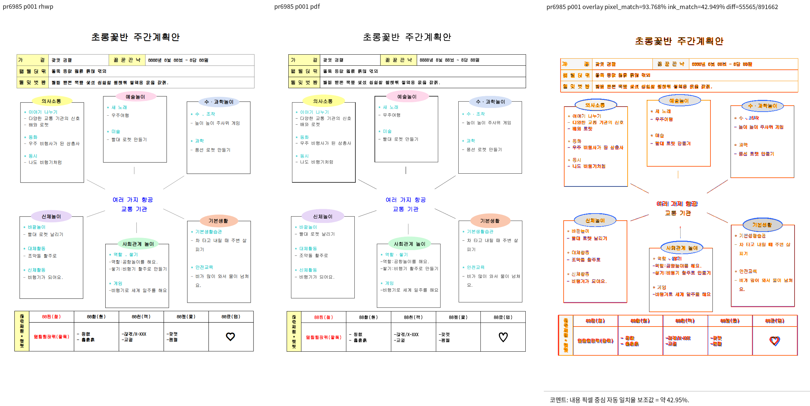

# PR #6985 검토: 비인라인 글상자의 자식 개체 높이 확장

## 최종 판정: 메인터너 보정 후 수용 가능

2026-09-10 제출 전 R4 검증 결과다. 원 PR head `375df9bb7c2574bf174d15e757735c0d7de862a2`만으로는 표 겹침 문제가 남으므로 원본 그대로를 승인하지 않는다. 로컬 `5acf1fd95106d29fd72fa48c00bbe03b2175b243` 위의 메인터너 보정과 포맷 정리를 함께 검증했다. 이 기록과 보정 소스를 같은 일반 코드 commit으로 고정한다.

### 완료한 로컬 검증

| 검증 | 결과 | 소요 시간 |
| --- | --- | --- |
| integration suite prepare | exit 0 | 2초 |
| cargo fmt / fmt check | 각각 exit 0 | 13초 / 12초 |
| native Clippy / WASM lib Clippy | 각각 exit 0 | 44초 / 42초 |
| workspace build / all-targets Clippy | 각각 exit 0 | 96초 / 79초 |
| suite manifest check | exit 0 | 2초 |
| 전체 nextest | 9,387 passed, 46 skipped, exit 0 | 빌드 포함 867초, 테스트 509.745초 |
| Native Skia lib/doc 범위 | 3,930 + 15 + 165 + 2 passed, 13 ignored, exit 0 | 222초 |
| Native Skia missing-picture focused | 2 passed, 185 skipped, exit 0 | 166초 |
| Native Skia direct-PDF focused | 4 passed, 181 skipped, exit 0 | 9초 |

모든 Cargo 검증은 Linux 로컬의 고정 `target/pr-review`에서 순차 실행했다. 전체 회귀 명령은 `cargo nextest run --locked --cargo-profile release-test --target-dir target/pr-review --tests --test-threads 12 --no-fail-fast`다. Clippy는 native, WASM lib, workspace all-targets 모두 `--locked` 및 `-D warnings`로 실행했다. Native Skia는 `--features native-skia`의 lib 검사와 `issue_2225_missing_picture_placeholder`, `render_p37_direct_pdf_export` focused 검사를 실행했다. 상세 재현 명령과 원시 로그는 로컬 `output/pr_6985_20260910/prepush-r4/run-validation.sh`, `output/pr_6985_20260910/prepush-r4/*.log`에만 보관하고 커밋하지 않는다. 이전 R1 회귀 중단(exit 143)은 과거 기록이며 이번 성공과 혼합하지 않는다.

### 최종 시각 증적과 한계

기존 한컴 기준 `pdf/pr6985-synth_textbox_vgrow-2020.pdf`와 R4 대표 PNG를 재사용했다. 이번 단계에서 PDF 또는 PNG를 다시 출력하지 않았다. 앞선 R4에서 직접 확인한 1/1쪽 비교는 상단 표의 큰 위치 차이와 하단 표 겹침이 해소된 근거다. pixel match 93.76838%, visual accuracy proxy 42.94940%, 자동 후보 0/1은 참고 수치이며 전체 글꼴/도형 fidelity의 완전 일치나 사용자 시각 승인으로 해석하지 않는다.



원본 HWP와 기준 PDF의 출처 및 SHA는 아래 기존 provenance 기록을 유지한다. 이전 before/original-PR/R3 PNG 3개는 `output/pr_6985_20260910/prepush-r4/retired-assets/`로 이동했다. 영구 증적은 최종 대표 PNG 1개와 기준 PDF 1개이며, 이전 단계 이미지/로그/SVG/JSON은 제출하지 않는다.

### 검증 소스와 바이너리 식별

| 파일 | 이번 검증 SHA-256 |
| --- | --- |
| `src/renderer/layout.rs` | `335550ad143a92171f48f15cf55a9ff8a1cfceccfb8cccc39824c149b21129ba` |
| `src/renderer/layout/anchor_box_flow.rs` | `0dcf1da951aed590b62e58ef9569487434b409ccc90ee63279d5ed116cef8dc4` |
| `src/renderer/layout/fixed_textbox_flow.rs` | `40427fb69edba638d19ee10fe08907df23efbd545402177024af3b628c19cc06` |
| `target/pr-review/debug/rhwp` | `272dc50ecac1504ff62df1a2fd4e563abd4096d5122c775306d4d37fcc4b0ea7` |

이번 단계의 source 변경은 `cargo fmt`에 따른 `anchor_box_flow.rs` 포맷 정리다. 기존 R4 시각 증적은 이전 source/binary SHA에 귀속되며 아래 원 기록의 SHA를 덮어쓰지 않는다. 이번 재빌드 바이너리로 시각 출력을 다시 검증했다고 주장하지 않는다.

### 원격 제출과 trailing commit 조건

현재 branch는 `review/davindev-pr6985-20260910`이다. 조회 당시 원격 devel은 `ffc88e54fd17be9432d7985cd1c7ffa9aae39d3b`이며, 이번 로컬 검증 base와 같다고 기록하지 않는다. 보정 코드를 포함하는 첫 push는 일반 코드 변경이며 원 PR의 green CI를 재사용하지 않는다. 같은 저장소 검토 branch의 통합 PR에서 새 Full CI를 확인한다. 그 exact code SHA가 green인 뒤 CI 결과/PR 번호 등 문서 및 허용된 최종 증적만 trailing commit으로 추가한다. 새 코드 수정, source rebase 또는 충돌 해결이 생기면 검증 귀속을 다시 판단한다. 이 문서 작성 시 commit/push/새 PR/merge는 아직 수행 전이며, 원 contributor fork는 변경하지 않는다.

### Merge 후 contributor PR comment 계획 (최종본)

- 대상은 원 PR #6985와 관련 이슈 #6974다. 현재 comment/close/merge는 실행하지 않는다.
- 메인터너 보정 commit, 통합 PR, merge SHA와 최종 CI를 확인한 뒤 원 head의 한계와 보정 후 결과를 구분해 설명한다.
- 문서 비교 정본: [PDF/SVG visual sweep 가이드](https://github.com/edwardkim/rhwp/blob/devel/mydocs/manual/verification/visual_sweep_guide.md#github-merge-comment).
- 실제 확인 범위는 1/1쪽, 자동 후보 0/1, pixel match 93.76838%, visual accuracy proxy 42.94940%다. 상단 표 위치와 하단 표 겹침 개선을 설명하고 잔여 글꼴/도형 차이를 함께 알린다.
- 코멘트 이미지에는 `mydocs/pr/assets/pr_6985_20260910/pr6985-maintainer-r4-p001-review.png` 하나만 사용한다. 기존 before/original-PR/R3 이미지는 코멘트에서 사용하지 않는다.
- 이미지 URL 형식: `https://raw.githubusercontent.com/edwardkim/rhwp/<merge-commit-sha>/mydocs/pr/assets/pr_6985_20260910/pr6985-maintainer-r4-p001-review.png`.
- 해당 asset의 devel 반영과 merge SHA를 확인한 뒤 UTF-8 본문 파일을 `gh --body-file`로 게시하고 API로 본문과 이미지 URL을 재조회한다.

## 이전 단계 기록

아래 기록은 각 단계 당시의 관찰과 검증 상태다. 현재 판정 및 comment 계획은 위 제출 전 R4 검증 결과를 우선한다.

## 이전 단계 판정

### 최신 R4 재산출: 상단 표 위치 개선 및 하단 분리 유지 확인 (2026-09-10)

현재 수정본을 빌드하고 기존 한컴 PDF와 비교한 1쪽 review PNG를 직접 열어 확인했다.
**상단 표의 경계선이 크게 위·왼쪽으로 어긋나던 현상이 해소됐고, 하단 표도 세 글상자와
분리된 상태를 유지한다.** 기존의 큰 배치 차이를 확인한 사용자의 overlay 지적에
대응하는 결과다. 글자 획과 일부 도형의 차이는 남아 있으므로 전체 픽셀 일치를
주장하지 않는다. 자동 수치가 아니라 이미지 직접 판독을 우선했다.


| 확인 항목 | 결과 |
|---|---|
| CLI 빌드 | `cargo build --locked --target-dir target/pr-review --bin rhwp`, exit 0 |
| Visual Sweep | exit 0, 96 DPI, webfont, SVG/PDF 1/1쪽, 누락 없음 |
| fidelity 비교 | exit 0, 요청/완료 1/1쪽, SVG 및 layout ledger 생성 |
| 상단 표 직접 판독 | 큰 위치 어긋남 해소 확인 |
| 상단 Table bbox | `(50.0, 132.3, 708.6, 100.7)`; R3 시작점 `(48.1, 115.7)` |
| 한컴 상단 표 시작점 | PDF 경로를 96 DPI로 환산하면 약 `(50.053, 132.176)` |
| 하단 표 직접 판독 | 세 글상자와 비겹침 유지 |
| 하단 Table bbox | `(43.3, 897.7, 712.8, 120.1)`, R3와 동일 |
| 자동 보조 지표 | flagged=0/1, pixel match=93.76838%, visual accuracy proxy=42.94940% |
| 전체 회귀·Clippy·Native Skia | 이번 R4 확인에서는 미실행 |

| R4 식별 대상 | SHA-256 |
|---|---|
| `src/renderer/layout.rs` | `335550ad143a92171f48f15cf55a9ff8a1cfceccfb8cccc39824c149b21129ba` |
| `src/renderer/layout/anchor_box_flow.rs` | `5c16087286ad09bde04435b72c6d7d39c050276c481df87b0968c7f5f42b2e74` |
| `src/renderer/layout/fixed_textbox_flow.rs` | `40427fb69edba638d19ee10fe08907df23efbd545402177024af3b628c19cc06` |
| `src/renderer/layout/shape_layout.rs` | `a1962074d9c2bcd5a7c2f559e191fd0945d81d52bd2b3495961aeb048864d2c2` |
| `target/pr-review/debug/rhwp` | `93cabc0ded42ca5c81d157c6e8d06dcb67a5f1a6be1fbcf32069fd8d9342348e` |

최종 비교 이외의 중간 산출물은 아래 output 경로에만 보관한다.

- compare: `output/pr_6985_20260910/maintainer-r4/visual-sweep/pr6985/compare/compare_001.png`
- overlay: `output/pr_6985_20260910/maintainer-r4/visual-sweep/pr6985/overlay/overlay_001.png`
- review: `output/pr_6985_20260910/maintainer-r4/visual-sweep/pr6985/review/review_001.png`
- fidelity 원장·로그·해시·exit code: `output/pr_6985_20260910/maintainer-r4/`

원본과 기존 한컴 PDF의 해시는 이전 기록과 동일하며 PDF를 다시 변환하지 않았다.
새 최종 비교 PNG만 assets에 추가했다. 전체 회귀·Clippy 등 R4의 최종 검증은 대기이며,
이전 수정본의 통과 기록을 R4에 전용하지 않는다. commit·push·merge는 수행하지 않았다.
이하 R4 미검증 및 이전 단계 판정은 당시 이력이며 현재 상태는 이 절을 따른다.

### R4: 상단 표의 앵커 줄 높이·바깥 여백 보정 (2026-09-10, 검증 전)

상단 표 overlay의 큰 차이는 행 높이 변경보다 전체 위치 이동에서 확인된다.
한컴 PDF의 상단 표 경로는 x=37.540pt, 상단 y=741.868pt(PDF 아래 기준)이며,
96 DPI 좌표로 약 `(50.053, 132.176)`이다. R3 표는 `(48.1, 115.7)`에서 시작한다.
원본 선언 행 높이는 각 2517 HU이며 R3 실측 행 높이도 각 33.56px다.

추적에서는 첫 빈 문단이 y=61.3까지 진행한 뒤 `BehindText` 그림 처리로 y=37.8로
되감긴다. 같은 문단에 고정된 제목 글상자가 있는 형상에 한해 호스트의 본문 줄 높이를
유지하도록 수정했다. 일반 배경 로고 단독 호스트의 기존 동작은 유지하며, 줄 뒤 간격을
추가로 중복 가산하지 않는다.

상단 표 호스트에서 다음 문단까지 저장 간격은 `14779 - 5280 = 9499 HU`다.
이는 `세로 offset 1666 + 표 높이 7551 + 위 여백 141 + 아래 여백 141`과 정확히
일치한다. 이 저장 증거가 있는 분할 없는 비인라인 표에 기존 physical outer-box
paint inset 경로를 적용한다. 단일 단·선언/실측 높이 일치·상하좌우 동일 여백 조건을
유지하고, 표 테두리와 내부 내용을 함께 이동시킨다. 문서별 픽셀 상수는 넣지 않았다.

진단: `output/pr_6985_20260910/top-table-diagnosis/layout-trace.log`.
코드: `src/renderer/layout/anchor_box_flow.rs`, `src/renderer/layout.rs`.
**R4는 미빌드·미검증이다.** R3의 하단 겹침 해소 증거를 상단 보정의 통과 근거로
사용하지 않는다. 전체 회귀·Clippy는 재개하지 않았고 기존 PNG도 덮어쓰지 않았다.

### 최신 R3 재산출: 해당 1쪽의 겹침 해소 직접 확인 (2026-09-10)

수정본을 빌드해 기존 한컴 PDF와 비교한 새 review PNG를 직접 열었다.
**하단 표가 신체놀이·사회관계 놀이·기본생활 글상자 아래로 분리되어,
기존에 글상자와 내용을 가로지르던 겹침이 사라진 것을 확인했다.**
이 판정은 자동 일치율이 아니라 비교 이미지 직접 판독에 근거한다.
상단 표 위치·글꼴·자간 등의 기존 차이는 남아 있어 PDF와 완전히 같다고 주장하지 않는다.

이전 단계 로컬 참고(커밋 제외): `output/pr_6985_20260910/prepush-r4/retired-assets/pr6985-maintainer-r3-p001-review.png`

| 확인 항목 | 결과 |
|---|---|
| `cargo build --locked --target-dir target/pr-review --bin rhwp` | exit 0 |
| Visual Sweep, 96 DPI, webfont | exit 0, SVG/PDF 1/1쪽, 누락 없음 |
| fidelity 비교, 전체 SVG 및 layout ledger | exit 0, 요청/완료 1/1쪽 |
| 이미지 직접 판독 | 하단 표와 세 글상자의 겹침 해소 확인 |
| 하단 Table bbox | `(43.3, 897.7, 712.8, 120.1)`; 이전 y=683.2 |
| 보조 지표 | flagged=0/1, pixel match=92.29360%, visual accuracy proxy=35.16902% |
| 전체 회귀·Clippy·Native Skia | 이번 R3 재산출에서는 미실행 |

현재 R3의 source 및 binary SHA-256:

| 대상 | SHA-256 |
|---|---|
| `src/renderer/layout.rs` | `3668b7cb7693907f63148313c38b28825cd36ab29e9edb2447ce0f1c5dea009a` |
| `src/renderer/layout/fixed_textbox_flow.rs` | `40427fb69edba638d19ee10fe08907df23efbd545402177024af3b628c19cc06` |
| `src/renderer/layout/shape_layout.rs` | `a1962074d9c2bcd5a7c2f559e191fd0945d81d52bd2b3495961aeb048864d2c2` |
| `target/pr-review/debug/rhwp` | `ab527f276aa248540b73a990faa87f3d71589d62166b2b45892ea1c8912dbd67` |

입력과 기존 한컴 PDF 해시는 이전 기록과 동일하다. PDF를 다시 변환하지 않았다.
새 최종 review PNG만 assets에 보관하고, 나머지 산출물은 아래 output 경로에 둔다.

- compare: `output/pr_6985_20260910/maintainer-r3/visual-sweep/pr6985/compare/compare_001.png`
- overlay: `output/pr_6985_20260910/maintainer-r3/visual-sweep/pr6985/overlay/overlay_001.png`
- review: `output/pr_6985_20260910/maintainer-r3/visual-sweep/pr6985/review/review_001.png`
- fidelity 원장: `output/pr_6985_20260910/maintainer-r3/fidelity/`
- 실행 로그·exit code·해시: `output/pr_6985_20260910/maintainer-r3/`

**시각 겹침에 대한 보류 사유는 이번 fixture에서 해소됐다.** 다만 R3의 전체 회귀와
Clippy 등은 아직 검증 대기이며, 이전 수정본의 통과 결과를 R3에 전용하지 않는다.
최종 수용·merge 완료로 기록하지 않는다. commit·push·GitHub 게시·merge는 하지 않았다.
이하 R3 미검증 및 R1/R2 실패 기록은 당시 이력이며 현재 상태는 이 절을 따른다.

### R3: 자리차지 흐름 및 표 전체 높이 교차 보정 (2026-09-10, 검증 전)

원본 레코드와 수정 전 배치 추적에서 확인한 핵심은 다음과 같다.

- 14번 문단의 중앙 하단 글상자(record 400)는 `TopAndBottom`, attr `0x042a4000`, 용지 기준 세로 offset 52344 HU다.
- 15번 문단의 표(record 449)는 attr `0x082a6210`이며 표 자체도 `allowOverlap=1`이다.
- 기존 공간 예약은 페이지 위쪽 1/3 밖의 개체를 제외한다. 추적에서는 14번 문단 뒤의 본문 y가 650.9px에 머무르고, 표는 y=683.2px에 배치된다.
- 표는 글상자 위에서 시작하지만 표 높이 때문에 글상자 영역을 가로지른다. 시작점만 검사하는 회피로는 이 경우를 놓친다.

R2의 `InFrontOfText` 글상자까지 회피 대상으로 삼는 접근과 표의 `allow_overlap`을
차단 조건으로 삼는 접근을 철회했다. 실제 `TopAndBottom` 고정 글상자만 자식 확장을
포함한 본문 예약 밴드로 전달한다. 이 밴드는 문단 커서 이동으로 삭제하지 않고,
소유 문단 구분도 유지한다. 표 배치에서는 실측 표 높이 전체와 교차하는지 검사해
글상자 아래로 진행하며, 이동한 위치가 다른 밴드와 겹치면 반복해서 회피한다.
인라인·회전·기울임·글앞/글뒤 장식 개체는 이번 고정 밴드 경로에 포함하지 않는다.

진단 로그: `output/pr_6985_20260910/maintainer-r3-diagnosis/layout-trace.log`.
**R3는 미빌드·미검증이며 해결 완료로 판정하지 않는다.** 아래 R2 이미지와 해시는
R3의 증적이 아니다. 광범위 테스트는 재개하지 않았다.

### 최신 증적 재산출: 후속 보정도 시각 실패 (2026-09-10)

현재 수정본을 다시 빌드해 1쪽 비교 PNG를 생성하고 직접 열어 확인했다.
**rhwp 하단 표가 신체놀이·사회관계 놀이·기본생활 글상자를 여전히 가로지른다.**
기준 한컴 PDF에서는 표가 글상자 아래에 분리되어 있다. 직전 조건 수정만으로
원인이 해결됐다고 볼 수 없으며, 보정 실패 및 머지 보류를 유지한다.
이하 `후속 수정 미빌드·미검증`은 이전 상태이며 현재 상태는 이 절을 따른다.

| 실행 | 결과 |
|---|---|
| `cargo build --locked --target-dir target/pr-review --bin rhwp` | exit 0 |
| `visual_sweep.py`, 96 DPI, webfont, 기존 한컴 PDF | exit 0, SVG/PDF 1/1쪽, 누락 없음 |
| `fidelity_compare.py`, 전체 1쪽, SVG 및 layout ledger | exit 0, 요청/완료 1/1쪽 |
| 직접 이미지 판독 | 실패: 하단 표와 세 글상자 겹침 유지 |
| 전체 회귀·Clippy·Native Skia | 이번 재산출에서 실행하지 않음 |

실행 완료와 시각 통과는 별개다. 자동 후보는 0/1쪽이지만 실제 겹침이 남아 있다.
하단 Table bbox는 `(43.3, 683.2, 712.8, 120.1)`이고, 내용 픽셀 보조 일치율
29.10935%, 전체 픽셀 일치율 90.94848%는 참고값으로만 기록한다.

최신 결과 경로:

- compare: `output/pr_6985_20260910/maintainer-r2/visual-sweep/pr6985/compare/compare_001.png`
- overlay: `output/pr_6985_20260910/maintainer-r2/visual-sweep/pr6985/overlay/overlay_001.png`
- review: `output/pr_6985_20260910/maintainer-r2/visual-sweep/pr6985/review/review_001.png`
- 실행 로그·exit code·해시: `output/pr_6985_20260910/maintainer-r2/`

| 수정본 식별 대상 | SHA-256 |
|---|---|
| `src/renderer/layout.rs` | `3d606cc1e2f21d161288d663155ca7bbc58472d1fc034990d493b31a138a98e8` |
| `src/renderer/layout/fixed_textbox_flow.rs` | `18f94e4871b6225324bc9d6b88c6b5ee3b1d55c52c77b1fbe34157de52c0cac6` |
| `src/renderer/layout/shape_layout.rs` | `a1962074d9c2bcd5a7c2f559e191fd0945d81d52bd2b3495961aeb048864d2c2` |
| `target/pr-review/debug/rhwp` | `90839814229b7fb7623c07c2e770bc9e1690a49e8755145ded2069fd6762dac8` |

기존 한컴 PDF `pdf/pr6985-synth_textbox_vgrow-2020.pdf`를 재사용했다.
원본과 PDF의 해시는 앞선 기록과 동일하다. 새 한컴 PDF 변환, 기존 asset 덮어쓰기,
중복 비교 asset 추가, 소스 추가 수정, commit·push·merge는 하지 않았다.

### 실패 원인 후속 수정 (2026-09-10, 재검증 전)

이전 보정의 대상 판별이 잘못됐다. 원본의 고정 글상자는 `allowOverlap=1`이며,
하단 글상자에는 `InFrontOfText`가 사용된다. 이전 보정은 두 조건 모두 제외하므로
실제 겹침을 만드는 글상자 영역을 표 배치에 전달하지 못했다. 예를 들어 원본
CTRL_HEADER record 83의 common attr은 `0x042a4000`, record 116은
`0x046a4000`으로 둘 다 bit 14가 설정되어 있다. 진단 원문은
`output/pr_6985_20260910/maintainer-cause-records.txt`에 보관한다.

테두리가 있는 고정 사각 글상자는 `TopAndBottom` 및 `InFrontOfText`를 대상으로
실제 bbox를 예약하도록 수정했다. 겹침 허용 여부는 배치되는 표의
`allow_overlap`으로 판단한다. 글상자 자체의 겹침 허용을 후행 표의 겹침 허용으로
해석하지 않는다. 테두리 없는 제목·라벨, BehindText 배경, 회전·기울임 개체는 제외한다.
빈 문단의 사다리와 글상자 자체의 고정 위치는 바꾸지 않는다.

**이번 후속 수정은 미빌드·미검증이다.** 바로 아래 시각 실패 결과는 이전 보정본의
이력이며, 최신 수정본의 결과로 재사용하지 않는다. 전체 회귀는 재개하지 않았고,
기존 after PNG도 덮어쓰지 않았다. 실제 1쪽 비교에서 겹침 해소를 확인하기 전까지
머지 보류를 유지한다.

### 최신 판정: 메인터너 보정 시각 실패, 전체 회귀 중단 (2026-09-10)

비교 PNG를 직접 확인했다. rhwp의 하단 표가 `신체놀이`, `사회관계 놀이`,
`기본생활` 글상자와 내용을 가로지른다. 한컴 기준 PDF는 하단 표가 글상자 아래에
분리되어 있다. **이번 메인터너 보정은 이 겹침을 해결하지 못했으므로 수용 불가다.**
자동 일치율이나 `flagged=0`을 이 판정의 근거로 삼지 않는다.

workspace 빌드, 포맷 검사, Clippy 3종(native/WASM32/workspace all-targets)은
통과했지만 시각적 해결을 의미하지 않는다. 사용자 지시에 따라 실행 중인 전체
nextest를 중단했다(exit 143). 전체 회귀는 통과가 아니라 **중단·미완료**이며,
추가 Native Skia·WASM 진단 빌드는 실행하지 않았다. 겹침 원인을 수정하고 실제
비교 이미지에서 해결을 확인하기 전까지 광범위 검증을 재개하지 않는다.

이번 실행의 중간 결과는 `output/pr_6985_20260910/maintainer-validation/`에만 둔다.
새 비교 PNG는 기존 after PNG와 동일하여 중복 asset을 추가하지 않았다.
기존 before/after 증적은 실패를 보여주는 비교 자료이지 수용 증거가 아니다.

이하 `검증 대기` 설명은 보정 적용 직후의 이력이며 현재 상태는 이 절을 따른다.

### 메인터너 보정 상태 (2026-09-10, 검증 대기)

용지·쪽 기준의 비인라인 `TopAndBottom` 사각 글상자를 본문 흐름보다 먼저 한 번
렌더링하고, 자식 개체에 맞춰 확장된 실제 bbox를 후속 표의 exclusion에 전달하도록
수정했다. 겹치는 글상자 밴드는 합쳐 표가 다른 글상자에 다시 걸리는 것을 방지한다.
빈 앵커 문단의 흐름에 글상자 높이를 가산하지 않으며, 뒤의 shape pass에서는 이미
그린 글상자를 다시 그리지 않는다. 회전·인라인·겹침 허용 개체는 대상에서 제외한다.

이 보정은 아직 미커밋·미검증이다. 아래 빌드·시각 수치와 기존 PNG는 보정 전
`5acf1fd95106d29fd72fa48c00bbe03b2175b243`의 결과이며, 이번 수정본의 통과 증거가 아니다.
빌드·회귀·Clippy 및 동일 한컴 PDF와의 시각 대조 전에는 보류 사유가 해소됐다고
판정하지 않는다. 상세 범위는 [메인터너 보정 기록](../pr_6985_review_impl.md)을 따른다.

**실제 빌드와 한컴 기준 PDF의 전후 시각 대조를 완료했다. 글상자 높이 확장과 일부 내용 표시 개선은 확인했지만, PR이 해결한다고 설명한 하단 표와 글상자의 겹침은 재현 fixture에서 그대로 남았다.** 자동 지표나 CI 통과만으로 승인하지 않는다.

## 발견 사항

### [P1] 확장된 글상자 높이가 하단 표 배치를 바꾸지 않아 주요 증상이 남는다

- 위치: [shape_layout.rs:2623](../../../src/renderer/layout/shape_layout.rs#L2623), `expand_textbox_to_object_children`의 `shape_node.bbox.height` 갱신.
- 동일 fixture 1쪽을 최신 devel과 PR 적용본으로 각각 빌드·렌더했다. 우하단 TextBox `(x=562.5, y=633.0)`의 높이는 **205.2 → 236.0px**로 늘었다.
- 그러나 Body 아래 Table bbox는 두 결과 모두 **`(x=43.3, y=683.2, w=712.8, h=120.1)`**로 동일하다. 늘어난 글상자와 표가 여전히 겹치며, 글상자 내용을 표의 글자·선이 가로지른다.
- 한컴 기준 PDF에서는 표가 글상자 아래에 분리되어 있다. 표 첫 날짜 셀의 text bbox 상단은 96 DPI 환산 **909.72576px**다. 이 값은 글자 상단이며 rhwp Table bbox의 상단과 같은 종류의 좌표로 차이를 계산하지 않는다. 실제 review PNG에서 표 전체가 다른 높이에 놓인 것을 직접 확인했다.
- 추가 helper는 이미 생성한 shape/textbox의 bbox를 늘리지만, 관측된 결과에서는 후속 표의 배치가 갱신되지 않았다. 글상자 확장치를 후속 본문·표 배치와 일관되게 연결하는 보정이 필요하다. 정확한 상위 배치 원인은 이번 검토에서 수정하지 않았다.
- 신규 `issue_6974_noninline_textbox_expands_to_child_object_height`는 우측 TextBox 높이가 220px를 넘고 자식 하단을 포함하는지 검사한다. 이 조건은 표 겹침이 남은 현재 결과에서도 성립하므로, 후속 Table과의 비겹침·한컴 대응 위치를 검사하는 회귀가 추가로 필요하다.
- 이는 PR이 새로 만든 회귀라는 주장이 아니라, `Fixes #6974`와 PR 본문의 해결 범위를 충족하지 못하는 **미해결 핵심 증상**이다. 부분 개선만 수용하려면 issue 종료·PR 범위를 재정의해야 하며, 현재 범위에서는 보류한다.

## PR 및 검토 대상

| 항목 | 확인 내용 |
| --- | --- |
| PR | https://github.com/edwardkim/rhwp/pull/6985 |
| 관련 issue | https://github.com/edwardkim/rhwp/issues/6974, `Fixes #6974` |
| 작성자 / fork | `davindev` / `kidsnote/rhwp` |
| 원 head | `375df9bb7c2574bf174d15e757735c0d7de862a2` |
| source branch | `fix/6974-textbox-vgrow` |
| 변경 규모 | 1 commit, 3파일, +143 / -2 |
| base | `devel`, 검토 기준 `37bd46a72f9fd9ffd709e35244df79c00e789780` |
| 권한 / 경로 | `jangster77` write, `maintainer_can_modify=true`; collaborator 외부 PR 통합 검토 |
| reviewer | `jangster77` 지정 |
| 로컬 branch | `review/davindev-pr6985-20260910` |
| 체리픽 적용 SHA | `5acf1fd95106d29fd72fa48c00bbe03b2175b243` |
| 변경 적용 | 최신 devel 위에 원 기능 commit 하나를 충돌 없이 적용. 메인터너 source 보정 없음 |
| 작성 시점 원격 상태 | open, non-draft, mergeable / clean. 최종 merge 전 재확인 필요 |
| 코멘트 확인 | PR conversation·review·inline comment 및 관련 issue comment를 조회했고 추가 코멘트는 없었다 |

원 PR head와 통합 검토본을 같은 SHA로 취급하지 않는다. 두 tree의 차이는 기존 #6979의 `table_layout.rs`와 review·오늘할일·PNG·작업 기록이다. 아래 로컬 빌드·시각 결과는 **최신 devel 위 통합본**이며, GitHub CI는 **원 head** 결과다. 동일한 최신 devel을 before로 사용하므로 전후 비교 자체는 이번 PR의 세 파일 변경을 분리한다.

## 실제 빌드와 검증 범위

Ubuntu Linux에서 공유 `target/pr-review`를 유지하며 아래 명령을 두 후보에서 순차 실행했다.

```bash
cargo build --locked --target-dir target/pr-review --bin rhwp
```

- 기준 devel 빌드: exit 0, 1분 28초. 비교용 바이너리를 `output/pr_6985_20260910/rhwp-base`로 복사했다.
- PR 적용본 빌드: exit 0, 36.35초. 실행 바이너리 `target/pr-review/debug/rhwp`.
- Before binary SHA-256: `54324eb7952079ba90a5361157b78d7a06239613b474acf471c4b4430cfeb844`.
- After binary SHA-256: `747049500e9cbc0faa93890b6162d7e776c03af2fe4e09ebbabdf6149de096f5`.
- 적용본 `shape_layout.rs` SHA-256: `a1962074d9c2bcd5a7c2f559e191fd0945d81d52bd2b3495961aeb048864d2c2`.
- 실제 로컬 검증은 빌드, HWP info, 한컴 변환, before/after fidelity·visual sweep 및 직접 이미지/좌표 판독이다. 로컬 Rust 회귀·Clippy·Native Skia·OVR 전수는 이번에 실행하지 않았다.
- [원 head CI](https://github.com/edwardkim/rhwp/actions/runs/34446331088): success. Lint, Native Skia 및 archive A/B/C/D 회귀 통과.
- [원 head CodeQL workflow](https://github.com/edwardkim/rhwp/actions/runs/34446331087): success, Rust 분석 통과. 별도 `CodeQL` 이름의 skip 체크와 구분했다.
- [Render Diff](https://github.com/edwardkim/rhwp/actions/runs/34446330807), [Proptest](https://github.com/edwardkim/rhwp/actions/runs/34446331118), [Adapter](https://github.com/edwardkim/rhwp/actions/runs/34446331153), [CI Impact Policy](https://github.com/edwardkim/rhwp/actions/runs/34447382573): 조회 시 통과.
- 원 head CI 성공을 통합 SHA에서 실행한 전체 회귀라고 기록하지 않는다. 시각 blocker가 있어 현 단계에서 승인·merge하지 않는다.

## 원본과 한컴 기준 PDF

- PR fixture: [synth_textbox_vgrow.hwp](../../../samples/issue6974/synth_textbox_vgrow.hwp), 20,992 bytes.
- 제공자는 실문서 익명화 fixture라고 설명한다. 이번에는 이 공개 fixture만 사용했으며 원 비공개 서식 전체의 품질을 추정하지 않는다.
- 입력 SHA-256: `28132e5692efeaa33879fd7cc04534872a28b580cf86e4dec6bce22584575e8b`.
- `rhwp info --json`: HWP5, format version `5.0.5.0`, 1쪽, `lastSavedWith.version=9.6.0.2416`, `product=null`, printMethod 0.
- 기존 한컴 PDF 첨부나 같은 fixture의 로컬 기준본을 찾지 못해 MCP 변환을 수행했다. 제품 미상 규칙에 따라 **engine 2020**을 명시했다. 버전 번호만으로 원 작성 제품을 단정하지 않는다.
- MCP job `dfaa507f-bb72-4d6e-a595-19d3a4e5873b`: queued → succeeded → download success. 요청·status engine 2020 일치.
- 최종 기준: [pr6985-synth_textbox_vgrow-2020.pdf](../../../pdf/pr6985-synth_textbox_vgrow-2020.pdf), 87,780 bytes. Client 반환 SHA-256과 로컬 파일 SHA-256이 일치했다.
- PDF SHA-256: `fbfd234e78126a4a3995f77fbae6277fcdb58d602c7263320fea5ae0120ba121`.
- PDF SHA-1: `6df191adbd803bf529f05eb00827a1619b06df68`.
- `pdfinfo`: Creator `Hwp 2022 0.0.0.0`, Producer `Hancom PDF 1.3.0.550`, PDF 1.6, 1쪽, 595 x 841pt A4. 실제 metadata와 요청 engine을 구분한다.
- 인증 token·서버 주소·환경 파일 내용은 기록하거나 커밋하지 않는다.

## 실제 시각 검증 명령과 결과

[Visual Sweep 정본](../../manual/verification/visual_sweep_guide.md#github-merge-comment)에 따라 1쪽 전체를 비교했다. 양쪽 모두 96 DPI, `webfont` rasterizer다. 폰트·래스터 차이와 원본 저장 제품 미상이라는 한계는 있지만 표가 글상자를 가로지르는 차이는 단순 glyph 모양 차이로 처리하지 않는다.

```bash
# before는 RHWP_BIN을 output/pr_6985_20260910/rhwp-base로 지정한다.
RHWP_BIN=/home/tsjang/rhwp/target/pr-review/debug/rhwp \
venv/bin/python tools/fidelity_compare/fidelity_compare.py 0 0 \
  --source samples/issue6974/synth_textbox_vgrow.hwp \
  --reference-pdf pdf/pr6985-synth_textbox_vgrow-2020.pdf \
  --label pr6985-head --reference-grade 'Hancom 2020 MCP' \
  --text-only --export-all-svg --layout-ledger \
  --out-dir output/pr_6985_20260910/visual/head-fidelity

venv/bin/python scripts/visual_sweep.py --key pr6985 \
  --hwp samples/issue6974/synth_textbox_vgrow.hwp \
  --pdf pdf/pr6985-synth_textbox_vgrow-2020.pdf --page 1 \
  --rhwp-bin target/pr-review/debug/rhwp \
  --out output/pr_6985_20260910/visual/head-sweep
```

Before는 같은 옵션에 base 바이너리, `pr6985-base` label, `base-fidelity`·`base-sweep` 출력 경로를 사용했다. Before/after fidelity와 sweep 모두 exit 0, PDF/SVG/render tree 각 1쪽, missing 0이었다. 도구 실행 당시 checkout은 통합 검토 SHA이며 before source 식별은 위 devel SHA와 별도 binary hash로 고정한다.

실제 실행 당시 임시 출력 루트는 `pdf/pr_6985_20260910/`였으나, Changes에 중간 산출물이 섞이지 않도록 전체를 `output/pr_6985_20260910/visual/`로 이동했다. 위 명령은 정리된 경로로 다시 실행할 때의 예시다. 기존 manifest·로그의 실행 당시 경로는 provenance로 보존하며 재실행하지 않았다. 비교용 base 바이너리와 임시 HWP 사본은 검토 뒤 제거했으므로 before 재현에는 위 기준 SHA를 다시 빌드해야 한다.

| 항목 | Before devel | After PR 적용본 |
| --- | ---: | ---: |
| PDF / SVG / render tree | 1 / 1 / 1 | 1 / 1 / 1 |
| 직접 review한 페이지 | 1 | 1 |
| 자동 flagged | 0 / 1 | 0 / 1 |
| pixel_match_percent | 90.99883 | 90.94848 |
| visual_accuracy_proxy_percent | 28.62923 | 29.10935 |
| 우하단 TextBox 높이 | 205.2px | 236.0px |
| 하단 Table y | 683.2px | 683.2px |

`flagged=0`은 겹침이 없다는 뜻이 아니었다. 실제 review PNG를 열어 자동 후보가 놓친 겹침을 확인했다. 내용 픽셀 중심 자동 일치율 보조값은 높을수록 유사하고 낮을수록 차이 검토가 필요하며, 사람 판정 정확도가 아니다. 작은 지표 상승만으로 핵심 문제가 해결됐다고 판단하지 않는다.

### 대표 증적

이전 단계 로컬 참고(커밋 제외): `output/pr_6985_20260910/prepush-r4/retired-assets/pr6985-before-p001-review.png`

이전 단계 로컬 참고(커밋 제외): `output/pr_6985_20260910/prepush-r4/retired-assets/pr6985-after-p001-review.png`

대표 패널은 rhwp / 한컴 PDF / overlay 순서다. 두 PNG를 직접 열어 라벨·지표·하단 겹침을 확인했다. after에서는 상단 첫 항목 등 일부 내용이 복원되고 여러 테두리가 늘어났지만, 하단 표가 아래 글상자들을 가로지르는 배치는 유지된다.

진단용 after 경로:

- compare: `/home/tsjang/rhwp/output/pr_6985_20260910/visual/head-sweep/pr6985/compare/compare_001.png`
- overlay: `/home/tsjang/rhwp/output/pr_6985_20260910/visual/head-sweep/pr6985/overlay/overlay_001.png`
- review 임시 경로: `/home/tsjang/rhwp/output/pr_6985_20260910/visual/head-sweep/pr6985/review/review_001.png`
- 장기 review asset: `output/pr_6985_20260910/prepush-r4/retired-assets/pr6985-after-p001-review.png`

최종 포함 대상은 이 review 문서, 필요한 오늘할일, 기준 PDF 한 개와 대표 전후 PNG 두 개다. 기존 PR fixture는 중복 추가하지 않는다. 원시 `.log`는 `output/pr_6985_20260910/`, SVG·render-tree/metric JSON·연락판·개별 raster·중복 비교 PNG는 그 아래 `visual/`에서 관리하며 커밋하지 않는다. 비교용 바이너리와 임시 HWP 사본은 제거했다.

## 보류 해제 조건과 후속 계획

1. 동일 공개 fixture에서 한컴과 같이 하단 표가 글상자 아래로 분리되는지 실제 출력으로 확인한다. 높이 assertion만으로 대체하지 않는다.
2. 개선을 높이 확장으로만 제한할 경우 해결하지 못한 배치 문제를 별도 추적으로 명시하고 `Fixes #6974` 및 완전 해결 주장을 조정한다. 현재 검토는 범위 변경을 임의 승인하지 않는다.
3. 보정을 추가하면 별도 source/test commit과 정확한 integration SHA로 식별하고, focused 회귀·필요한 전체 검증·Clippy 및 실제 시각 비교를 다시 수행한다. 기존 CI 녹색을 새 보정의 성공으로 재사용하지 않는다.

## Merge 후 contributor PR comment 계획

현재 판정은 **머지 보류**이며 GitHub approve/comment/close/push/merge는 수행하지 않았다. Reviewer 지정만 완료했다. 시각 검증은 실제 수행했으나 수용을 지지하는 결과가 아니므로 통과 코멘트를 게시하지 않는다.

후속 보정이 검증되고 merge 승인을 받은 경우에만 [Visual Sweep GitHub merge comment 정본](https://github.com/edwardkim/rhwp/blob/devel/mydocs/manual/verification/visual_sweep_guide.md#github-merge-comment), 실제 후보·merge SHA, 확인한 1쪽과 개선/잔여 범위, 최종 지표를 기록한다. 최종 대표 asset이 devel에 반영된 뒤 `<merge-commit-sha>` 고정 raw URL로 이미지를 포함하고 UTF-8 `--body-file`로 게시한 뒤 API 본문을 확인한다. 아직 존재하지 않는 보정 SHA·성공 수치·merge URL을 미리 만들지 않는다.
