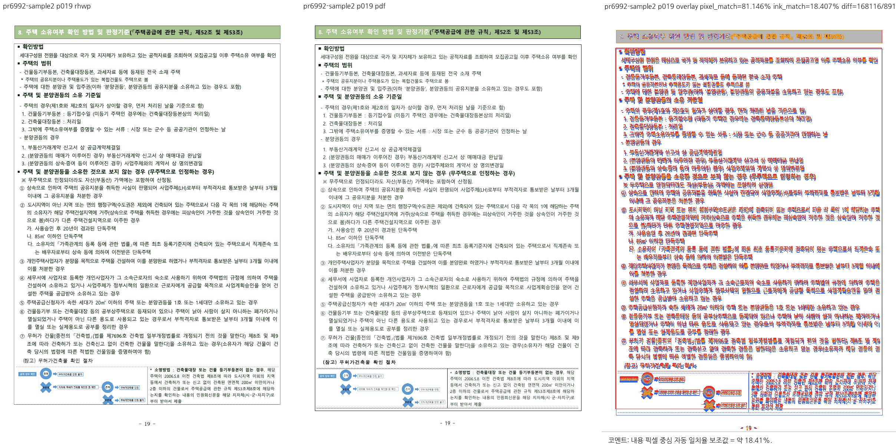
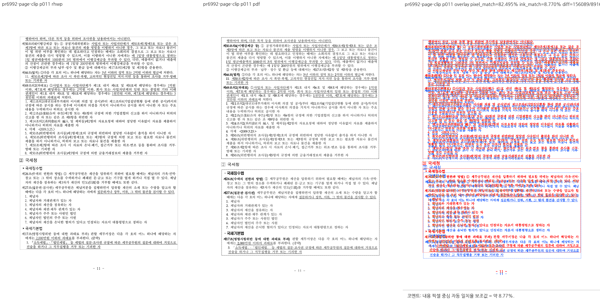

# PR #6992 검토: 안 잘린 중첩 셀의 세로 정렬

## 판정: 수용 가능

PR이 분리한 정상 중첩 셀의 세로 정렬 개선은 수용 가능하다. 최초 검토의 부모 clip 반례는 상위 레이아웃의 가시 높이 제한을 누락한 가정이었다. 해당 보류 근거를 철회한다. 메인터너가 잠정 추가한 제품 source 보정은 제거했고, 원 PR source를 유지한 상태에서 회귀 테스트 2개를 보강하여 기존 3개와 함께 통과했다.

최신 devel 통합 코드 후보의 전체 회귀 9,449개와 GitHub CI가 모두 성공했다. 이 판정은 PR 범위의 수용이며 전체 #4068 해결이나 PDF 완전 일치를 뜻하지 않는다. 아래 문서 trailing head와 merge 이후의 결과는 별도 확인 대상이다.

## 대상과 적용 이력

| 항목 | 내용 |
| --- | --- |
| 원 PR | [#6992](https://github.com/edwardkim/rhwp/pull/6992) |
| 작성자 | planet6897, 기존 기여자 |
| 리뷰어 | jangster77 사전 지정 |
| 검토 경로 | collaborator_external_pr; intake_and_review, local_validation, visual_fixture_evidence |
| 원 head | `dc3ec1becdf250949d99faa64296c150195a6c77` |
| 원 source | planet6897/rhwp, `fix/4068-unclipped-cell-valign`; 마지막 조회 당시 maintainerCanModify=true |
| 최신 동기화 기준 devel | `8644cf0a4a1431de74df7ea5f3acbde9bac05f10` |
| 로컬 branch | `review/planet6897-pr6992-20260910` |
| 출처 보존 체리픽 | `5204fedf580d338e62ddccaaa187e667eab723c2` |
| rebase | 기존 `66f25e744` 기준의 `8fee31418`을 최신 devel 위로 충돌 없이 rebase; 미커밋 변경 보존 |
| 메인터너 테스트 commit | `f99cd08c6`; 회귀 2개 보강, 제품 source 추가 보정 없음 |
| 최신 devel 통합 code candidate | `0af05290103596cda1e36de1650a7afe33db96b1`; base `8644cf0a4`와 일반 merge, 충돌 없음 |
| 통합 PR | [#6998](https://github.com/edwardkim/rhwp/pull/6998); 원 contributor fork는 변경하지 않음 |
| 원 PR 변경 | renderer source 1개, integration test 1개, contributor 비교 PNG 1개 |
| 메인터너 변경 | 기존 integration 파일에 테스트 2개 추가, 이 리뷰 문서, 직접 대조한 대표 PNG 2개; 추가 제품 source 보정 없음 |
| 검증 상태 | code candidate `0af052901` commit/push 및 Full CI 성공. 이 리뷰·오늘할일·대표 PNG만 같은 PR에 trailing commit으로 추가하며 최종 head CI와 merge는 이후 확인 |

## 관련 이슈와 수용 범위

[#4068](https://github.com/edwardkim/rhwp/issues/4068) 중 정상 셀의 `Center`를 잘못 `Top`으로 강제하던 조건을 보정하는 범위다. 그림 dy, 바깥 셀 조각의 재개 위치 등 잔여 차이는 해결 범위가 아니다. #4068을 닫는 PR로 취급하지 않는다.

## 최초 보류 판정의 정정

### 철회: 페이지 내부의 부모 clip만으로 본문이 사라진다는 정적 반례

최초 검토는 page 0..1122, 부모 clip 300..500, 자식 셀 450..650을 가정하고 Center 내용이 부모 밖으로 이동할 수 있다고 판단했다. 하지만 자식 전체 선언 높이가 그대로 정렬에 전달된다는 전제를 검증하지 않았다.

`src/renderer/layout/table_layout.rs`의 실제 호출 경로는 다음과 같다.

- 비-TAC 중첩 표의 `ctrl_area.height`는 부모 내부 영역에서 중첩 표 시작 위치까지의 거리를 뺀 남은 높이다.
- `inferred_viewport_split`은 명시적 split이 없고 중첩 표가 이 viewport보다 크면 가시 행 범위를 계산한다.
- `row_y`는 `split.visible_height`로 제한된 다음 셀 높이와 정렬 계산에 사용된다.
- 따라서 이번 합성 입력에서는 부모 밖의 전체 선언 높이를 기준으로 정렬하지 않는다. paint의 부모 clip 자체가 없다는 뜻은 아니다.

실행으로 확인한 값은 부모 `75.5733..235.5733px`, 중첩 셀 시작 `208.9067px`, 선언 높이 `133.3333px`, 실제 셀 높이 `26.6667px`다. 자식 하단은 부모 하단과 일치한다. Center/Bottom 모두 이 가시 높이로 정렬되고 첫 줄 전체가 부모 안에 남는다.

이전에 추가한 `parent_clip` 전달과 별도 부모 bbox 판정은 이 결함의 필수 보정이라는 근거가 없어 철회했다. 사용자 source를 되돌린 것이 아니라 메인터너가 미커밋으로 추가했던 변경만 제거했다.

### 실패 기록의 해석

- 첫 합성 입력: 기본 문서 스타일/호스트 입력이 불충분해 기대한 글줄을 찾지 못했다. 기존 3개 통과, 신규 2개 실패였다.
- 입력 보완 후: 글줄은 생성됐지만 `InFrontOfText`는 해당 문단 세로 오프셋 적용 경로가 아니었다. 4개 통과, 1개 반례 전제 실패였다.
- `TopAndBottom`과 후속 문단으로 올바른 배치 경로를 사용한 뒤: 상위 viewport 제한으로 셀 높이가 이미 줄어들었다. 이 또한 제품 회귀가 아니라 최초 반례의 전제 실패였다.
- 최종 시험은 위 실제 제한 계약을 검증한다. 실패를 숨기기 위해 오차를 늘리거나 assert를 제거하지 않고, 부모 하단 일치·줄 전체 가시성·가시 높이에 따른 정렬량을 명시적으로 검사한다.
- 중간 한 번은 파생 suite 재배정 전 실행으로 0개 테스트/exit 4였다. 통과로 집계하지 않았으며 `--prepare` 후 재실행했다.

## 로컬 검증 결과

[회귀 테스트](../../../tests/cases/issue_4068_unclipped_cell_honors_valign.rs)의 최종 실행은 8 test threads, `release-test`, `target/pr-review`, `--locked`, `--no-fail-fast`를 사용했다.

```bash
node scripts/rust-test-suite-manifest.mjs --prepare
node scripts/run-rust-test.mjs issue_4068_unclipped_cell_honors_valign -- \
  --cargo-profile release-test --target-dir target/pr-review \
  --test-threads 8 --no-fail-fast
```

**5개 통과, 실패 0개**, nextest run `51533549-0466-4bf0-9585-db2fd6ed1967`, 시험 실행 0.279초. 선택 범위 밖 192개 skip은 이 집중 실행의 필터 결과다.

| 시험 | 판정 |
| --- | --- |
| 정상 중첩 셀의 Center 정렬 | 통과 |
| 정렬 여유 없는 그림 셀 위치 유지 | 통과 |
| #2007 기존 페이지 잘림 보호 | 통과 |
| 부모 viewport에 맞춘 셀 축소 후 Center/Bottom의 첫 줄 전체 보존 | 통과 |
| 부모 안에 온전히 들어간 셀의 Center/Bottom 정렬 유지 | 통과 |

다음 검증도 모두 exit 0으로 완료했다.

- `cargo fmt --all -- --check`
- `node scripts/rust-test-suite-manifest.mjs --check`
- `cargo build --locked --profile release-test --target-dir target/pr-review --bin rhwp`
- `cargo clippy --locked --target-dir target/pr-review -- -D warnings`
- `cargo clippy --locked -p rhwp --lib --target wasm32-unknown-unknown --target-dir target/pr-review -- -D warnings`
- `cargo build --locked --workspace --target-dir target/pr-review`
- `cargo clippy --locked --workspace --all-targets --target-dir target/pr-review -- -D warnings`

이후 최신 devel 통합 코드 `0af052901`에서 전체 회귀를 재실행했다. **9,449개 통과, 실패 0개, 46개 skip**, 시험 실행 318.294초, 8 threads, exit 0이다. 실행 명령은 `cargo nextest run --locked --cargo-profile release-test --target-dir target/pr-review --tests --test-threads 8 --no-fail-fast`다. `issue_2063::huge_cellbreak_table_paginates_without_quadratic_blowup`도 84.812초에 통과했다. 위 fmt·manifest·native/WASM/workspace Clippy·workspace build·시각용 CLI build 묶음도 이 통합본에서 순차로 다시 통과했다.

원 head의 기존 CI, 이전 집중 5개 검증, 최신 통합본 전체 회귀를 구분한다. `.config/nextest.toml`의 `report-skipped` 키를 로컬 nextest가 무시한다는 경고는 있었지만 실제 실행 개수와 exit code로 성공을 확인했다. generated suite와 `.log`는 제출 자료에 포함하지 않는다.

## 기존 원 head CI

원 head `dc3ec1b`에서 이전 조회로 확인한 [Build & Test](https://github.com/edwardkim/rhwp/actions/runs/34473390798/job/102862364991), [CodeQL Rust](https://github.com/edwardkim/rhwp/actions/runs/34473390683/job/102858400324), [Render Diff](https://github.com/edwardkim/rhwp/actions/runs/34473390339/job/102858360115), Adapter·Proptest 및 [CI Impact Policy](https://github.com/edwardkim/rhwp/actions/runs/34474668465)는 성공이었다. 이는 이번 rebase 후 후보 또는 앞으로 추가할 commit의 CI가 아니다. merge 전에는 최종 remote head의 CI·mergeability를 별도로 확인해야 한다.

## 통합 PR 코드 head의 Full CI 성공

[PR #6998](https://github.com/edwardkim/rhwp/pull/6998)의 exact code candidate `0af05290103596cda1e36de1650a7afe33db96b1`에서 다음을 확인했다. base는 `8644cf0a4`, 상태는 `MERGEABLE / CLEAN`, required `Build & Test`는 success였다.

- [CI](https://github.com/edwardkim/rhwp/actions/runs/34483968227): preflight, archive build A-D, 실행된 archive test A-D, lint, Native Skia, 최종 Build & Test 성공. frontend·WASM Build·promotion 및 PR event의 timing refresh는 정책상 skip.
- [CodeQL](https://github.com/edwardkim/rhwp/actions/runs/34483968186): preflight와 JavaScript/TypeScript·Python·Rust Analyze 모두 성공. 같은 head의 GHAS CodeQL check는 neutral.
- [Render Diff](https://github.com/edwardkim/rhwp/actions/runs/34483967637): preflight와 Canvas visual diff 성공.
- [Adapter inter-diff](https://github.com/edwardkim/rhwp/actions/runs/34483968103), [Proptest roundtrip](https://github.com/edwardkim/rhwp/actions/runs/34483968313): preflight와 실행 worker 성공.
- [CI Impact Policy](https://github.com/edwardkim/rhwp/actions/runs/34485631147): exact head의 status success.

## 시각 증적과 한계

이번 검증에서 새로 빌드한 `target/pr-review/release-test/rhwp`를 명시하고 기본 webfont rasterizer로 visual sweep을 수행했다. 대표 비교 PNG 두 장을 직접 열어 확인했다. 최신 devel 통합본 `0af052901`에서도 CLI를 재빌드하고 두 페이지를 재산출했으며, 아래 보관 이미지와 byte-identical임을 `cmp`로 확인했다. 원본과 기준 PDF는 기존 파일을 재사용했으며 새 PDF를 생성하지 않았다.

| 대상 | 기준 PDF | 실제 대조 | pixel_match | visual_accuracy_proxy_percent | 자동 후보 |
| --- | --- | --- | --- | --- | --- |
| `samples/hwpx_sample2.hwp` | `pdf/hwpx_sample2-2024.pdf` | 19쪽 1개 | 81.14577% | 18.40693% | 0쪽 |
| `samples/basic/issue2007_nested_cell_pagination_42065.hwp` | `pdf/basic/issue2007_nested_cell_pagination_42065-hwp-2020.pdf` | 11쪽 1개 | 82.49460% | 8.77003% | 0쪽 |

SVG/render tree는 각각 29쪽/17쪽을 export했지만 PDF raster와 육안 대조는 표의 **각 1쪽만** 수행했다. `flagged=0`은 자동 규칙의 후보가 없다는 뜻이지 PDF 완전 일치가 아니다. 자동 내용 픽셀 일치율 보조값도 제품 정확도나 무회귀 확률이 아니다.

- 19쪽: 하단 중첩 셀의 그림과 본문이 확인된다. PDF와 하단 박스·글자 위치 차이는 남아 있다. contributor의 9.99px→8.11px, 개선 1.88px은 원 PR 이미지에 기재된 값이며 이번 sweep에서 독립 재측정한 값으로 쓰지 않는다.
- 11쪽: 상단의 `행하여야 하며` 첫 줄과 다음 조문이 보인다. 기존 페이지 잘림 시험도 통과했다. PDF와 문단/박스의 전체 위치 차이는 남아 있으므로 전체 페이지 fidelity 통과로 확대하지 않는다.
- `hwpx_sample2.hwp`의 `lastSavedWith`는 `hancom-office-2024`, `13.0.0.3622`다. 선택한 PDF의 Creator도 Hwp 2024 13.0.0.3622, Producer는 Hancom PDF 1.3.0.550이다. Cairo 생성인 `pdf/hwpx_sample2-2020.pdf`를 이름만 보고 한컴 기준으로 사용하지 않았다.
- #2007 선택 PDF의 Creator는 Hwp 2022 0.0.0.0, Producer는 Hancom PDF 1.3.0.550, 17쪽/PDF 1.6이다.





| 자료 | SHA-256 |
| --- | --- |
| `samples/hwpx_sample2.hwp` | `ca66d521d070ac8442e09fd3f283e17611eb9efb45eb4bf6c3a8f65e604f6b5f` |
| `pdf/hwpx_sample2-2024.pdf` | `406d3d9da7967f50dd04e115ca5f53953e61c88d4641005165f251a65d8028af` |
| #2007 HWP | `bebd4ce3691246b0fb3ae332e1d40bc51d9035cddb9fc3d378466b6a8a2b5626` |
| #2007 선택 PDF | `450aae3be8ea99721d3af1fb8772b7771c7a7b818e015c18d16e07fe4348702c` |

원 PR의 `mydocs/report/4068-unclipped-cell-valign/nested-cell-valign-before-after-oracle.png`는 contributor 자료로 별도 보존한다. 이번 원시 SVG/render-tree JSON/로그는 `/tmp/pr6992-*`에 두고, 코멘트에서 사용할 대표 PNG 두 장만 `mydocs/pr/assets/pr_6992_validation_20260910/`에 보관했다.

## 새로운 CI 검증 대상으로의 적합성

PR 범위의 제품 검토 보류는 해제됐다. renderer/test 변경이며 CI 정책을 바꾸지 않는다. 실제 current-base merge 자체인 `0af052901`의 Full CI가 성공했으므로, 이 commit 뒤에 문서-only trailing commit을 추가해 #6991의 green merge candidate 선택을 검증한다. 현재 시점에는 코드 head Full 성공까지만 확인했으며 trailing/post-merge 재사용 성공이나 #6815 전체 해결을 미리 선언하지 않는다.

원 PR은 단일 코드 commit이다. #6991의 성공한 current-base merge 후보 선택 경로를 시험하려면 실제 기준선 통합 후 merge 후보 Full 성공, 문서-only trailing head, candidate SHA/preflight/heavy skip/aggregate, 최종 devel 재사용과 timing 갱신을 각각 관찰해야 한다. 실행하지 않은 원격 경로를 성공으로 기록하지 않는다.

## Merge 후 contributor PR comment 계획

게시 전 최종 head CI와 merge SHA를 확정하고 [Visual Sweep 정본](https://github.com/edwardkim/rhwp/blob/devel/mydocs/manual/verification/visual_sweep_guide.md#github-merge-comment)에 따라 UTF-8 body file을 사용한다. 다음 내용을 중복 없이 기록한다.

- 실제 수용 PR과 merge SHA, 원 PR source provenance 및 최종 PR/devel CI 결과.
- 잠정 부모 clip 보류는 상위 viewport 제한을 빠뜨린 검토 가정이어서 철회했으며, 제품 source 추가 보정 없이 focused 5개가 통과했다는 사실.
- 위 대표 PNG 두 장은 실제 merge SHA에 포함된 것을 확인한 뒤 `raw.githubusercontent.com/edwardkim/rhwp/<실제-merge-SHA>/mydocs/pr/assets/pr_6992_validation_20260910/`의 이미지 URL을 ``로 삽입하여 코멘트에서 바로 보이게 한다. 확정되지 않은 SHA의 링크는 게시하지 않는다.
- 대조한 페이지 범위, 위 두 자동 지표와 후보 0쪽, 남아 있는 PDF 위치 차이를 함께 적는다.
- #4068 전체 해결 및 #6815 CI 재사용 성공을 주장하지 않는다. 실제 closing reference와 해결 범위를 확인한 뒤 후속 issue 처리를 판단한다.

통합 PR #6998의 코드 head push와 CI 확인은 완료했다. 이 기록 작성 시점에 문서 trailing commit·최종 CI·merge·comment·원 PR close는 아직 후속 단계다. 게시 후에는 API로 본문과 이미지 URL을 재조회한다.
