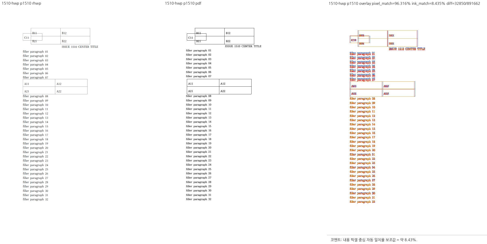

# PR #6994 — #6950 제출 검증 기록

- PR: https://github.com/edwardkim/rhwp/pull/6994
- Issue: #6950
- 작성일: 2026-09-10
- 작성자·담당자: edwardkim (메인테이너 자체 PR)
- base: devel / source: task_m100_6950 / milestone: v1.0.0
- 상태: Open. 코드 후보 CI 성공 확인·메인테이너 승인에 따른 self-review 완료. **문서 후속 HEAD 검증·병합 승인 대기**.
- 제출 후보: `e4f2b1a38`.
- 검증 제품: `a653d23ddfb08a65e88569a9f85b37389f41d500`.
- 최신 base 통합: `61eb331b0a92a7c19e46e36d273ac1e1e4af2746`,
  base `ec822767ae52926479e8fe58bc7003b4e6c82cba`.
- 결과: [최종 보고서](../../report/task_m100_6950_report.md),
  [Stage 3 §31](../../working/task_m100_6950_stage3.md#31-최신-devel-통합-및-제출-전-검증).

## 변경 계약과 보호 범위

텍스트 끝의 자리차지 표가 잔여 너비에 들어가지 않으면 다음 줄의 확정 원점과 점유 범위를
fit·pagination·일반/조각 출력에 전달한다. 다음 줄 점유와 떠 있는 표의 배제 영역을 구분해
명시적 개행·문단 종료 진행량·후속 빈 문단을 보존한다. 표 속성 조회는 raw 부재에 영향받지
않도록 IR 기하를 사용하며 조회 과정의 문서 불변성을 검사했다.

최신 base의 고정 글상자 배제·래퍼 표 여백 처리를 보존했다. #6972 신규 fixture에는
추가 필드의 빈 초기값만 보완했다. 후속 #6991 병합은 CI·문서이며 Rust·Studio·샘플·렌더
검사 입력은 동일하다. 해당 CI delta의 Python56/56·Node291/291 검사도 통과했다.

## 완료한 로컬 검증

| 게이트 | 결과 |
| --- | --- |
| 별도 review worktree prepare·fmt·native/WASM/workspace Clippy·workspace build | PASS |
| manifest·source-side unit tier | PASS |
| 전체 nextest | 9,444 passed / 0 failed / 46 skipped |
| Native Skia lib | 4,112 passed / 0 failed / 13 ignored |
| Native Skia placeholder / direct PDF | 2/2 / 4/4 PASS |
| 새 Docker dev WASM·Native Skia CLI | PASS |
| 렌더 계약·Canvas·Direct PDF·CanvasKit readiness | PASS / 3/3 / 3/3 / 8/8 |
| 제출 source·test·샘플·PDF와 검증 사본 동일성·diff check | PASS |

새 integration test는 `tests/cases/` 원본만 제출했다. generated suite·manifest·Cargo 파생
target·로그·중간 PNG·WASM 산출물은 제외했다. 메인테이너의7700 서버는 재시작하지 않았다.

Canvas 최대0.01761%(허용0.05%), Direct PDF 최대1.15895%(허용2%).
보고 전용 Browser Canvas/PDF4warn과 readiness 초기 폰트·context·커서 경고는 남았다.
nextest 버전·CI 설정 키 경고도 Stage 3에 기록했다. 최종 gate 통과를 무경고와 혼동하지 않는다.

## 시각 증거와 판정 경계

메인테이너가 원본 문단 끝 표·후속 문단, synam30쪽, #6025 1쪽, #1510의 두 형식을
SVG·WASM 및 한컴 편집기에서 확인했다. 최신 조판 통합 뒤 원본3쪽·#1510 HWP1쪽·HWPX2쪽의
SVG6개는 같은 `--font-style` 옵션의 승인본과 바이트 동일했다.
HWP1쪽/HWPX2쪽은 한컴에서도 서로 다르며 기존 쪽수 래칫을 유지했다.

이 대표 PNG를 직접 열어 표 위 본문과 표 아래 재개 흐름을 확인했다. 패널 제목의 `p1510`은
생성기가 파일명 번호를 읽은 표기이며 **실제 문서1쪽**이다. pixel_match96.316%,
ink_match8.435%는 보조 지표로, 글꼴·텍스트의 픽셀 차이를 포함한다. 전체 fidelity 합격 점수나
한컴과의 완전 일치 주장이 아니다. 원본의 작은 용지 높이 합성 실험은 메인테이너 결정으로
이번 범위에서 제외했으며 모든 표 분할 정책을 해결했다고 주장하지 않는다.

## 다음 조건과 merge 후 comment 계획

- 문서 후속 HEAD의 GitHub required checks를 다시 확인한다. 코드 후보 성공만으로 후속 HEAD를 성공 처리하지 않는다.
- 병합 방식·병합·이슈 close는 후속 승인 전 실행하지 않는다.
- 병합 후 승인된 comment에는 #6950의 해결 규칙과 #1510 HWP1쪽/HWPX2쪽 보호 결과,
  위 시각 지표의 한계, 실제 merge SHA의 `mydocs/pr/assets/pr_6994_20260910/issue1510-hwp-physical-p1.png`
  raw 이미지 링크를 넣는다. 현재는 계획만 기록하며 comment를 게시하지 않는다.

## 정식 self-review — 2026-09-10 21:37 KST

자체 PR 경로(`collaborator_self_merge`)에 intake·local validation·visual fixture·대형 PR·
review-only 지침을 적용했다. 외부 reviewer assign이나 자신의 PR에 GitHub approve 이벤트를
시도하지 않는다. 메인테이너의 이번 승인은 self-review 진행이며 병합 승인과 구분한다.

검토 HEAD는 `ed64c1af9da218a02f63eb2edea5c3eefd52e4ca`다.
확인 당시33파일, +5,474/-288, 57commits였다. 추가분은 문서3,039줄·source1,151줄·
tests1,284줄이며, 단계별 작업·통합 이력이 누적된 PR이다. 최종 base 대비 diff로 검토해
이미 base에 반영된 CI 변경을 이번 PR의 제품 변경으로 세지 않았다.

### 코드 및 보호 불변식 재검토

- `ParagraphFloatPlacement`의 단 상대 좌표를 전체 표·첫 조각·후속 frame에서 공유하고,
  새 frame에는 이전 앵커 거리를 재가산하지 않는 전달 경로를 확인했다.
- `NextLine`의 문단 종료는 max 합성으로 중복 소비를 방지한다. `Exclusion`은 뒤 문단을
  표 아래로 강제 이동시키지 않는다. stored-host 원점 복구는 단일 control·유효한 연속
  저장 줄·진행량 일치에 제한돼 HashMap 순서에 따라 서로 다른 원점을 고르지 않는다.
- 명시적 개행·탭·미확정 너비는 폭 부족의 증거로 조작하지 않는다. 무저장/재조판 줄에
  오래된 저장 좌표를 덧씌우지 않는 분기와 NO_LS 본문의 잉크 높이 probe를 확인했다.
- `resolved_table_top`은 표·캡션·내용 생성 전에 적용된다. 이미 paint한 트리의 bbox만
  옮기는 실패 구현은 최종 diff에 없다. #6985·#6643의 독립 보정도 유지됐다.
- 속성 조회는 공통 IR의 부호 있는 offset·0값·여백을 읽으며 raw를 합성하지 않는다.
  새 integration source의25+3개 test 함수, 관련 기존 회귀와 전체 실행 근거를 대조했다.
- baseline 추가는 신규 원본의 raw 헤더 차이3행뿐이다. 기존 쪽수·시각 임계치를 완화하지
  않았다. `61eb331b0..ed64c1af9`에는 source/test/sample/PDF/Studio/Cargo 변경이 없다.

### 실제 GitHub CI 완료 증거

다음은 모두 위 **동일 HEAD**의 completed/success를 직접 조회한 결과다.

- [CI](https://github.com/edwardkim/rhwp/actions/runs/34476075873): Build & Test, Archive A/B/C/D,
  Lint, Native Skia, frontend package 성공.
- [CodeQL](https://github.com/edwardkim/rhwp/actions/runs/34476075865): Rust·Python·JavaScript 분석 성공,
  별도 GHAS CodeQL check도 success.
- [Render Diff](https://github.com/edwardkim/rhwp/actions/runs/34476075502): Canvas visual diff 성공.
- [Adapter inter-diff](https://github.com/edwardkim/rhwp/actions/runs/34476075796) 및
  [Proptest](https://github.com/edwardkim/rhwp/actions/runs/34476075660) 성공.
- CI Impact Policy success. 확인 시 pending/failure 없음, MERGEABLE/CLEAN.
  별도 WASM Build·frontend unit 등 skipped 항목은 실제 실행 성공으로 기록하지 않는다.

### 시각 근거 고정과 한계

대표 PNG를 다시 직접 열어 표 위 filler01~07과 표 아래 filler08 이후 흐름을 확인했다.
이미 기록된 메인테이너 원본·SVG·WASM 판정과 통합 SVG6개 동일성 증거를 함께 사용한다.
정확한 입력/대표 증적 SHA-256:

- 원본 `samples/hwpx/20260909-para-table.hwpx`:
  `cbf2ee7235861e93011d80834bfc49525349f6776c929b98ebd4f06003581d07`
- 기준 `pdf/hwpx/20260909-para-table-2024.pdf`:
  `c24244980c2c428b06575a1d948349a0971ba168898956a2bbfcccda816dc5ad`
- 위 대표 PNG: `7b61fef189dfb9271e1112f19cb26465a0901274eea0803a54751b68c235df5c`

이 검토에서 추가 차단 결함은 발견하지 못했다. 코드 규모에 따른 영향 위험은 넓은 회귀와
실문서 판정으로 확인했지만, 미측정 전면 성능·모든 표 분할 정책·로그 경고 해소까지 보증하지 않는다.

## 최종 판정

- **판정: 승인** — 검토 범위 내 추가 코드 보정 사항 없음.
- 원격 조치: 이 결과·오늘할일·최종 보고서만 동일 branch의 문서 후속 commit으로 제출한다.
- merge 전 조건: 문서 후속 HEAD의 required checks 성공, 최신 mergeability 재확인,
  **메인테이너의 별도 병합 승인**. issue close·branch/worktree 삭제는 아직 수행하지 않는다.
