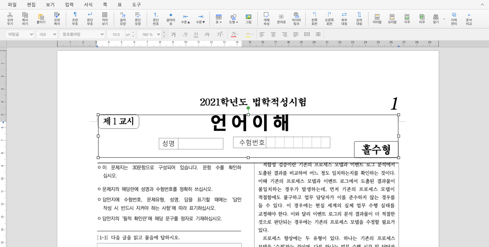
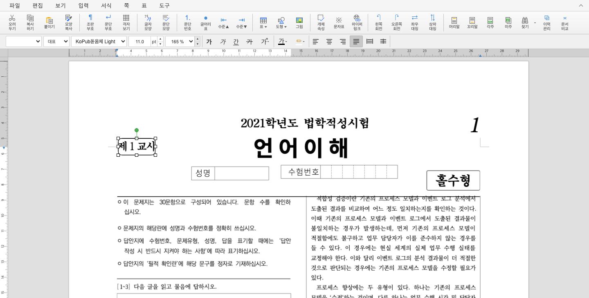
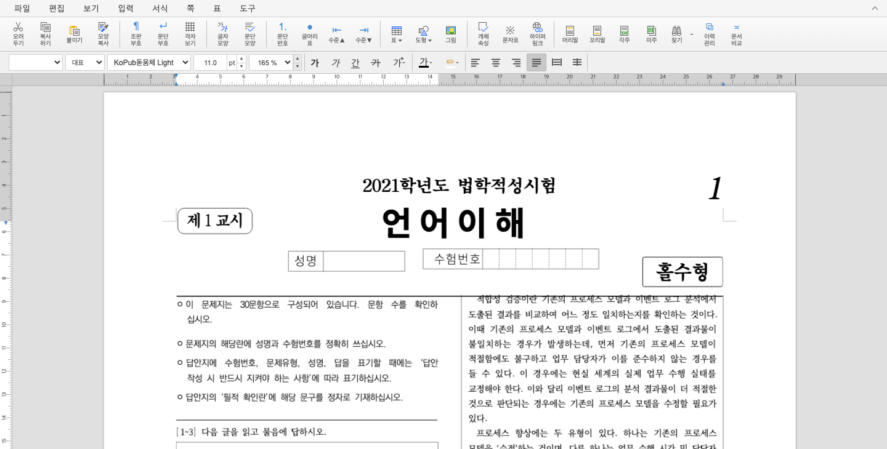

# PR #7014 검토: 표 셀 도형의 cellPath 전달 및 선택·크기 변경 검증

## 판정: 승인

## 검토 대상과 권한

- 검토일: 2026-09-11, 검토자: jangster77.
- 기본 경로: collaborator 매개 외부 PR. 원 PR의 사전 reviewer 할당은 완료했으며, 통합 PR의 owner 자동 지정과 구분한다.
- 작성자 lpaiu-cs는 기존 기여자다. 첫 기여자 절차를 새로 적용하지 않는다.
- 검토 브랜치: `review/lpaiu-cs-7004-7022-20260911`.
- 통합 기준: `upstream/devel b59323de0448df0a42bcb9cdd12cb80d51fe83d2`.
- 체리픽 통합 코드 head: `b788e340a1e5860a09bf89cc1f5fa71ab4b6b1e9`.
- 실제 검증 후보: 위 체리픽 head와 #7010 메인터너 보정 commit `d6b1c25bd584e766dd8121f3678a64919040a37d`의 3개 파일. [통합 검증 기록](pr_7004_review_impl.md)의 SHA-256으로 정확한 내용을 구분한다.
- 사용자가 통합 PR 생성을 승인했다. 검증한 코드와 리뷰·오늘할일·필수 PNG를 제출하며 원 PR/이슈 comment·close·merge는 아직 수행하지 않는다.

## 원본 보존 체리픽

```text
1c6e5dbc40f87a2bc09e1aacdd2d0056ec2c9b1d -> f190e1c6a9905dab95407095b2b60344f82fe752
```

## 변경과 보류 사유 해소

- 연결 Task: #7005. 셀 도형의 control layout에 `cellIdx`, `cellParaIdx`, `outerTableControlIdx` 및 1단계 `cellPath`를 함께 내보낸다.
- 대상은 Rectangle, Line, Ellipse, Path 계열의 해당 셀 도형 경로다. Rust focused 3개는 경로 전달, 같은 body 식별자를 가진 도형 구분, body 도형의 셀 필드 부재를 검증했다.
- 초기 보류 사유였던 실제 UI 미검증은 최신 WASM 브라우저 측정으로 해소했다. 제품 소스에 추가 보정 없이 통합본에서 통과했다.

## 실제 브라우저 검증

- 입력: [21_언어_기출_편집가능본.hwp](../../../samples/21_언어_기출_편집가능본.hwp), 물리 1쪽.
- 환경: macOS Google Chrome headless/Puppeteer, 새 WASM, localhost Vite Node API 서버, 최종 viewport 1440×1100. 증적은 앱 상단 1440×730만 캡처했다. PC 바탕화면·다른 앱 화면은 포함하지 않는다.
- 「제 1 교시」 cellIdx=2와 「홀수형」 cellIdx=4는 body 식별자 (0,0,0)가 같지만 cellPath가 달라야 한다. 실제 클릭 후 Shift+클릭으로 선택 수 **1 → 2** 및 서로 다른 cellPath를 확인했다.
- 실제 오른쪽 resize handle을 30 CSS px 왼쪽으로 드래그했다. 원본 폭 **9070 → 6818**, Ctrl+Z 후 **9070**으로 복원됐다. 높이는 3117 → 3120 → 3117이며, Undo 후 전체 shape properties가 원본과 동일함을 단언했다.
- 직접 WASM document 교체를 반복한 초기 임시 스크립트는 이전 선택 상태의 간섭을 받았다. 단계마다 새 페이지 초기화로 분리했다. CDP 기본 viewport 변경과 30초 navigation timeout도 임시 검증 환경에서 보정한 뒤 최종 재실행을 통과했다. 이 실패를 제품의 cellPath 결함으로 기록하지 않는다.
- 본 자료는 셀 도형 식별과 사용자 입력·Undo 증거다. Hancom PDF와의 전체 페이지 배치 일치를 주장하지 않으므로 기준 PDF를 재변환하지 않았다.

### 최종 코멘트용 시각 증적








## 검증 범위와 잔여 제한

nested cellPath 깊이 2 이상, Group 내부 객체, header/footer, 회전·이동·저장 후 재열기의 직접 UI 검증까지 확장한 승인이 아니다. 이번 판정은 원 PR이 주장한 1단계 셀 도형 경로 및 선택·크기 변경·Undo에 한정한다. 현재 그 범위의 blocker 없음.

## PR·이슈 코멘트 계획

향후 원 PR 및 Task #7005에 원 head·실제 merge SHA·통합 수용 사실·원 PR/통합 PR/devel의 실제 CI 결과와 위 측정값을 적는다. 승인 후 UTF-8 body-file로 게시하고 기존 동일 merge SHA 코멘트가 있으면 수정한다. 이미지 링크만 나열하지 않고 아래 Markdown을 실제 merge SHA로 치환해 **코멘트 안에 직접 렌더링**한다. 아직 게시하거나 원 이슈를 종료하지 않았다.

```markdown


```

## 공통 로컬 검증 결과

| 검증 | 실제 결과 |
| --- | --- |
| Rust 집중 nextest | 11개 통과; 조각 삭제 복원 7개, 캐시 목록 1개, 셀 도형 경로 3개 |
| 전체 nextest, release-test, 8 threads, no-fail-fast | 9,471개 통과, 46개 건너뜀, 실패 0개; 실행 360.994초 |
| Rust export 감사 및 추출기 집중 테스트 | 최종 보정본 13개 통과 |
| Studio 및 npm/editor 통합 Node 테스트 | 최종 보정본 1,649개 통과, 2개 건너뜀 |
| 회전 oracle Python 테스트 | 8개 통과 |
| Undo-depth workflow Python 계약 | 5개 통과 |
| E2E 목록 검사 | 추적 파일 129개와 manifest 129행 일치 |
| cargo fmt --all -- --check | 통과 |
| native Clippy, WASM32 Clippy | 각각 -D warnings 통과 |
| workspace build, workspace all-target Clippy | 각각 통과 |
| Rust suite manifest --check | 1,258 sources, 28 suites + 20 exceptions, 48/48 targets 일치 |
| 잠금 파일 보호 wrapper WASM 빌드 | 통과; 210초, 새 pkg 사용 |
| Studio tsc + Vite production build | 통과 |
| 실제 Vite Undo 깊이 E2E | 110라운드, 이력 255개, 조각 삭제 103개, snapshot 슬롯 0, 키보드 Undo 255/255 통과 |

모든 Cargo 계열 명령은 Mac의 `target/pr-review`에서 순차 실행했다. 전체 회귀에 `cargo test --profile release-test --tests`를 사용하지 않았다. 원 PR의 CI 성공을 로컬 실행 결과로 바꿔 기록하지 않는다. 원시 로그·임시 스크립트·JSON은 커밋 대상에서 제외한다.

## 원 PR의 최신 상태

- 원 head: `1c6e5dbc40f87a2bc09e1aacdd2d0056ec2c9b1d`; OPEN, non-draft.
- 마지막 조회에서 원 head 추가 변경 없음. 본문 댓글 0개, 제출된 review 0개.
- 아래는 원 head의 원격 결과다. 아직 생성하지 않은 통합 PR의 CI 결과가 아니다. CodeQL의 NEUTRAL은 SUCCESS로 바꿔 적지 않는다.

| 확인 항목 | 결과 | 증적 |
| --- | --- | --- |
| Canvas visual diff | SUCCESS | [실제 검사](https://github.com/edwardkim/rhwp/actions/runs/34564202874/job/103152897155) |
| adapter inter-diff | SUCCESS | [실제 검사](https://github.com/edwardkim/rhwp/actions/runs/34564203066/job/103152910114) |
| prop roundtrip | SUCCESS | [실제 검사](https://github.com/edwardkim/rhwp/actions/runs/34564203201/job/103152909586) |
| Build & Test | SUCCESS | [실제 검사](https://github.com/edwardkim/rhwp/actions/runs/34564203077/job/103155504797) |
| CodeQL | NEUTRAL | [실제 검사](https://github.com/edwardkim/rhwp/runs/103155684325) |
| CI Impact Policy | SUCCESS | [실제 검사](https://github.com/edwardkim/rhwp/actions/runs/34565177736) |

## 다음 원격 게이트

이 판정은 GitHub approve/merge 실행이 아니다. 보정을 포함한 최종 통합 commit과 문서·필수 PNG를 확정한 뒤, 승인된 통합 PR의 최신 head CI 및 mergeability를 확인해야 한다. 원 PR 직접 merge나 원 이슈 조기 종료를 수행하지 않는다.
