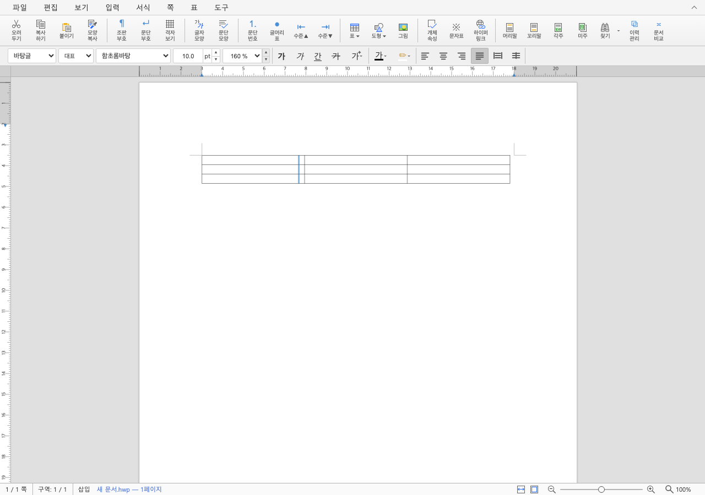

# PR #7026 검토: 다쪽 배치의 표 오버레이 X 좌표

## 판정: 승인

- 원 PR: https://github.com/edwardkim/rhwp/pull/7026
- 기여자: `planet6897`; 관련 이슈: [#7025](https://github.com/edwardkim/rhwp/issues/7025).
- source head `4e96610ed9d4b320a78e664ecef72ecb3e72cc21`, 로컬 `fe61d71c5`·`c16aa15fe`.
- 최신 원격 head는 동일하며 추가 커밋이 없다.

## 본문 계약과 검토

표 resize 안내선 2곳, 객체 선택 4곳, 셀 선택 2곳의 단일 쪽 중앙 정렬 계산을
`VirtualScroll.getPageLeftResolved()`로 통일했다. caret·field marker는 이미 grid 분기를
가진 경로를 같은 helper로 정리한 것으로, 이전부터 모두 깨져 있었다고 판단하지 않는다.

## 검증과 보류 해소

검토 후보에서 새 WASM을 빌드하고 별도 Vite/Chrome으로 원 PR의 #7025 E2E를 실행했다.
한 쪽·뒤쪽 쪽·두 쪽 오른쪽 열·3열 셋째 열·맞쪽 첫 쪽, 과거 중앙 정렬식과 달라지는 조건,
실제 hover cursor/marker를 포함한 14개 assertion이 통과했다. 추가로 객체 테두리·회전 테두리·
셀 highlight·phase marker의 네 배치별 DOM 좌표 검사 16개가 통과했다.

Studio 전체 1,659개 통과·2개 skip, TypeScript 통과, 통합 Rust 9,473개 통과·46개 skip,
빌드·Clippy도 통과했다. 원 head CI rollup은 `SUCCESS`이며 별도 CodeQL `NEUTRAL` 표시와
실제 성공한 분석을 구분한다. 로컬 동작 검증이 없었던 초기 보류 사유를 해소했다.
별도 제품 보정은 필요하지 않았다.

## 시각 증거의 실제 범위

위 사진은 합성 새 문서의 표 hover 캡처다. 다쪽 전체 화면 증거라고 부르지 않는다.
다쪽 좌표는 E2E와 추가 DOM 검사로 검증했다. 기여자의 [사설 문서 전후 보고서](../../report/grid-overlay-page-left-7025/README.md)와
그 안의 before/after PNG도 직접 열어 비교했으나, 사설 문서 3190263을 이번에 다시 로드한 것은 아니다.

상세 실행·환경·범위는 [통합 기록](pr_7024_review_impl.md)을 따른다.

## 원 PR/이슈 후속 기록 계획

merge 후 #7026·#7025에 merge SHA와 실제 CI, 수용 판정, 위 PNG를 확정 SHA URL의 ``
문법으로 넣어 comment에서 바로 보이게 한다. 합성 입력과 기여자 원본 증거를 구분하고 기존
comment가 있으면 수정한다. closing reference가 비어 있으므로 자동 close를 가정하지 않는다.
통합 PR 생성·merge·후속 처리는 아직 수행하지 않았다.
