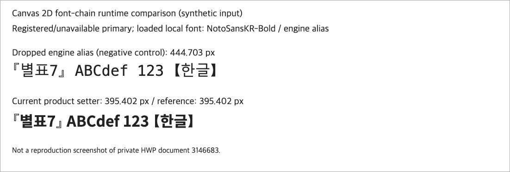

# PR #7031 검토: Canvas 폰트 치환의 엔진 후보 보존

## 판정: 승인

- 원 PR: https://github.com/edwardkim/rhwp/pull/7031
- 기여자: `planet6897`; 관련 이슈: [#6600](https://github.com/edwardkim/rhwp/issues/6600).
- source head `d706e7ecda2e5d3fb202a330e3ecf3f90e2fd51f`, 로컬 `af0fe858c`.
- 최신 원격 head는 동일하며 추가 커밋이 없다.

## 본문 계약과 초기 보류 사유

Canvas의 `font` 치환이 첫 family만 보고 엔진의 설치 별칭·후속 후보를 버리던 경로를 보완했다.
Studio가 고른 첫 face, 엔진 후보 전체, Studio의 나머지 후보 순서를 유지하고 대소문자 중복을
제거한다. 인용·escape·이름 안 쉼표도 파싱한다. 기존 Studio 우선 치환을 없애거나 모든
미등록 이름에서 엔진 후보가 무조건 최우선이 되도록 하는 변경은 아니다.

기존 추가 테스트는 parser/formatter 중심이어서 실제 설치된 setter와 글리프 공급을 검증하지
못했다. 이 공백을 초기 보류 사유로 기록했고 메인터너 실행 회귀를 추가했다.

## 메인터너 보완과 재검증

[영구 회귀 테스트](../../../rhwp-studio/tests/review-runtime-contracts.test.ts)는 실제 bridge
초기화가 설치한 Canvas setter를 호출한다. 엔진 별칭, 기존 첫 face, 이름 안 쉼표, 중복 제거를
확인했다. 엔진 체인 병합을 제거한 메모리 내 음성 대조가 실패함도 확인했다.

새 후보 WASM/Chrome에서는 로컬 `NotoSansKR-Bold.woff2`를 `FontFace`로 로드했다.
등록됐지만 없는 선두 face, 실제 로드된 검증용 엔진 별칭, 동일한 전체 fallback으로 비교했다.
제품 setter 출력 395.401825px가 직접 기준 395.401825px와 일치했고, 엔진 별칭을 뺀 대조군은
444.703125px로 달랐다. 미등록 첫 이름의 기존 Studio 우선 치환도 별도로 보존됨을 확인했다.

초기 합성 검증에서 우선순위와 fallback 목록이 다른 값을 비교한 실패는 임시 스크립트의 문제로
분류해 정정했다. 제품 우선순위를 바꾸거나 차이 허용값을 늘려 통과시키지 않았다.
Studio 1,659개 통과·2개 skip, 새 runtime 묶음 6개 통과, TypeScript·통합 Rust 9,473개
통과·46개 skip 및 빌드/Clippy를 확인했다. 원 head CI rollup은 `SUCCESS`이며 CodeQL의 별도
`NEUTRAL` 표시를 성공으로 바꿔 기록하지 않는다. 초기 보류 사유를 해소했다.

## 시각 증거와 범위

위 사진은 실제 Chrome Canvas와 로컬 폰트의 합성 실행 증거다. 사설 HWP 3146683의 재현
사진이나 모든 글꼴·문서·PDF의 정합 증거가 아니다. 기여자의 [원본 전후 보고서](../../report/studio-cjk-bracket-face-6600/README.md)와
before/after crop도 직접 열어 확인했다. 그 문서의 Windows 실측을 이번 Mac 실행으로 적지 않는다.
#6600 중 Studio 후보 손실의 범위에 한정하며, 별개 원인의 문서/고정 공백 문제까지 해결됐다고
주장하지 않는다. 상세 범위는 [통합 기록](pr_7024_review_impl.md)을 따른다.

## 원 PR/이슈 후속 기록 계획

merge 후 #7031·#6600에 merge SHA, 실제 CI, 이번 수용 범위, 위 PNG를 확정 SHA의 Markdown
이미지로 삽입한다. 기존 comment는 수정해 중복을 피한다. #6600의 전체 범위와 잔여 항목을
확인하기 전에는 통합 수용만으로 이슈 전체를 close하지 않는다. 통합 PR·merge·후속 comment는
아직 수행하지 않았다.
