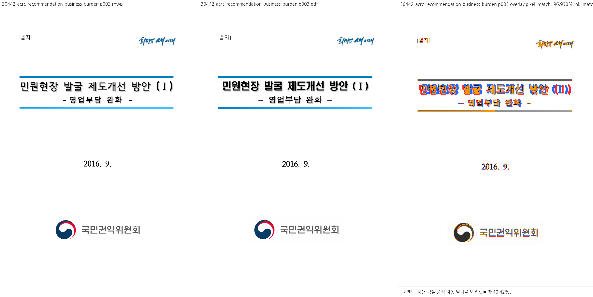

# PR #7037 검토: HWP5 한 축 그림 자르기 배율

## 판정: 승인 (검증 보완 완료, #7015 기능 범위)

- 원 PR: https://github.com/edwardkim/rhwp/pull/7037
- 작성자: planet6897. 원 fork PR을 유지하며 체리픽 통합 PR을 새로 만들지 않는다.
- 기여 SHA: `a3a6cc87a2d1af5315f25dac985d76a50f4a636d`.
- devel 정렬 SHA: `1077cc6b58d06f9a045cf516684314a1f8c6905e`.
- 최종 코드/테스트·증적 후보: `05eeaeef8773d206bdb3afc32a909ad6a087b16b`.
- 문서 작성 시 원 PR은 OPEN이며 merge·post-merge 검증 결과를 선기록하지 않는다.
- 기능 종료 대상은 본문의 `closes #7015`. GraphQL closingIssuesReferences는 조회 시 빈 배열이므로 본문 및 실제 이슈 상태를 별도로 확인해야 한다. #6901은 별도 CI 운영 검증 대상이며 자동 종료 대상으로 추가하지 않는다.

## 검토 내용과 범위

`compute_image_crop_src`의 유효한 imgDim 우선 경로를 유지하면서, HWP5 폴백의 배율을 축별로 판정한다. 실물 입력 `(0, 20745, 88560, 45453)`, 1181×945 그림에서 잘리지 않은 가로 축 배율을 세로 축에도 사용한다. 기존 y=431.3, 높이=513.7 대신 y=276.64685, 높이=329.49580으로 원본 로고 잉크 y=324..562를 포함한다.

- 실물 회귀는 공개 렌더 경로의 3쪽 SVG 자르기 창과 잉크 포함을 확인한다.
- #3239의 잘리지 않은 200dpi 폴백과 유효 imgDim 경로를 기존 집중 테스트로 확인했다.
- 메인터너 보완은 반대 축 자르기, 기준 크기의 가로/세로가 각각 0인 무효 입력을 기존 단위 테스트 안에 추가한 것이다. 제품 코드를 추가 변경하거나 source-side 시험 총량·기준선을 완화하지 않았다.
- `crop_start=0`만으로 모든 문서의 반대쪽 끝도 잘리지 않았다고 일반적으로 증명할 수는 없다. 이번 승인은 #7015 실물 사례와 검증한 기존 계약 범위이며 임의의 모든 crop 표현이나 전체 렌더 fidelity 해결을 의미하지 않는다.
- [메인터너 분석·수정·검증 기록](../../working/task_m100_7015_maintainer_stage1.md).

## 로컬 검증

macOS, `CARGO_TARGET_DIR=target/pr-review`, 전체 회귀 `--test-threads 8 --no-fail-fast`. 사용자 공유 산출물은 제거하지 않았다. 로그와 임시 SVG/JSON은 저장소 밖에 보관한다.

| 대상 | 기준 SHA | 결과 |
| --- | --- | --- |
| crop 단위 집중 | `1077cc6b5` | 8개 통과 |
| #7015 실물 렌더 집중 | `1077cc6b5` | 1개 통과 |
| 전체 integration nextest | `1077cc6b5` | 9,489개 통과, 실패 0, 기존 skip 46 |
| Native Skia lib | `1077cc6b5` | workspace 합계 4,112개 통과, ignore 13 |
| Native PNG / 직접 PDF | `1077cc6b5` | 각각 2개 / 4개 통과 |
| fmt, native/WASM32/workspace all-target Clippy, workspace build | `1077cc6b5` | 통과 |
| Docker 없는 WASM build | `1077cc6b5` | 통과, 별도 임시 pkg 출력 |
| suite manifest / unit tier | `1077cc6b5` | 통과, source-side 4,205개 유지 |
| 반대 축·무효 imgDim 보완 후 crop 단위 집중 | `05eeaeef8` 변경 내용 | 8개 통과, 기존 테스트 내부 assertion 추가 |
| 보완 후 fmt·세 Clippy·workspace build·manifest·unit tier | `05eeaeef8` 변경 내용 | 모두 통과, 4,205개 유지 |

신규 HWP를 `RHWP_SECURITY_SWEEP_SAMPLES_JSON`으로 전달해 전체 회귀에서 신규 문서 보안 스윕도 실행했다. 전체 로컬 회귀와 WASM/Skia 실행은 `1077cc6b5` 기준이며, 테스트 전용 보완 뒤 같은 전체 로컬 실행을 다시 했다고 기록하지 않는다. 최종 후보 전체 검증은 아래 원격 Full CI 결과로 보완한다.

## 최종 후보 원격 CI

모두 `05eeaeef8773d206bdb3afc32a909ad6a087b16b` 기준이다.

- [CI 34609842928](https://github.com/edwardkim/rhwp/actions/runs/34609842928): 성공. Lint, Native Skia, archive A/B/C/D 빌드·실행과 Build & Test 모두 실제 성공. WASM 전용 job, frontend unit/package, workflow promotion은 정책상 skip. PR 이벤트의 duration refresh도 expected skip이다.
- [CodeQL 34609842763](https://github.com/edwardkim/rhwp/actions/runs/34609842763): 성공. Rust·JavaScript/TypeScript·Python Analyze 모두 실제 성공.
- [Adapter 34609842707](https://github.com/edwardkim/rhwp/actions/runs/34609842707), [Proptest 34609842753](https://github.com/edwardkim/rhwp/actions/runs/34609842753), [Render Diff 34609841869](https://github.com/edwardkim/rhwp/actions/runs/34609841869): preflight와 실행 worker 성공.
- fork duration 발행 확인: `nextest-target-durations-34609842928-attempt-1-b` (artifact 10268515728), `...-c` (10268610369), `...-d` (10268067930). 모두 미만료. 세 artifact가 존재한다는 사실과 post-merge 신뢰 검증·소비 성공은 구분한다.

## 시각적 증적

- 원본: [30442-acrc-recommendation-business-burden.hwp](../../../samples/issue7015/30442-acrc-recommendation-business-burden.hwp). SHA256 `abcb65b90aae8af209d69df8a4eb658b569559ff05a81e7370620d848bd708e4`.
- 정본: [Hancom PDF](../../../pdf/30442-acrc-recommendation-business-burden-2020.pdf). SHA256 `07e129d80d0f289acfc7b02e2712160e248efff12230c1ed415df29d6e6b064b`.
- 저장 메타 버전 `7.5.12.754`에 따라 MCP engine 2020을 비동기로 사용했다. PDF Creator `Hwp 2022 0.0.0.0`, Producer `Hancom PDF 1.3.0.550`, PDF 1.6, 17쪽을 확인했다.
- 렌더러: 검증 후보로 빌드한 `target/pr-review/debug/rhwp`. visual sweep의 SVG/webfont 래스터 경로로 **3쪽만** 대조했다.
- [대표 대조 PNG](../assets/pr_7037_20260911/logo-p003.png). SHA256 `0f0c56a3ca38ca322b7c571c5e96c0657ec32ac9eed21e612a6f89cfe3b5e779`.
- 로고가 잘리지 않고 양쪽에서 전체 표시되는 것을 직접 확인했다. pixel match 96.93023%, ink proxy 40.41923%, frame drift flag 없음. 지표만으로 통과시키지 않았으며 제목 폰트 굵기·형태와 선 색상 차이는 남아 있다. 전체 17쪽 시각 일치나 Studio 붙여넣기 검증을 수행했다고 주장하지 않는다.

## 머지 후 contributor PR·이슈 코멘트 계획

1. 최신 후행 head의 required check와 MERGEABLE/CLEAN을 재확인하고 원 PR을 일반 merge commit으로 병합한다. contributor fork branch는 보존한다.
2. merge SHA의 실제 CI/CodeQL/Adapter/Proptest 및 존재하는 Render Diff 결과를 확인한다. #6901은 Full run 선택·reuse=true·heavy skip·duration refresh 성공과 provenance까지 실제 확인한 경우에만 종료한다.
3. 원 PR과 #7015에 기존 동일 merge 결과 코멘트가 있는지 확인한다. 없으면 UTF-8 body file로 한 번 게시하고 API로 body를 재조회한다. 기존 코멘트가 있으면 갱신한다.
4. 코멘트에는 merge SHA, 최종 PR/devel CI 링크, 위 로컬 검증의 기준 SHA 차이, 기능 판정과 잔여 시각 차이를 명시한다. 이미지는 merge SHA에 고정된 `raw.githubusercontent.com/edwardkim/rhwp/<merge-sha>/mydocs/pr/assets/pr_7037_20260911/logo-p003.png`를 Markdown 이미지로 삽입하여 코멘트에서 바로 보이게 한다. HWP/PDF와 review는 같은 SHA의 파일 링크를 함께 제공한다.
5. #7015의 실제 auto-close 상태를 API로 확인하고 미종료이면 검증 근거 코멘트 후 완료 처리한다. #6901은 기능 이슈와 별도 종료 판단이다.
6. clean·실행 작업 부재·merge 포함 및 소유 확인 뒤 이번 로컬 검토 브랜치만 정리한다. 원 fork와 기본 작업공간 및 공유 target은 보존한다.
