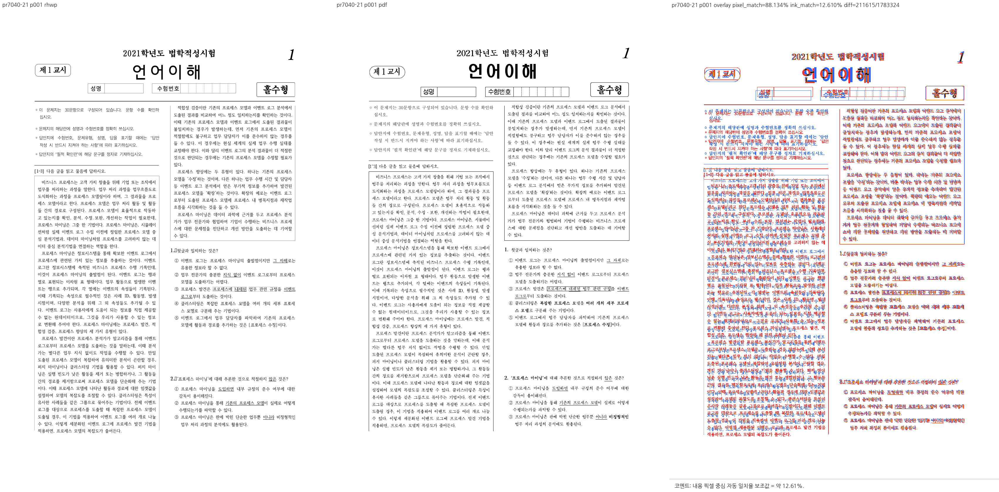

# PR #7040 — 누적 체리픽 검토

## 최종 판정

**메인터너 보정 후 수용 가능**. 보정 후보의 로컬 검증·직접 visual sweep을 완료했다.
원 head 단독 승인으로 해석하지 않는다. 최신 integration head의 GitHub CI는 merge 전 조건이다.
#7048의 진단 동작 검증과 미해결 한컴 렌더링 일치 판정은 구분하며, 이 기록에서 통합 merge를 완료 처리하지 않는다.

## 메인터너 보정 검증 — 2026-09-12

- 작업 branch: `review/nondraft-7040-7053-20260912`, 기준 `upstream/devel` `ea5d1ff70b1d50301d1e6fdd26248e9d9c10c1fa`.
- 생산 코드·회귀 보정 `8099aa8b2`, 측정 회귀 입력 보정 `6456aff3a`; 최종 실행 후보 **`6456aff3a0ee3fea70a12a7d167192e094e971fc`**.
- #7050 최신 source `de3301a03891ff2a9287f907f6944a38cf59720b`는 `78f2a85b1`에 이미 포함됐다.
  원 contributor history는 유지하고 보정 commit을 별도로 더했다. 아래 과거 검토의 보류 사유는 이 보정으로 재판정한다.
- 원 PR CI 네 건은 성공했다. #7050의 별도 CodeQL Rust도 마지막 조회에서 완료·성공했다.
  새 메인터너 후보의 GitHub CI·PR 생성·merge는 아직 실행하지 않았다. 원 source CI를 새 후보 CI로 이월하지 않는다.

### 이번 후보의 실제 검증

macOS arm64 / Rust 1.93.1 / review 전용 `target/pr-review`. 소유·공유 상태와 기존 Cargo 작업 부재를
확인하고 실행했다. shared target과 다른 worktree는 삭제하지 않았다.

- 파생 suite 준비 → fmt → fmt check → native Clippy → WASM32 Clippy → workspace build →
  workspace all-target Clippy → manifest check를 순차 통과했다. 모든 Clippy는 `--locked`, `-D warnings`다.
- 집중 nextest: `Summary [   0.386s] 25 tests run: 25 passed, 9548 skipped`; exit 0.
- 전체 nextest: `Summary [ 433.012s] 9527 tests run: 9527 passed (5 slow, 1 leaky), 46 skipped`; exit 0. 새 fixture를 `RHWP_SECURITY_SWEEP_SAMPLES_JSON`에 명시했고 코퍼스 래칫도 통과했다.
- Native Skia lib: **4,112 PASS / 0 FAIL / 13 ignored**, exit 0.
  placeholder **2 PASS**, direct PDF **4 PASS**, 각각 exit 0.
- WASM: 공식 `scripts/wasm-pack-locked.sh --target web --out-dir <검증경로>/wasm-pkg --no-opt`, exit 0.
  Docker daemon 연결 불가로 사용한 native 진단 경로이며, 최적화 배포 빌드 통과를 뜻하지 않는다.
- native↔WASM SVG: 원본 4종의 첫 쪽, 화학 표시기준 15쪽, PAGE/TOTAL_PAGE 정·역순 변형 각 12쪽,
  **7종 / 29쪽 모두 MATCH**, 각 실행 exit 0. Node WASM 직접 실행이며 브라우저 editor E2E는 아니다.
- source-side `#[cfg(test)]` 변경은 없어 unit-tier 추가 gate는 비해당. generated suite·manifest는 stage하지 않았다.

재현 명령은 아래 과거 검토의 lint/full/Native 명령과 같으며, focused 식에
`maintainer_nested_table_lines|`를 추가했다. 새 WASM/시각 출력과 전체 원시 로그는
`/tmp/rhwp-maintainer-validation`에 보관했다. 실제 실행 명령의 전체 순서는
`/tmp/rhwp-maintainer-validate.py`, 결과는 `results.jsonl`의 각 단계 마지막 완료값이다.
중간 테스트 입력 실패를 성공으로 세지 않았으며, 2-cell host로 수정한 최종 후보에서 전체를 재실행했다.
이후 `6b0c396b5`에서 기존 body/footer 검사도 옛 진단에서 통과한다는 사실을 테스트 주석에 정정했다.
테스트 본문·생산 동작은 그대로이고 Rust lint 8단계를 다시 통과했다(`final-lint-results.json`).

### Visual sweep 수정 전후 비교

[Visual Sweep 정본](../../manual/verification/visual_sweep_guide.md#github-merge-comment)을 적용했다.
사용한 debug CLI의 SHA-256은 `1e2b7bdacca1c41ddab986ad423f364b47fb9b54d4142d0679143d3405b8a8ee`다.
`8099aa8b2`에서 빌드했으며 뒤의 `6456aff3a`는 테스트 입력만 바꿔 생산 source가 동일하다.
release CLI나 최적화 배포 WASM을 사용한 것으로 기록하지 않는다.

- 비교 전: 보관한 최초 누적 후보 `522a2e80db04cbd84264406ccb8bdd33a21dcc55`.
  비교 후: 위 최종 보정 후보. 이 비교에는 #7050 최신 source 갱신도 들어간다.
  비교 전을 upstream/devel 또는 직전 `71213f7e6`으로 잘못 표기하지 않는다.
- 원본 5종 **126쪽의 SVG·render tree가 byte 단위로 동일**했다.
  언어 15쪽, issue2083 4쪽, issue2470 2쪽, 쪽필드 1쪽, 화학 표시기준 104쪽이다.
  별도로 raster한 공통 첫 쪽 4장의 본문 PNG pixel도 동일했다. 126쪽 모두를 육안 검토했다는 뜻은 아니다.
- 한컴 PDF와 직접 연 대표 review PNG는 **5장**이다. compare/overlay/review 산출은
  `<검증경로>/visual/<key>/{compare,overlay,review}`, 화학 문서 최종 내용 대응 패널은 `visual7048-mapped/review_015.png`다.
- 별도 OVR5의 **142쪽 / 48개 객체**, 페이지 수·geometry 변경 0건(기본 2px 비교 허용치).
  KTX 27쪽/9개, exam_math 20쪽/9개, 언어 15쪽/3개, aift 74쪽/27개, biz_plan 6쪽/0개.
  `tools/object_visual_regression.py`의 추출·비교 함수를 두 보관 CLI로 실행했다.
  biz_plan은 검출 객체가 없어 객체 배치 검증 범위가 비어 있다. 한컴 fidelity 전체 통과 수치가 아니다.

| 대표 화면 | 직접 확인 쪽 | 자동 후보 | pixel match | ink proxy | 판정 범위 |
| --- | --- | --- | --- | --- | --- |
| #7040 언어 | 1 | 0 | 88.134% | 12.610% | 머리 표 괘선이 본문 위, 성명 상자 절대 y·글꼴 차이 잔존 |
| #7050 issue2083 | 1 | 0 | 94.586% | 21.890% | 두 표 하단 상대 간격 18.2px, 한컴 18.22px; 절대 y 차이 잔존 |
| #7050 issue2470 | 1 | 0 | 96.079% | 30.866% | 두 표 하단 상대 간격 6.2px, 한컴 6.23px; 글꼴·로고 차이 잔존 |
| #7053 쪽필드 | 1 | 0 | 99.527% | 13.692% | 두 쪽필드 모두 1/1 표시, 선·글자 폭 차이 잔존 |
| #7048 화학 표시기준 | rhwp 15 ↔ PDF 16 | 자동 후보 재산출 안 함 | 97.902% | 11.679% | 내용 대응 보정 후에도 하단 문단 y·꼬리말 충돌·글꼴 차이 잔존 |

자동 후보 0은 해당 heuristic의 결과다. #7048 최초 rhwp15↔PDF15 패널은 본문이 대응하지 않아
사용자 지적 뒤 최종 증적에서 제외했다. 본문 내용으로 PDF16을 찾아 재비교했으며, 하단 두 문단이
약 40px 낮고 꼬리말과 겹치는 실제 차이와 글꼴 차이가 남는다. 이 패널을 렌더링 합격 증거로 쓰지 않는다.
기존 rhwp 96 ↔ 한컴 95쪽의 내용 대응 패널도 과거 증거로 보존했다.

사용자 지적 뒤 `upstream/devel` `ea5d1ff70`의 생산 source로 별도 CLI를 빌드해 추가 대조했다.
화학 표시기준 **104쪽 전체 render tree와 `export-svg --font-style` 출력이 보정 후보와 동일**했다.
따라서 하단 문단·꼬리말 충돌은 기존 renderer 결함이며 이번 진단 보정으로 새로 발생하지 않았다.
base CLI SHA-256은 `6bb96cf2947a846899c0aabd7f3bbcc32ffea125c018aa2892bcd6627e7128f4`다.
독립 기준 출력은 `devel-chemical/`, 재현 script와 source 복원·재빌드 결과는
`/tmp/rhwp-maintainer-validation/compare-devel.py`, `devel-comparison.json`에 보관했다.
최초 SVG 비교의 `--font-style` 옵션 차이는 동일 옵션으로 재실행해 제거했다.

PDF16은 `pdftotext -layout`에서 본문 내용으로 찾고 `pdftoppm -f 16 -l 16 -r 96 -png -singlefile`로
추출했다. 최종 패널은 canonical `make_compares`, `make_overlay_compares`, `make_review_panels`를
현재 rhwp15 PNG/PDF16 PNG 쌍으로 실행했다. 임시 wrapper `remap-7048.py`는 PDF 축 라벨을 실제 16쪽으로
표시하며, 이미지 내용·좌표·지표 계산은 바꾸지 않는다.

```bash
python3 scripts/visual_sweep.py --rhwp-bin /tmp/rhwp-maintainer-validation/maintainer-rhwp \
  --out /tmp/rhwp-maintainer-validation/visual --page 1 \
  --file-target pr7040-21 samples/21_언어_기출_편집가능본.hwp pdf/21_언어_기출_편집가능본-2022.pdf \
  --file-target pr7050-2083 samples/issue2083_hide_fill_page.hwpx pdf/issue2083_hide_fill_page-hwpx-2020.pdf \
  --file-target pr7050-2470 samples/issue2470/36382471_masked.hwpx pdf/issue2470/36382471_masked-hwpx-2020.pdf \
  --file-target pr7053 samples/issue6986/cell-page-and-total-page-in-one-run.hwpx pdf/cell-page-and-total-page-in-one-run-2020.pdf
python3 scripts/visual_sweep.py --rhwp-bin /tmp/rhwp-maintainer-validation/maintainer-rhwp \
  --out /tmp/rhwp-maintainer-validation/visual7048 --page 15 --key pr7048-15 \
  --hwp samples/issue6782/1480000-201900042-chemical-labeling-standards.hwp \
  --pdf pdf/1480000-201900042-chemical-labeling-standards-2020.pdf
```

### 보류 사유 보정

`float_placement::stored_control_line_indices`가 `control_utf16_positions()`와
`line_seg_text_start()`를 같은 원시 UTF-16 축에서 비교한다. 텍스트 없는 8-unit 컨트롤,
1-unit U+FFFC marker도 실제 모델 계약에 따라 시작 위치를 보존한다.
`nested_table_groups()`의 줄별 집합과 side-by-side 판정을 측정과 셀 배치가 함께 사용한다.
실제 저장 y 간격을 포함한 그룹 하단을 측정하고, 서로 다른 저장 줄의 배치 lane을 분리했다.
저장 LineSeg가 없으면 TAC를 무조건 한 줄로 묶지 않고 종전 적층 fallback을 유지한다.

공개 `HeightMeasurer::measure_section` 경로의 합성 IR 6개는 같은/다른 저장 줄, 비 BMP,
HWPX 축 보정, text-free control, U+FFFC, 명시적 개행, 저장 폭 줄바꿈, NO_LS를 확인했다.
이들은 정상 한컴 저장 문서를 새로 만든 증거가 아니다. 실물은 원본 언어 문서와 #7050 두 문서의
같은 줄·텍스트/여백 혼재 출력으로 확인했다. 정상 한컴 개행·폭 부족 변형 문서의 직접 출력은 미검증이다.
이번 보정은 저장 줄 계약과 NO_LS 보존 범위이며, NO_LS의 새로운 reflow 구현·전체 엔진 공통 메트릭
재작성·기존 clamp 제거는 주장하지 않는다.

보정 전 `71213f7e6` 생산 source를 적용한 음성 대조에서 6개 중 text-free raw-slot 높이 회귀가 실패했고,
최종 후보에서는 6개 모두 통과했다. 첫 합성 입력은 별개의 1×1 wrapper shortcut을 탔으므로
실제 두 셀 host로 수정했다. 그 기존 shortcut을 이번에 고쳤다고 기록하지 않는다.

### 보정 후 공통 조판 원칙 준수

[공통 준수 검토](../../manual/pr_review/intake_and_review.md#27-조판-원칙-준수-검토)를 재적용했다.

| 항목 | 판정 | 근거 |
| --- | --- | --- |
| 구현 근거와 일반성 | 범위 내 충족 | raw UTF-16 공통 축; NO_LS는 증거 없는 한 줄 가정 제거 |
| 측정·배치 일관성 | 범위 내 충족 | 동일 nested_table_groups와 줄별 lane 소비 |
| 줄 소속과 점유 높이 | 범위 내 충족 | 저장 줄의 실제 y와 그룹 하단; 기존 composer 메트릭 소유권 유지 |
| 사례와 증거의 독립성 | 범위 제한 | 실물 3종 + 합성 6개 + 음성 대조; 정상 개행/폭 부족 변형 출력 미검증 |
| 기준값 변경 | 비해당 | 이 보정은 baseline/golden/허용치 변경 없음 |
| 주장과 검증 범위 | 충족 | 저장 줄 보정과 legacy NO_LS 보존으로 제한 |

### 최종 대표 이미지



- 최종 SHA-256 `7665b4671844becf22c59666e8dd44dc33015bc8c206e2d2682ed5b7af7a2b55`. 원본/PDF provenance는 아래 이력의 동일 입력을 사용했다.

### Merge 후 contributor PR comment 계획

실제 통합 merge 후 위 직접 확인 페이지·후보 수·지표·잔여 차이와 원 PR 적용/보정 SHA를
`--body-file`로 게시하고 API로 본문과 이미지 URL을 재조회한다. 원 PR은 통합 PR/merge를 링크한 뒤 닫는다.
대표 이미지는 다음처럼 merge SHA에 고정한다.

`https://raw.githubusercontent.com/edwardkim/rhwp/<merge-commit-sha>/mydocs/pr/assets/pr7040_integrated_21_review_p001.png`

최신 integration head CI와 적용 대상 원 PR head를 merge 전에 다시 확인한다. 이 검토 기록 자체는
GitHub approve/comment/close/push/merge 수행이 아니며, owner reviewer 자동 지정도 하지 않았다.

<details>
<summary>보정 전 검토 이력 — 당시 후보와 실패를 보존하며 현재 판정에는 이월하지 않음</summary>


## 보정 전 판정

**머지 보류**. 아래 구현·검증 blocker를 해소하기 전 이 변경을 수용하지 않는다.

| 항목 | 확인값 |
| --- | --- |
| 원 PR / 이슈 | [#7040](https://github.com/edwardkim/rhwp/pull/7040) / [#7008](https://github.com/edwardkim/rhwp/issues/7008) |
| 작성자 / reviewer | lpaiu-cs / jangster77; 원 PR reviewer 선행 지정 완료 |
| base / draft | devel / false |
| 원 source head | `6b675ac94c8bff70912dae3a3e61ffc62c49b0c6` |
| 규모 | 3 files, +245 / -32 |
| mergeability | 조사 시 MERGEABLE / CLEAN; volatile 참고값 |
| 검토 경로 | collaborator_external_pr 체리픽 통합 + intake_and_review + local_validation + multi_pr_update_branch + visual_fixture_evidence |
| 구현 계획 | [원 PR별 적용·후속 계획](pr_7040_review_impl.md) |

실제 diff로 범위를 판단했다. `src/renderer/float_placement.rs`, `src/renderer/height_measurer.rs`, `tests/cases/issue_7008_cell_tac_nested_side_by_side.rs`.
문서 전용 PR이 아니며, renderer/진단 또는 관련 기준값에 영향이 있어 공통 조판 검토를 적용했다.
원 PR CI와 head 갱신 상태, 재사용 근거는 아래에 구분한다.
원격 head는 종료 전 재확인했으며 갱신됐다면 기존 판정을 최신 head에 이월하지 않는다.

## 원 PR 최신 head CI

GitHub Actions를 2026-09-12에 다시 조회했다. 대상 4건의 최신 **CI workflow는 모두 SUCCESS**다.
작업 중 갱신된 #7050 head `de3301a03891ff2a9287f907f6944a38cf59720b`도 CI 완료를 확인했다.
마지막 check-rollup 조회에서 #7050의 별도 CodeQL `Analyze (rust)`는 진행 중이었고 실패 check는 없었다.
CI workflow 성공과 모든 별도 check 완료를 구분한다.

| 원 PR | 최신 head CI | 실행 또는 재사용 근거 |
| --- | --- | --- |
| #7040 | [34674768254](https://github.com/edwardkim/rhwp/actions/runs/34674768254) | head `6b675ac94`에서 Lint·Native Skia·Build & Test 성공 |
| #7048 | [34672055783](https://github.com/edwardkim/rhwp/actions/runs/34672055783) | `b0d657d75`의 [성공 CI 34665904362](https://github.com/edwardkim/rhwp/actions/runs/34665904362) 재사용 |
| #7050 | [34677890610](https://github.com/edwardkim/rhwp/actions/runs/34677890610) | 새 head `de3301a03`에서 Lint·Native Skia·Archive A/B/C/D·Build & Test 성공 |
| #7053 | [34672052090](https://github.com/edwardkim/rhwp/actions/runs/34672052090) | `5e83a52d5`의 [성공 CI 34670322954](https://github.com/edwardkim/rhwp/actions/runs/34670322954) 재사용 |

#7048·#7053의 재사용 경로는 preflight의 `direct-source-build-and-test-green:success`와
`current-base-merge-tree-match`를 확인했다. 재사용 원본 run의 Lint·Native Skia·Archive A/B/C/D·
Build & Test도 모두 성공했다. 최신 head의 worker skip은 이 검증된 재사용 경로이며 누락으로 판정하지 않는다.
이후 아래 로컬 누적 후보의 실패는 원 PR CI와 구분한다. CI 녹색을 취소하거나 단독 source 실패로 바꾸어
기록하지 않는다. 코드 계약 검토 결과와 로컬 누적 환경의 차이는 각각 별도의 검토 근거다.

## 발견 사항과 해제 조건

### P1 — 서로 다른 문자 위치 척도로 저장 줄을 선택한다

`src/renderer/float_placement.rs:555-566`은 `control_text_positions()`의 **텍스트 character 인덱스**를
`LineSeg.text_start`의 **컨트롤 슬롯을 포함한 UTF-16 위치**와 직접 비교한다.
`src/model/paragraph.rs:1689-1703`, `:1826-1867`, `:1901-1943`에 각 좌표 계약과 변환 경로가 있다.
HWPX 첫 문단의 축 보정도 새 함수에서는 사용하지 않는다.

최소 모델에서 공개 `control_text_positions()`와 PR의 줄 선택식을 실행했다.
원시 문단 축은 첫 표 슬롯 `[0,8)`, A 위치 8, 둘째 표 슬롯 `[9,17)`, B 위치 17이다.
`text="AB"`, `char_offsets=[8,17]`, `char_count=19`, 표 컨트롤 2개,
저장 줄 시작 `[0,9]`이면 표 줄 소속은 `[0,1]`이어야 한다.
실제 반환 character 위치는 `[0,1]`이고 새 식의 결과는 **`[0,0]`**이었다.
저장 줄에는 각각 높이 750HU, 기준선 600HU를 주고 둘째 줄 y는 900HU로 두었다.
이는 좌표 계약 재현이며, 변형 문서를 한컴에 저장·출력해 확인한 렌더링 회귀라는 주장은 아니다.

해제 조건: 컨트롤의 원시 시작과 저장 줄 시작을 같은 좌표축으로 정규화하고, 앞선 컨트롤 슬롯·
서로 다른 저장 줄·비 BMP 문자·HWPX 보정 축의 경계를 검증한다. 단순 상수 보정으로 덮지 않는다.

### P1 — 측정과 배치가 같은 줄 구성 결과를 소비하지 않는다

`para_nested_table_line_indices()`는 `height_measurer.rs:1919`에서만 호출된다.
배치의 `table_layout.rs:5664`는 문단 전체 `para_float_group_is_side_by_side()`를 호출한다.
새 이름의 공통 술어를 호출하더라도 전달하는 표 집합의 단위가 다르므로 공통 줄 구성 결과가 아니다.
저장 줄이 없으면 측정은 모든 표에 줄 0을 부여하고 `all(tac)`일 때 최댓값을 취한다.
이는 종전 devel의 TAC 적층 높이 합산과 다르며, PR 설명의 ‘종전 폴백 유지’와도 다르다.
재조판의 개행·사용 가능 너비·여백을 반영한 실제 줄 나눔을 소비하지 않는다.

줄별 표 선언/측정 높이의 최댓값을 더하는 `height_measurer.rs:1939-1964`에도
그 줄의 실제 기준선·점유 구간·줄간격이 없다. 다른 측정 경로가 일부 높이를 보완한다는 것과
이번 공통 규칙이 성립한다는 것은 구분해야 한다.

해제 조건: 이번 중첩 표 범위 안에서 줄 소속과 점유 메트릭을 측정·배치가 같이 사용하고,
저장 사다리와 재조판 경로를 구분해 개행·너비 부족·텍스트/여백 혼재 사례를 검증한다.
전체 엔진 재작성을 요구하지 않는다. 정상 한컴 출력이 없는 경로는 미검증으로 남긴다.

## 직접 확인한 개선과 한계

원본 `21_언어_기출_편집가능본.hwp`의 새 테스트 3개는 통과했다.
통합 render tree의 머리 표는 `(x=118.0, y=131.6, w=886.6, h=183.2)`px이고,
하단 314.8px로 본문 첫 글줄을 덮지 않았다. 두 중첩 표의 y는 모두 254.7px였다.
한컴 2022 PDF 1쪽과 비교 PNG를 직접 열어 괘선이 본문 위에 놓이는 것을 확인했다.
성명·수험번호 상자의 절대 y 차이와 글꼴·본문 배치 차이는 남는다.
같은 줄 표와 실제 여백 혼재 원본 증거를, 개행·폭 부족 정상 문서 증거로 확대하지 않는다.
이번 diff에는 baseline 완화가 없다. 기존 리뷰가 지적했던 완화 삭제는 확인했지만 위 구현 결함을 해소하지는 않는다.

## 공통 조판 원칙 준수

[공통 계약](../../manual/pr_review/intake_and_review.md#27-조판-원칙-준수-검토)을 실제 호출 경로와 대조했다.

| 항목 | 판정 | 근거 |
| --- | --- | --- |
| 구현 근거와 일반성 | 미충족 | 문자 척도 혼용과 NO_LS의 문단 단위 TAC 가정 |
| 측정·배치 일관성 | 미충족 | 줄 매핑은 측정만 소비; 배치는 문단 전체 집합 |
| 줄 소속과 점유 높이 | 미충족 | 실제 줄의 baseline·점유·줄간격을 공통 산출하지 않음 |
| 사례와 증거의 독립성 | 미검증 | 원본 3개 테스트/1쪽 시각 확인; 개행·폭 부족 정상 문서 없음 |
| 기준값 변경 | 비해당 | 현 head에는 baseline 변경 없음 |
| 주장과 검증 범위 | 미충족 | 종전 폴백 유지/공통 소비 주장과 실제 호출 경로가 다름 |

## 검증 환경과 결과

아래 실행 수치·이미지는 코드 후보 `522a2e80d`의 결과다. 이후 #7050의 새 head를
`-x`로 적용한 최신 후보는 `78f2a85b103a287c4def67221ff94b3b4e7ed298`다. 두 Rust 파일만 달라졌고 테스트 source는 같다.
최신 후보의 로컬 빌드·전체 테스트·시각 출력은 재실행하지 않았으며 이전 결과를 이월해 성공으로 주장하지 않는다.
사용자 지시에 따라 #7050 새 source CI의 최종 SUCCESS를 확인했다.

- macOS arm64, logical CPU 10, RAM 32 GiB, Rust 1.93.1, 기본 nextest 동시성.
- 기준 devel `ea5d1ff70b1d50301d1e6fdd26248e9d9c10c1fa`; 실제 코드 검증 head `522a2e80db04cbd84264406ccb8bdd33a21dcc55`.
- `target/pr-review`의 기존 소유·공유 상태와 실행 중 Cargo/Rust 작업 부재를 확인했다.
  공유 debug/release 및 다른 review target을 삭제하지 않고 고정 review target을 재사용했다.
- 검증에 사용해 보관한 `candidate-rhwp`의 SHA-256은
  `1e618148bf00501c613b3cd19269ed0453dbe90b630f84786ed7cf4b8366808b`다.
  대조 실험 후 복원한 source는 code head와 diff가 없다. 재빌드한 작업용 CLI와 보관한 검증 바이너리는 구분한다.
- `--prepare`, `cargo fmt --all`, fmt check, native Clippy, WASM32 Clippy,
  workspace build, workspace all-target Clippy, manifest check가 순차로 모두 exit 0이었다.
  파생 generated suite는 stage하지 않았다. source-side cfg(test)는 변경하지 않아 unit-tier 추가 gate는 비해당이다.
- 집중 nextest: **14 PASS / 1 FAIL / 9,548 filtered/ignored**. 실행 15건 중 실패는 #7048 새 회귀 1건.
- 전체 nextest: **9,516 PASS / 1 FAIL / 46 skipped**, 실행 342.021초, exit 100.
  실패는 동일 #7048 테스트뿐이다. 전체 성공이라고 기록하지 않는다.
- 새 sample 1개를 `RHWP_SECURITY_SWEEP_SAMPLES_JSON`으로 명시한 security 검사 PASS.
  기존 samples 전수 래칫은 통과했지만 baseline 증가의 독립 타당성은 별도 판정이다.
- Native Skia lib: exit 0, 4 binaries, 4112 PASS / 0 FAIL / 13 ignored.
- native-placeholder: exit 0;      Summary [   1.012s] 2 tests run: 2 passed, 190 skipped
- native-pdf: exit 0;      Summary [   0.766s] 4 tests run: 4 passed, 189 skipped
- WASM 진단 build: exit 0. Docker CLI는 있으나 daemon에 연결하지 못해
  공식 wrapper의 native `--no-opt` 경로를 사용했다. 최적화된 배포 빌드 통과로 주장하지 않는다.
- native↔WASM SVG parity: exit 0; 세부 결과는 아래 WASM 항목.
- OVR5 전수 base/head geometry 비교, 다른 OS, 원 제보 법령 187쪽, 누락한 다중 줄 정상 한컴 출력은 미실행이다.
  구현 blocker와 전체 테스트 실패가 남은 이 통합 branch의 merge gate를 완료한 것으로 처리하지 않는다.

```bash
node scripts/rust-test-suite-manifest.mjs --prepare
cargo fmt --all
cargo fmt --all -- --check
cargo clippy --locked --target-dir target/pr-review -- -D warnings
cargo clippy --locked -p rhwp --lib --target wasm32-unknown-unknown --target-dir target/pr-review -- -D warnings
cargo build --locked --workspace --target-dir target/pr-review
cargo clippy --locked --workspace --all-targets --target-dir target/pr-review -- -D warnings
node scripts/rust-test-suite-manifest.mjs --check
cargo nextest run --locked --cargo-profile release-test --target-dir target/pr-review --tests --no-fail-fast \
  -E 'test(/issue_7008|issue_7023|issue_7049|issue_6986|layout_anomaly_glyph_band/)'
RHWP_SECURITY_SWEEP_SAMPLES_JSON='["samples/issue6986/cell-page-and-total-page-in-one-run.hwpx"]' \
  cargo nextest run --locked --cargo-profile release-test --target-dir target/pr-review --tests --no-fail-fast
cargo test --locked --profile release-test --target-dir target/pr-review --features native-skia --lib
node scripts/run-rust-test.mjs issue_2225_missing_picture_placeholder -- --cargo-profile release-test --target-dir target/pr-review --features native-skia
node scripts/run-rust-test.mjs render_p37_direct_pdf_export -- --cargo-profile release-test --target-dir target/pr-review --features native-skia
CARGO_TARGET_DIR=target/pr-review scripts/wasm-pack-locked.sh --target web \
  --out-dir /tmp/rhwp-nondraft-review-20260912-YtWNPm/wasm-pkg --no-opt
```

원시 로그·JSON·probe source는 `/tmp/rhwp-nondraft-review-20260912-YtWNPm`에 남겼다. 저장소에는 요약과 최종 증적만 포함한다.
최소 계약 probe는 아래 명령으로 native debug 라이브러리에 연결해 실행했다. `review_probes.rs`의
SHA-256은 `e1d63642ce4dff5b617fc84efe6886cda4e2217e1e5a06260acb3e7ba313c423`이다.
이 하네스는 제품 source를 수정하지 않으며, #7040은 공개 모델 위치 API와 새 비교식,
#7048은 실제 공개 진단·SVG 출력 API를 실행한다.

```bash
rustc --edition=2021 /tmp/rhwp-nondraft-review-20260912-YtWNPm/review_probes.rs   --extern rhwp=target/pr-review/debug/librhwp.rlib -L dependency=target/pr-review/debug/deps   -o /tmp/rhwp-nondraft-review-20260912-YtWNPm/review_probes
/tmp/rhwp-nondraft-review-20260912-YtWNPm/review_probes
```


## 시각 증적과 provenance

[Visual Sweep 정본](../../manual/verification/visual_sweep_guide.md#github-merge-comment)을 사용했다. macOS Chrome webfont raster, 96 DPI다. 픽셀/잉크 일치율은 후보 지표이며 호환성 점수가 아니다.

- 원본 `samples/21_언어_기출_편집가능본.hwp`, SHA-256 `905454045ca2e236839a7cab59750678116d08af3db31dbf846819af355b8d15`.
- 기준 `pdf/21_언어_기출_편집가능본-2022.pdf`, 851275 bytes, SHA-256 `f2d858d7974393661d91a658e6b384b951114ef52783379f426a963effd97b72`, SHA-1 `f4a5f1d4f36eae88e0e68dae33160a7c1ab8d599`. Creator:         Hwp 2022 12.0.0.4426; Producer:        Hancom PDF 1.3.0.550; Pages:           15; PDF version:     1.6.


- 원 산출: `/tmp/rhwp-nondraft-review-20260912-YtWNPm/visual/pr7040-21/review/review_001.png`; 최종 SHA-256 `cbf9bc83ab98fdcd7f3e43e1ae04b40adf710231174abbe820ac33892b0dad98`.
- pr7040-21: 1쪽 직접 확인, flagged 0쪽; pixel match 88.134%, ink match 12.610%.

## WASM 확인

```text
6 documents / 28 pages: native and WASM SVG all MATCH; exit 0.
Original fixtures: 4 documents x page 1.
Synthetic PAGE/TOTAL_PAGE order variants: 2 documents x 12 pages.
```

## 원격 후속 처리

현재 판정은 보류다. 이 기록을 GitHub approve/merge/close로 해석하지 않는다.
구체적인 위반 위치·실행 결과·미검증 범위를 보완 요청 근거로 사용하고, 수정 head에서 다시 검토한다.

</details>
