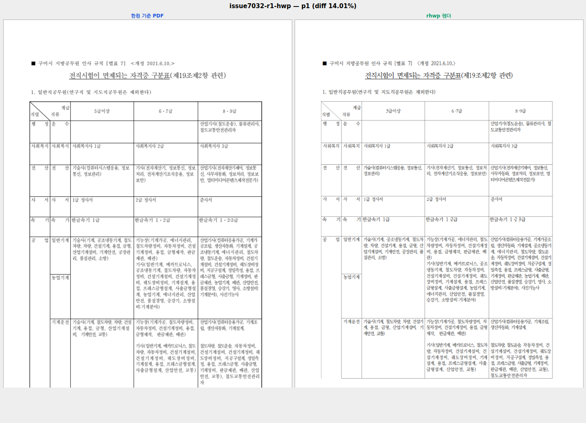

# PR #7043 self-review — 셀의 빈 문단 줄 진행 보존

- Issue: #7032 / [PR #7043](https://github.com/edwardkim/rhwp/pull/7043)
- 검토일: 2026-09-12 KST, 작성자·메인테이너 self-review. 별도 reviewer 지정 없음.
- 경로: collaborator_self_merge + intake_and_review + local_validation + visual_fixture_evidence + rework_and_exceptions.
- 최종 판정: **승인** — 이번 빈 문단 배치 수정 범위. 원격 병합 승인이나 전체 문서 fidelity 통과를 뜻하지 않는다.

## 1. 대상과 코드 검토

| 항목 | 확인 결과 |
| --- | --- |
| code candidate | `b1a2a08af953e50d18a471c67b3e8314bcf64534` |
| 작성자 / base / 상태 | edwardkim / devel / Open, non-Draft |
| 규모 | 13파일, +1,310/-6, 21커밋(이번 기록 추가 전) |
| 참조 | `Closes #7032`, [결과보고서](../../report/task_m100_7032_report.md) |
| 원격 상태 | CI 완료 시 MERGEABLE / CLEAN, 병합 전 재확인 필요 |

1,000줄 초과이므로 코드·테스트·병합 시뮬레이션·직접 이미지 확인을 별도로 수행했다.
제품 변경은 layout 세 파일이다. 나머지는 integration test, 신규 샘플·승인된 baseline 두 행과 문서다.
parser/model/serializer 및 전역 줄간격 정책 변경은 없다.

- 빈 문단 여부는 기존 metrics helper의 controls 없음·저장 LINE_SEG 없음·유효 글꼴·char_count 조건을
  유지한다. partial 경로의 zero-line 대상만 처리하고 HWP3·세로쓰기의 기존 경계를 보존한다.
- cut 소유권은 CellUnit의 실제 empty content atom을 조회한다. gap-only, nested row/fragment,
  non-inline control unit은 배제한다. 임의 y 가산이나 `직렬` 문자열 분기는 없다.
- 소유권을 skip, 가시 마지막 문단, 부분 높이, 가짜 split 방지에 일관되게 사용한다.
- 마지막 빈 문단은 기존 셀 측정 계약의 em 높이를 적용하고 trailing spacing을 중복 소비하지 않는다.
- 실제 빈 문단이 없는 경우 추가 CellUnit 소유권 조회를 하지 않는다. 제품 성능 전후 계측은 미수행이다.

테스트는 실제 DocumentCore의 HWP/HWPX 6쪽을 모두 검사한다. 별도 내부 IR cut 검사는 실제
LayoutEngine을 호출하고 6개 선택 창·전체 창, 3개 정렬·2개 줄간격·문단 전후 간격 유무를 확인한다.
이 내부 구조를 한컴이 생성한 정상 파일이나 pagination oracle로 주장하지 않는다.
R1 원인 재현과 R2 음성 대조는 [Stage 2](../../working/task_m100_7032_stage2.md)에 있다.
검토 범위에서 추가 코드 보정이 필요한 결함은 발견하지 않았다.

## 2. 검증 결과

동일 candidate의 GitHub Full 실행을 확인했다.

- [CI / Build & Test](https://github.com/edwardkim/rhwp/actions/runs/34612249050): SUCCESS.
  archive A/B/C/D 실제 실행, Lint·Native Skia·Frontend package gates SUCCESS.
- [CodeQL](https://github.com/edwardkim/rhwp/actions/runs/34612249109): Rust/Python/JS 분석 SUCCESS.
- [Render Diff](https://github.com/edwardkim/rhwp/actions/runs/34612248744): Canvas visual diff SUCCESS.
- [Adapter](https://github.com/edwardkim/rhwp/actions/runs/34612249228),
  [Proptest](https://github.com/edwardkim/rhwp/actions/runs/34612249135): 실제 worker SUCCESS.
- CI Impact Policy SUCCESS. 정책상 skipped job을 실제 실행 PASS로 세지 않는다.

로컬 전체 nextest 9,490 PASS / 0 FAIL / 46 skipped 및 native/WASM/workspace lint,
Skia·Docker WASM 검증의 SHA와 상세는 [Stage 3](../../working/task_m100_7032_stage3.md)를 따른다.
새 제품·test 변경이 없어 광범위 검증을 반복하지 않았다. 이번 self-review에서는 같은 Rust 입력의
review HEAD `4b74cf032`에서 suite prepare 후 아래 focused를 재실행했다.

```bash
node scripts/run-rust-test.mjs issue_7032_cell_empty_paragraph_flow -- \
  --cargo-profile release-test --target-dir /home/edward/mygithub/rhwp-shared-review-target
```

7 PASS, 실행 0.630초, 필터 제외 193건. 전체 회귀의 skipped 46건과 구분한다.
신규 test 원본만 제출하고 generated suite·manifest는 제외한다.
IR baseline은 기존 문단 ID 재부여의 신규 샘플 등록이며 렌더 회귀 은폐가 아니다.
clipping 외부 원본 92건 부재는 계속 미검증이다. 새 Docker WASM의 직접 사람 시각 판정은 없고
API smoke만 수행했다. 기존 메인테이너 SVG 통과와 이 제약을 혼동하지 않는다.

## 3. 시각 증적

[PDF/SVG 비교 정본](../../manual/verification/visual_sweep_guide.md#github-merge-comment)을 따른
기존 `fidelity_compare.py --export-all-svg --layout-ledger` 6쪽 결과를 재사용했다.
한컴 기준은 `pdf/task2146/21761835_jeonjik_exemption_table-hwp-2020.pdf`:
Creator Hwp 2022 0.0.0.0, Producer Hancom PDF 1.3.0.550, 6쪽, 595×841pt A4.
SHA-1 `3b623963b9c6aa62fd08fb74114e9ce80ac80430`; SHA-256은 결과보고서의 선행 계획에 보존했다.
유효한 기존 한컴 PDF를 재사용했고 중복 PDF를 만들지 않았다.

임시 `output/7032/r1-after-hwp/cmp-p000.png`를 이번 검토에서 직접 열어 첫 제목 셀의 `직렬`
위치와 도구 라벨 판독을 확인했다. 영구 증적은 아래 한 장이다. 다른 다섯 쪽을 이번에 직접
열었다고 주장하지 않는다. R2에서 R1 대비 HWP/HWPX 12 SVG byte-identical임을 이미 확인했다.



페이지 diff%는 1쪽 14.01, 2쪽 16.55, 3쪽 18.83, 4쪽 18.29, 5쪽 19.40, 6쪽 14.83이다.
해당 report는 diff%를 제공하며 별도 pixel-match/visual_accuracy_proxy_percent는 산출하지 않았다.
layout-candidates.tsv의 7개 항목은 6쪽 모두 0이다. 이 값을 모든 탐지기의 총 후보 0으로 확대하지 않는다.
본문 글꼴·선 굵기 등의 잔여 차이가 있어 전체 fidelity 통과로 해석하지 않는다.
메인테이너가 통과시킨 범위는 첫 셀의 빈 문단 줄 진행과 제목 텍스트 위치다.

## 4. 최신 base와 후속 조건

fetch 후 base는 `045a04e4c9`이며 #7037 그림 crop 변경이 추가됐다.
candidate와 `git merge-tree --write-tree` exit 0, tree `1ab03e1131bf3a9ad82e53fcd426f76f24d2d754`.
새 base에서 별도 전체 Cargo 실행은 하지 않았다. 이 tree의 성공과 기존 candidate CI를 구분한다.
문서 trailing만 추가하며 source merge/rebase하지 않는다. trailing commit의 merge-tree·공백·링크·
오늘할일 보존을 검증하고 원격 head/base를 재조회한 뒤에만 승인된 push를 한다.
새 head CI 성공과 메인테이너 병합 승인을 확인하기 전에는 merge·이슈 close하지 않는다.

### Merge 후 PR comment 계획

게시 승인은 별도다. 병합 후 실제 merge SHA에 대표 이미지가 존재하는지 확인하고, 비교 정본 링크와
1쪽 diff 14.01%, 범위 내 시각 판정·잔여 차이를 설명한다. 전체 6쪽 실행/대표 1장 직접 재확인을 구분한다.
이미지는 `https://raw.githubusercontent.com/edwardkim/rhwp/<merge-commit-sha>/mydocs/pr/assets/pr_7043_hwp_page1_compare.png`
형식으로 고정한다. 승인된 게시에는 UTF-8 body-file을 사용하고 API로 본문·이미지 URL을 재확인한다.
