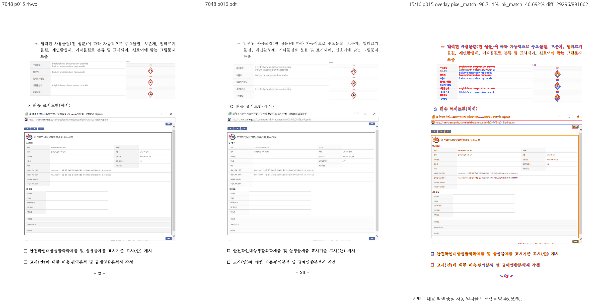
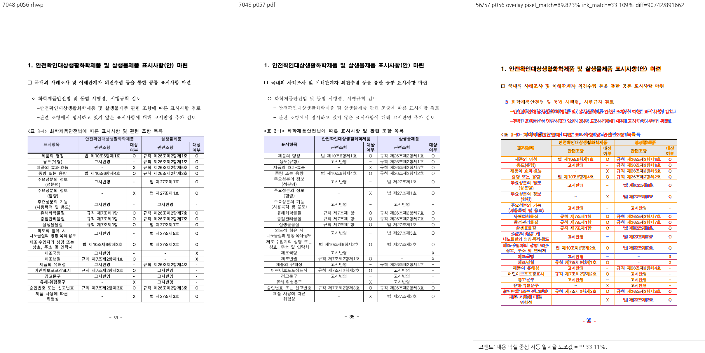
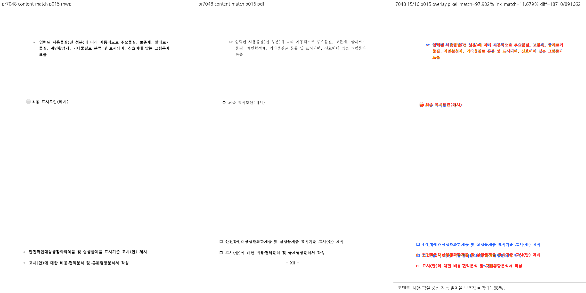

# PR #7048 — 누적 체리픽 검토

## 최종 판정

**머지 보류 — 남은 최종 검증 진행 중**. 렌더링 보류 사유의 구현 수정과 원본 시각 검증은 완료했다. 하단 문단·꼬리말 충돌 두 곳과
`바탕체`의 고딕 대체 경로를 수정했다. 원 source만 승인하거나 통합 merge를 완료했다는 뜻은 아니다.
최신 통합 head의 GitHub CI는 원격 병합 전 별도로 확인한다.

## 렌더링 보류 사유 해결 — 2026-09-12

- 검토 branch: `review/nondraft-7040-7053-20260912`.
- 첫 보정: `4deab2a709e28e4252511c48cb44417ee329bb30`, 적용 계약 보완 `6c358f209`.
- 최종 code candidate: **`c15686421dc6914c5bdf8cc0f80d8930bee46dc1`**. 검증 중 찾은 앞 소제목 가림도 이 commit에서 수정했다.
- 비교 전: 문서 commit `fe5dfdd49`의 생산 코드와 같은 보관 CLI(`8099aa8b2` 빌드).
  `upstream/devel`을 이번 직전 후보라고 부르지 않는다. #7050 최신 `de3301a038` 적용도 유지했다.
- 검증 원본은 축소본뿐 아니라 BinData가 보존된
  `samples/issue6782/1480000-201900042-chemical-product-labeling-study.hwp`와 기존 한컴 2020 PDF다.
  축소본의 1×1 대체 이미지를 원본 그림 검증에 사용하지 않았다.

### 원인과 수정

| 보류 사유 | 원인 | 이번 수정·독립 근거 |
| --- | --- | --- |
| 하단 문단이 약 41.6px 내려가 꼬리말과 충돌 | 그림 뒤 호스트 줄과 다음 빈 문단의 앞 간격을 중복 소비 | 그림의 물리 하단과 다음 저장 LINESEG의 시작이 일치할 때 조판이 확정한 원점·끝을 배치가 함께 사용 |
| 다른 쪽의 표가 꼬리말을 덮음 | CellBreak 표의 첫 조각에 원본보다 두 행을 더 넣음 | 첫 22행 합 42,741HU = common.height, 나머지 행 + 반복 제목행 = 다음 문단 vpos 16,262HU라는 두 식이 모두 성립할 때 원본 행 경계로 분할 |
| 명조인 바탕체가 고딕으로 보임 | 바탕체 부재 시 GulimChe/D2Coding 고딕 대체·공급 | serif paint fallback과 Noto Serif KR 공급으로 수정. BatangChe layout metric은 유지하고 v2 lifecycle reducer로 기존 공급 rule을 retire/replace |

그림 계약은 양수 앞 간격을 가진 **빈 후속 문단**이 예약 간격을 독립적으로 증명할 때만 적용한다.
현재 단에 앞선 non-inline TopAndBottom 그림의 흐름이 아직 이 공통 배치 계약으로 닫히지 않았다면
중간부터 저장 절대 좌표로 재진입하지 않는다. 실제 텍스트·인라인 그림·유효 줄 폭·합성/누락/불일치 LINESEG·명시적 쪽 나눔을
배제한다. 표 계약은 온전한 행 경계와 양쪽 조각의 저장 높이를 검산하며 rowspan이 경계를 가르면
적용하지 않는다. 편집 세션은 기존 재조판 경로를 사용한다. 파일명·PI·행 번호를 생산 분기에 넣거나,
본문/꼬리말 좌표를 강제로 클램프하거나, 오류를 허용하도록 기존 TSV 한도를 올리지 않았다.

### 직접 확인한 결과

- 축소본과 전체 원본 모두 본문 글자 겹침 **2 → 0건**, `layout-anomaly --json` 전수 스캔.
- 내용 대응 rhwp 15 ↔ 한컴 PDF 16: 하단 두 문단의 기준선 **974.68 / 1020.28px**,
  한컴 **974.72 / 1020.32px**. 각각 차이 **0.04px**다. 꼬리말과 겹치지 않는다.
- rhwp 56 ↔ PDF 57: 첫 표 조각이 source row 0–21에서 끝난다. `품목별 특성`과 `사용방법`
  행은 반복 제목행과 함께 다음 쪽(rhwp 57 ↔ PDF 58)으로 넘어가며 한컴의 분할과 일치한다.
- 104쪽 중 render tree 변경 **7쪽**, 나머지 **97쪽 byte 동일**. 7쪽 전부 직접 화면으로 확인했다.
- OVR5 별도 **142쪽 / 48개 객체**: 페이지·크기·x/y 변화 0건(2px 검사 허용치).
  객체가 없는 biz_plan은 객체 배치 검증으로 세지 않는다.

총 쪽수 **104 대 103**, 일부 쪽번호·글자 폭·상단 그림 정렬의 기존 차이는 남아 있다.
`그림 4-5` 캡션은 여전히 rhwp 90쪽으로 이월되며, PDF 88쪽과 다르다.
전체 스캔의 overflow 28건·object overlap 1건·empty page 6건도 이번 수용으로 종료하지 않는다.
전체 문서의 한컴 픽셀 일치가 완료됐다고 판정하지 않는다. 이번 수용 대상은 위의 중복 흐름,
잘못된 표 분할, 글꼴 계열 대체이며 기존 원본 전체의 페이지네이션 과제를 종료하지 않는다.

### Visual sweep — 실제 본문 대응

[정본 Visual Sweep](../../manual/verification/visual_sweep_guide.md)을 실행하고, 본문을 비교하여
기준 PDF 쪽을 매핑했다. 자동 5-gram 대응 후보를 읽고 7장의 compare/overlay/review PNG로
내용을 직접 확인했다. 서로 다른 본문을 가진 동일 physical page 패널은 최종 증거에서 제외한다.

| rhwp ↔ PDF | pixel match | ink proxy | 확인 |
| --- | --- | --- | --- |
| 15 ↔ 16 | 96.714% | 46.692% | 전체 그림과 하단 문단·꼬리말 분리 |
| 56 ↔ 57 | 89.823% | 33.109% | 첫 조각의 마지막 행·표 하단 |
| 57 ↔ 58 | 88.358% | 32.093% | 이월 두 행·반복 제목행·뒤 표 |
| 87 ↔ 86 | 95.731% | 39.451% | 그림 4-1과 캡션 |
| 88 ↔ 87 | 92.271% | 30.256% | 그림 4-2·4-3과 캡션 |
| 89 ↔ 88 | 95.274% | 35.976% | 그림 4-4·4-5; 4-5 캡션 이월 잔존 |
| 90 ↔ 89 | 94.232% | 17.934% | 그림 4-6·4-7 앞 소제목 보존; 위치 차이 잔존 |

위 지표는 배경과 글꼴 래스터 차이를 포함한 보조값이다. 같은 physical page를 전제한 자동 후보
집계를 수정된 본문 대응의 합격 건수로 이월하지 않았다. 임시 `remap-all.py`는 정본의
`make_compares`, `make_overlay_compares`, `make_review_panels`를 호출하고 PDF 축의 쪽 번호만
실제 대응 쪽으로 표시한다. 이미지 내용·좌표·지표 계산을 바꾸지 않는다.

### 검증 기록

사용자 요청에 따라 PR 검토 문서를 먼저 갱신했다. 아래는 갱신 시점에 실제 완료된 결과다.
macOS arm64 / Rust 1.93.1 / 검토 전용 `target/pr-review`, code candidate `c15686421dc6914c5bdf8cc0f80d8930bee46dc1`.

- prepare·fmt·fmt check·native Clippy·WASM32 Clippy·workspace build·workspace all-target Clippy·manifest check: 모두 exit 0.
- source-side font fallback 테스트에 대한 `node scripts/rust-unit-test-tiers.mjs --check`: exit 0.
- 집중 nextest: `Summary [   0.705s] 42 tests run: 42 passed (1 leaky), 9537 skipped`; exit 0.
- 전체 nextest: `Summary [ 329.734s] 9533 tests run: 9533 passed (3 slow, 1 leaky), 46 skipped`; exit 0.
- Native Skia workspace lib: **4,112 PASS / 13 ignored / 0 FAIL**, exit 0.
- Font registry/projection/webfont 스크립트 46 PASS, Studio 1,661 PASS / 2 skipped / 0 FAIL, standalone `tsc --noEmit` exit 0.
- **진행/대기**: Native Skia placeholder·direct PDF, 공식 WASM 빌드, native↔WASM 원본/변형 8종 42쪽 비교.
  이 항목은 아직 최종 후보의 성공으로 기록하지 않는다. 완료 결과와 판정을 같은 문서에 갱신한다.
- 현재 보류 해제 조건: 위 미완료 검증의 최종 exit 0과 직접 결과 확인. 원격 merge 전에는 별도로 최신 head CI를 확인한다.

첫 전체 실행에서 font registry 역사 봉인 가정과 대형 문서의 304→299쪽 부작용을 찾아 수정했다.
저장 좌표가 맞닿는 것만으로 실제 텍스트 흐름을 회수하지 않으며, 기존 대형 문서 304쪽 기준을 유지한다.
이후 visual sweep에서 발견한 앞 소제목 가림도 공통 흐름 연속성 조건과 실제 원본 회귀로 수정했다.
위 집중·전체 결과는 그 수정까지 포함한 현재 후보를 새로 실행한 결과다. 중간 실패를 성공으로 세지 않았다.

원시 로그·순차 명령: `/tmp/rhwp-7048-render-fix/validation-complete/`, `validate-complete.py`.
[진행 상태와 완료 결과 JSON](../assets/pr7048_render_fix_validation.json)에 완료 단계와 미완료 단계를 구분했다.


### 공통 조판 원칙 준수

[공통 검토](../../manual/pr_review/intake_and_review.md#27-조판-원칙-준수-검토)를 최종 code candidate에 적용했다.

| 항목 | 판정 | 확인 근거 |
| --- | --- | --- |
| 구현 근거와 일반성 | 충족 | 그림/LINESEG의 독립 경계와 실제 빈 간격 문단, 표 양쪽 조각의 HU 합. 파일명·PI·픽셀 clamp 분기 없음 |
| 측정·배치 일관성 | 충족 | 조판의 ParagraphFloatPlacement를 layout이 소비. 앞 그림이 측정 흐름이면 저장 원점 재진입 금지. 첫 표 scan과 각주 refit에 같은 row end 적용 |
| 줄 소속과 점유 높이 | 충족 | native HWP stored / 편집 세션 구분. 실제 텍스트·합성/누락/불일치 LineSeg는 기존 재조판 유지. 후속 앞 간격 중복 소비 제거 |
| 사례와 증거의 독립성 | 충족 | 전체·축소 원본과 한컴 PDF, 저장값 불일치/rowspan 반례, 소제목 가림 음성 대조. 합성 다중 쪽 field는 별도 계약 증거 |
| 기준값 변경 | 충족 | TSV 2→5는 원 contributor 변경 그대로이며 이번 추가 완화 없음. 겹침 재현 검사를 비겹침 회귀로 전환. 한컴 기준선 974.72/1020.32px 및 source 행 경계로 새 회귀 검증 |
| 주장과 검증 범위 | 충족 | 아래 실행 결과와 19개 저장소 입력 SHA-256. 원 source CI를 후보 CI로 이월하지 않음. 전체 PDF 페이지네이션·일부 캡션 위치와 editor E2E는 완료 주장 제외 |

### 검증 입력과 재현

직접 시각 검증·OVR5·집중 원본·native/WASM 비교에 사용한 **19개 파일**은 모두 저장소의 커밋된 blob과
byte 동일함을 확인했다. [입력 목록과 SHA-256](../assets/pr7048_validation_inputs.json)을 따른다.
화학 문서의 전체·축소 HWP와 기준 PDF 2개를 포함한 원본 17개는 기존에 추적 중이었다.
임시로만 존재하던 다중 쪽 HWPX 2개는 `tests/fixtures/issue6986/`에 추가하고 출처·변형 방법·hash를
함께 기록했다. 최종 검증은 저장소 입력을 사용하며 korea_downloads나 임시 fixture에 의존하지 않는다.

최종 workspace build에서 보관한 debug CLI `accepted-rhwp`의 SHA-256은
`dee4529ae24906435e5711db851522770e80bdf0bcc70d60c8e7f3f805c532f6`다. 시각 스윕에 쓴 `chain-rhwp`와 전체 104쪽 SVG·render tree가 byte 동일함을 확인했다.
다른 빌드의 성공이나 중간 그림 조건을 최종 후보의 결과로 혼용하지 않는다.

```bash
python3 scripts/visual_sweep.py --rhwp-bin /tmp/rhwp-7048-render-fix/accepted-rhwp \
  --out /tmp/rhwp-7048-render-fix/visual-chain --pages 15,56,57,87-90 --key chemical-full \
  --hwp samples/issue6782/1480000-201900042-chemical-product-labeling-study.hwp \
  --pdf pdf/1480000-201900042-chemical-product-labeling-study-2020.pdf
```

PDF raster는 96dpi이며 위 표의 실제 PDF 쪽을 `pdftoppm -f N -l N -r 96 -png -singlefile`로 추출했다.
최종 대응 패널은 `mapped-chain/`에 보관했다. 앞의 최초 물리 쪽 오대응·축소 그림 패널은 아래 과거
검토의 이력이며 현재 승인 증거가 아니다.

### 대표 이미지와 후속 계획

동일 전체 원본의 수정 전 패널:
[본문·꼬리말 수정 전](../assets/pr7048_render_fix_before_rhwp015_pdf016_review.png),
[표 분할 수정 전](../assets/pr7048_render_fix_before_rhwp056_pdf057_review.png).
아래는 현재 후보의 직접 확인 결과다.





나머지 직접 확인 증거:
[57↔58](../assets/pr7048_render_fix_rhwp057_pdf058_review.png),
[87↔86](../assets/pr7048_render_fix_rhwp087_pdf086_review.png),
[88↔87](../assets/pr7048_render_fix_rhwp088_pdf087_review.png),
[89↔88](../assets/pr7048_render_fix_rhwp089_pdf088_review.png),
[90↔89](../assets/pr7048_render_fix_rhwp090_pdf089_review.png).

실제 통합 merge 후 보정 SHA·검증 수치·내용 대응·잔여 차이를 원 #7048 PR에 `--body-file`로
설명하고, 위 자산은 실제 merge SHA에 고정한 raw GitHub URL로 링크한다. 게시 뒤 API로 본문과
이미지 링크를 확인하고 통합 PR/merge를 연결한 뒤 원 PR을 닫는다. 이 기록 자체는 원격 push,
PR 생성, merge, comment 또는 close 실행이 아니다.


<details>
<summary>렌더러 수정 전 검토 이력 — 아래 판정·후보·수치는 당시 기록</summary>

## 최종 판정

**진단 보정 검증 완료 / 렌더링 수용 판정 보류**. 내용 대응을 바로잡아도 한컴 PDF와 하단 문단·꼬리말 차이가 남는다.
원 head 단독 승인으로 해석하지 않는다. 최신 integration head의 GitHub CI는 merge 전 조건이다.
#7048의 진단 동작 검증과 미해결 한컴 렌더링 일치 판정은 구분하며, 이 기록에서 통합 merge를 완료 처리하지 않는다.

## 메인터너 보정 검증 — 2026-09-12

- 작업 branch: `review/nondraft-7040-7053-20260912`, 기준 `upstream/devel` `ea5d1ff70b1d50301d1e6fdd26248e9d9c10c1fa`.
- 생산 코드·회귀 보정 `8099aa8b2`, 측정 회귀 입력 보정 `6456aff3a`; 최종 실행 후보 **`6456aff3a0ee3fea70a12a7d167192e094e971fc`**.
- #7050 최신 source `de3301a03891ff2a9287f907f6944a38cf59720b`는 `78f2a85b1`에 이미 포함됐다.
  원 contributor history는 유지하고 보정 commit을 별도로 더했다. 아래 과거 검토의 보류 사유는 이 보정으로 재판정한다.
- 원 PR CI 네 건은 성공했다. #7050의 별도 CodeQL Rust도 마지막 조회에서 완료·성공했다.
  새 메인터너 후보의 GitHub CI·PR 생성·merge는 아직 실행하지 않았다. 원 source CI를 새 후보 CI로 이월하지 않는다.

### 이번 후보의 실제 검증

macOS arm64 / Rust 1.93.1 / review 전용 `target/pr-review`. 소유·공유 상태와 기존 Cargo 작업 부재를
확인하고 실행했다. shared target과 다른 worktree는 삭제하지 않았다.

- 파생 suite 준비 → fmt → fmt check → native Clippy → WASM32 Clippy → workspace build →
  workspace all-target Clippy → manifest check를 순차 통과했다. 모든 Clippy는 `--locked`, `-D warnings`다.
- 집중 nextest: `Summary [   0.386s] 25 tests run: 25 passed, 9548 skipped`; exit 0.
- 전체 nextest: `Summary [ 433.012s] 9527 tests run: 9527 passed (5 slow, 1 leaky), 46 skipped`; exit 0. 새 fixture를 `RHWP_SECURITY_SWEEP_SAMPLES_JSON`에 명시했고 코퍼스 래칫도 통과했다.
- Native Skia lib: **4,112 PASS / 0 FAIL / 13 ignored**, exit 0.
  placeholder **2 PASS**, direct PDF **4 PASS**, 각각 exit 0.
- WASM: 공식 `scripts/wasm-pack-locked.sh --target web --out-dir <검증경로>/wasm-pkg --no-opt`, exit 0.
  Docker daemon 연결 불가로 사용한 native 진단 경로이며, 최적화 배포 빌드 통과를 뜻하지 않는다.
- native↔WASM SVG: 원본 4종의 첫 쪽, 화학 표시기준 15쪽, PAGE/TOTAL_PAGE 정·역순 변형 각 12쪽,
  **7종 / 29쪽 모두 MATCH**, 각 실행 exit 0. Node WASM 직접 실행이며 브라우저 editor E2E는 아니다.
- source-side `#[cfg(test)]` 변경은 없어 unit-tier 추가 gate는 비해당. generated suite·manifest는 stage하지 않았다.

재현 명령은 아래 과거 검토의 lint/full/Native 명령과 같으며, focused 식에
`maintainer_nested_table_lines|`를 추가했다. 새 WASM/시각 출력과 전체 원시 로그는
`/tmp/rhwp-maintainer-validation`에 보관했다. 실제 실행 명령의 전체 순서는
`/tmp/rhwp-maintainer-validate.py`, 결과는 `results.jsonl`의 각 단계 마지막 완료값이다.
중간 테스트 입력 실패를 성공으로 세지 않았으며, 2-cell host로 수정한 최종 후보에서 전체를 재실행했다.
이후 `6b0c396b5`에서 기존 body/footer 검사도 옛 진단에서 통과한다는 사실을 테스트 주석에 정정했다.
테스트 본문·생산 동작은 그대로이고 Rust lint 8단계를 다시 통과했다(`final-lint-results.json`).

### Visual sweep 수정 전후 비교

[Visual Sweep 정본](../../manual/verification/visual_sweep_guide.md#github-merge-comment)을 적용했다.
사용한 debug CLI의 SHA-256은 `1e2b7bdacca1c41ddab986ad423f364b47fb9b54d4142d0679143d3405b8a8ee`다.
`8099aa8b2`에서 빌드했으며 뒤의 `6456aff3a`는 테스트 입력만 바꿔 생산 source가 동일하다.
release CLI나 최적화 배포 WASM을 사용한 것으로 기록하지 않는다.

- 비교 전: 보관한 최초 누적 후보 `522a2e80db04cbd84264406ccb8bdd33a21dcc55`.
  비교 후: 위 최종 보정 후보. 이 비교에는 #7050 최신 source 갱신도 들어간다.
  비교 전을 upstream/devel 또는 직전 `71213f7e6`으로 잘못 표기하지 않는다.
- 원본 5종 **126쪽의 SVG·render tree가 byte 단위로 동일**했다.
  언어 15쪽, issue2083 4쪽, issue2470 2쪽, 쪽필드 1쪽, 화학 표시기준 104쪽이다.
  별도로 raster한 공통 첫 쪽 4장의 본문 PNG pixel도 동일했다. 126쪽 모두를 육안 검토했다는 뜻은 아니다.
- 한컴 PDF와 직접 연 대표 review PNG는 **5장**이다. compare/overlay/review 산출은
  `<검증경로>/visual/<key>/{compare,overlay,review}`, 화학 문서 최종 내용 대응 패널은 `visual7048-mapped/review_015.png`다.
- 별도 OVR5의 **142쪽 / 48개 객체**, 페이지 수·geometry 변경 0건(기본 2px 비교 허용치).
  KTX 27쪽/9개, exam_math 20쪽/9개, 언어 15쪽/3개, aift 74쪽/27개, biz_plan 6쪽/0개.
  `tools/object_visual_regression.py`의 추출·비교 함수를 두 보관 CLI로 실행했다.
  biz_plan은 검출 객체가 없어 객체 배치 검증 범위가 비어 있다. 한컴 fidelity 전체 통과 수치가 아니다.

| 대표 화면 | 직접 확인 쪽 | 자동 후보 | pixel match | ink proxy | 판정 범위 |
| --- | --- | --- | --- | --- | --- |
| #7040 언어 | 1 | 0 | 88.134% | 12.610% | 머리 표 괘선이 본문 위, 성명 상자 절대 y·글꼴 차이 잔존 |
| #7050 issue2083 | 1 | 0 | 94.586% | 21.890% | 두 표 하단 상대 간격 18.2px, 한컴 18.22px; 절대 y 차이 잔존 |
| #7050 issue2470 | 1 | 0 | 96.079% | 30.866% | 두 표 하단 상대 간격 6.2px, 한컴 6.23px; 글꼴·로고 차이 잔존 |
| #7053 쪽필드 | 1 | 0 | 99.527% | 13.692% | 두 쪽필드 모두 1/1 표시, 선·글자 폭 차이 잔존 |
| #7048 화학 표시기준 | rhwp 15 ↔ PDF 16 | 자동 후보 재산출 안 함 | 97.902% | 11.679% | 내용 대응 보정 후에도 하단 문단 y·꼬리말 충돌·글꼴 차이 잔존 |

자동 후보 0은 해당 heuristic의 결과다. #7048 최초 rhwp15↔PDF15 패널은 본문이 대응하지 않아
사용자 지적 뒤 최종 증적에서 제외했다. 본문 내용으로 PDF16을 찾아 재비교했으며, 하단 두 문단이
약 40px 낮고 꼬리말과 겹치는 실제 차이와 글꼴 차이가 남는다. 이 패널을 렌더링 합격 증거로 쓰지 않는다.
기존 rhwp 96 ↔ 한컴 95쪽의 내용 대응 패널도 과거 증거로 보존했다.

사용자 지적 뒤 `upstream/devel` `ea5d1ff70`의 생산 source로 별도 CLI를 빌드해 추가 대조했다.
화학 표시기준 **104쪽 전체 render tree와 `export-svg --font-style` 출력이 보정 후보와 동일**했다.
따라서 하단 문단·꼬리말 충돌은 기존 renderer 결함이며 이번 진단 보정으로 새로 발생하지 않았다.
base CLI SHA-256은 `6bb96cf2947a846899c0aabd7f3bbcc32ffea125c018aa2892bcd6627e7128f4`다.
독립 기준 출력은 `devel-chemical/`, 재현 script와 source 복원·재빌드 결과는
`/tmp/rhwp-maintainer-validation/compare-devel.py`, `devel-comparison.json`에 보관했다.
최초 SVG 비교의 `--font-style` 옵션 차이는 동일 옵션으로 재실행해 제거했다.

PDF16은 `pdftotext -layout`에서 본문 내용으로 찾고 `pdftoppm -f 16 -l 16 -r 96 -png -singlefile`로
추출했다. 최종 패널은 canonical `make_compares`, `make_overlay_compares`, `make_review_panels`를
현재 rhwp15 PNG/PDF16 PNG 쌍으로 실행했다. 임시 wrapper `remap-7048.py`는 PDF 축 라벨을 실제 16쪽으로
표시하며, 이미지 내용·좌표·지표 계산은 바꾸지 않는다.

```bash
python3 scripts/visual_sweep.py --rhwp-bin /tmp/rhwp-maintainer-validation/maintainer-rhwp \
  --out /tmp/rhwp-maintainer-validation/visual --page 1 \
  --file-target pr7040-21 samples/21_언어_기출_편집가능본.hwp pdf/21_언어_기출_편집가능본-2022.pdf \
  --file-target pr7050-2083 samples/issue2083_hide_fill_page.hwpx pdf/issue2083_hide_fill_page-hwpx-2020.pdf \
  --file-target pr7050-2470 samples/issue2470/36382471_masked.hwpx pdf/issue2470/36382471_masked-hwpx-2020.pdf \
  --file-target pr7053 samples/issue6986/cell-page-and-total-page-in-one-run.hwpx pdf/cell-page-and-total-page-in-one-run-2020.pdf
python3 scripts/visual_sweep.py --rhwp-bin /tmp/rhwp-maintainer-validation/maintainer-rhwp \
  --out /tmp/rhwp-maintainer-validation/visual7048 --page 15 --key pr7048-15 \
  --hwp samples/issue6782/1480000-201900042-chemical-labeling-standards.hwp \
  --pdf pdf/1480000-201900042-chemical-labeling-standards-2020.pdf
```

### 보류 사유 보정

앞뒤 U+0020/U+3000 공백을 고정 em 폭으로 빼던 코드를 renderer와 같은
`replay_positions_for(display_or_text())`로 바꿨다. 유효한 글리프 위치, 잘못된/비유한 위치의 fallback,
표시 문자열 변경을 함께 처리하고 비공백 쪽 bbox 끝은 보존한다.
같은 글리프 배치의 좁은/넓은/전각/뒤 공백과 표시 문자열 경계 테스트를 추가했다.

physical 96쪽을 모든 환경에서 전제한 fixture 회귀는 내용으로 찾는 실제 본문/꼬리말 충돌 검사와
결정적 baseline 3쌍 검사로 분리했다. 본문/꼬리말은 기존 진단도 검출하므로 이것만을 red/green
증거로 쓰지 않는다. 기존 devel 진단 모듈을 임시 하네스에 그대로 넣으면 새 baseline 3쌍 테스트가
**0 대 3으로 실패**, 현재 모듈은 통과했다. `71213f7e6` 고정 em 공백 진단에서는 추가한
앞/뒤 공백 테스트 2개가 실패했고 최종 후보의 전체 glyph-band 10개는 통과했다.

기존 TSV 두 행의 **2→5는 contributor 변경 그대로 보존**했다. 이번 보정에서 추가로 올리지 않았다.
원 source `b0d657d75`의 [CI 34665904362](https://github.com/edwardkim/rhwp/actions/runs/34665904362)
Archive C 로그에서 `issue_7023_crowded_body_lines_are_detected` PASS(본문 ≥3쌍), Archive B에서
text-overlap 전수 partition PASS를 직접 확인했다. 기존 2건에 추가 baseline 띠 3쌍을 허용한 출처다.
해당 PR의 좌표 설명과 별개로, 같은 최종 render tree에 `ea5d1ff70` 진단과 현재 진단을 적용한
Mac 대조에서는 두 문서 모두 **2→2, 104쪽**이었다. 원본 104쪽 SVG·render tree도 보정 전후 동일해
renderer 악화를 허용하려고 기준을 높인 것이 아니다. source CI 결과를 현재 Mac의 5건 실측으로 쓰지 않는다.

현재 실제 검출 2건은 physical 15·56쪽 본문/꼬리말이다. 15쪽 교차 영역 44.0×12.92px,
56쪽 5.47×11.32px. 기존 renderer 겹침·페이지 수 104 대 한컴 103은 이번 diagnostics 수정의 해결 범위가 아니다.

### 보정 후 공통 조판 원칙 준수

[공통 준수 검토](../../manual/pr_review/intake_and_review.md#27-조판-원칙-준수-검토)를 재적용했다.

| 항목 | 판정 | 근거 |
| --- | --- | --- |
| 구현 근거와 일반성 | 충족 | 고정 em 공백 차감 대신 실제 renderer replay 계약 |
| 측정·배치 일관성 | 충족 | 진단과 SVG의 유효 위치/fallback 일치 |
| 줄 소속과 점유 높이 | 비해당 | 진단만 변경; renderer 배치 불변 |
| 사례와 증거의 독립성 | 충족 | 실물 충돌 + baseline/공백 음성 대조를 구분 |
| 기준값 변경 | 근거 확인 | 원 CI 실제 3쌍·전수 PASS, Mac 2→2; 추가 완화 없음 |
| 주장과 검증 범위 | 충족 | 환경별 관측과 기존 renderer 문제를 구분 |

### 최종 대표 이미지



- 최종 SHA-256 `c8e8fe60455f2d5e8cfb7c501f4bb53e287392515dd3ac5351c7da23a058fe73`. 원본/PDF provenance는 아래 이력의 동일 입력을 사용했다.

### Merge 후 contributor PR comment 계획

실제 통합 merge 후 위 직접 확인 페이지·후보 수·지표·잔여 차이와 원 PR 적용/보정 SHA를
`--body-file`로 게시하고 API로 본문과 이미지 URL을 재조회한다. 원 PR은 통합 PR/merge를 링크한 뒤 닫는다.
대표 이미지는 다음처럼 merge SHA에 고정한다.

`https://raw.githubusercontent.com/edwardkim/rhwp/<merge-commit-sha>/mydocs/pr/assets/pr7048_maintainer_rhwp15_pdf16_review.png`

최신 integration head CI와 적용 대상 원 PR head를 merge 전에 다시 확인한다. 이 검토 기록 자체는
GitHub approve/comment/close/push/merge 수행이 아니며, owner reviewer 자동 지정도 하지 않았다.

<details>
<summary>보정 전 검토 이력 — 당시 후보와 실패를 보존하며 현재 판정에는 이월하지 않음</summary>


## 보정 전 판정

**머지 보류**. 아래 구현·검증 blocker를 해소하기 전 이 변경을 수용하지 않는다.

| 항목 | 확인값 |
| --- | --- |
| 원 PR / 이슈 | [#7048](https://github.com/edwardkim/rhwp/pull/7048) / [#7023](https://github.com/edwardkim/rhwp/issues/7023) |
| 작성자 / reviewer | planet6897 / jangster77; 원 PR reviewer 선행 지정 완료 |
| base / draft | devel / false |
| 원 source head | `429993db938324677f9d94fa8001600b6c51746b` |
| 규모 | 3 files, +150 / -12 |
| mergeability | 조사 시 MERGEABLE / CLEAN; volatile 참고값 |
| 검토 경로 | collaborator_external_pr 체리픽 통합 + intake_and_review + local_validation + multi_pr_update_branch + visual_fixture_evidence |
| 구현 계획 | [원 PR별 적용·후속 계획](pr_7048_review_impl.md) |

실제 diff로 범위를 판단했다. `src/diagnostics/layout_anomaly.rs`, `tests/cases/issue_7023_glyph_band_follows_baseline.rs`, `tests/fixtures/text_overlap_baseline.tsv`.
문서 전용 PR이 아니며, renderer/진단 또는 관련 기준값에 영향이 있어 공통 조판 검토를 적용했다.
원 PR CI와 head 갱신 상태, 재사용 근거는 아래에 구분한다.
원격 head는 종료 전 재확인했으며 갱신됐다면 기존 판정을 최신 head에 이월하지 않는다.

## 원 PR 최신 head CI

GitHub Actions를 2026-09-12에 다시 조회했다. 대상 4건의 최신 **CI workflow는 모두 SUCCESS**다.
작업 중 갱신된 #7050 head `de3301a03891ff2a9287f907f6944a38cf59720b`도 CI 완료를 확인했다.
마지막 check-rollup 조회에서 #7050의 별도 CodeQL `Analyze (rust)`는 진행 중이었고 실패 check는 없었다.
CI workflow 성공과 모든 별도 check 완료를 구분한다.

| 원 PR | 최신 head CI | 실행 또는 재사용 근거 |
| --- | --- | --- |
| #7040 | [34674768254](https://github.com/edwardkim/rhwp/actions/runs/34674768254) | head `6b675ac94`에서 Lint·Native Skia·Build & Test 성공 |
| #7048 | [34672055783](https://github.com/edwardkim/rhwp/actions/runs/34672055783) | `b0d657d75`의 [성공 CI 34665904362](https://github.com/edwardkim/rhwp/actions/runs/34665904362) 재사용 |
| #7050 | [34677890610](https://github.com/edwardkim/rhwp/actions/runs/34677890610) | 새 head `de3301a03`에서 Lint·Native Skia·Archive A/B/C/D·Build & Test 성공 |
| #7053 | [34672052090](https://github.com/edwardkim/rhwp/actions/runs/34672052090) | `5e83a52d5`의 [성공 CI 34670322954](https://github.com/edwardkim/rhwp/actions/runs/34670322954) 재사용 |

#7048·#7053의 재사용 경로는 preflight의 `direct-source-build-and-test-green:success`와
`current-base-merge-tree-match`를 확인했다. 재사용 원본 run의 Lint·Native Skia·Archive A/B/C/D·
Build & Test도 모두 성공했다. 최신 head의 worker skip은 이 검증된 재사용 경로이며 누락으로 판정하지 않는다.
이후 아래 로컬 누적 후보의 실패는 원 PR CI와 구분한다. CI 녹색을 취소하거나 단독 source 실패로 바꾸어
기록하지 않는다. 코드 계약 검토 결과와 로컬 누적 환경의 차이는 각각 별도의 검토 근거다.

## 발견 사항과 해제 조건

### P1 — 공백의 실제 배치 폭을 무시해 겹침을 누락한다

`src/diagnostics/layout_anomaly.rs:487-498`은 앞뒤 공백을 `0.5em`/`1em`으로 계산해 진단 bbox를 줄인다.
그러나 SVG는 `TextRunNode.layout_positions`가 유효하면 그 값을 사용한다
(`render_tree.rs:1005-1024`, `svg.rs:779`, `:3363`). 장평·자간·실제 font advance도 고정 em 비율과 다를 수 있다.

통합 라이브러리의 공개 `scan_page()`와 `SvgRenderer`로 같은 글리프 좌표를 가진 두 표현을 실행했다.

| 입력 | 실제 배치 / SVG | 진단 결과 |
| --- | --- | --- |
| 첫 런 `"  가"`, bbox `(10,100,24,20)`, font 20, baseline 17, positions `[0,2,4,24]`; 둘째 런 `"나"`, bbox `(14,102,10,20)`, baseline 17 | 가 `(14,117)`, 나 `(14,119)` | text overlap **0** |
| 첫 런만 `"가"`, bbox `(14,100,20,20)`, positions `[0,20]`로 표현 | 보이는 글리프 좌표 동일 | text overlap **1** |

첫 입력의 진단 시작은 `10+2×10=30`인데 실제 가의 시작은 `10+4=14`다.
고정 폭 차감 때문에 실제 겹침이 사라지는 **합성 render-tree 계약상의 위음성**이다.
한컴 정상 문서에서 새 회귀를 발견했다고 주장하지 않는다.
해제 조건: 유효한 replay positions/공통 글자 폭 계산을 사용하고, 폭 자료가 없을 때의 보수적 경계를
검증한다. 같은 배치를 갖는 공백 표현, 장평·자간·전각 공백·display_text를 보호하는 테스트가 필요하다.

### 통합 검증 차이 — 신규 회귀 테스트가 로컬 macOS에서 실패한다

`tests/cases/issue_7023_glyph_band_follows_baseline.rs:51`의
`issue_7023_crowded_body_lines_are_detected`가 집중·전체 실행에서 모두
`96쪽에 이상 신호가 있어야 한다`로 실패했다. 그 쪽의 진단 항목 자체가 없었다.
CLI `layout-anomaly` 실측은 104쪽, text overlap **2건**(0-based 14, 55쪽)이었다.
PR의 5건 및 96쪽 새 3건 주장과 일치하지 않는다.
CLI SVG의 대상 본문 baseline은 392.28px와 432.773px로, PR의 407.17px/417.88px 실측과 다르다.
환경·current base·통합 상호작용 중 어느 것이 차이를 만들었는지까지 분리 완료한 것은 아니다.
원 PR의 최신 CI는 성공했다. 따라서 이 결과를 원 PR CI 실패 또는 #7048 단독 회귀로 단정하지 않는다.
#7050의 두 source 파일만 적용 전으로 되돌린 대조 실행도 104쪽/2건(0-based 14, 55쪽)이었다.
#7050 제외만으로 차이가 없어지지는 않았다. 대조 후 원래 source를 복원했고 후보 CLI 재빌드도 exit 0이었다.

해제 조건: 정확한 최신 base와 source/integration SHA, 같은 실행 환경에서 수정 전 실패/후 성공을
재현하고 해당 입력의 실제 겹침 근거를 제시한다. 페이지 번호나 허용치를 결과에 맞춰 바꾸지 않는다.
`text_overlap_baseline.tsv` 두 행의 2→5도 현재 실행에서 필요한 증가로 입증되지 않았으므로 별도 근거가 필요하다.
기존 진단을 더 정확하게 만들어 수가 증가하는 경우 자체를 금지하는 판단은 아니다.

## 시각 증거 대응과 한계

통합 rhwp 96쪽의 `(16. 어린이보호포장 대상/비대상 제품의 표시)`는 기준 PDF **95쪽**에 대응했다.
처음 같은 physical 96쪽끼리 생성한 패널은 다른 내용이므로 폐기 판정하고 최종 증적으로 쓰지 않았다.
내용 대응을 확인한 rhwp 96 ↔ PDF 95 패널을 다시 생성해 직접 열었다.
페이지 수는 rhwp 104, PDF 103이다. 이 차이를 이번 PR이 새로 만들었다고 분류하지 않는다.
문서-wide 페이지·기하 무회귀와 baseline 증가의 정당성이 확인됐다는 주장은 하지 않는다.

## 공통 조판 원칙 준수

[공통 계약](../../manual/pr_review/intake_and_review.md#27-조판-원칙-준수-검토)을 실제 호출 경로와 대조했다.

| 항목 | 판정 | 근거 |
| --- | --- | --- |
| 구현 근거와 일반성 | 미충족 | 공백의 고정 em 차감은 실제 배치 폭과 다름 |
| 측정·배치 일관성 | 미충족 | 유효한 layout_positions를 쓰는 SVG와 진단 불일치 재현 |
| 줄 소속과 점유 높이 | 비해당 | 줄 배치 자체를 수정하지 않는 diagnostics 변경 |
| 사례와 증거의 독립성 | 미충족 | 동일 글리프 좌표의 공백 표현에 따라 신호 1→0; 신규 회귀 실패 |
| 기준값 변경 | 미검증 | 기존 두 행 2→5 증가 필요성이 현재 실행에서 확인되지 않음 |
| 주장과 검증 범위 | 미충족 | 현재 실측 2건/96쪽 신호 없음은 원 PR의 5건 주장과 다름 |

## 검증 환경과 결과

아래 실행 수치·이미지는 코드 후보 `522a2e80d`의 결과다. 이후 #7050의 새 head를
`-x`로 적용한 최신 후보는 `78f2a85b103a287c4def67221ff94b3b4e7ed298`다. 두 Rust 파일만 달라졌고 테스트 source는 같다.
최신 후보의 로컬 빌드·전체 테스트·시각 출력은 재실행하지 않았으며 이전 결과를 이월해 성공으로 주장하지 않는다.
사용자 지시에 따라 #7050 새 source CI의 최종 SUCCESS를 확인했다.

- macOS arm64, logical CPU 10, RAM 32 GiB, Rust 1.93.1, 기본 nextest 동시성.
- 기준 devel `ea5d1ff70b1d50301d1e6fdd26248e9d9c10c1fa`; 실제 코드 검증 head `522a2e80db04cbd84264406ccb8bdd33a21dcc55`.
- `target/pr-review`의 기존 소유·공유 상태와 실행 중 Cargo/Rust 작업 부재를 확인했다.
  공유 debug/release 및 다른 review target을 삭제하지 않고 고정 review target을 재사용했다.
- 검증에 사용해 보관한 `candidate-rhwp`의 SHA-256은
  `1e618148bf00501c613b3cd19269ed0453dbe90b630f84786ed7cf4b8366808b`다.
  대조 실험 후 복원한 source는 code head와 diff가 없다. 재빌드한 작업용 CLI와 보관한 검증 바이너리는 구분한다.
- `--prepare`, `cargo fmt --all`, fmt check, native Clippy, WASM32 Clippy,
  workspace build, workspace all-target Clippy, manifest check가 순차로 모두 exit 0이었다.
  파생 generated suite는 stage하지 않았다. source-side cfg(test)는 변경하지 않아 unit-tier 추가 gate는 비해당이다.
- 집중 nextest: **14 PASS / 1 FAIL / 9,548 filtered/ignored**. 실행 15건 중 실패는 #7048 새 회귀 1건.
- 전체 nextest: **9,516 PASS / 1 FAIL / 46 skipped**, 실행 342.021초, exit 100.
  실패는 동일 #7048 테스트뿐이다. 전체 성공이라고 기록하지 않는다.
- 새 sample 1개를 `RHWP_SECURITY_SWEEP_SAMPLES_JSON`으로 명시한 security 검사 PASS.
  기존 samples 전수 래칫은 통과했지만 baseline 증가의 독립 타당성은 별도 판정이다.
- Native Skia lib: exit 0, 4 binaries, 4112 PASS / 0 FAIL / 13 ignored.
- native-placeholder: exit 0;      Summary [   1.012s] 2 tests run: 2 passed, 190 skipped
- native-pdf: exit 0;      Summary [   0.766s] 4 tests run: 4 passed, 189 skipped
- WASM 진단 build: exit 0. Docker CLI는 있으나 daemon에 연결하지 못해
  공식 wrapper의 native `--no-opt` 경로를 사용했다. 최적화된 배포 빌드 통과로 주장하지 않는다.
- native↔WASM SVG parity: exit 0; 세부 결과는 아래 WASM 항목.
- OVR5 전수 base/head geometry 비교, 다른 OS, 원 제보 법령 187쪽, 누락한 다중 줄 정상 한컴 출력은 미실행이다.
  구현 blocker와 전체 테스트 실패가 남은 이 통합 branch의 merge gate를 완료한 것으로 처리하지 않는다.

```bash
node scripts/rust-test-suite-manifest.mjs --prepare
cargo fmt --all
cargo fmt --all -- --check
cargo clippy --locked --target-dir target/pr-review -- -D warnings
cargo clippy --locked -p rhwp --lib --target wasm32-unknown-unknown --target-dir target/pr-review -- -D warnings
cargo build --locked --workspace --target-dir target/pr-review
cargo clippy --locked --workspace --all-targets --target-dir target/pr-review -- -D warnings
node scripts/rust-test-suite-manifest.mjs --check
cargo nextest run --locked --cargo-profile release-test --target-dir target/pr-review --tests --no-fail-fast \
  -E 'test(/issue_7008|issue_7023|issue_7049|issue_6986|layout_anomaly_glyph_band/)'
RHWP_SECURITY_SWEEP_SAMPLES_JSON='["samples/issue6986/cell-page-and-total-page-in-one-run.hwpx"]' \
  cargo nextest run --locked --cargo-profile release-test --target-dir target/pr-review --tests --no-fail-fast
cargo test --locked --profile release-test --target-dir target/pr-review --features native-skia --lib
node scripts/run-rust-test.mjs issue_2225_missing_picture_placeholder -- --cargo-profile release-test --target-dir target/pr-review --features native-skia
node scripts/run-rust-test.mjs render_p37_direct_pdf_export -- --cargo-profile release-test --target-dir target/pr-review --features native-skia
CARGO_TARGET_DIR=target/pr-review scripts/wasm-pack-locked.sh --target web \
  --out-dir /tmp/rhwp-nondraft-review-20260912-YtWNPm/wasm-pkg --no-opt
```

원시 로그·JSON·probe source는 `/tmp/rhwp-nondraft-review-20260912-YtWNPm`에 남겼다. 저장소에는 요약과 최종 증적만 포함한다.
최소 계약 probe는 아래 명령으로 native debug 라이브러리에 연결해 실행했다. `review_probes.rs`의
SHA-256은 `e1d63642ce4dff5b617fc84efe6886cda4e2217e1e5a06260acb3e7ba313c423`이다.
이 하네스는 제품 source를 수정하지 않으며, #7040은 공개 모델 위치 API와 새 비교식,
#7048은 실제 공개 진단·SVG 출력 API를 실행한다.

```bash
rustc --edition=2021 /tmp/rhwp-nondraft-review-20260912-YtWNPm/review_probes.rs   --extern rhwp=target/pr-review/debug/librhwp.rlib -L dependency=target/pr-review/debug/deps   -o /tmp/rhwp-nondraft-review-20260912-YtWNPm/review_probes
/tmp/rhwp-nondraft-review-20260912-YtWNPm/review_probes
```


## 시각 증적과 provenance

[Visual Sweep 정본](../../manual/verification/visual_sweep_guide.md#github-merge-comment)을 사용했다. macOS Chrome webfont raster, 96 DPI다. 픽셀/잉크 일치율은 후보 지표이며 호환성 점수가 아니다.

- 원본 `samples/issue6782/1480000-201900042-chemical-labeling-standards.hwp`, SHA-256 `4382eabadb86cde5730a7e7b972cea1828fea0c1c743a654c2a430cc19ae26c0`.
- 기준 `pdf/1480000-201900042-chemical-labeling-standards-2020.pdf`, 1119717 bytes, SHA-256 `32e0e6d41d53b755b3dc4bcc31937e8b4f0921b282c2e5d3633a3f3617761912`, SHA-1 `a93593ec3798add8577bb4469c7be55c8ab43619`. Creator:         Hwp 2022 0.0.0.0; Producer:        Hancom PDF 1.3.0.550; Pages:           103; PDF version:     1.6.


- 원 산출: `/tmp/rhwp-nondraft-review-20260912-YtWNPm/visual7048-mapped/review_096.png`; 최종 SHA-256 `f73bc1cd697eb4768b28e5b4162823fb280b306a24f863b63ead1f5411b18788`.
- 내용 대응을 보정한 rhwp 96 ↔ PDF 95: pixel match 86.041%, ink match 9.967%. 최초 96↔96 지표는 수용 근거에서 제외했다.

## WASM 확인

```text
6 documents / 28 pages: native and WASM SVG all MATCH; exit 0.
Original fixtures: 4 documents x page 1.
Synthetic PAGE/TOTAL_PAGE order variants: 2 documents x 12 pages.
```

## 원격 후속 처리

현재 판정은 보류다. 이 기록을 GitHub approve/merge/close로 해석하지 않는다.
구체적인 위반 위치·실행 결과·미검증 범위를 보완 요청 근거로 사용하고, 수정 head에서 다시 검토한다.

</details>


</details>
