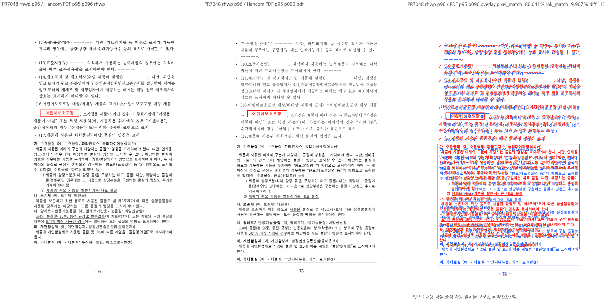

# PR #7048 — 누적 체리픽 검토

## 최종 판정

**머지 보류**. 아래 구현·검증 blocker를 해소하기 전 이 변경을 수용하지 않는다.

| 항목 | 확인값 |
| --- | --- |
| 원 PR / 이슈 | [#7048](https://github.com/edwardkim/rhwp/pull/7048) / [#7023](https://github.com/edwardkim/rhwp/issues/7023) |
| 작성자 / reviewer | planet6897 / jangster77; 원 PR reviewer 선행 지정 완료 |
| base / draft | devel / false |
| 원 source head | `429993db938324677f9d94fa8001600b6c51746b` |
| 규모 | 3 files, +150 / -12 |
| mergeability | 조사 시 MERGEABLE / CLEAN; volatile 참고값 |
| 검토 경로 | collaborator_external_pr 체리픽 통합 + intake_and_review + local_validation + multi_pr_update_branch + visual_fixture_evidence |
| 구현 계획 | [원 PR별 적용·후속 계획](pr_7048_review_impl.md) |

실제 diff로 범위를 판단했다. `src/diagnostics/layout_anomaly.rs`, `tests/cases/issue_7023_glyph_band_follows_baseline.rs`, `tests/fixtures/text_overlap_baseline.tsv`.
문서 전용 PR이 아니며, renderer/진단 또는 관련 기준값에 영향이 있어 공통 조판 검토를 적용했다.
원 PR CI와 head 갱신 상태, 재사용 근거는 아래에 구분한다.
원격 head는 종료 전 재확인했으며 갱신됐다면 기존 판정을 최신 head에 이월하지 않는다.

## 원 PR 최신 head CI

GitHub Actions를 2026-09-12에 다시 조회했다. 대상 4건의 최신 **CI workflow는 모두 SUCCESS**다.
작업 중 갱신된 #7050 head `de3301a03891ff2a9287f907f6944a38cf59720b`도 CI 완료를 확인했다.
마지막 check-rollup 조회에서 #7050의 별도 CodeQL `Analyze (rust)`는 진행 중이었고 실패 check는 없었다.
CI workflow 성공과 모든 별도 check 완료를 구분한다.

| 원 PR | 최신 head CI | 실행 또는 재사용 근거 |
| --- | --- | --- |
| #7040 | [34674768254](https://github.com/edwardkim/rhwp/actions/runs/34674768254) | head `6b675ac94`에서 Lint·Native Skia·Build & Test 성공 |
| #7048 | [34672055783](https://github.com/edwardkim/rhwp/actions/runs/34672055783) | `b0d657d75`의 [성공 CI 34665904362](https://github.com/edwardkim/rhwp/actions/runs/34665904362) 재사용 |
| #7050 | [34677890610](https://github.com/edwardkim/rhwp/actions/runs/34677890610) | 새 head `de3301a03`에서 Lint·Native Skia·Archive A/B/C/D·Build & Test 성공 |
| #7053 | [34672052090](https://github.com/edwardkim/rhwp/actions/runs/34672052090) | `5e83a52d5`의 [성공 CI 34670322954](https://github.com/edwardkim/rhwp/actions/runs/34670322954) 재사용 |

#7048·#7053의 재사용 경로는 preflight의 `direct-source-build-and-test-green:success`와
`current-base-merge-tree-match`를 확인했다. 재사용 원본 run의 Lint·Native Skia·Archive A/B/C/D·
Build & Test도 모두 성공했다. 최신 head의 worker skip은 이 검증된 재사용 경로이며 누락으로 판정하지 않는다.
이후 아래 로컬 누적 후보의 실패는 원 PR CI와 구분한다. CI 녹색을 취소하거나 단독 source 실패로 바꾸어
기록하지 않는다. 코드 계약 검토 결과와 로컬 누적 환경의 차이는 각각 별도의 검토 근거다.

## 발견 사항과 해제 조건

### P1 — 공백의 실제 배치 폭을 무시해 겹침을 누락한다

`src/diagnostics/layout_anomaly.rs:487-498`은 앞뒤 공백을 `0.5em`/`1em`으로 계산해 진단 bbox를 줄인다.
그러나 SVG는 `TextRunNode.layout_positions`가 유효하면 그 값을 사용한다
(`render_tree.rs:1005-1024`, `svg.rs:779`, `:3363`). 장평·자간·실제 font advance도 고정 em 비율과 다를 수 있다.

통합 라이브러리의 공개 `scan_page()`와 `SvgRenderer`로 같은 글리프 좌표를 가진 두 표현을 실행했다.

| 입력 | 실제 배치 / SVG | 진단 결과 |
| --- | --- | --- |
| 첫 런 `"  가"`, bbox `(10,100,24,20)`, font 20, baseline 17, positions `[0,2,4,24]`; 둘째 런 `"나"`, bbox `(14,102,10,20)`, baseline 17 | 가 `(14,117)`, 나 `(14,119)` | text overlap **0** |
| 첫 런만 `"가"`, bbox `(14,100,20,20)`, positions `[0,20]`로 표현 | 보이는 글리프 좌표 동일 | text overlap **1** |

첫 입력의 진단 시작은 `10+2×10=30`인데 실제 가의 시작은 `10+4=14`다.
고정 폭 차감 때문에 실제 겹침이 사라지는 **합성 render-tree 계약상의 위음성**이다.
한컴 정상 문서에서 새 회귀를 발견했다고 주장하지 않는다.
해제 조건: 유효한 replay positions/공통 글자 폭 계산을 사용하고, 폭 자료가 없을 때의 보수적 경계를
검증한다. 같은 배치를 갖는 공백 표현, 장평·자간·전각 공백·display_text를 보호하는 테스트가 필요하다.

### 통합 검증 차이 — 신규 회귀 테스트가 로컬 macOS에서 실패한다

`tests/cases/issue_7023_glyph_band_follows_baseline.rs:51`의
`issue_7023_crowded_body_lines_are_detected`가 집중·전체 실행에서 모두
`96쪽에 이상 신호가 있어야 한다`로 실패했다. 그 쪽의 진단 항목 자체가 없었다.
CLI `layout-anomaly` 실측은 104쪽, text overlap **2건**(0-based 14, 55쪽)이었다.
PR의 5건 및 96쪽 새 3건 주장과 일치하지 않는다.
CLI SVG의 대상 본문 baseline은 392.28px와 432.773px로, PR의 407.17px/417.88px 실측과 다르다.
환경·current base·통합 상호작용 중 어느 것이 차이를 만들었는지까지 분리 완료한 것은 아니다.
원 PR의 최신 CI는 성공했다. 따라서 이 결과를 원 PR CI 실패 또는 #7048 단독 회귀로 단정하지 않는다.
#7050의 두 source 파일만 적용 전으로 되돌린 대조 실행도 104쪽/2건(0-based 14, 55쪽)이었다.
#7050 제외만으로 차이가 없어지지는 않았다. 대조 후 원래 source를 복원했고 후보 CLI 재빌드도 exit 0이었다.

해제 조건: 정확한 최신 base와 source/integration SHA, 같은 실행 환경에서 수정 전 실패/후 성공을
재현하고 해당 입력의 실제 겹침 근거를 제시한다. 페이지 번호나 허용치를 결과에 맞춰 바꾸지 않는다.
`text_overlap_baseline.tsv` 두 행의 2→5도 현재 실행에서 필요한 증가로 입증되지 않았으므로 별도 근거가 필요하다.
기존 진단을 더 정확하게 만들어 수가 증가하는 경우 자체를 금지하는 판단은 아니다.

## 시각 증거 대응과 한계

통합 rhwp 96쪽의 `(16. 어린이보호포장 대상/비대상 제품의 표시)`는 기준 PDF **95쪽**에 대응했다.
처음 같은 physical 96쪽끼리 생성한 패널은 다른 내용이므로 폐기 판정하고 최종 증적으로 쓰지 않았다.
내용 대응을 확인한 rhwp 96 ↔ PDF 95 패널을 다시 생성해 직접 열었다.
페이지 수는 rhwp 104, PDF 103이다. 이 차이를 이번 PR이 새로 만들었다고 분류하지 않는다.
문서-wide 페이지·기하 무회귀와 baseline 증가의 정당성이 확인됐다는 주장은 하지 않는다.

## 공통 조판 원칙 준수

[공통 계약](../../manual/pr_review/intake_and_review.md#27-조판-원칙-준수-검토)을 실제 호출 경로와 대조했다.

| 항목 | 판정 | 근거 |
| --- | --- | --- |
| 구현 근거와 일반성 | 미충족 | 공백의 고정 em 차감은 실제 배치 폭과 다름 |
| 측정·배치 일관성 | 미충족 | 유효한 layout_positions를 쓰는 SVG와 진단 불일치 재현 |
| 줄 소속과 점유 높이 | 비해당 | 줄 배치 자체를 수정하지 않는 diagnostics 변경 |
| 사례와 증거의 독립성 | 미충족 | 동일 글리프 좌표의 공백 표현에 따라 신호 1→0; 신규 회귀 실패 |
| 기준값 변경 | 미검증 | 기존 두 행 2→5 증가 필요성이 현재 실행에서 확인되지 않음 |
| 주장과 검증 범위 | 미충족 | 현재 실측 2건/96쪽 신호 없음은 원 PR의 5건 주장과 다름 |

## 검증 환경과 결과

아래 실행 수치·이미지는 코드 후보 `522a2e80d`의 결과다. 이후 #7050의 새 head를
`-x`로 적용한 최신 후보는 `78f2a85b103a287c4def67221ff94b3b4e7ed298`다. 두 Rust 파일만 달라졌고 테스트 source는 같다.
최신 후보의 로컬 빌드·전체 테스트·시각 출력은 재실행하지 않았으며 이전 결과를 이월해 성공으로 주장하지 않는다.
사용자 지시에 따라 #7050 새 source CI의 최종 SUCCESS를 확인했다.

- macOS arm64, logical CPU 10, RAM 32 GiB, Rust 1.93.1, 기본 nextest 동시성.
- 기준 devel `ea5d1ff70b1d50301d1e6fdd26248e9d9c10c1fa`; 실제 코드 검증 head `522a2e80db04cbd84264406ccb8bdd33a21dcc55`.
- `target/pr-review`의 기존 소유·공유 상태와 실행 중 Cargo/Rust 작업 부재를 확인했다.
  공유 debug/release 및 다른 review target을 삭제하지 않고 고정 review target을 재사용했다.
- 검증에 사용해 보관한 `candidate-rhwp`의 SHA-256은
  `1e618148bf00501c613b3cd19269ed0453dbe90b630f84786ed7cf4b8366808b`다.
  대조 실험 후 복원한 source는 code head와 diff가 없다. 재빌드한 작업용 CLI와 보관한 검증 바이너리는 구분한다.
- `--prepare`, `cargo fmt --all`, fmt check, native Clippy, WASM32 Clippy,
  workspace build, workspace all-target Clippy, manifest check가 순차로 모두 exit 0이었다.
  파생 generated suite는 stage하지 않았다. source-side cfg(test)는 변경하지 않아 unit-tier 추가 gate는 비해당이다.
- 집중 nextest: **14 PASS / 1 FAIL / 9,548 filtered/ignored**. 실행 15건 중 실패는 #7048 새 회귀 1건.
- 전체 nextest: **9,516 PASS / 1 FAIL / 46 skipped**, 실행 342.021초, exit 100.
  실패는 동일 #7048 테스트뿐이다. 전체 성공이라고 기록하지 않는다.
- 새 sample 1개를 `RHWP_SECURITY_SWEEP_SAMPLES_JSON`으로 명시한 security 검사 PASS.
  기존 samples 전수 래칫은 통과했지만 baseline 증가의 독립 타당성은 별도 판정이다.
- Native Skia lib: exit 0, 4 binaries, 4112 PASS / 0 FAIL / 13 ignored.
- native-placeholder: exit 0;      Summary [   1.012s] 2 tests run: 2 passed, 190 skipped
- native-pdf: exit 0;      Summary [   0.766s] 4 tests run: 4 passed, 189 skipped
- WASM 진단 build: exit 0. Docker CLI는 있으나 daemon에 연결하지 못해
  공식 wrapper의 native `--no-opt` 경로를 사용했다. 최적화된 배포 빌드 통과로 주장하지 않는다.
- native↔WASM SVG parity: exit 0; 세부 결과는 아래 WASM 항목.
- OVR5 전수 base/head geometry 비교, 다른 OS, 원 제보 법령 187쪽, 누락한 다중 줄 정상 한컴 출력은 미실행이다.
  구현 blocker와 전체 테스트 실패가 남은 이 통합 branch의 merge gate를 완료한 것으로 처리하지 않는다.

```bash
node scripts/rust-test-suite-manifest.mjs --prepare
cargo fmt --all
cargo fmt --all -- --check
cargo clippy --locked --target-dir target/pr-review -- -D warnings
cargo clippy --locked -p rhwp --lib --target wasm32-unknown-unknown --target-dir target/pr-review -- -D warnings
cargo build --locked --workspace --target-dir target/pr-review
cargo clippy --locked --workspace --all-targets --target-dir target/pr-review -- -D warnings
node scripts/rust-test-suite-manifest.mjs --check
cargo nextest run --locked --cargo-profile release-test --target-dir target/pr-review --tests --no-fail-fast \
  -E 'test(/issue_7008|issue_7023|issue_7049|issue_6986|layout_anomaly_glyph_band/)'
RHWP_SECURITY_SWEEP_SAMPLES_JSON='["samples/issue6986/cell-page-and-total-page-in-one-run.hwpx"]' \
  cargo nextest run --locked --cargo-profile release-test --target-dir target/pr-review --tests --no-fail-fast
cargo test --locked --profile release-test --target-dir target/pr-review --features native-skia --lib
node scripts/run-rust-test.mjs issue_2225_missing_picture_placeholder -- --cargo-profile release-test --target-dir target/pr-review --features native-skia
node scripts/run-rust-test.mjs render_p37_direct_pdf_export -- --cargo-profile release-test --target-dir target/pr-review --features native-skia
CARGO_TARGET_DIR=target/pr-review scripts/wasm-pack-locked.sh --target web \
  --out-dir /tmp/rhwp-nondraft-review-20260912-YtWNPm/wasm-pkg --no-opt
```

원시 로그·JSON·probe source는 `/tmp/rhwp-nondraft-review-20260912-YtWNPm`에 남겼다. 저장소에는 요약과 최종 증적만 포함한다.
최소 계약 probe는 아래 명령으로 native debug 라이브러리에 연결해 실행했다. `review_probes.rs`의
SHA-256은 `e1d63642ce4dff5b617fc84efe6886cda4e2217e1e5a06260acb3e7ba313c423`이다.
이 하네스는 제품 source를 수정하지 않으며, #7040은 공개 모델 위치 API와 새 비교식,
#7048은 실제 공개 진단·SVG 출력 API를 실행한다.

```bash
rustc --edition=2021 /tmp/rhwp-nondraft-review-20260912-YtWNPm/review_probes.rs   --extern rhwp=target/pr-review/debug/librhwp.rlib -L dependency=target/pr-review/debug/deps   -o /tmp/rhwp-nondraft-review-20260912-YtWNPm/review_probes
/tmp/rhwp-nondraft-review-20260912-YtWNPm/review_probes
```


## 시각 증적과 provenance

[Visual Sweep 정본](../../manual/verification/visual_sweep_guide.md#github-merge-comment)을 사용했다. macOS Chrome webfont raster, 96 DPI다. 픽셀/잉크 일치율은 후보 지표이며 호환성 점수가 아니다.

- 원본 `samples/issue6782/1480000-201900042-chemical-labeling-standards.hwp`, SHA-256 `4382eabadb86cde5730a7e7b972cea1828fea0c1c743a654c2a430cc19ae26c0`.
- 기준 `pdf/1480000-201900042-chemical-labeling-standards-2020.pdf`, 1119717 bytes, SHA-256 `32e0e6d41d53b755b3dc4bcc31937e8b4f0921b282c2e5d3633a3f3617761912`, SHA-1 `a93593ec3798add8577bb4469c7be55c8ab43619`. Creator:         Hwp 2022 0.0.0.0; Producer:        Hancom PDF 1.3.0.550; Pages:           103; PDF version:     1.6.



- 원 산출: `/tmp/rhwp-nondraft-review-20260912-YtWNPm/visual7048-mapped/review_096.png`; 최종 SHA-256 `f73bc1cd697eb4768b28e5b4162823fb280b306a24f863b63ead1f5411b18788`.
- 내용 대응을 보정한 rhwp 96 ↔ PDF 95: pixel match 86.041%, ink match 9.967%. 최초 96↔96 지표는 수용 근거에서 제외했다.

## WASM 확인

```text
6 documents / 28 pages: native and WASM SVG all MATCH; exit 0.
Original fixtures: 4 documents x page 1.
Synthetic PAGE/TOTAL_PAGE order variants: 2 documents x 12 pages.
```

## 원격 후속 처리

현재 판정은 보류다. 이 기록을 GitHub approve/merge/close로 해석하지 않는다.
구체적인 위반 위치·실행 결과·미검증 범위를 보완 요청 근거로 사용하고, 수정 head에서 다시 검토한다.
