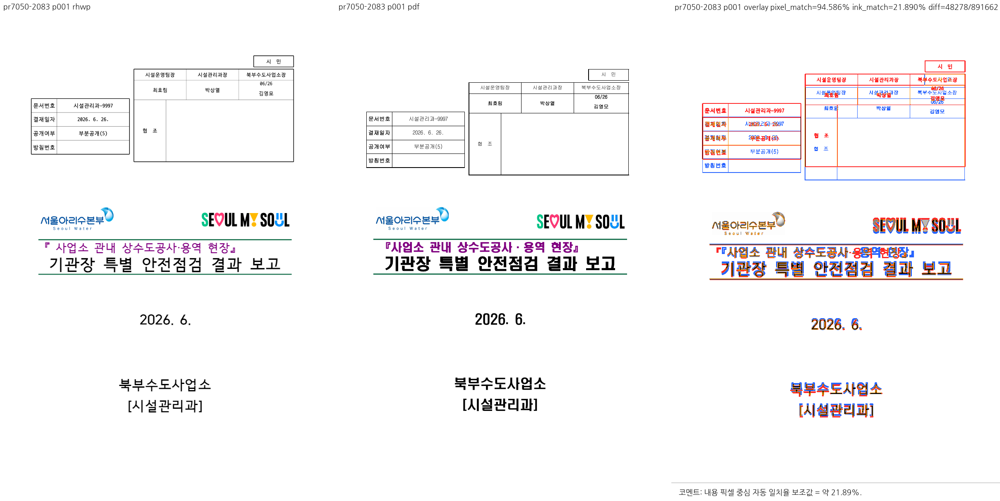
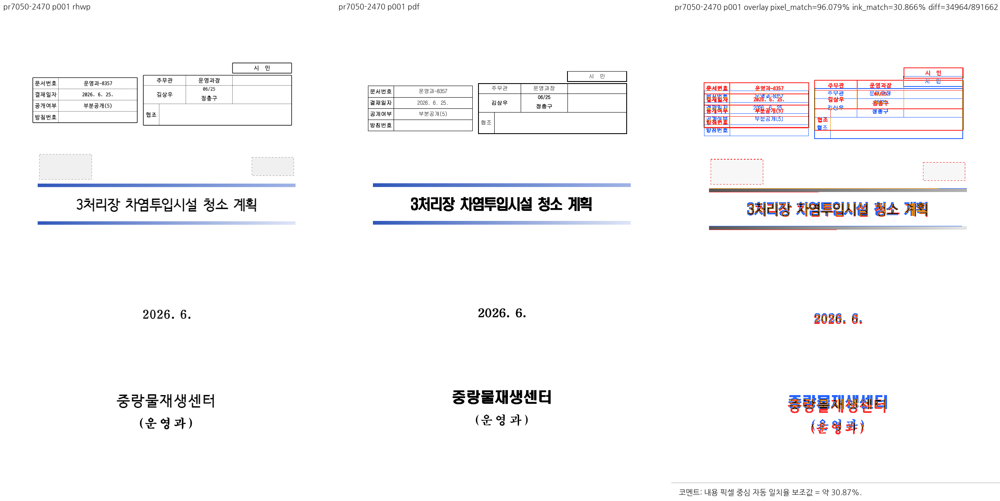

# PR #7050 — 누적 체리픽 검토

## 최종 판정

**머지 보류**. 아래 구현·검증 blocker를 해소하기 전 이 변경을 수용하지 않는다.

| 항목 | 확인값 |
| --- | --- |
| 원 PR / 이슈 | [#7050](https://github.com/edwardkim/rhwp/pull/7050) / [#7049](https://github.com/edwardkim/rhwp/issues/7049) |
| 작성자 / reviewer | lpaiu-cs / jangster77; 원 PR reviewer 선행 지정 완료 |
| base / draft | devel / false |
| 원 source head | `f26c0cae6b7f5a9506a6228b2ecea39cb04d5b6f` |
| 규모 | 3 files, +216 / -7 |
| mergeability | 조사 시 MERGEABLE / CLEAN; volatile 참고값 |
| 검토 경로 | collaborator_external_pr 체리픽 통합 + intake_and_review + local_validation + multi_pr_update_branch + visual_fixture_evidence |
| 구현 계획 | [원 PR별 적용·후속 계획](pr_7050_review_impl.md) |

실제 diff로 범위를 판단했다. `src/renderer/layout/paragraph_layout.rs`, `src/renderer/layout/table_layout.rs`, `tests/cases/issue_7049_inline_tac_table_baseline.rs`.
문서 전용 PR이 아니며, renderer/진단 또는 관련 기준값에 영향이 있어 공통 조판 검토를 적용했다.
원 PR CI는 모두 성공했으며 아래에서 재사용 근거까지 구분한다.
원격 head는 종료 전 재확인했으며 갱신됐다면 기존 판정을 최신 head에 이월하지 않는다.

## 원 PR 최신 head CI

GitHub Actions를 2026-09-12에 다시 조회했다. 원 PR 4건의 최신 CI는 모두 **SUCCESS**다.

| 원 PR | 최신 head CI | 실행 또는 재사용 근거 |
| --- | --- | --- |
| #7040 | [34674768254](https://github.com/edwardkim/rhwp/actions/runs/34674768254) | head `6b675ac94`에서 Lint·Native Skia·Build & Test 성공 |
| #7048 | [34672055783](https://github.com/edwardkim/rhwp/actions/runs/34672055783) | `b0d657d75`의 [성공 CI 34665904362](https://github.com/edwardkim/rhwp/actions/runs/34665904362) 재사용 |
| #7050 | [34672053443](https://github.com/edwardkim/rhwp/actions/runs/34672053443) | `e28ba0dc7`의 [성공 CI 34659681269](https://github.com/edwardkim/rhwp/actions/runs/34659681269) 재사용 |
| #7053 | [34672052090](https://github.com/edwardkim/rhwp/actions/runs/34672052090) | `5e83a52d5`의 [성공 CI 34670322954](https://github.com/edwardkim/rhwp/actions/runs/34670322954) 재사용 |

세 재사용 경로는 preflight의 `direct-source-build-and-test-green:success`와
`current-base-merge-tree-match`를 확인했다. 재사용 원본 run의 Lint·Native Skia·Archive A/B/C/D·
Build & Test도 모두 성공했다. 최신 head의 worker skip은 이 검증된 재사용 경로이며 누락으로 판정하지 않는다.
이후 아래 로컬 누적 후보의 실패는 원 PR CI와 구분한다. CI 녹색을 취소하거나 단독 source 실패로 바꾸어
기록하지 않는다. 코드 계약 검토 결과와 로컬 누적 환경의 차이는 각각 별도의 검토 근거다.

## 발견 사항과 해제 조건

### P1 — ‘표 전용 줄’을 문단 전체 표 개수로 판정한다

`src/renderer/layout/paragraph_layout.rs:7575-7586`과 `table_layout.rs:6957-6971`은
`para.controls`의 TAC 표를 모두 세어 `<=1`일 때만 저장 밴드 앵커를 적용한다.
같은 문단에 각자 다른 저장 줄을 독점하는 표가 두 개면 두 줄 모두 전용 줄이어도 이 조건이 거짓이다.
현재 표와 같은 줄의 텍스트/다른 인라인 요소 소속도 판정하지 않는다.
따라서 문단당 표 개수는 줄 독점의 필요충분 조건이 아니며, 다른 줄의 표 존재가 현재 줄 앵커를 바꾼다.
새 테스트의 전용 줄 보호 사례는 문단 표 하나뿐이어서 이 반례를 보호하지 않는다.
이 항목은 코드 규칙 위반이며 다중 줄 정상 한컴 문서의 실행 회귀를 검출한 것으로 표현하지 않는다.

해제 조건: 현재 배치할 표의 실제 줄 소속과 그 줄의 요소/메트릭으로 앵커를 결정하고,
서로 다른 줄의 전용 표·같은 줄 혼재·개행·폭 부족 사례를 독립 증거로 구분해 검증한다.

### 측정·배치 및 clamp 경계의 필수 증거 부족

두 파일의 조건식을 비슷하게 바꿨지만 공통 줄 결과를 공유하지 않는다.
한쪽의 ±0.2px와 다른 쪽의 ±10HU 조건도 완전히 같지 않으며,
`paragraph_layout`은 0.85 baseline 식을 쓰지만 `table_layout` 형제 경로에는 같은 else 규칙이 없다.
기존 `max(y)` clamp는 남아 있고, 성명/수험번호 사례는 그 clamp에 도달해 같은 y가 된다고 PR도 설명한다.
같은 y로 수렴했다는 결과만으로 두 표의 점유 영역과 바깥여백·기준선 규칙이 옳다고 결론내릴 수 없다.
형제 경로를 반드시 함께 전면 수정하라는 요구는 아니며, 실제 영향을 받는 경로와 비해당/미검증 근거를 분리해야 한다.

## 직접 확인한 개선과 한계

새 테스트 4개는 통과했다. 같은 줄 상대 하단 간격은 실제 통합 출력에서도 개선 목표와 맞는다.

| 원본 | 통합 표 2개의 y·높이(px) | 하단 간격 | PR이 제시한 한컴 기준 |
| --- | --- | --- | --- |
| issue2083_hide_fill_page | 208.4+134.5 / 104.8+256.3 | 18.2px | 18.22px |
| issue2470/36382471_masked | 157.6+109.0 / 122.2+150.6 | 6.2px | 6.23px |

두 원본의 한컴 PDF 1쪽과 통합 PNG를 직접 열었다. 상대 배치는 맞아도 표 전체의 절대 y 차이가 보이고,
글꼴 대체 차이도 남는다. 기존 관문 테스트 통과와 일부 상대 간격 개선을 전체 조판 규칙 충족으로 확대하지 않는다.

## 공통 조판 원칙 준수

[공통 계약](../../manual/pr_review/intake_and_review.md#27-조판-원칙-준수-검토)을 실제 호출 경로와 대조했다.

| 항목 | 판정 | 근거 |
| --- | --- | --- |
| 구현 근거와 일반성 | 미충족 | 문단 전체 표 수는 현재 줄 독점의 근거가 아님 |
| 측정·배치 일관성 | 미검증 | 두 배치 경로와 측정이 공통 줄 메트릭을 소비하는 증거 없음 |
| 줄 소속과 점유 높이 | 미충족 | 다른 줄 표까지 현재 줄의 앵커 조건에 포함 |
| 사례와 증거의 독립성 | 미검증 | 기존 4개 테스트 통과; 다중 줄·재조판·clamp 경계 증거 부족 |
| 기준값 변경 | 비해당 | baseline/golden/허용치 변경 없음 |
| 주장과 검증 범위 | 충족 | 상대 간격 개선과 절대 y/형제 경로 미검증을 분리 |

## 검증 환경과 결과

- macOS arm64, logical CPU 10, RAM 32 GiB, Rust 1.93.1, 기본 nextest 동시성.
- 기준 devel `ea5d1ff70b1d50301d1e6fdd26248e9d9c10c1fa`; 실제 코드 검증 head `522a2e80db04cbd84264406ccb8bdd33a21dcc55`.
- `target/pr-review`의 기존 소유·공유 상태와 실행 중 Cargo/Rust 작업 부재를 확인했다.
  공유 debug/release 및 다른 review target을 삭제하지 않고 고정 review target을 재사용했다.
- 검증에 사용해 보관한 `candidate-rhwp`의 SHA-256은
  `1e618148bf00501c613b3cd19269ed0453dbe90b630f84786ed7cf4b8366808b`다.
  대조 실험 후 복원한 source는 code head와 diff가 없다. 재빌드한 작업용 CLI와 보관한 검증 바이너리는 구분한다.
- `--prepare`, `cargo fmt --all`, fmt check, native Clippy, WASM32 Clippy,
  workspace build, workspace all-target Clippy, manifest check가 순차로 모두 exit 0이었다.
  파생 generated suite는 stage하지 않았다. source-side cfg(test)는 변경하지 않아 unit-tier 추가 gate는 비해당이다.
- 집중 nextest: **14 PASS / 1 FAIL / 9,548 filtered/ignored**. 실행 15건 중 실패는 #7048 새 회귀 1건.
- 전체 nextest: **9,516 PASS / 1 FAIL / 46 skipped**, 실행 342.021초, exit 100.
  실패는 동일 #7048 테스트뿐이다. 전체 성공이라고 기록하지 않는다.
- 새 sample 1개를 `RHWP_SECURITY_SWEEP_SAMPLES_JSON`으로 명시한 security 검사 PASS.
  기존 samples 전수 래칫은 통과했지만 baseline 증가의 독립 타당성은 별도 판정이다.
- Native Skia lib: exit 0, 4 binaries, 4112 PASS / 0 FAIL / 13 ignored.
- native-placeholder: exit 0;      Summary [   1.012s] 2 tests run: 2 passed, 190 skipped
- native-pdf: exit 0;      Summary [   0.766s] 4 tests run: 4 passed, 189 skipped
- WASM 진단 build: exit 0. Docker CLI는 있으나 daemon에 연결하지 못해
  공식 wrapper의 native `--no-opt` 경로를 사용했다. 최적화된 배포 빌드 통과로 주장하지 않는다.
- native↔WASM SVG parity: exit 0; 세부 결과는 아래 WASM 항목.
- OVR5 전수 base/head geometry 비교, 다른 OS, 원 제보 법령 187쪽, 누락한 다중 줄 정상 한컴 출력은 미실행이다.
  구현 blocker와 전체 테스트 실패가 남은 이 통합 branch의 merge gate를 완료한 것으로 처리하지 않는다.

```bash
node scripts/rust-test-suite-manifest.mjs --prepare
cargo fmt --all
cargo fmt --all -- --check
cargo clippy --locked --target-dir target/pr-review -- -D warnings
cargo clippy --locked -p rhwp --lib --target wasm32-unknown-unknown --target-dir target/pr-review -- -D warnings
cargo build --locked --workspace --target-dir target/pr-review
cargo clippy --locked --workspace --all-targets --target-dir target/pr-review -- -D warnings
node scripts/rust-test-suite-manifest.mjs --check
cargo nextest run --locked --cargo-profile release-test --target-dir target/pr-review --tests --no-fail-fast \
  -E 'test(/issue_7008|issue_7023|issue_7049|issue_6986|layout_anomaly_glyph_band/)'
RHWP_SECURITY_SWEEP_SAMPLES_JSON='["samples/issue6986/cell-page-and-total-page-in-one-run.hwpx"]' \
  cargo nextest run --locked --cargo-profile release-test --target-dir target/pr-review --tests --no-fail-fast
cargo test --locked --profile release-test --target-dir target/pr-review --features native-skia --lib
node scripts/run-rust-test.mjs issue_2225_missing_picture_placeholder -- --cargo-profile release-test --target-dir target/pr-review --features native-skia
node scripts/run-rust-test.mjs render_p37_direct_pdf_export -- --cargo-profile release-test --target-dir target/pr-review --features native-skia
CARGO_TARGET_DIR=target/pr-review scripts/wasm-pack-locked.sh --target web \
  --out-dir /tmp/rhwp-nondraft-review-20260912-YtWNPm/wasm-pkg --no-opt
```

원시 로그·JSON·probe source는 `/tmp/rhwp-nondraft-review-20260912-YtWNPm`에 남겼다. 저장소에는 요약과 최종 증적만 포함한다.
최소 계약 probe는 아래 명령으로 native debug 라이브러리에 연결해 실행했다. `review_probes.rs`의
SHA-256은 `e1d63642ce4dff5b617fc84efe6886cda4e2217e1e5a06260acb3e7ba313c423`이다.
이 하네스는 제품 source를 수정하지 않으며, #7040은 공개 모델 위치 API와 새 비교식,
#7048은 실제 공개 진단·SVG 출력 API를 실행한다.

```bash
rustc --edition=2021 /tmp/rhwp-nondraft-review-20260912-YtWNPm/review_probes.rs   --extern rhwp=target/pr-review/debug/librhwp.rlib -L dependency=target/pr-review/debug/deps   -o /tmp/rhwp-nondraft-review-20260912-YtWNPm/review_probes
/tmp/rhwp-nondraft-review-20260912-YtWNPm/review_probes
```


## 시각 증적과 provenance

[Visual Sweep 정본](../../manual/verification/visual_sweep_guide.md#github-merge-comment)을 사용했다. macOS Chrome webfont raster, 96 DPI다. 픽셀/잉크 일치율은 후보 지표이며 호환성 점수가 아니다.

- 원본 `samples/issue2083_hide_fill_page.hwpx`, SHA-256 `7758c15c57b1ef14fda6e6d29409ae3425f344931f2901641af84a40ef413d2e`.
- 원본 `samples/issue2470/36382471_masked.hwpx`, SHA-256 `43572dad5e17395aa02d1b0000b736b8467278931086604776ef30393dd0f54b`.
- 기준 `pdf/issue2083_hide_fill_page-hwpx-2020.pdf`, 202151 bytes, SHA-256 `00b37911e4a74410e5a6181a20a636b700bcaa950e885a12dc4d99bb91348c94`, SHA-1 `9662695316b07b404c06a7ef5a0a8e3003996406`. Creator:         Hwp 2022 0.0.0.0; Producer:        Hancom PDF 1.3.0.550; Pages:           4; PDF version:     1.6.
- 기준 `pdf/issue2470/36382471_masked-hwpx-2020.pdf`, 51691 bytes, SHA-256 `c742f264ecab461c86f10198164a762a95dfe8aea71f6fb8c94b13f9041038e1`, SHA-1 `fd6727783a75537a8ea3debc0d82efa85b3e4a91`. Creator:         Hwp 2022 0.0.0.0; Producer:        Hancom PDF 1.3.0.550; Pages:           2; PDF version:     1.6.



- 원 산출: `/tmp/rhwp-nondraft-review-20260912-YtWNPm/visual/pr7050-2083/review/review_001.png`; 최종 SHA-256 `93c17d0047b48ab337fcf164e59457303912d8bb5282002b06de988c89677980`.



- 원 산출: `/tmp/rhwp-nondraft-review-20260912-YtWNPm/visual/pr7050-2470/review/review_001.png`; 최종 SHA-256 `5e3849093c12740d8a0e0cfb838624d07f6f761ce3617b2fb02a90d495beeb58`.
- pr7050-2083: 1쪽 직접 확인, flagged 0쪽; pixel match 94.586%, ink match 21.890%.
- pr7050-2470: 1쪽 직접 확인, flagged 0쪽; pixel match 96.079%, ink match 30.866%.

## WASM 확인

```text
6 documents / 28 pages: native and WASM SVG all MATCH; exit 0.
Original fixtures: 4 documents x page 1.
Synthetic PAGE/TOTAL_PAGE order variants: 2 documents x 12 pages.
```

## 원격 후속 처리

현재 판정은 보류다. 이 기록을 GitHub approve/merge/close로 해석하지 않는다.
구체적인 위반 위치·실행 결과·미검증 범위를 보완 요청 근거로 사용하고, 수정 head에서 다시 검토한다.
