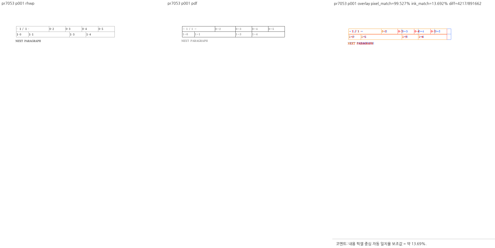

# PR #7053 — 누적 체리픽 검토

## 최종 판정

**승인**. 개별 #7053 변경에서 차단 결함을 찾지 못했다. 그러나 통합 branch는 다른 PR의 blocker와 전체 테스트 실패로 머지 보류다. 이 판정은 통합 branch 또는 원 PR의 원격 병합 실행을 뜻하지 않는다.

| 항목 | 확인값 |
| --- | --- |
| 원 PR / 이슈 | [#7053](https://github.com/edwardkim/rhwp/pull/7053) / [#6986](https://github.com/edwardkim/rhwp/issues/6986) |
| 작성자 / reviewer | planet6897 / jangster77; 원 PR reviewer 선행 지정 완료 |
| base / draft | devel / false |
| 원 source head | `6db3b169663f6cb68c4c4c25370112348d74b1e7` |
| 규모 | 3 files, +193 / -47 |
| mergeability | 조사 시 MERGEABLE / CLEAN; volatile 참고값 |
| 검토 경로 | collaborator_external_pr 체리픽 통합 + intake_and_review + local_validation + multi_pr_update_branch + visual_fixture_evidence |
| 구현 계획 | [원 PR별 적용·후속 계획](pr_7053_review_impl.md) |

실제 diff로 범위를 판단했다. `samples/issue6986/cell-page-and-total-page-in-one-run.hwpx`, `src/renderer/layout.rs`, `tests/cases/issue_6986_page_and_total_page_in_one_run.rs`.
문서 전용 PR이 아니며, renderer/진단 또는 관련 기준값에 영향이 있어 공통 조판 검토를 적용했다.
원 PR CI와 head 갱신 상태, 재사용 근거는 아래에 구분한다.
원격 head는 종료 전 재확인했으며 갱신됐다면 기존 판정을 최신 head에 이월하지 않는다.

## 원 PR 최신 head CI

GitHub Actions를 2026-09-12에 다시 조회했다. 대상 4건의 최신 **CI workflow는 모두 SUCCESS**다.
작업 중 갱신된 #7050 head `de3301a03891ff2a9287f907f6944a38cf59720b`도 CI 완료를 확인했다.
마지막 check-rollup 조회에서 #7050의 별도 CodeQL `Analyze (rust)`는 진행 중이었고 실패 check는 없었다.
CI workflow 성공과 모든 별도 check 완료를 구분한다.

| 원 PR | 최신 head CI | 실행 또는 재사용 근거 |
| --- | --- | --- |
| #7040 | [34674768254](https://github.com/edwardkim/rhwp/actions/runs/34674768254) | head `6b675ac94`에서 Lint·Native Skia·Build & Test 성공 |
| #7048 | [34672055783](https://github.com/edwardkim/rhwp/actions/runs/34672055783) | `b0d657d75`의 [성공 CI 34665904362](https://github.com/edwardkim/rhwp/actions/runs/34665904362) 재사용 |
| #7050 | [34677890610](https://github.com/edwardkim/rhwp/actions/runs/34677890610) | 새 head `de3301a03`에서 Lint·Native Skia·Archive A/B/C/D·Build & Test 성공 |
| #7053 | [34672052090](https://github.com/edwardkim/rhwp/actions/runs/34672052090) | `5e83a52d5`의 [성공 CI 34670322954](https://github.com/edwardkim/rhwp/actions/runs/34670322954) 재사용 |

#7048·#7053의 재사용 경로는 preflight의 `direct-source-build-and-test-green:success`와
`current-base-merge-tree-match`를 확인했다. 재사용 원본 run의 Lint·Native Skia·Archive A/B/C/D·
Build & Test도 모두 성공했다. 최신 head의 worker skip은 이 검증된 재사용 경로이며 누락으로 판정하지 않는다.
이후 아래 로컬 누적 후보의 실패는 원 PR CI와 구분한다. CI 녹색을 취소하거나 단독 source 실패로 바꾸어
기록하지 않는다. 코드 계약 검토 결과와 로컬 누적 환경의 차이는 각각 별도의 검토 근거다.

## 코드 검토와 실행 결과

검토 범위에서 차단 결함을 찾지 못했다. 모델 문자 인덱스를 유지한 채 Page·TotalPage 치환을
모아 런 단위 display_text를 한 번에 구성한다. `auto_number_placeholder_positions`도 다른 종류의
AutoNumber가 차지한 위치를 소비한다. 표 셀·글상자·머리말/꼬리말의 기존 wrapper가 공통 함수를 호출한다.
이 작업은 줄 소속·높이·래칫을 바꾸지 않으므로 중첩 표 네 가지 사례를 이 PR의 필수 조건으로 요구하지 않는다.

신규 회귀 테스트 1개가 통과했고, 실제 CLI에서 원본 1쪽의 `- 1 / 1 -`를 확인했다.
페이지 값과 총쪽수가 모두 1인 테스트만으로 값의 교환/덮어쓰기를 놓치지 않도록,
원본을 복제하고 명시 pageBreak를 준 12쪽 합성 HWPX를 두 종류로 추가 실행했다.

| 합성 입력 | 확인한 결과 |
| --- | --- |
| PAGE → TOTAL_PAGE | 1~12쪽 각각 `-1/12-` … `-12/12-` |
| TOTAL_PAGE → PAGE | 1~12쪽 각각 `-12/1-` … `-12/12-` |

이 24쪽은 native CLI 계약 검증이며 정상 한컴 문서 전수 증거가 아니다.
제보 법령 원본 187쪽은 확보하지 못했고 직접 검증하지 않았다.
원 PR 본문에 남은 검증 SHA 자리표시자 `$SHA`는 증적으로 사용하지 않고 아래 실제 SHA·명령을 사용했다.

## 한컴 기준 PDF와 직접 시각 검증

제출 fixture의 마지막 저장 metadata는 `hancom-office-2020`, `11.0.0.7257`이다.
통합 HWP 2024 client 0.9.0의 `start → status → download`, 요청 engine **2020**을 사용했다.
job `377d07ed-c338-4a1a-8fdd-2b1ad4e9b60e`는 `queued → succeeded → success`였고,
start/status의 engine도 2020이었다. 출력 10,584 bytes와 client/server SHA-256이 일치했다.
backend `hwp-managed-direct-dll-host`, worker 32bit, `hancom_version=12.0.0.4605`,
PDF Creator `Hwp 2022 0.0.0.0`이다. engine bucket 이름과 실제 제품 버전을 구분한다.

PDF를 열고 webfont sweep 패널을 직접 확인해 첫 칸의 현재쪽/총쪽수 두 값이 모두 표시됨을 확인했다.
표 선·글꼴·폭 차이가 남으므로 이 결과를 전체 레이아웃 일치로 설명하지 않는다.

## 공통 조판 원칙 준수

[공통 계약](../../manual/pr_review/intake_and_review.md#27-조판-원칙-준수-검토)을 실제 호출 경로와 대조했다.

| 항목 | 판정 | 근거 |
| --- | --- | --- |
| 구현 근거와 일반성 | 충족 | 동일 런 재구성이 앞 치환을 덮는 원인을 공통 경로에서 수정 |
| 측정·배치 일관성 | 충족 | 모델 인덱스를 보존하고 표시 치환만 일괄 구성; backend 확인은 아래 기록 |
| 줄 소속과 점유 높이 | 비해당 | 줄 소속·높이·기준선 변경 없음 |
| 사례와 증거의 독립성 | 충족 | 새 회귀와 12쪽 정/역순 계약, 제출 fixture 한컴 출력 대조를 구분 |
| 기준값 변경 | 비해당 | 래칫 허용치 변경 없음; 새 한컴 PDF는 reviewer 증적 |
| 주장과 검증 범위 | 충족 | 이번 review의 exact SHA·실제 실행/한계로 판단; 원문의 자리표시자는 사용 안 함 |

## 검증 환경과 결과

아래 실행 수치·이미지는 코드 후보 `522a2e80d`의 결과다. 이후 #7050의 새 head를
`-x`로 적용한 최신 후보는 `78f2a85b103a287c4def67221ff94b3b4e7ed298`다. 두 Rust 파일만 달라졌고 테스트 source는 같다.
최신 후보의 로컬 빌드·전체 테스트·시각 출력은 재실행하지 않았으며 이전 결과를 이월해 성공으로 주장하지 않는다.
사용자 지시에 따라 #7050 새 source CI의 최종 SUCCESS를 확인했다.

- macOS arm64, logical CPU 10, RAM 32 GiB, Rust 1.93.1, 기본 nextest 동시성.
- 기준 devel `ea5d1ff70b1d50301d1e6fdd26248e9d9c10c1fa`; 실제 코드 검증 head `522a2e80db04cbd84264406ccb8bdd33a21dcc55`.
- `target/pr-review`의 기존 소유·공유 상태와 실행 중 Cargo/Rust 작업 부재를 확인했다.
  공유 debug/release 및 다른 review target을 삭제하지 않고 고정 review target을 재사용했다.
- 검증에 사용해 보관한 `candidate-rhwp`의 SHA-256은
  `1e618148bf00501c613b3cd19269ed0453dbe90b630f84786ed7cf4b8366808b`다.
  대조 실험 후 복원한 source는 code head와 diff가 없다. 재빌드한 작업용 CLI와 보관한 검증 바이너리는 구분한다.
- `--prepare`, `cargo fmt --all`, fmt check, native Clippy, WASM32 Clippy,
  workspace build, workspace all-target Clippy, manifest check가 순차로 모두 exit 0이었다.
  파생 generated suite는 stage하지 않았다. source-side cfg(test)는 변경하지 않아 unit-tier 추가 gate는 비해당이다.
- 집중 nextest: **14 PASS / 1 FAIL / 9,548 filtered/ignored**. 실행 15건 중 실패는 #7048 새 회귀 1건.
- 전체 nextest: **9,516 PASS / 1 FAIL / 46 skipped**, 실행 342.021초, exit 100.
  실패는 동일 #7048 테스트뿐이다. 전체 성공이라고 기록하지 않는다.
- 새 sample 1개를 `RHWP_SECURITY_SWEEP_SAMPLES_JSON`으로 명시한 security 검사 PASS.
  기존 samples 전수 래칫은 통과했지만 baseline 증가의 독립 타당성은 별도 판정이다.
- Native Skia lib: exit 0, 4 binaries, 4112 PASS / 0 FAIL / 13 ignored.
- native-placeholder: exit 0;      Summary [   1.012s] 2 tests run: 2 passed, 190 skipped
- native-pdf: exit 0;      Summary [   0.766s] 4 tests run: 4 passed, 189 skipped
- WASM 진단 build: exit 0. Docker CLI는 있으나 daemon에 연결하지 못해
  공식 wrapper의 native `--no-opt` 경로를 사용했다. 최적화된 배포 빌드 통과로 주장하지 않는다.
- native↔WASM SVG parity: exit 0; 세부 결과는 아래 WASM 항목.
- OVR5 전수 base/head geometry 비교, 다른 OS, 원 제보 법령 187쪽, 누락한 다중 줄 정상 한컴 출력은 미실행이다.
  구현 blocker와 전체 테스트 실패가 남은 이 통합 branch의 merge gate를 완료한 것으로 처리하지 않는다.

```bash
node scripts/rust-test-suite-manifest.mjs --prepare
cargo fmt --all
cargo fmt --all -- --check
cargo clippy --locked --target-dir target/pr-review -- -D warnings
cargo clippy --locked -p rhwp --lib --target wasm32-unknown-unknown --target-dir target/pr-review -- -D warnings
cargo build --locked --workspace --target-dir target/pr-review
cargo clippy --locked --workspace --all-targets --target-dir target/pr-review -- -D warnings
node scripts/rust-test-suite-manifest.mjs --check
cargo nextest run --locked --cargo-profile release-test --target-dir target/pr-review --tests --no-fail-fast \
  -E 'test(/issue_7008|issue_7023|issue_7049|issue_6986|layout_anomaly_glyph_band/)'
RHWP_SECURITY_SWEEP_SAMPLES_JSON='["samples/issue6986/cell-page-and-total-page-in-one-run.hwpx"]' \
  cargo nextest run --locked --cargo-profile release-test --target-dir target/pr-review --tests --no-fail-fast
cargo test --locked --profile release-test --target-dir target/pr-review --features native-skia --lib
node scripts/run-rust-test.mjs issue_2225_missing_picture_placeholder -- --cargo-profile release-test --target-dir target/pr-review --features native-skia
node scripts/run-rust-test.mjs render_p37_direct_pdf_export -- --cargo-profile release-test --target-dir target/pr-review --features native-skia
CARGO_TARGET_DIR=target/pr-review scripts/wasm-pack-locked.sh --target web \
  --out-dir /tmp/rhwp-nondraft-review-20260912-YtWNPm/wasm-pkg --no-opt
```

원시 로그·JSON·probe source는 `/tmp/rhwp-nondraft-review-20260912-YtWNPm`에 남겼다. 저장소에는 요약과 최종 증적만 포함한다.
최소 계약 probe는 아래 명령으로 native debug 라이브러리에 연결해 실행했다. `review_probes.rs`의
SHA-256은 `e1d63642ce4dff5b617fc84efe6886cda4e2217e1e5a06260acb3e7ba313c423`이다.
이 하네스는 제품 source를 수정하지 않으며, #7040은 공개 모델 위치 API와 새 비교식,
#7048은 실제 공개 진단·SVG 출력 API를 실행한다.

```bash
rustc --edition=2021 /tmp/rhwp-nondraft-review-20260912-YtWNPm/review_probes.rs   --extern rhwp=target/pr-review/debug/librhwp.rlib -L dependency=target/pr-review/debug/deps   -o /tmp/rhwp-nondraft-review-20260912-YtWNPm/review_probes
/tmp/rhwp-nondraft-review-20260912-YtWNPm/review_probes
```


## 시각 증적과 provenance

[Visual Sweep 정본](../../manual/verification/visual_sweep_guide.md#github-merge-comment)을 사용했다. macOS Chrome webfont raster, 96 DPI다. 픽셀/잉크 일치율은 후보 지표이며 호환성 점수가 아니다.

- 원본 `samples/issue6986/cell-page-and-total-page-in-one-run.hwpx`, SHA-256 `0bae4669b776cad8e17c440ca2d6bb8f2b838990a42569fa5aaf58a340790c67`.
- 기준 `pdf/cell-page-and-total-page-in-one-run-2020.pdf`, 10584 bytes, SHA-256 `26c0b17ab8ae3916b5825a18f873c6436a32695d397e7d11fad2693c8b816887`, SHA-1 `794ab5cf6095427551df171e7e08697b3b7a73ad`. Creator:         Hwp 2022 0.0.0.0; Producer:        Hancom PDF 1.3.0.550; Pages:           1; PDF version:     1.6.



- 원 산출: `/tmp/rhwp-nondraft-review-20260912-YtWNPm/visual7053/pr7053/review/review_001.png`; 최종 SHA-256 `6476c76490b8767b9f3fbfbbd3d509ecfff0ca005c84917a18f64cd664152146`.
- pr7053: 1쪽 직접 확인, flagged 0쪽; pixel match 99.527%, ink match 13.692%.

## WASM 확인

```text
6 documents / 28 pages: native and WASM SVG all MATCH; exit 0.
Original fixtures: 4 documents x page 1.
Synthetic PAGE/TOTAL_PAGE order variants: 2 documents x 12 pages.
```

## Merge 후 contributor PR comment 계획

현재는 게시하지 않았다. #7053을 분리해 통합하거나 모든 blocker를 해결한 통합 PR이 실제 merge되고,
위 asset과 PDF가 devel에 존재할 때만 다음 계획을 실행한다.

- 실제 검증은 제출 fixture 1쪽 한컴 PDF 대조와 12쪽 정/역순 native 계약 24쪽이다. 원 제보 187쪽은 미검증이다.
- Visual Sweep 정본 direct link와 이 review 문서를 연결하고, 원 PR/기능 SHA·최종 merge SHA를 구분한다.
- 대표 이미지: `mydocs/pr/assets/pr7053_integrated_fields_review_p001.png`.
- 이미지 URL: `https://raw.githubusercontent.com/edwardkim/rhwp/<merge-commit-sha>/mydocs/pr/assets/pr7053_integrated_fields_review_p001.png`.
- UTF-8 Markdown 파일로 `gh pr comment 7053 --body-file <파일>` 게시 후 API로 실제 본문을 확인한다.
- 원본 통합·CI·merge 확인 전 #7053/#6986을 닫지 않는다. 출처 fork branch를 삭제하지 않는다.
