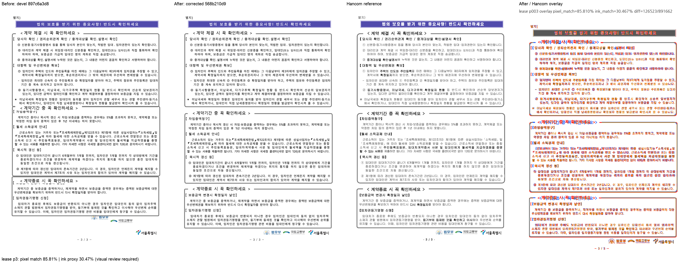

# PR #7073 — 빈 개체 host의 저장 줄 전진과 제목·글상자 겹침 검토

**최종 판정: 메인터너 보정 후 수용 가능.** 저장된 문단 간격까지 포함한 사다리 판정으로 제목·글상자 겹침을 해소했다. 최초 통합 후보에는 하단 법무부 로고의 17.9px 오배치가 남아 있어 메인터너 code 568b210d9를 추가했다.

이 문서는 로컬 검증에 따른 수용 판정이다. 최종 통합 head의 GitHub CI·MERGEABLE/CLEAN 확인과 실제 merge 전에는 원 PR을 close하지 않는다. 원 PR의 녹색 CI를 통합 후보의 Full CI로 대신하지 않는다.

## 대상과 코드 계약

- 원 PR: [#7073](https://github.com/edwardkim/rhwp/pull/7073), planet6897 / reviewer jangster77.
- 원 head: `6952477ae783235377495caeaedd0a23f1a21373`. 기준 devel: `897c6a3d8d7559d314bf863c93bbe28c0d65e945`.
- cherry-pick -x 대응: `b42a5e288, 4725bcdbb, 1aca2baf4`. 통합 runtime 보정 head: `568b210d9`.
- 주 작업공간 branch: `review/planet6897-20260913`. 기본 collaborator_external_pr, 보조 intake_and_review·local_validation·multi_pr_update_branch·visual_fixture_evidence.
- 관련 issue: #7047.

FullParagraph의 textless host는 유효한 단일 저장 LineSeg의 다음 문단 전진을 사용한다. line height·line spacing·현재 문단 뒤 간격·다음 문단 앞 간격을 같은 좌표 단위로 비교한다. 장식용 floating table의 zero-flow 판정과 실제 배치가 같은 소유 관계를 따른다. 추가 보정은 TopAndBottom Picture/Shape를 기존 저장 사다리 질의에 포함하며, synthetic-tag·stale-delta 배제는 유지한다. #7089의 저장 LineSeg 없는 host 앞 spacer 변경은 포함하지 않았다.

## 실제 검증과 한계

독립 한컴 PDF의 하단 로고 3개는 모두 y=784.901pt(1046.535px)에서 시작한다. 최초 후보의 법무부 로고 1029.7px를 보정한 뒤 세 로고가 모두 1047.7px로 정렬되고 글상자 아래에 놓인다. 새 테스트는 세 상단의 동일성과 글상자와의 비겹침을 확인한다. 0.1px는 SVG 소수 첫째 자리 반올림 비교이며 절대 위치 허용치를 넓힌 것이 아니다. 1·2쪽 SVG/tree는 기준 devel과 동일하고 3쪽만 변경됐다.

최종 통합 전체 nextest **Summary [ 457.270s] 9565 tests run: 9565 passed (7 slow), 46 skipped**, 세 Clippy(native/WASM/workspace all-targets), workspace build, manifest/unit-tier check, Native Skia 3종, WASM build/parity를 통과했다. [공통 검증 기록](pr_7073_review_impl.md)에 exact command·시간·바이너리·24개 입력 provenance를 기록했다. 원 작성자의 실측과 이번 Mac 실행을 구분한다.

전체 3쪽의 글꼴·줄바꿈·테두리 위치가 PDF와 완전히 일치하지는 않는다. 수용 범위는 제목 겹침과 이 저장 host 계열의 전진이며 pixel/ink 지표를 전체 정확도로 해석하지 않는다.

통합 code candidate `d3dfa17e0f1cb454793b16c19628405e6f02b535`의 [Full CI / Build & Test](https://github.com/edwardkim/rhwp/actions/runs/34741218879), [CodeQL](https://github.com/edwardkim/rhwp/actions/runs/34741218885), [Render Diff](https://github.com/edwardkim/rhwp/actions/runs/34741218798)가 완료·success임을 확인한 뒤 이 review-only 기록을 추가했다. 최종 trailing head aggregate는 push 뒤 별도로 확인한다.

## Visual sweep

- 대표 3쪽: pixel match **85.81043%**, ink proxy **30.46697%**.
- 96dpi / threshold 32. SVG sweep 선택 페이지의 자동 flagged 0은 완전한 fidelity 승인이 아니다. PDF export 검토는 실제 PDF를 raster했다.
- [before / after / 한컴 PDF / overlay 전체 페이지 패널](../assets/pr7073_textless_host_review_p003.png)

## 검증 파일의 commit 포함

| 파일 | 마지막 파일 commit | SHA-256 |
| --- | --- | --- |
| [`pdf/housing-lease-standard-form-2020.pdf`](../../../pdf/housing-lease-standard-form-2020.pdf) | `2fabd879a` | `f73f17d57b566d35f1641eef4ba1ab580aaf13725493b29e5ec88e7496e64e39` |
| [`tests/fixtures/issue_7047/housing-lease-standard-form.hwp`](../../../tests/fixtures/issue_7047/housing-lease-standard-form.hwp) | `b42a5e288` | `fe295c12c5f9bd9e7e73a540c7c7ecd044f18ed58ea9826c0de5d55ba2710439` |

각 파일을 `git show HEAD:<path>`와 바이트 대조했다. 원본·독립 한컴 기준·후보 검사 산출은 같은 통합 PR의 blob으로 재현할 수 있다. 변환 산출을 독립 oracle로 사용하지 않았다.

## 공통 조판 원칙 검토

| 항목 | 판정·근거 |
| --- | --- |
| 구현 근거·일반성 | 충족 — 위 source 계약·한컴 독립 실측에 근거하며 문서 ID 분기·clamp 없음 |
| 측정·배치 일관성 | 충족 — 저장 사다리 판정과 실제 host 전진이 같은 줄 계약을 소비한다. 새 TopAndBottom 분기도 기존 stale/synthetic 가드를 거친다. |
| 줄 소속·점유 높이 | 충족 — 개체 예약 높이와 앵커 문단 줄의 전진을 구분한다. stored line과 문단 앞뒤 간격을 중복 합산하지 않는다. |
| 사례·증거 독립성 | 충족 — committed 원본/한컴 출력과 후보를 구분하고 집중·전체 회귀를 실행 |
| 기준값 변경 | 비해당 — baseline/golden 허용치 변경 없음. 로고 동일 상단은 한컴 이미지 rect에서 독립 취득했다. |
| 주장·검증 범위 | 충족 — 위 잔여 문제와 미실행 작성자 전수 실측을 명시하고 실제 재검증 범위에 한정 |

## Merge 후 원 PR comment 계획

기여에 감사 인사를 남기고 원 head `6952477ae783235377495caeaedd0a23f1a21373`의 반영, 통합 PR 번호·merge SHA와 메인터너 보정을 알린다. [review](pr_7073_review.md)는 `https://github.com/edwardkim/rhwp/blob/<merge-commit-sha>/mydocs/pr/archives/pr_7073_review.md`로 고정한다. PNG는 `https://raw.githubusercontent.com/edwardkim/rhwp/<merge-commit-sha>/mydocs/pr/assets/pr7073_textless_host_review_p003.png`로 고정하고 위 page/pixel/ink/잔여 차이를 함께 게시한다. 통합 merge 후 #7047 종료를 확인한다. 통합 merge가 확인된 뒤 원 PR을 close하며 contributor fork branch는 삭제하지 않는다.
