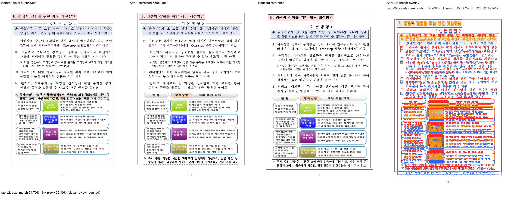

# PR #7074 — TAC 개체 host의 점유 높이 검토

**최종 판정: 메인터너 보정 후 수용 가능.** 높이 400px인 TAC 도해의 host가 5.3px만 차지하여 뒤 문단이 그림 내부에 놓이던 오류를 해결했다. #7083의 뒤 leading과 함께 누적 검토했으며 별도 중복 적용하지 않았다.

이 문서는 로컬 검증에 따른 수용 판정이다. 최종 통합 head의 GitHub CI·MERGEABLE/CLEAN 확인과 실제 merge 전에는 원 PR을 close하지 않는다. 원 PR의 녹색 CI를 통합 후보의 Full CI로 대신하지 않는다.

## 대상과 코드 계약

- 원 PR: [#7074](https://github.com/edwardkim/rhwp/pull/7074), planet6897 / reviewer jangster77.
- 원 head: `416e894a8133608829788cb06f7cb757751f4b5a`. 기준 devel: `897c6a3d8d7559d314bf863c93bbe28c0d65e945`.
- cherry-pick -x 대응: `e81628483`. 통합 runtime 보정 head: `568b210d9`.
- 주 작업공간 branch: `review/planet6897-20260913`. 기본 collaborator_external_pr, 보조 intake_and_review·local_validation·multi_pr_update_branch·visual_fixture_evidence.
- 관련 issue: #7062.

table cell의 TAC-only 문단도 기존 tac_object_stack_line_metrics를 같은 available width로 호출하여 그림 높이를 줄의 점유 높이에 반영한다. renderer에서 임의 보정값을 더하는 방식이 아니다. 빈 TextLine bbox와 그 뒤 문단의 시작 위치가 같은 host metric을 사용한다.

## 실제 검증과 한계

실물 156060125의 2쪽 그림 y=548.1px/h=400px, 후속 표 시작은 553.4px에서 통합 후 958.0px로 이동했다. #7083을 포함한 host advance는 410px다. 10쪽 전체 SVG/tree와 한컴 PDF를 대조했고 SVG는 2쪽만 바뀐다. 4·10쪽의 빈 TextLine bbox 높이는 변경되지만 화면 SVG는 동일하다. 원 PR의 누락된 PDF 설명은 4aa80b96a에서 커밋된 기준 PDF에 맞게 정정했다.

최종 통합 전체 nextest **Summary [ 457.270s] 9565 tests run: 9565 passed (7 slow), 46 skipped**, 세 Clippy(native/WASM/workspace all-targets), workspace build, manifest/unit-tier check, Native Skia 3종, WASM build/parity를 통과했다. [공통 검증 기록](pr_7073_review_impl.md)에 exact command·시간·바이너리·24개 입력 provenance를 기록했다. 원 작성자의 실측과 이번 Mac 실행을 구분한다.

한컴 대비 2쪽 전체 내용의 약 20px 상향 차이와 글꼴 차이는 남아 있다. 6쪽은 기준 devel에도 존재하는 table off-canvas 30.1467px, cell overflow 10.1px가 그대로다. 6쪽 해결이나 문서 전체 한컴 일치를 주장하지 않는다.

통합 code candidate `d3dfa17e0f1cb454793b16c19628405e6f02b535`의 [Full CI / Build & Test](https://github.com/edwardkim/rhwp/actions/runs/34741218879), [CodeQL](https://github.com/edwardkim/rhwp/actions/runs/34741218885), [Render Diff](https://github.com/edwardkim/rhwp/actions/runs/34741218798)가 완료·success임을 확인한 뒤 이 review-only 기록을 추가했다. 최종 trailing head aggregate는 push 뒤 별도로 확인한다.

## Visual sweep

- 대표 2쪽: pixel match **74.69983%**, ink proxy **25.09654%**.
- 96dpi / threshold 32. SVG sweep 선택 페이지의 자동 flagged 0은 완전한 fidelity 승인이 아니다. PDF export 검토는 실제 PDF를 raster했다.
- [before / after / 한컴 PDF / overlay 전체 페이지 패널](../assets/pr7074_pr7083_tac_host_review_p002.png)

## 검증 파일의 commit 포함

| 파일 | 마지막 파일 commit | SHA-256 |
| --- | --- | --- |
| [`pdf/tac_object_host_line_height-2020.pdf`](../../../pdf/tac_object_host_line_height-2020.pdf) | `b76fd6cb6` | `f90ea6915a842ac2266f4dd737b2829bbb3b72b927b1658577f6ca8c8b9b6051` |
| [`samples/issue7062/tac_object_host_line_height.hwp`](../../../samples/issue7062/tac_object_host_line_height.hwp) | `e81628483` | `2cf764c89943a23eff17fb8ac5ccaa1958711216b15d5eb29a9a469b97d23abb` |

각 파일을 `git show HEAD:<path>`와 바이트 대조했다. 원본·독립 한컴 기준·후보 검사 산출은 같은 통합 PR의 blob으로 재현할 수 있다. 변환 산출을 독립 oracle로 사용하지 않았다.

## 공통 조판 원칙 검토

| 항목 | 판정·근거 |
| --- | --- |
| 구현 근거·일반성 | 충족 — 위 source 계약·한컴 독립 실측에 근거하며 문서 ID 분기·clamp 없음 |
| 측정·배치 일관성 | 충족 — cell 측정과 실제 문단 배치가 동일 TAC stack metric과 폭을 사용한다. |
| 줄 소속·점유 높이 | 충족 — 그림 400px를 host 줄이 점유하고 후속 문단이 그 아래에서 시작한다. 뒤 leading은 #7083의 별도 공통 계산이다. |
| 사례·증거 독립성 | 충족 — committed 원본/한컴 출력과 후보를 구분하고 집중·전체 회귀를 실행 |
| 기준값 변경 | 충족 — 새 sample에 off_canvas 1 / overflow_cell 1을 등록했다. 기준 devel 바이너리에서도 정확히 같은 6쪽 표 bbox와 overflow가 발생하고 SVG/tree가 동일함을 재현했다. 기존 fixture 허용치는 늘리지 않았다. |
| 주장·검증 범위 | 충족 — 위 잔여 문제와 미실행 작성자 전수 실측을 명시하고 실제 재검증 범위에 한정 |

## Merge 후 원 PR comment 계획

기여에 감사 인사를 남기고 원 head `416e894a8133608829788cb06f7cb757751f4b5a`의 반영, 통합 PR 번호·merge SHA와 메인터너 보정을 알린다. [review](pr_7074_review.md)는 `https://github.com/edwardkim/rhwp/blob/<merge-commit-sha>/mydocs/pr/archives/pr_7074_review.md`로 고정한다. PNG는 `https://raw.githubusercontent.com/edwardkim/rhwp/<merge-commit-sha>/mydocs/pr/assets/pr7074_pr7083_tac_host_review_p002.png`로 고정하고 위 page/pixel/ink/잔여 차이를 함께 게시한다. 통합 merge 후 #7062 종료를 확인한다. 6쪽 기존 넘침을 이 수정의 해결 결과로 세지 않는다. 통합 merge가 확인된 뒤 원 PR을 close하며 contributor fork branch는 삭제하지 않는다.
