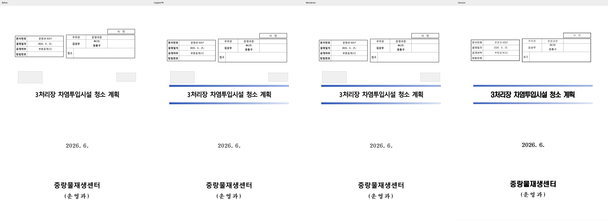
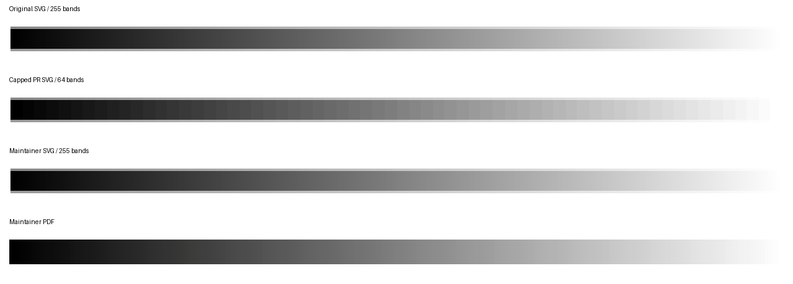

# PR #7078 검토 — 메인터너 보정 후 수용 가능

## 최종 판정과 출처

**초기 머지 보류 사유를 해결했다. 원 PR의 공통 64띠 상한 대신 메인터너 PDF 보정을 통합한다.**

| 항목 | 내용 |
| --- | --- |
| 원 PR / 작성자 / base | [#7078](https://github.com/edwardkim/rhwp/pull/7078) / lpaiu-cs / devel |
| 원 head | `d865f0d43ecbdb8d2a3c716e1e86ac72b2bed143` |
| 원 diff | 3개 파일, +166/-2 |
| 초기 적용·보류 | `85fa18d60651ff560dadc5a79140798f5975dd16` 적용 → `fb09813f6` 되돌림 |
| 메인터너 보정 | `0acc011e3` — PDF stitching 함수 계층화와 제품 경로 회귀 테스트 |
| 검토 브랜치 / 기준 | `review/pr7078-7091-20260913` / devel `1ae5ca295bddcb31b846affc62834a2a3023d24d` |
| 원격 상태 | 2026-09-13 재확인한 원 head 동일. merge 전 최신 상태·CI 재조회 필요 |

## 보류 원인과 해결

기본 PDF의 그러데이션이 없어지는 결함은 재현됐다. 기존 svg2pdf가 510 stops를
509개 Type 2 함수가 달린 단일 Type 3 함수로 바꿨고, MuPDF의 함수당 256개 제한에 걸렸다.
원 PR은 공통 `expand_gradient_steps`를 64띠로 줄여 PDF 오류를 피했지만 SVG·Canvas·Skia에도
손실을 만들었다. 고대비 반례의 255 고유색이 64개로 감소했고 기존 step=100 계약도 낮췄다.

보정은 동일한 `edwardkim/svg2pdf` 고정 rev `2caeb0a038f9128b79833d803b94c2667565c4da`의
라이브러리·ICC·라이선스·NOTICE를 `vendor/svg2pdf`에 보존하고 PDF 함수 목록만 계층화한다.
원래 각 구간의 Type 2 함수와 색·불투명도는 전부 유지한다. 부모 Encode와 자식 Domain은 같은
원본 stop 좌표를 써서 입력 매핑이 항등이 되며, 한 함수의 자식 수만 256 이하로 만든다.
작은 함수는 기존 순서·표현을 유지한다. RGB와 opacity soft mask에 같은 보정이 적용된다.

[PDF 32000-1 §7.10.4](https://opensource.adobe.com/dc-acrobat-sdk-docs/standards/pdfstandards/pdf/PDF32000_2008.pdf)의
1입력 stitching 계약과 [MuPDF 구현](https://github.com/ArtifexSoftware/mupdf/blob/master/source/pdf/pdf-function.c)을 확인했다.
벤더 src 18개 중 변경된 것은 `render/gradient.rs`와 lifetime 표기만 보정한 `util/helper.rs`뿐이다.
공통 renderer와 #6822 step=100 테스트는 devel 대비 변경이 없다. 출처는
[벤더 변경 기록](../../../vendor/svg2pdf/RHWP_PATCHES.md)에 있다.

## 실제 출력과 반례

- 기존 `samples/issue2470/36382471_masked.hwpx` 1쪽: 이전·원 PR·보정·한컴 PDF 전체 페이지를 직접 비교했다.
  수정 전 MuPDF는 `too many sub-functions in stitching function`을 보고했고 배경이 흰색이었다.
  보정 PDF와 고대비 반례 PDF는 같은 오류 없이 렌더됐다.
- 96dpi (400,417) 픽셀: 수정 전 `(255,255,255)`, 원 PR `(102,133,206)`, 보정 `(103,133,206)`,
  독립 한컴 `(102,133,207)`. 이는 표본 실측이며 전체 페이지 동일성 주장이 아니다.
- 고대비 합성 HWPX는 보정 후 **510 stops / 255 고유색**을 유지했다. 같은 SVG raster의
  비교 행 고유색도 기존 254개 그대로이며 원 PR은 65개였다(경계 antialias 포함).
  PDF raster 행은 234개다. PDF reader의 색 관리·픽셀 양자화를 공통 IR 색 감소와 혼동하지 않는다.
- 제품 변환 경로의 실제 PDF 함수를 해석해 원 구간 중점 색과 opacity를 대조했다.
  HWP 띠 수 100/129/255/1024, stepCenter 0/8/50/92/100, 선형·원형을 검사했고,
  일반 다중색·투명도 램프는 1/256/257/1024구간으로 함수당 제한 양옆을 확인했다. 2개 테스트 PASS.
- 큰 단일 함수를 처리하는 Poppler에서도 같은 문서의 무상한 이전 PDF와 보정 PDF를 대조했다.
  실문서·고대비 반례 모두 96dpi 전체 페이지 픽셀이 동일했다. PDF 계층화가 기존 색 표현을 바꾸지 않았음을
  별도 PDF reader의 실제 출력으로 확인했다. 비교 전용 flat PDF는 같은 출력의 중복 산출물이므로 커밋하지 않는다.
- 이 합성 반례에는 독립 한컴 oracle이 없다. 기존 실문서 PDF 개선과 원래 색 표현 계약 보존을 각각 검사했다.
  글꼴·본문의 기존 한컴 차이와 #7085의 별도 표 정렬 개선을 이번 PDF 보정의 해결로 확대하지 않는다.

## 공통 원칙 판정

| 항목 | 판정 | 근거 |
| --- | --- | --- |
| 구현 계층·일반성 | 충족 | PDF 변환기 함수 구조에서 해결, 공통 띠 상한·샘플 ID 분기 없음 |
| 측정·배치 일치 | 비해당 | 줄 측정·배치 변경 없음 |
| 줄 소속·점유 높이 | 비해당 | PDF 색 함수 표현만 변경 |
| 독립 정답·대표/반례 | 충족 | 실문서 한컴 대조와 고대비·다중색·불투명도·경계 테스트 |
| 기준값 변경 | 비해당 | 공통 step=100 및 baseline/golden 변경 없음 |
| 주장·증빙 일치 | 충족 | 출력 오류 해소·원본 색 보존과 기존 페이지 차이를 구분 |

## 완료한 로컬 검증

검증 코드 head는 `0acc011e3`이며 아래 필수 13단계가 모두 exit 0으로 완료됐다.
이후 source/test/build 입력 변경 여부와 현재 증거 head `e670fb245a15f7e281401045065552f4f638041b`의 관계는 [공통 검토](pr_7078_review_impl.md)에 기록했다.
집중 **35 PASS**, 전체 **9,577 PASS / 46 skipped**, 세 Clippy·workspace build·manifest·unit-tier 검사를 통과했다.
Native Skia lib 4,112건(13 ignored)·placeholder 2건·direct PDF 4건과 WASM native `--no-opt` build를 완료했다.
전체 nextest에는 leaky가 없었다. Native Skia direct PDF의 `document_core_direct_pdf_preserves_selection_errors`
1건에는 leaky 표시가 있었으며 재확인 결과와 최초 기록을 공통 검토에 함께 남겼다.
4문서 31쪽 native/WASM SVG 불일치는 0이며, 기존 #7085/#7089 후보와도 동일 CLI SVG 31쪽이 같다.
Docker daemon 연결 불가로 최적화 Docker build는 미실행이다. 정확한 명령·단계별 시간·leaky 여부는 공통 검토를 참조한다.
사용자 승인으로 [통합 PR #7102](https://github.com/edwardkim/rhwp/pull/7102)를 생성했으며 code candidate `e670fb245`의 CI가 성공했다.

## 검증 입력 커밋 확인 — 충족

확인한 증거 head: `e670fb245a15f7e281401045065552f4f638041b`. 실행 파일의 실제 바이트와 Git blob이 일치했다.
기존 원본과 독립 한컴 PDF는 원래 경로를 재사용한다. Downloads에만 남겨 둔 입력은 없다.

| 경로 | bytes | SHA-256 |
| --- | ---: | --- |
| `samples/issue2470/36382471_masked.hwpx` | 16310 | `43572dad5e17395aa02d1b0000b736b8467278931086604776ef30393dd0f54b` |
| `pdf/issue2470/36382471_masked-2022.pdf` | 51697 | `814492b502a46e56e3a3be253e7beb386d752d2f5d47bfe2bfb9c646d41747cb` |
| `tests/fixtures/issue_7077/high-contrast-step255.hwpx` | 13567 | `38ba625555495335582d47a66896e987fc3722b08b8b6735bb5b2845108c727b` |
| `pdf/pr7078-before-original-p1.pdf` | 245462 | `5de1436886ae56750a85ea5c5af9fdf416b412e7e3b3d32c10b4417abc8ff141` |
| `pdf/pr7078-capped-original-p1.pdf` | 87770 | `02831046acb759ce819c563078996d2b8d4eeee47881bbae02e4408e8f5c767e` |
| `pdf/pr7078-maintainer-original-p1.pdf` | 246111 | `7f65b1ca24567f0682d5edbaf9dca2f21c6a9a734dcc41e77b28b853eafe3d82` |
| `pdf/pr7078-maintainer-contrast-p1.pdf` | 247053 | `f18a3a71c9d8fe56c65c0ff6dceb3625cd791ba6af62dbac9c2a2d65dbf51b94` |

## 시각 증거 및 후속 처리 계획

[Visual Sweep 게시 절차](../../manual/verification/visual_sweep_guide.md#github-merge-comment)를 따른다.
실제 통합 merge 뒤 원 PR #7078에 원 head·보정 SHA·merge SHA·이 review와 위 시각 근거를 링크하고 close한다.
통합 PR에서는 실제 PDF 오류 해결 범위로 #7077 종료를 연결할 수 있다. 원 PR의 64띠 코드는 직접 merge하지 않는다.
원 contributor branch는 보존한다. 게시 승인 뒤 UTF-8 본문 파일을 `gh pr comment --body-file`로 전달하고 API로 게시 내용을 재확인한다.
고정 이미지 URL 형식은 `https://raw.githubusercontent.com/edwardkim/rhwp/<merge-commit-sha>/mydocs/pr/assets/pr7078_maintainer_pdf_review_p001.png`이다.

| 대표 PNG 경로 | SHA-256 |
| --- | --- |
| `mydocs/pr/assets/pr7078_maintainer_pdf_review_p001.png` | `5bf06af02cb52b785e5fa50f9f24a80338bc8620e2fad412e1150a9ecb7ca545` |
| `mydocs/pr/assets/pr7078_maintainer_high_contrast.png` | `673a07e6754e1ab322012e3f0d25a73d53b39821cd066737992e710cbb913aa0` |

이 문서는 완료한 로컬 검토 결과다. 승인된 통합 PR #7102의 code CI 성공 뒤 이 review·오늘할일을 trailing commit으로 반영했다. 최종 trailing head CI와 merge 판단이 남아 있다.

## 통합 PR code CI 완료와 trailing 기록

통합 PR #7102의 code candidate는 `e670fb245a15f7e281401045065552f4f638041b`다. [통합 code CI](https://github.com/edwardkim/rhwp/actions/runs/34751409313)와 [CodeQL](https://github.com/edwardkim/rhwp/actions/runs/34751409265), [Render Diff](https://github.com/edwardkim/rhwp/actions/runs/34751409180), [Adapter](https://github.com/edwardkim/rhwp/actions/runs/34751409302), [Proptest](https://github.com/edwardkim/rhwp/actions/runs/34751409281)가 모두 성공했다.
CI의 Linux Archive A/B/C/D는 합계 **9,384 PASS / 46 skipped**이며 Lint·Frontend·Native Skia도 성공했다.
CI Impact Policy가 성공했고 trailing 작성 직전 `MERGEABLE / CLEAN`을 확인했다.
이 문서는 검증된 code candidate 위의 single-parent review-only commit에 포함했다. 최종 trailing head CI·fast-pass 및 실제 merge는 별도 확인 대상이다.
