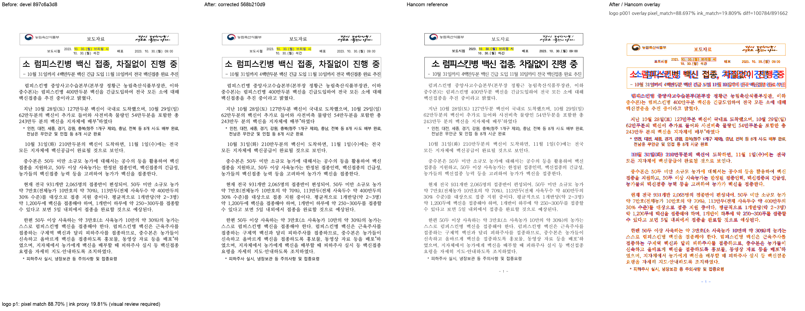

# PR #7083 — 저장 LineSeg 없는 TAC 줄의 뒤 leading 검토

**최종 판정: 메인터너 보정 후 수용 가능.** 저장 LineSeg가 없는 TAC 개체 host의 합성 줄간격을 0으로 버리던 경로를 공통 metric으로 계산하여 개체 뒤에 배치했다. 코드의 위/뒤 설명 불일치는 4aa80b96a에서 정정했다.

이 문서는 로컬 검증에 따른 수용 판정이다. 최종 통합 head의 GitHub CI·MERGEABLE/CLEAN 확인과 실제 merge 전에는 원 PR을 close하지 않는다. 원 PR의 녹색 CI를 통합 후보의 Full CI로 대신하지 않는다.

## 대상과 코드 계약

- 원 PR: [#7083](https://github.com/edwardkim/rhwp/pull/7083), planet6897 / reviewer jangster77.
- 원 head: `4d9fd37b186332607640915825fa5d3973f4beb6`. 기준 devel: `897c6a3d8d7559d314bf863c93bbe28c0d65e945`.
- cherry-pick -x 대응: `b76fd6cb6 (#7074 중복 제외)`. 통합 runtime 보정 head: `568b210d9`.
- 주 작업공간 branch: `review/planet6897-20260913`. 기본 collaborator_external_pr, 보조 intake_and_review·local_validation·multi_pr_update_branch·visual_fixture_evidence.
- 관련 issue: #7079.

base font height와 Percent 줄간격으로 계산한 leading을 tac_object_stack_line_metrics에서 측정·배치가 함께 사용한다. leading의 소유 위치는 개체 뒤다. 저장 segment가 있는 경우와 synthetic-tag가 있는 경우에는 새 leading을 적용하지 않아 #6708의 기존 baseline 계약을 보존한다.

## 실제 검증과 한계

156060125 2쪽의 400px 개체 host가 410px 전진한다. 추가 실물 156596828의 1쪽 로고 host 높이 27px와 후속 빈 줄 31.2px 전진을 확인했다. 독립 engine 2020 PDF 2종, #6708 font-height oracle·synthetic/invalid counterexample, 저장/합성 TAC 집중 테스트를 함께 사용했다. 156596828 2쪽은 SVG/tree가 동일하다.

최종 통합 전체 nextest **Summary [ 457.270s] 9565 tests run: 9565 passed (7 slow), 46 skipped**, 세 Clippy(native/WASM/workspace all-targets), workspace build, manifest/unit-tier check, Native Skia 3종, WASM build/parity를 통과했다. [공통 검증 기록](pr_7073_review_impl.md)에 exact command·시간·바이너리·24개 입력 provenance를 기록했다. 원 작성자의 실측과 이번 Mac 실행을 구분한다.

로고/본문의 글꼴과 한컴 전체 배치 차이는 남아 있다. 이미지 2종과 저장/합성 반례 범위의 공통 leading 보존을 수용하며 모든 TAC 문서의 완전 일치를 주장하지 않는다.

통합 code candidate `d3dfa17e0f1cb454793b16c19628405e6f02b535`의 [Full CI / Build & Test](https://github.com/edwardkim/rhwp/actions/runs/34741218879), [CodeQL](https://github.com/edwardkim/rhwp/actions/runs/34741218885), [Render Diff](https://github.com/edwardkim/rhwp/actions/runs/34741218798)가 완료·success임을 확인한 뒤 이 review-only 기록을 추가했다. 최종 trailing head aggregate는 push 뒤 별도로 확인한다.

## Visual sweep

- 대표 1쪽: pixel match **88.69706%**, ink proxy **19.80904%**.
- 96dpi / threshold 32. SVG sweep 선택 페이지의 자동 flagged 0은 완전한 fidelity 승인이 아니다. PDF export 검토는 실제 PDF를 raster했다.
- [before / after / 한컴 PDF / overlay 전체 페이지 패널](../assets/pr7083_logo_review_p001.png)

## 검증 파일의 commit 포함

| 파일 | 마지막 파일 commit | SHA-256 |
| --- | --- | --- |
| [`pdf/tac_object_host_line_height-2020.pdf`](../../../pdf/tac_object_host_line_height-2020.pdf) | `b76fd6cb6` | `f90ea6915a842ac2266f4dd737b2829bbb3b72b927b1658577f6ca8c8b9b6051` |
| [`pdf/vaccination-briefing-logo-2020.pdf`](../../../pdf/vaccination-briefing-logo-2020.pdf) | `2fabd879a` | `464f85f6eefd6efd1d932d3d1976b18d1f580ee496974943414d57a9426394d9` |
| [`samples/issue7062/tac_object_host_line_height.hwp`](../../../samples/issue7062/tac_object_host_line_height.hwp) | `e81628483` | `2cf764c89943a23eff17fb8ac5ccaa1958711216b15d5eb29a9a469b97d23abb` |
| [`tests/fixtures/issue_7079/vaccination-briefing-logo.hwp`](../../../tests/fixtures/issue_7079/vaccination-briefing-logo.hwp) | `2fabd879a` | `474e748d21402dc539cf9a1f65c761fe9144a8abb91627f9846810c46b2d8d05` |

각 파일을 `git show HEAD:<path>`와 바이트 대조했다. 원본·독립 한컴 기준·후보 검사 산출은 같은 통합 PR의 blob으로 재현할 수 있다. 변환 산출을 독립 oracle로 사용하지 않았다.

## 공통 조판 원칙 검토

| 항목 | 판정·근거 |
| --- | --- |
| 구현 근거·일반성 | 충족 — 위 source 계약·한컴 독립 실측에 근거하며 문서 ID 분기·clamp 없음 |
| 측정·배치 일관성 | 충족 — shared TAC metric이 높이 측정과 paragraph layout의 동일 입력에서 계산된다. |
| 줄 소속·점유 높이 | 충족 — leading은 개체 위가 아닌 뒤에 속한다. stored/synthetic-tag 경로에 중복 적용하지 않는다. |
| 사례·증거 독립성 | 충족 — committed 원본/한컴 출력과 후보를 구분하고 집중·전체 회귀를 실행 |
| 기준값 변경 | 비해당 — 새 허용치나 기존 baseline 수정 없음. #7074의 신규 sample baseline 등록은 별도 검토 기록 참조. |
| 주장·검증 범위 | 충족 — 위 잔여 문제와 미실행 작성자 전수 실측을 명시하고 실제 재검증 범위에 한정 |

## Merge 후 원 PR comment 계획

기여에 감사 인사를 남기고 원 head `4d9fd37b186332607640915825fa5d3973f4beb6`의 반영, 통합 PR 번호·merge SHA와 메인터너 보정을 알린다. [review](pr_7083_review.md)는 `https://github.com/edwardkim/rhwp/blob/<merge-commit-sha>/mydocs/pr/archives/pr_7083_review.md`로 고정한다. PNG는 `https://raw.githubusercontent.com/edwardkim/rhwp/<merge-commit-sha>/mydocs/pr/assets/pr7083_logo_review_p001.png`로 고정하고 위 page/pixel/ink/잔여 차이를 함께 게시한다. 통합 merge 후 #7079 종료를 확인한다. 통합 merge가 확인된 뒤 원 PR을 close하며 contributor fork branch는 삭제하지 않는다.
