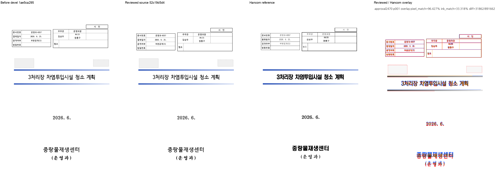
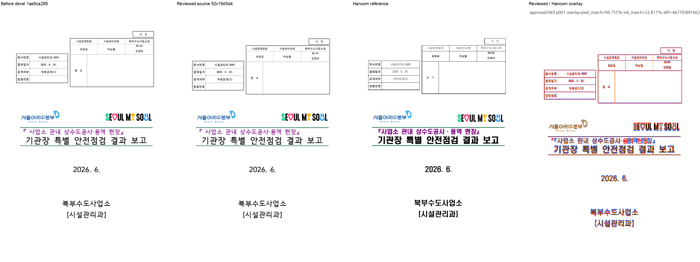
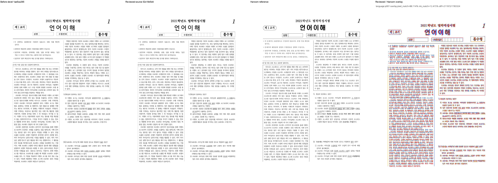

# PR #7085 검토 — 승인

## 원 PR 정보

| 항목 | 검토 기록 |
| --- | --- |
| 원 PR | [#7085](https://github.com/edwardkim/rhwp/pull/7085) — 수정(renderer): 칸 세로 정렬용 콘텐츠 높이를 줄별 중첩 표 그룹으로 센다 (#7066) |
| 작성자 / base | lpaiu-cs / `devel` |
| 원 PR diff 규모 | 2개 파일, +155/-2 (선행 stacked 변경 포함 가능) |
| 상태 참고값 | 2026-09-13 검토 당시 OPEN, non-draft. mergeable은 문서 생성 시 재조회하지 않음 |
| 검토 브랜치 | `review/pr7078-7091-20260913` |
| 통합 코드·증거 head | `2b6581b053112b348bb7af68830021aa01394dc0` |

위 상태는 검토 당시 기록이며 merge 전 원 PR head와 최신 CI·mergeability를 다시 확인한다.
선행 PR 제외 및 보류 후 되돌림은 아래 체리픽 이력과 [공통 검토](pr_7078_review_impl.md)에 기록했다.

- 원 head: `97a1926084fea74e58c0d65f37ee22af68e07051`, 작성자 lpaiu-cs.
- 체리픽: `a6ae31b80448210f0cfc7f4caf83fcfa610e3a32`. 충돌 없음.
- 최종 판정: **승인**. 원격 통합은 사용자 승인·최종 head CI 이후다.

## 구현과 독립 시각 대조

칸 세로 정렬용 중첩 컨트롤 높이가 측정과 같은 `nested_table_groups`를 사용한다.
저장 줄별로 나란한 표는 max, 적층은 sum, 줄의 vpos는 그룹 top에 반영한다.
저장 줄이 없는 TAC들을 무조건 한 줄로 합치지 않는 기존 공유 함수의 반례도 유지한다.
문서 ID/임의 픽셀 보정/조판 baseline 증가는 없다.

| 실문서 1쪽 / 대상 | devel | 후보 | 독립 Hancom PDF |
| --- | ---: | ---: | ---: |
| issue2470 문서번호표 y | 157.6 | 179.1 | 177.73 |
| issue2470 결재표 하단 | 272.8 | 294.3 | 292.80 |
| issue2083 문서번호표 y | 208.4 | 242.2 | 240.70 |
| issue2083 결재표 하단 | 361.1 | 395.0 | 393.17 |
| 21_언어 성명/수험번호표 y | 254.7 | 262.9 | 266.60 |

모두 96dpi px, 표 크기·x는 그대로다. 독립 PDF는 기존
`pdf/issue2470/36382471_masked-2022.pdf`, `pdf/issue2083_hide_fill_page-hwpx-2020.pdf`,
`pdf/21_언어_기출_편집가능본-2022.pdf`이며 생성기는 Hancom 2022다. 이름을 바꿔 복제하지 않았다.
Before/after/한컴/overlay의 전체 페이지를 직접 확인했다.
원래 회귀 테스트 3건과 #7008/#6787 공유 줄 그룹 반례를 검사한다.

잔여: 결재 블록의 1.4~1.8px 및 21_언어 외곽선 3.7px, 글꼴 대체/본문의 기존 차이는 해결 주장에
포함하지 않는다. 21_언어 전체 ink proxy는 12.61→12.42로 소폭 하락하므로 페이지 전체 일치율 개선으로
표현하지 않는다. 해당 표의 y와 한컴 기준 차이로 수용한다. OVR5 142쪽·표 48개의 page/size는 불변이며
추가 exact 좌표 비교에서는 21_언어의 대상 표 2개 y만 +8.2px다.

## 공통 원칙 판정

| 항목 | 판정 | 근거 |
| --- | --- | --- |
| 구현 계층·일반성 | 충족 | 셀 콘텐츠 높이 계산에서 동일 줄 그룹 계약 공유 |
| 측정·배치 일치 | 충족 | 양쪽 모두 nested_table_groups 호출 |
| 줄 소속·점유 높이 | 충족 | 줄 vpos/max/sum 분리, 기존 NO_LS/겹침 반례 유지 |
| 독립 정답·대표/반례 | 충족 | 서로 다른 Center 2건·Bottom 1건, Hancom PDF 직접 대조 |
| 기준값 변경 | 비해당 | baseline/golden 수정 없음 |
| 주장·증빙 일치 | 충족 | 표 좌표 개선과 잔여 오차·전체 페이지 지표를 구분 |

승인/CI/merge 후 원 PR에 통합 merge SHA·검토·시각 증거를 링크하고 close한다.
#7066은 해당 중첩 표 높이 이중 계상 수정 범위로 종료할 수 있다. 원 contributor branch는 보존한다.

## 실행 범위와 후속 조건

이 문서는 **완료한 로컬 검토의 판정 기록**이다. 사용자 승인으로 [통합 PR #7102](https://github.com/edwardkim/rhwp/pull/7102)를 생성했다. 원 PR comment/close 및 merge는 아직 실행하지 않았다.
개별 review 문서와 시각 asset은 사용자 요청에 따라 저장소 경로에 생성했다.
통합 PR #7102의 code CI 성공 뒤 같은 PR의 trailing docs-only commit으로 반영했다.
오늘할일은 해당 단계에서 기존 내용을 보존하며 갱신한다.
원래 번호별 review를 쓰며 별도 통합 PR 번호의 review 또는 문서 전용 PR을 만들지 않는다.
로컬 검사 명령·최종 결과·입력 blob 증거는 [공통 검토](pr_7078_review_impl.md)를 참조한다.
원본 PR의 CI 성공은 로컬 통합 head의 CI 성공으로 간주하지 않는다.

## 시각 검증 패널

## 검증 입력 커밋 확인 — 충족

확인 commit: `2b6581b053112b348bb7af68830021aa01394dc0`. 아래 실행 입력의 실제 바이트와 Git blob이 일치했다.
기존 파일은 원래 경로를 재사용했으며, 신규 파일은 앞서 설명한 반례 또는 서로 다른 변환 결과다.

| 경로 | 기존/신규 | bytes | SHA-256 |
| --- | --- | ---: | --- |
| `samples/issue2470/36382471_masked.hwpx` | 기존 | 16310 | `43572dad5e17395aa02d1b0000b736b8467278931086604776ef30393dd0f54b` |
| `samples/issue2083_hide_fill_page.hwpx` | 기존 | 208382 | `7758c15c57b1ef14fda6e6d29409ae3425f344931f2901641af84a40ef413d2e` |
| `samples/21_언어_기출_편집가능본.hwp` | 기존 | 435200 | `905454045ca2e236839a7cab59750678116d08af3db31dbf846819af355b8d15` |
| `pdf/issue2470/36382471_masked-2022.pdf` | 기존 | 51697 | `814492b502a46e56e3a3be253e7beb386d752d2f5d47bfe2bfb9c646d41747cb` |
| `pdf/issue2083_hide_fill_page-hwpx-2020.pdf` | 기존 | 202151 | `00b37911e4a74410e5a6181a20a636b700bcaa950e885a12dc4d99bb91348c94` |
| `pdf/21_언어_기출_편집가능본-2022.pdf` | 기존 | 851275 | `f2d858d7974393661d91a658e6b384b951114ef52783379f426a963effd97b72` |

## 로컬 검증 결과의 적용 범위

이 PR을 포함한 최종 두 PR 후보에서 집중 30건·전체 9,572건이 통과했고 전체 46건은 skipped였다.
세 Clippy·workspace build·Native Skia 검사를 통과했으며 4문서 31쪽 native/WASM SVG 불일치는 0이었다.
WASM은 native `--no-opt` 경로였고 Docker daemon 연결 불가로 최적화 Docker 빌드는 미실행이다.
명령·검사별 결과·leaky 표시 및 재확인 범위는 [공통 검토](pr_7078_review_impl.md#로컬-검증)에 있다.
통합 PR #7102의 code candidate `e670fb245`에서 GitHub CI가 성공했다.

## Merge 후 contributor PR comment 계획

[Visual Sweep 게시 절차](../../manual/verification/visual_sweep_guide.md#github-merge-comment)를 따른다.
위의 실제 비교 페이지·지표·사람의 판정과 원 head, 통합 merge SHA, 검토 문서 링크를 함께 게시한다.
이 계획은 게시 실행이나 승인 완료를 뜻하지 않는다. 실제 게시 승인 및 asset의 devel 반영을 확인한 뒤
UTF-8 본문 파일을 `gh pr comment --body-file`로 전달하고 API로 본문·링크를 재조회한다.

| 대표 PNG 안정 경로 | SHA-256 |
| --- | --- |
| `mydocs/pr/assets/pr7085_nested_valign_issue2470_p001.png` | `de87b1c3c3a35609b68d02fd9b6aac0664fcf07eb4cfa1ece1b1162330d0940c` |
| `mydocs/pr/assets/pr7085_nested_valign_issue2083_p001.png` | `0c5b9d2db991500482c096a293396dcb3a74763dcd41f9701126495e86e80cc3` |
| `mydocs/pr/assets/pr7085_nested_valign_language_p001.png` | `4fb2ce4f30656642c8785bfd9816ae934261e54322bd8d1748e18090e414864e` |

고정 이미지 URL 형식: `https://raw.githubusercontent.com/edwardkim/rhwp/<merge-commit-sha>/mydocs/pr/assets/pr7085_nested_valign_issue2470_p001.png`.

## #7078/#7091 메인터너 보정 후 통합 재검증

최종 code head `0acc011e34097b0c7ac8273d714f37b79608082f`, 증거 head `e670fb245a15f7e281401045065552f4f638041b`에서 전체 9,577건·집중 35건 및 필수 검사를 통과했다.
이 PR의 판정은 유지하며 원문에 기록한 이전 2건 후보 9,572건 결과와 구분한다.
같은 CLI 옵션으로 재출력한 4문서 31쪽 SVG가 이전 수용 후보와 byte-identical이다.
보정 전후 통합 범위와 실제 실행 기록은 [공통 검토](pr_7078_review_impl.md)를 따른다.

## 통합 PR code CI 완료와 trailing 기록

통합 PR #7102의 code candidate는 `e670fb245a15f7e281401045065552f4f638041b`다. [통합 code CI](https://github.com/edwardkim/rhwp/actions/runs/34751409313)와 [CodeQL](https://github.com/edwardkim/rhwp/actions/runs/34751409265), [Render Diff](https://github.com/edwardkim/rhwp/actions/runs/34751409180), [Adapter](https://github.com/edwardkim/rhwp/actions/runs/34751409302), [Proptest](https://github.com/edwardkim/rhwp/actions/runs/34751409281)가 모두 성공했다.
CI의 Linux Archive A/B/C/D는 합계 **9,384 PASS / 46 skipped**이며 Lint·Frontend·Native Skia도 성공했다.
CI Impact Policy가 성공했고 trailing 작성 직전 `MERGEABLE / CLEAN`을 확인했다.
이 문서는 검증된 code candidate 위의 single-parent review-only commit에 포함했다. 최종 trailing head CI·fast-pass 및 실제 merge는 별도 확인 대상이다.
