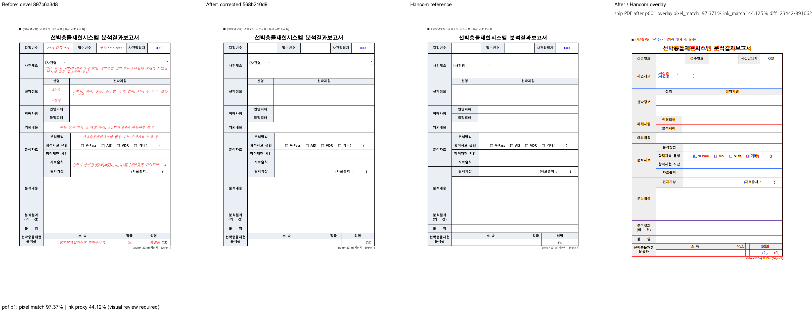

# PR #7087 — 기본 PDF export의 Print profile 적용 검토

**최종 판정: 메인터너 보정 후 수용 가능.** profile을 지정하지 않은 library/native 호환 PDF export가 Print를 사용하도록 연결했다. 기존 suppress 조건이 작동하여 빈 누름틀 안내문이 실제 PDF에 인쇄되지 않는다.

이 문서는 로컬 검증에 따른 수용 판정이다. 최종 통합 head의 GitHub CI·MERGEABLE/CLEAN 확인과 실제 merge 전에는 원 PR을 close하지 않는다. 원 PR의 녹색 CI를 통합 후보의 Full CI로 대신하지 않는다.

## 대상과 코드 계약

- 원 PR: [#7087](https://github.com/edwardkim/rhwp/pull/7087), planet6897 / reviewer jangster77.
- 원 head: `16ee2974ba7b057e39f2fd0ab572b54c18406e72`. 기준 devel: `897c6a3d8d7559d314bf863c93bbe28c0d65e945`.
- cherry-pick -x 대응: `79d217eaa`. 통합 runtime 보정 head: `568b210d9`.
- 주 작업공간 branch: `review/planet6897-20260913`. 기본 collaborator_external_pr, 보조 intake_and_review·local_validation·multi_pr_update_branch·visual_fixture_evidence.
- 관련 issue: #7076.

기본 PDF 진입점이 기존 Print profile을 선택한다. 명시적 Screen과 기본 SVG의 Screen 동작은 유지한다. field 내용을 임의 삭제하거나 조판 좌표를 보정하지 않는다. SVG 화면만 보고 PDF 수정 검증을 대신하지 않았다.

## 실제 검증과 한계

실제 SVG backend PDF를 Poppler로 raster/text 추출했다. 현재 Mac 폰트 환경에서 before 440자·after 202자·한컴 202자이고, 한컴 대비 extra 238→0 / missing 0이다. after 기본 PDF는 명시 Print PDF와 byte-identical, 명시 Screen은 before/after byte-identical이다. 568b210d9의 PDF도 최초 통합 PDF와 byte-identical로 재확인했다.

최종 통합 전체 nextest **Summary [ 457.270s] 9565 tests run: 9565 passed (7 slow), 46 skipped**, 세 Clippy(native/WASM/workspace all-targets), workspace build, manifest/unit-tier check, Native Skia 3종, WASM build/parity를 통과했다. [공통 검증 기록](pr_7073_review_impl.md)에 exact command·시간·바이너리·24개 입력 provenance를 기록했다. 원 작성자의 실측과 이번 Mac 실행을 구분한다.

[사건명]의 닫는 괄호 위치와 글꼴 등 기존 차이는 남는다. 본문의 문자 집합 일치는 위치까지의 일치가 아니다. 원 PR의 Windows 환경 수치와 Mac 수치를 섞지 않는다.

통합 code candidate `d3dfa17e0f1cb454793b16c19628405e6f02b535`의 [Full CI / Build & Test](https://github.com/edwardkim/rhwp/actions/runs/34741218879), [CodeQL](https://github.com/edwardkim/rhwp/actions/runs/34741218885), [Render Diff](https://github.com/edwardkim/rhwp/actions/runs/34741218798)가 완료·success임을 확인한 뒤 이 review-only 기록을 추가했다. 최종 trailing head aggregate는 push 뒤 별도로 확인한다.

## Visual sweep

- 대표 1쪽: pixel match **97.37098%**, ink proxy **44.12452%**.
- 96dpi / threshold 32. SVG sweep 선택 페이지의 자동 flagged 0은 완전한 fidelity 승인이 아니다. PDF export 검토는 실제 PDF를 raster했다.
- [before / after / 한컴 PDF / overlay 전체 페이지 패널](../assets/pr7087_default_pdf_review_p001.png)

## 검증 파일의 commit 포함

| 파일 | 마지막 파일 commit | SHA-256 |
| --- | --- | --- |
| [`pdf/ship-collision-analysis-form-2020.pdf`](../../../pdf/ship-collision-analysis-form-2020.pdf) | `2fabd879a` | `fee10b0762d642a51207db8e6116246764c2b3fa52ccee9f2d2021bd0f368b9a` |
| [`tests/fixtures/issue_7076/ship-collision-analysis-form.hwp`](../../../tests/fixtures/issue_7076/ship-collision-analysis-form.hwp) | `79d217eaa` | `9c7952549166ec9b20efc8f32521fd3d1673f367599e6e82652b65c782e6bc44` |

각 파일을 `git show HEAD:<path>`와 바이트 대조했다. 원본·독립 한컴 기준·후보 검사 산출은 같은 통합 PR의 blob으로 재현할 수 있다. 변환 산출을 독립 oracle로 사용하지 않았다.

## 공통 조판 원칙 검토

| 항목 | 판정·근거 |
| --- | --- |
| 구현 근거·일반성 | 충족 — 위 source 계약·한컴 독립 실측에 근거하며 문서 ID 분기·clamp 없음 |
| 측정·배치 일관성 | 충족 — 기존 profile 기반 필드 억제 경로를 활성화하며 기하 metric 자체를 수정하지 않는다. |
| 줄 소속·점유 높이 | 비해당 — 줄 점유 높이·개체 소유 변경 없음. |
| 사례·증거 독립성 | 충족 — committed 원본/한컴 출력과 후보를 구분하고 집중·전체 회귀를 실행 |
| 기준값 변경 | 비해당 — PDF golden/허용치 변경 없음. 독립 한컴 PDF를 신규 커밋했다. |
| 주장·검증 범위 | 충족 — 위 잔여 문제와 미실행 작성자 전수 실측을 명시하고 실제 재검증 범위에 한정 |

## Merge 후 원 PR comment 계획

기여에 감사 인사를 남기고 원 head `16ee2974ba7b057e39f2fd0ab572b54c18406e72`의 반영, 통합 PR 번호·merge SHA와 메인터너 보정을 알린다. [review](pr_7087_review.md)는 `https://github.com/edwardkim/rhwp/blob/<merge-commit-sha>/mydocs/pr/archives/pr_7087_review.md`로 고정한다. PNG는 `https://raw.githubusercontent.com/edwardkim/rhwp/<merge-commit-sha>/mydocs/pr/assets/pr7087_default_pdf_review_p001.png`로 고정하고 위 page/pixel/ink/잔여 차이를 함께 게시한다. 통합 merge 후 #7076 종료를 확인한다. 통합 merge가 확인된 뒤 원 PR을 close하며 contributor fork branch는 삭제하지 않는다.
