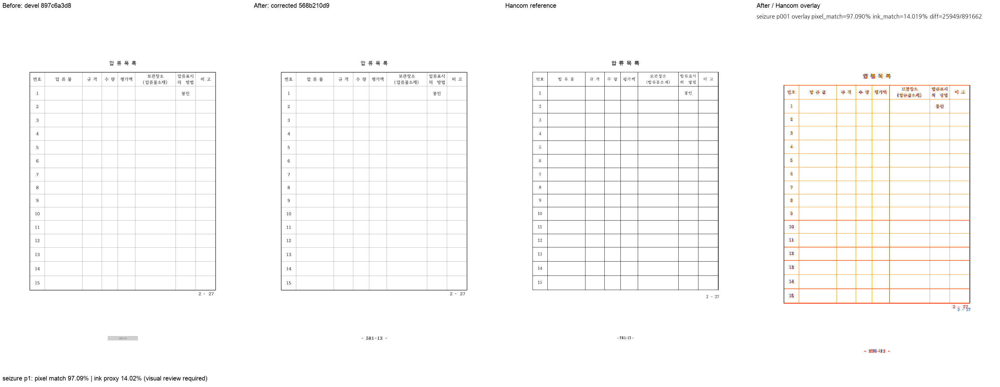

# PR #7088 — HWP3 objtype=3의 표·캡션과 실제 용지 높이 보존 검토

**최종 판정: 메인터너 보정 후 수용 가능.** 표 구조를 버리고 캡션을 PushButton 속성으로만 보존하던 HWP3 parser를 Table IR 보존으로 수정했다. 용지 기준 표의 세로 정렬에는 실제 current_page_height를 써서 비대칭 여백에서 하단 위치도 유지했다.

이 문서는 로컬 검증에 따른 수용 판정이다. 최종 통합 head의 GitHub CI·MERGEABLE/CLEAN 확인과 실제 merge 전에는 원 PR을 close하지 않는다. 원 PR의 녹색 CI를 통합 후보의 Full CI로 대신하지 않는다.

## 대상과 코드 계약

- 원 PR: [#7088](https://github.com/edwardkim/rhwp/pull/7088), planet6897 / reviewer jangster77.
- 원 head: `186953b0369aa2f962848fdadb70f85f1a60a6ef`. 기준 devel: `897c6a3d8d7559d314bf863c93bbe28c0d65e945`.
- cherry-pick -x 대응: `75099f5ce (#7075·#7082 중복 제외)`. 통합 runtime 보정 head: `568b210d9`.
- 주 작업공간 branch: `review/planet6897-20260913`. 기본 collaborator_external_pr, 보조 intake_and_review·local_validation·multi_pr_update_branch·visual_fixture_evidence.
- 관련 issue: #6874, #6266 회귀, #4680 부분 해결.

objtype=3은 독립 한컴 HWPX에서 1×1 table로 확인되는 저장 구조를 보존한다. Paper 기준 세로 참조 높이에 상하 여백 대칭을 가정하지 않고 실제 용지 높이를 쓴다. 높이가 미설정인 0일 때만 기존 fallback을 유지한다. 다른 쪽 맞춤 가드의 근사값을 함께 바꾸지 않는다.

## 실제 검증과 한계

독립 한컴 원본 HWPX와 후보 HWPX 모두 tbl=2/btn=0이고 공백 정규화 후 -581-13- 캡션이 본문에 있다. 후보 HWP5의 표 control도 2개다. 후보 HWP5를 다시 한컴에서 열어 HWPX로 저장해도 표 2개·버튼 0개·캡션을 보존한다. 따라서 rhwp 자체 재읽기만의 성공 판정이 아니다. 기존 #6266 하단 y=1052.5±6px·제목 중심396.7±4px 계약을 그대로 검증했다.

최종 통합 전체 nextest **Summary [ 457.270s] 9565 tests run: 9565 passed (7 slow), 46 skipped**, 세 Clippy(native/WASM/workspace all-targets), workspace build, manifest/unit-tier check, Native Skia 3종, WASM build/parity를 통과했다. [공통 검증 기록](pr_7073_review_impl.md)에 exact command·시간·바이너리·24개 입력 provenance를 기록했다. 원 작성자의 실측과 이번 Mac 실행을 구분한다.

고정폭 공백을 가시 공백으로 내보내는 차이와 기타 HWP3 문제는 별도다. 원 PR 작성자의 150문서 A/B 쪽수 비교를 이번 Mac 재검증 결과로 인용하지 않는다. OVR5와 전체 nextest, 명시된 실물 비교가 이번 재검증 범위다.

통합 code candidate `d3dfa17e0f1cb454793b16c19628405e6f02b535`의 [Full CI / Build & Test](https://github.com/edwardkim/rhwp/actions/runs/34741218879), [CodeQL](https://github.com/edwardkim/rhwp/actions/runs/34741218885), [Render Diff](https://github.com/edwardkim/rhwp/actions/runs/34741218798)가 완료·success임을 확인한 뒤 이 review-only 기록을 추가했다. 최종 trailing head aggregate는 push 뒤 별도로 확인한다.

## Visual sweep

- 대표 1쪽: pixel match **97.08982%**, ink proxy **14.01922%**.
- 96dpi / threshold 32. SVG sweep 선택 페이지의 자동 flagged 0은 완전한 fidelity 승인이 아니다. PDF export 검토는 실제 PDF를 raster했다.
- [before / after / 한컴 PDF / overlay 전체 페이지 패널](../assets/pr7088_table_caption_review_p001.png)

## 검증 파일의 commit 포함

| 파일 | 마지막 파일 commit | SHA-256 |
| --- | --- | --- |
| [`pdf/pr_planet6897_open_ci_20260828/by_saved_version/pr6281_issue6266_seizure_list_form_button-2020.pdf`](../../../pdf/pr_planet6897_open_ci_20260828/by_saved_version/pr6281_issue6266_seizure_list_form_button-2020.pdf) | `94bf0c7ca` | `6b04114179cef4091a38f4dfd44d419fe6ebe9ad93d5dff47c046f2a167d27a9` |
| [`samples/issue6266/seizure_list_form_button.hwp`](../../../samples/issue6266/seizure_list_form_button.hwp) | `3c827cd07` | `17d2984f1f15fd6455c5439266b5e6f444a0affae835e3d2739395a66b1b69c3` |
| [`tests/fixtures/issue_6874/seizure-list-candidate-hancom-2020.hwpx`](../../../tests/fixtures/issue_6874/seizure-list-candidate-hancom-2020.hwpx) | `d3dfa17e0` | `be66f55370f4a9db1248f59a7ad26b36c223b1bdab6bfbf4ad02182e4bad5452` |
| [`tests/fixtures/issue_6874/seizure-list-candidate.hwp`](../../../tests/fixtures/issue_6874/seizure-list-candidate.hwp) | `036f74870` | `7032583b0fe09510d7d1e0ae6bfbf6cbad04d153199a7507fe415af5c41475de` |
| [`tests/fixtures/issue_6874/seizure-list-candidate.hwpx`](../../../tests/fixtures/issue_6874/seizure-list-candidate.hwpx) | `036f74870` | `69311f338d115cddbdca89faf497f1d0284ce9d97a566c2f3a0031acbd9e4c51` |
| [`tests/fixtures/issue_6874/seizure-list-hancom-2020.hwpx`](../../../tests/fixtures/issue_6874/seizure-list-hancom-2020.hwpx) | `036f74870` | `28e95b27718f727c97ac0aca20abea5a253d4429cd92f78146205a25d74d43f9` |

각 파일을 `git show HEAD:<path>`와 바이트 대조했다. 원본·독립 한컴 기준·후보 검사 산출은 같은 통합 PR의 blob으로 재현할 수 있다. 변환 산출을 독립 oracle로 사용하지 않았다.

## 공통 조판 원칙 검토

| 항목 | 판정·근거 |
| --- | --- |
| 구현 근거·일반성 | 충족 — 위 source 계약·한컴 독립 실측에 근거하며 문서 ID 분기·clamp 없음 |
| 측정·배치 일관성 | 충족 — Paper 정렬에서 가로축처럼 실제 용지 세로 크기를 사용한다. 비대칭 여백의 +37.8px 근사 오차를 제거한다. |
| 줄 소속·점유 높이 | 충족 — 캡션은 표 안의 문단 본문으로 보존한다. 기존 form-object 위치 계약을 표에서도 유지한다. |
| 사례·증거 독립성 | 충족 — committed 원본/한컴 출력과 후보를 구분하고 집중·전체 회귀를 실행 |
| 기준값 변경 | 충족 — #6266의 기존 위치 허용치를 변경하지 않았다. 한컴 독립 HWPX·PDF가 기대 구조/배치의 기준이다. |
| 주장·검증 범위 | 충족 — 위 잔여 문제와 미실행 작성자 전수 실측을 명시하고 실제 재검증 범위에 한정 |

## Merge 후 원 PR comment 계획

기여에 감사 인사를 남기고 원 head `186953b0369aa2f962848fdadb70f85f1a60a6ef`의 반영, 통합 PR 번호·merge SHA와 메인터너 보정을 알린다. [review](pr_7088_review.md)는 `https://github.com/edwardkim/rhwp/blob/<merge-commit-sha>/mydocs/pr/archives/pr_7088_review.md`로 고정한다. PNG는 `https://raw.githubusercontent.com/edwardkim/rhwp/<merge-commit-sha>/mydocs/pr/assets/pr7088_table_caption_review_p001.png`로 고정하고 위 page/pixel/ink/잔여 차이를 함께 게시한다. 통합 merge 후 #6874 종료를 확인한다. 이미 CLOSED인 #6266은 재개방하지 않으며 #4680은 OPEN을 유지한다. 통합 merge가 확인된 뒤 원 PR을 close하며 contributor fork branch는 삭제하지 않는다.
