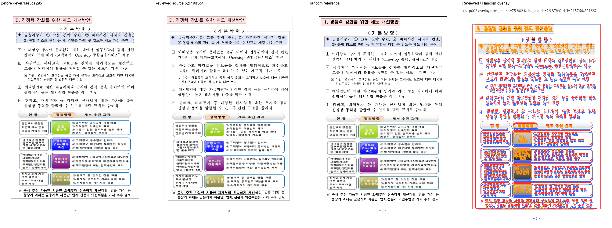

# PR #7089 검토 — 승인

## 원 PR 정보

| 항목 | 검토 기록 |
| --- | --- |
| 원 PR | [#7089](https://github.com/edwardkim/rhwp/pull/7089) — 수정(renderer): 저장 seg 없는 표 host 앞의 빈 문단을 접지 않는다 (#7086) |
| 작성자 / base | planet6897 / `devel` |
| 원 PR diff 규모 | 14개 파일, +712/-9 (선행 stacked 변경 포함 가능) |
| 상태 참고값 | 2026-09-13 검토 당시 OPEN, non-draft. mergeable은 문서 생성 시 재조회하지 않음 |
| 검토 브랜치 | `review/pr7078-7091-20260913` |
| 통합 코드·증거 head | `2b6581b053112b348bb7af68830021aa01394dc0` |

위 상태는 검토 당시 기록이며 merge 전 원 PR head와 최신 CI·mergeability를 다시 확인한다.
선행 PR 제외 및 보류 후 되돌림은 아래 체리픽 이력과 [공통 검토](pr_7078_review_impl.md)에 기록했다.

- 원 head: `37a0a9557d4a012b898ab72ff17f6b1075070657`, 작성자 planet6897.
- 체리픽: `fe5cb649c4d151f45fd37be67532c66ff89a87c6`. 선행 #7074/#7083은 devel 반영분으로 중복 제외.
- 메인터너 테스트 보강: `c1a4d3345` 저장 슬롯 불일치·다음 host에 저장 seg가 있는 합성 반례.
  생산 코드는 원 PR과 같다. 최종 판정: **승인**. 이슈 종료 범위는 아래 조건을 따른다.

## 저장 규칙과 실제 비교

다음 host에 저장 LineSeg가 없을 때, 앞 저장 슬롯의 끝이 빈 문단 vpos에 닿는 경우만 줄을 보존한다.
±2HU는 기존 저장 슬롯 정합 허용 범위이며 문서별 px 이동을 코드에 넣지 않았다.
대표 입력은 기존 `samples/issue7062/tac_object_host_line_height.hwp`, 정본은 기존
`pdf/tac_object_host_line_height-2020.pdf`다. 신규 복제 입력·정본은 만들지 않는다.

2쪽 실측: 없던 빈 줄 y=97.0/h=8.0이 살아나고, 3×3 표 y=97.0→108.8,
도해 y=548.1→559.9로 같은 11.8px가 흐름에 반영됐다. 제목 상자 y=47.2는 그대로이며
도해→뒤 표 간격 410.0px와 10쪽 페이지 수는 유지한다.
전체 페이지 before/after/한컴/overlay를 직접 확인했다. 2쪽 ink proxy 25.10→26.88,
6쪽 기존 오버플로는 픽셀/기하 불변(ink proxy 14.32)이며 이번 수정으로 해결했다고 쓰지 않는다.

**#7086 축 A(약 8.8px 상단 오프셋)는 남는다.** 원 PR의 자동 종료 표현을 통합 PR에 옮기지 않는다.
통합 PR에는 Refs #7086으로 기록하고, merge 후 원 PR만 통합 근거로 close하며 이슈는 open을 유지한다.

## 공통 원칙 판정

| 항목 | 판정 | 근거 |
| --- | --- | --- |
| 구현 계층·일반성 | 충족 | 빈 문단 collapse의 저장 증거 질의, 샘플 ID 분기 없음 |
| 측정·배치 일치 | 충족 | 실제 저장 줄박스+줄간격을 흐름에서 보존 |
| 줄 소속·점유 높이 | 충족 | 앞 저장 슬롯 정합/다음 seg 부재로 한정; stored/synthetic 분리 |
| 독립 정답·대표/반례 | 충족 | 동일 원본 Hancom PDF, 저장 슬롯 불일치·stored next host 합성 반례 |
| 기준값 변경 | 비해당 | baseline/golden 수정 없음 |
| 주장·증빙 일치 | 충족 | 빈 줄 11.8px 회복과 남은 8.8px를 구분, 이슈 전체 close 제외 |

승인/CI/merge 후 원 PR comment에는 통합 merge SHA, 원 head, 검증, 2쪽 이미지, #7086의 잔여 축을
함께 남기고 원 PR을 close한다. 이슈 comment는 부분 해결과 남은 조사 항목을 설명한다.

## 실행 범위와 후속 조건

이 문서는 **완료한 로컬 검토의 판정 기록**이다. 사용자 승인으로 [통합 PR #7102](https://github.com/edwardkim/rhwp/pull/7102)를 생성했다. 원 PR comment/close 및 merge는 아직 실행하지 않았다.
개별 review 문서와 시각 asset은 사용자 요청에 따라 저장소 경로에 생성했다.
통합 PR #7102의 code CI 성공 뒤 같은 PR의 trailing docs-only commit으로 반영했다.
오늘할일은 해당 단계에서 기존 내용을 보존하며 갱신한다.
원래 번호별 review를 쓰며 별도 통합 PR 번호의 review 또는 문서 전용 PR을 만들지 않는다.
로컬 검사 명령·최종 결과·입력 blob 증거는 [공통 검토](pr_7078_review_impl.md)를 참조한다.
원본 PR의 CI 성공은 로컬 통합 head의 CI 성공으로 간주하지 않는다.

## 시각 검증 패널

## 검증 입력 커밋 확인 — 충족

확인 commit: `2b6581b053112b348bb7af68830021aa01394dc0`. 아래 실행 입력의 실제 바이트와 Git blob이 일치했다.
기존 파일은 원래 경로를 재사용했으며, 신규 파일은 앞서 설명한 반례 또는 서로 다른 변환 결과다.

| 경로 | 기존/신규 | bytes | SHA-256 |
| --- | --- | ---: | --- |
| `samples/issue7062/tac_object_host_line_height.hwp` | 기존 | 286720 | `2cf764c89943a23eff17fb8ac5ccaa1958711216b15d5eb29a9a469b97d23abb` |
| `pdf/tac_object_host_line_height-2020.pdf` | 기존 | 719340 | `f90ea6915a842ac2266f4dd737b2829bbb3b72b927b1658577f6ca8c8b9b6051` |

## 로컬 검증 결과의 적용 범위

이 PR을 포함한 최종 두 PR 후보에서 집중 30건·전체 9,572건이 통과했고 전체 46건은 skipped였다.
세 Clippy·workspace build·Native Skia 검사를 통과했으며 4문서 31쪽 native/WASM SVG 불일치는 0이었다.
WASM은 native `--no-opt` 경로였고 Docker daemon 연결 불가로 최적화 Docker 빌드는 미실행이다.
명령·검사별 결과·leaky 표시 및 재확인 범위는 [공통 검토](pr_7078_review_impl.md#로컬-검증)에 있다.
통합 PR #7102의 code candidate `e670fb245`에서 GitHub CI가 성공했다.

## Merge 후 contributor PR comment 계획

[Visual Sweep 게시 절차](../../manual/verification/visual_sweep_guide.md#github-merge-comment)를 따른다.
위의 실제 비교 페이지·지표·사람의 판정과 원 head, 통합 merge SHA, 검토 문서 링크를 함께 게시한다.
이 계획은 게시 실행이나 승인 완료를 뜻하지 않는다. 실제 게시 승인 및 asset의 devel 반영을 확인한 뒤
UTF-8 본문 파일을 `gh pr comment --body-file`로 전달하고 API로 본문·링크를 재조회한다.

| 대표 PNG 안정 경로 | SHA-256 |
| --- | --- |
| `mydocs/pr/assets/pr7089_empty_spacer_review_p002.png` | `f6d5fa1c8ca146f335e0a4d8a5639b743d7d71ff25fae890e5bd0d45ba7928d2` |

고정 이미지 URL 형식: `https://raw.githubusercontent.com/edwardkim/rhwp/<merge-commit-sha>/mydocs/pr/assets/pr7089_empty_spacer_review_p002.png`.

## #7078/#7091 메인터너 보정 후 통합 재검증

최종 code head `0acc011e34097b0c7ac8273d714f37b79608082f`, 증거 head `e670fb245a15f7e281401045065552f4f638041b`에서 전체 9,577건·집중 35건 및 필수 검사를 통과했다.
이 PR의 판정은 유지하며 원문에 기록한 이전 2건 후보 9,572건 결과와 구분한다.
같은 CLI 옵션으로 재출력한 4문서 31쪽 SVG가 이전 수용 후보와 byte-identical이다.
보정 전후 통합 범위와 실제 실행 기록은 [공통 검토](pr_7078_review_impl.md)를 따른다.

## 통합 PR code CI 완료와 trailing 기록

통합 PR #7102의 code candidate는 `e670fb245a15f7e281401045065552f4f638041b`다. [통합 code CI](https://github.com/edwardkim/rhwp/actions/runs/34751409313)와 [CodeQL](https://github.com/edwardkim/rhwp/actions/runs/34751409265), [Render Diff](https://github.com/edwardkim/rhwp/actions/runs/34751409180), [Adapter](https://github.com/edwardkim/rhwp/actions/runs/34751409302), [Proptest](https://github.com/edwardkim/rhwp/actions/runs/34751409281)가 모두 성공했다.
CI의 Linux Archive A/B/C/D는 합계 **9,384 PASS / 46 skipped**이며 Lint·Frontend·Native Skia도 성공했다.
CI Impact Policy가 성공했고 trailing 작성 직전 `MERGEABLE / CLEAN`을 확인했다.
이 문서는 검증된 code candidate 위의 single-parent review-only commit에 포함했다. 최종 trailing head CI·fast-pass 및 실제 merge는 별도 확인 대상이다.
