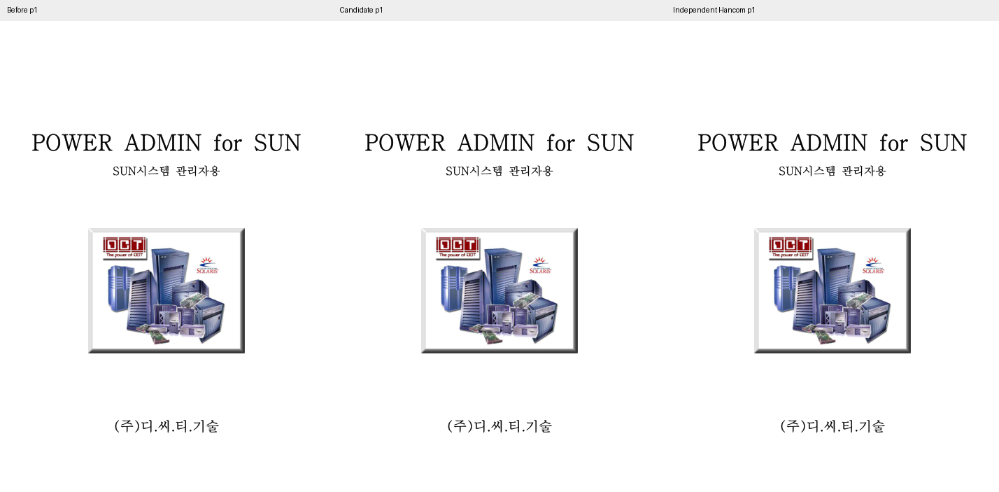
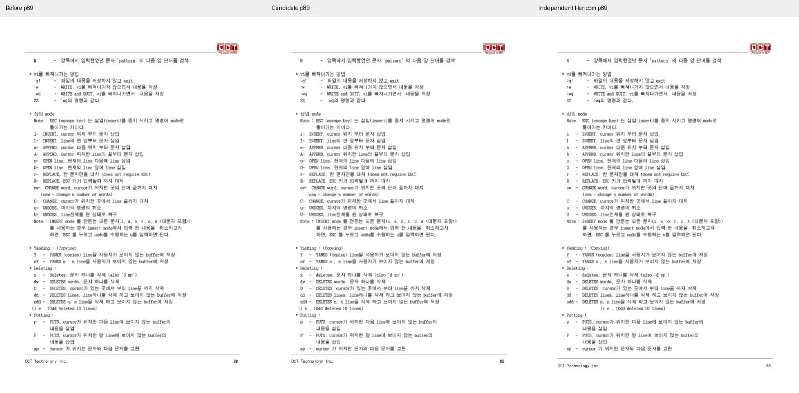

# PR #7091 검토 — 메인터너 보정 후 수용 가능

## 최종 판정과 출처

**PDF 실패는 개선된 MCP 서버에서 재현되지 않았고, 남아 있던 테스트 공백을 보정·검증했다.**

| 항목 | 내용 |
| --- | --- |
| 원 PR / 작성자 / base | [#7091](https://github.com/edwardkim/rhwp/pull/7091) / planet6897 / devel |
| 원 head | `2b21258f7f4b5f5313e146afcf8a6c3ae02b7216` |
| 원 diff | 선행 stacked 변경 포함 10개 파일, +1015/-102 |
| 중복 제외 | #7075/#7082/#7088은 이미 devel 반영 |
| 초기 고유 적용 | `9a39b8f6b`, 테스트 보강 `3e6d0a2ad` 뒤 초기 PDF 실패로 모두 되돌림 |
| 재적용·메인터너 보정 | `64605f37d` — 원 고유 변경 복원, 실제 최상위·독립 census·HWP5 재저장 검사 |
| 검토 브랜치 / 기준 | `review/pr7078-7091-20260913` / devel `1ae5ca295bddcb31b846affc62834a2a3023d24d` |
| 원격 상태 | 2026-09-13 재확인한 원 head 동일. merge 전 최신 상태·CI 재조회 필요 |

## 구현 계약과 메인터너 보정

HWP3 parser가 도형 트리에 실제 그룹 깊이를 기록하고, HWP5 serializer의 세 행렬 생성 경로가
깊이+1 쌍을 기록한다. 한컴 HWP5 원본의 rendering 바이트는 그대로 보존한다.
일반적인 파일 개방 실패라는 원 PR 주석의 단정은 실측 범위에 맞게 제거했다.

원 테스트는 ctrl_id가 두 번 들어간 최상위 레코드를 제외해 깊이 0 검사가 빈 목록으로 통과할 수 있었다.
4-byte 오프셋을 처리하고 section/record 읽기 실패와 fixture 누락을 실패로 처리했다.
현재 보강한 Rust 테스트 세 개를 실제로 실행했고 전부 PASS다.

- sample11: 독립 한컴 HWP5와 도형 **1,392개**, 깊이 0~9의 `(깊이, 쌍 개수)`별 개수가 전부 일치.
- 독일 법령: **358개**, 깊이 0~3의 census 전부 일치.
- sample11의 실제 최상위 **25개**가 (0,1)이며 빈 집합으로 통과하지 않는다.
- 두 독립 HWP5를 parse→serialize한 뒤 전수 census가 보존됐다.

## 한컴 PDF 재검증과 시각 판정

초기 동일 engine 2020 / Hancom 12.0.0.4605 통제 실험에서 sample11 후보 PDF만 worker 종료가
두 번 발생했다. 사용자에게 MCP 서버 개선을 전달받은 뒤 입력 바이트를 그대로 재변환했다.
**서버 개선 후 성공했으므로 초기 실패를 현재도 존재하는 rhwp 회귀로 판단하지 않는다.**
서버 내부 변경의 구체적 원인은 이번 검토에서 확정하지 않았다.

| 입력/동작 | job | 실제 결과 |
| --- | --- | --- |
| 초기 후보 → PDF | `36ac4623-2606-4ce2-a213-ccfdc71a9e14` | 21초 worker 종료, exit 3762504530 |
| 초기 후보 → PDF 재확인 | `b62cc57a-8aa0-4874-a135-20057e35355d` | 15초 같은 종료 |
| 수정 전 → PDF | `caf56a2e-7d4b-418e-97ef-ae510c4a4a99` | 148초 성공, 151쪽 |
| 독립 한컴 HWP5 → PDF 통제 | `9e0c2859-5677-4894-84eb-5e8d313f918b` | 147초 성공, 151쪽 |
| 후보 → HWPX | `ec46a3db-b91a-46f8-8a2b-5e8ebcd7876d` | 9초 성공 |
| 서버 개선 후 동일 후보 → PDF | `03325817-45fb-4d2b-8012-c54ea9d891a9` | **148초 성공, 151쪽** |
| 독일 법령 후보 → PDF | `9aef009a-e72a-41f3-9a30-6cc99f90dd02` | 59초 성공, 326쪽 |

새 job의 status는 5·34·67·109·140초에 running/converting, 최종 succeeded/completed였다.
같은 engine 2020 / Hancom 12.0.0.4605 / 32-bit, `input_preprocess=none`,
`pdf_print_method=0`, `pdf_output_mode=frame_print_to_pdf_ex_one_up`이다.
출력 25,612,183 bytes, SHA-256 `5adf04ec8f15c6e9c8d28f3d8561c75d6ec1d27a4b9e21620945799331a7ba38`.
서버·다운로드 해시 일치, PDF 서명, 151쪽 전체 36dpi raster와 백지 0을 확인했다.

추가 72dpi 전수 비교에서 새 sample11 PDF는 기존 `pdf/pr7091-sample11-before-2020.pdf`와
**151쪽 전체 픽셀·추출 텍스트가 동일**했다. 중복 PDF는 새 이름으로 커밋하지 않고 기존 경로와 job을 참조한다.
독일 법령도 기존 candidate PDF와 326쪽 전체 픽셀·텍스트가 같았다.
현재 바이너리의 sample11/german HWP5 출력은 커밋된 두 candidate HWP와 byte-identical이므로
이 한컴 결과를 재적용한 코드의 입력에 연결할 수 있다.

기존 독립 sample11 정본 PDF와는 151쪽 raster·33쪽 추출 텍스트에 차이가 있다. 수정 전과 후보의 출력이
완전히 같으므로 기존 차이를 이번 PR의 신규 회귀로 보지 않는다. 1쪽·89쪽 전체 비교 패널을 직접 확인했다.
이는 그룹 깊이·행렬 저장 계약 수용이며 전체 HWP3 충실도 해결 주장이 아니다.
현재 코드의 HWP3 원본 SVG도 sample11 151쪽 + 독일 법령 261쪽 = **412쪽 전부 수정 전과 동일**했다.

## 공통 원칙 판정

| 항목 | 판정 | 근거 |
| --- | --- | --- |
| 구현 계층·일반성 | 충족 | HWP3 parser 깊이 복구와 serializer 저장 계약 |
| 측정·배치 일치 | 비해당 | 측정 변경 없음; 412쪽 SVG 동일 |
| 줄 소속·점유 높이 | 비해당 | 도형 저장 구조 변경 |
| 독립 정답·대표/반례 | 충족 | 독립 census·실제 최상위·재저장 테스트, 한컴 실제 출력과 전후 대조 |
| 기준값 변경 | 비해당 | baseline/golden 변경 없음 |
| 주장·증빙 일치 | 충족 | 과거 worker 실패·현재 성공·기존 정본 차이를 구분 |

#4680의 전체 HWP3 저장·충실도 범위는 남으므로 open을 유지한다. #6874는 이미 종료된 이슈이며 reopen하지 않는다.

## 완료한 로컬 검증

검증 코드 head는 `0acc011e3`이며 아래 필수 13단계가 모두 exit 0으로 완료됐다.
이후 source/test/build 입력 변경 여부와 현재 증거 head `e670fb245a15f7e281401045065552f4f638041b`의 관계는 [공통 검토](pr_7078_review_impl.md)에 기록했다.
집중 **35 PASS**, 전체 **9,577 PASS / 46 skipped**, 세 Clippy·workspace build·manifest·unit-tier 검사를 통과했다.
Native Skia lib 4,112건(13 ignored)·placeholder 2건·direct PDF 4건과 WASM native `--no-opt` build를 완료했다.
전체 nextest에는 leaky가 없었다. Native Skia direct PDF의 `document_core_direct_pdf_preserves_selection_errors`
1건에는 leaky 표시가 있었으며 재확인 결과와 최초 기록을 공통 검토에 함께 남겼다.
4문서 31쪽 native/WASM SVG 불일치는 0이며, 기존 #7085/#7089 후보와도 동일 CLI SVG 31쪽이 같다.
Docker daemon 연결 불가로 최적화 Docker build는 미실행이다. 정확한 명령·단계별 시간·leaky 여부는 공통 검토를 참조한다.
사용자 승인으로 [통합 PR #7102](https://github.com/edwardkim/rhwp/pull/7102)를 생성했으며 code candidate `e670fb245`의 CI가 성공했다.

## 검증 입력 커밋 확인 — 충족

확인한 증거 head: `e670fb245a15f7e281401045065552f4f638041b`. 실행 파일의 실제 바이트와 Git blob이 일치했다.
기존 원본과 독립 한컴 PDF는 원래 경로를 재사용한다. Downloads에만 남겨 둔 입력은 없다.

| 경로 | bytes | SHA-256 |
| --- | ---: | --- |
| `pdf/pr7091-sample11-before-2020.pdf` | 25612131 | `a5307a886421bb6235098d3d39258029f7b6980cbb31a3b4a70da8011ff24002` |
| `tests/fixtures/issue_7091/german-candidate.hwp` | 370688 | `032b5fc93b1f45ce3f319326cfc16b074892f25d43b18a7ba05ed77795d59715` |
| `tests/fixtures/issue_7091/pr7091-sample11-candidate-hancom.hwpx` | 518222 | `56f36098d70369514ba759b69da3af5fa30672f7e0b4f3f0b8fd73a73a79dd97` |
| `tests/fixtures/issue_7091/sample11-before.hwp` | 291840 | `78ad6d2d3187c07971f780ce31866eec3bf91efee297d5842401c78dc9461c8e` |
| `tests/fixtures/issue_7091/sample11-candidate.hwp` | 309760 | `49ae0c59518e307245ac897cd466ee127ba0c4e65f2792dfd9f64c840fa6cdfd` |
| `samples/hwp3-sample11.hwp` | 391507 | `51b743b2823a2df9b6fac243f56aebecedbbd02e2a8baad58ffc2e5a4e695f20` |
| `samples/hwp3-sample11-hwp5.hwp` | 587264 | `412956ee85313584dcb901e162a19f68b70a35d57cbe76c95e5e3a1c6f591b9d` |
| `pdf/hwp3-sample11-hwp-2020.pdf` | 26386908 | `3f7bf779eb1928a48690386dadf14fb71b3b0935e93d3a40d523a53d9731b2d3` |
| `tests/fixtures/issue_4680/german-legislative-system.hwp` | 545110 | `543d67cdb4d84b876949cef4f4ec7435b99716d6fa7feebde57b024c88d40559` |
| `tests/fixtures/issue_4680/german-legislative-system-hancom-2020.hwp` | 538112 | `84bcec55e53692a935dafec0ff509f878b278c9f833e59a3f4c9be1a444444b6` |
| `tests/fixtures/issue_4680/german-legislative-system-candidate.hwp` | 369152 | `78d1bf6cc4480619d2044466c6f3742fc2bac7da4b2b6cb9abbdfc158ec63735` |
| `pdf/german-legislative-system-candidate-2020.pdf` | 2381759 | `f4a4b40f1c9f6938b17612a334ec61392c5b81eb38d37900040b6455470b6ffd` |

## 시각 증거 및 후속 처리 계획

[Visual Sweep 게시 절차](../../manual/verification/visual_sweep_guide.md#github-merge-comment)를 따른다.
실제 통합 merge 뒤 원 PR #7091에 원 head·보정 SHA·merge SHA·이 review와 위 시각 근거를 링크하고 close한다.
원 contributor branch는 보존한다. 게시 승인 뒤 UTF-8 본문 파일을 `gh pr comment --body-file`로 전달하고 API로 게시 내용을 재확인한다.
고정 이미지 URL 형식은 `https://raw.githubusercontent.com/edwardkim/rhwp/<merge-commit-sha>/mydocs/pr/assets/pr7091_hancom_output_p001.png`이다.

| 대표 PNG 경로 | SHA-256 |
| --- | --- |
| `mydocs/pr/assets/pr7091_hancom_output_p001.png` | `a3f1f25e8bb2d4fa808aa95ca140e847087d6cf9318452725415598f38acf606` |
| `mydocs/pr/assets/pr7091_hancom_output_p089.png` | `dfaed6252ada00097a74db6b308c03612c1fdb71c08162cd7dbb83e170e74205` |

이 문서는 완료한 로컬 검토 결과다. 승인된 통합 PR #7102의 code CI 성공 뒤 이 review·오늘할일을 trailing commit으로 반영했다. 최종 trailing head CI와 merge 판단이 남아 있다.

## 통합 PR code CI 완료와 trailing 기록

통합 PR #7102의 code candidate는 `e670fb245a15f7e281401045065552f4f638041b`다. [통합 code CI](https://github.com/edwardkim/rhwp/actions/runs/34751409313)와 [CodeQL](https://github.com/edwardkim/rhwp/actions/runs/34751409265), [Render Diff](https://github.com/edwardkim/rhwp/actions/runs/34751409180), [Adapter](https://github.com/edwardkim/rhwp/actions/runs/34751409302), [Proptest](https://github.com/edwardkim/rhwp/actions/runs/34751409281)가 모두 성공했다.
CI의 Linux Archive A/B/C/D는 합계 **9,384 PASS / 46 skipped**이며 Lint·Frontend·Native Skia도 성공했다.
CI Impact Policy가 성공했고 trailing 작성 직전 `MERGEABLE / CLEAN`을 확인했다.
이 문서는 검증된 code candidate 위의 single-parent review-only commit에 포함했다. 최종 trailing head CI·fast-pass 및 실제 merge는 별도 확인 대상이다.
